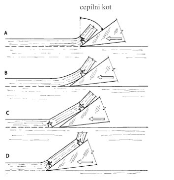

# STROJNO RAZŽAGOVANJE

## Sestavni deli
1. masivno ogrodje - zagotavlja togost stroja, varnost
2. asinhronski motor
3. žagin list (ŽL)
4. razporni klin - preprečuje "zapiranje žaginega lista", preprečuje povratni udarec
5. pokrov ali kapa - preprečuje slučajnostni stik z žag. listom, pomaga odsesovati, (s sistemom za preprečevanje povratnega udarca)
6. odsesovalni vod
7. stikalo ON/OFF - OFF stikalo je večje in tudi ob strani
8. vzdolžni prislon
9. prečni prislon
10. potisna letev
11. predrezilo - vrti se v smeri podajanja, preprečuje odtrgavanje lesnih vlaken

## Nastavitev stroja

- **PRAVOKOTNOST IN VZPOREDNOST REZILA**:
  - pravokotnost rezila glede na mizo
    - preverimo s kotnikom
    - nastavimo z mehanizmom za nagib ŽL
  - vzporednost rezila glede na pomik prečnega vodila
    - preverimo z mikrometrskim merilom ali kljunastim merilom
    - različne metode: poravnanje vodil, mize, gredi na katero je vpet ŽL
  - vzporednost rezila glede na vzdolžni prislon
    - preverimo z mikrometrskim merilom ali kljunastim merilom
    - nastavimo prislon

- **PRAVOKOTNOST PREČNEGA PRISLONA**
  + na prislon poravnamo večji obdelovanec in ga odrežemo, ta rez označimo kot 1.
  + odžagan rez prislonimo k prečnemu prislonu in proces 3x ponovimo.
  + zadnji 4. odrezek ima na svoji dolžini 4-kratno napako v odstopanju pravokotnosti

- **NAMESTITEV RAZPORNEGA KLINA**
  + za žagin list
  + višina je lahko  za cca 5mm nižja od višine ŽL (omogoča izrez utorv)

- **VIŠINA REZILA**:
  - cca. 1/2 - 1 višina zoba nad obdelovancem (debelina obdelovanca, moč motorja)
  - bolje je nastaviti nižjo višino, ker:
    + zob ž.l. izstopi iz obdelovanca bolj pod ostrim kotom in zato manj zatrga lesna vlakna, zadnja odrezana vlakna imajo več podpore in se manj cepijo,
    + manjša možnost ureza,
    + [nastavitev višine rezila](https://www.youtube.com/watch?v=JL8-1bmt7XY)
  - vendar ima nižja nastavitev rezila tudi nekaj pomankljivosti:
    - več zob je v stiku z obdelovancem - večje trenje
    - več trenja -—> potrebna je večja moč motorja pri odrezovanju
    - nekoliko več vidnih zarez na odrezani površini

- **IZBIRA ŽAGINEGA LISTA**:
  - ustrezuno ozobljenje
    - cepilni kot
{#fig:cepilni_kot_rezila}
    - oblika zob (ravni vs poševni)
  - več žaginih listov in rezil za izrez utorov

  - po končanem delu naj bo rezilo spuščeno

## Nastavitev prislona

- __prečni razrez__
  + odmaknemo vzdolžno letev (Zakaj?: Ker se odrezek ne bo tiščal prislona in je nevarnost povratnega udarca res majhna)
  + obdelovanec prislonimo k prečni letvi
  + roke imamo na levi strani obdelovanca in žaginega lista
  + ne hitimo z odmikanjem odstranjevanja odrezka, odrezek je dokaj varen.
  + [nastavitev prečnega prislona](https://www.youtube.com/watch?v=UbG-n--LFgQ)
      
- __vzdolžni razrez__
  + ker je obd. med vzdolžnim prislonom in ž.l. je povečana verjetnost za povratni udarec
  + zagotovljen mora biti raven rob obdelovanca, ki ga prislonimo k vodilu
  + skušamo zagotoviti tri smeri potiska (navzdol na mizo, vstran na VP in v smeri reza)
  + leva roka vodi levi rob obdelovanca 5-10 cm pred ž.l.
  - z njo ne sledimo obdelovancu, ker bi na neki točki bočno obremenjevali ž.l.
  + desna roka potiska obdelovanec v razrez
    + pri potiskanju skozi razrezovanje si lahko pomagamo tudi s potisno palico
    + s potisno palico potiskamo bližje ž.l. zato, da ustvarjamo navor v desno in s tem pritiskamo obdelovanec k prislonu (razen če uporabljamo razporni klin)
  + razrez zaključimo z desno roko tako, da obdelovanec potisnemo še nekaj cm za ž.l.
  + odrezek, ki je na levi strani pustimo dokler se ž.l. ne ustavi
  + [Varno razžagovanje](https://www.youtube.com/watch?v=kfiqPlC6Ltg)

## Pomembnejše začetniške napake

1. __zapiranje žaginega lista:__
  - žaganje brez razpornega klina ob vzdolžnem prislonu, zlasti pri masivnem lesu
  - vžagovanje utorov ob necelostni podpori deske
  - vzdolžno ne odžagujemo ukrivljenih desk, ker ne moremo zagotoviti popolnega stika z vzdolžnim prislonom
2. __uporaba potisne letve__
  - če je potisna letev daleč stran od žag. lista, z njim ustvarja več navora nanj in žag. lis "zapiramo" (povratni udarec, ožganine)
  + če uporabljamo dve potisni letvi:
      + imamo desno blizu ob ž.l. (1-2 cm stran),
      + z levo potisno letvijo najprej pritiskamo obdelovanec k prislonu pred ž.l.
      + v zadnjem delu razreza (zadnjih 5-10 cm) prestavimo levo potisno letev za ž.l. in še vedno potiskamo obdelovanec k vzdolžnemu prislonu
3. __ožganine poslabšajo__ razmere kot so:
  - bočni pritisk na ž.l.
  - neostro rezilo
  - trši les
  - debelejšo kos lesa
  - __počasnejši odrez__
    + če imamo prešibek motor, se temu lahko izognemo tako, da najprej odrežemo do polovice in nato odrez ponovimo z iste strani z bolj izvlečenim ž.l.
    + ti isto tehniko lahko uporabimo kadar želimo zmanjšati zatrgovanje vlaken ob razrezu
4. __prečno razžagovanje__ (pozabimo odmakniti vzdolžni prislon!!!)
  - pri tem razrezu NE uporabljamo vzdolžnega prislona, ker obstaja večja verjetnost, da se bo odrezek tiščal ž.l. in tako se možnost povratnega udarca poveča

1. __IZOGIB UREZNINAM__
  - zdrs!
  - nepozornost
  - seganje po obdelovanec, ki ni na dosegu
  - rezanje premajhnih obdelovancev
2. __IZOGIB POVRATNEMU UDARCU__
  - [povratni udarec](https://www.youtube.com/watch?v=u7sRrC2Jpp4)
  - fi(ž.l.) 40 -> r=20cm, o=1,25m, w=3400/min=57/s -> 57/s*1,25m => 71m/s = __256km/h__
  - odrezek med vzdolžnim prislonom in ž.l.
  - zobje ž.l. povlečejo odrezek

> ### NALOGA: Opiši nastavitev mizarska krožne žage.
>
> 1. Na skici predstavi glavne sestavne dele mizarske krožne žage in 
> jedrnato opiši njihovo funkcijo.
>
> 2. Jasno predstavite pravilno nastavitev mizarske krožne žage in tehniko vzdolžnega in prečnega razžagovanja.
>

