# KOMPOZITNI MATERIALI

Definicija: kompozita:

- je mešanica vsaj dveh različnih sestavin ali faz, 
- so homogeni v makroskopskem in heterogeni v mikroskopskem merilu,
- delež, oblika, in razdelitev sestavin so vnaprej načrtovani,
- niso naravne tvorbe, pač pa delo človeških rok.
- posamezne sestavine mora biti vsaj 5 %.

Izjeme, ki jih med kompozitne materiale ne uvrščamo:

- Četudi imajo posamezne sestavine bistveno različne lastnosti, tako, da ima kompozit bistveno drugačne lastnosti od posameznih faz, umetne snovi z dodatki proti UV ne štejemo med kompozitne materiale.
- Umetne kompozite izdelujemo z namenskim dodajanjem in mešanjem sestavin, dvofazne zlitine nastale iz homogene taline ali po toplotnih obdelavah ne uvrščamo med kompozitne materiale.

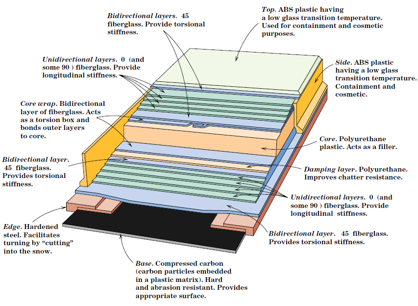{#fig:kompoziti_cross_section}

## Armaturna delitev kompozitnih materialov
<!--
https://slideplayer.com/slide/6381299/
-->

Kompozit je sestavljen iz osnovnega materiala (matrice), ki prenaša tlačne obremenitve, in armaturnih vlaken, ki prenašajo natezne sile. Vlakna so vgrajena v matrico in izboljšajo trdnost ter togost kompozita.

Glede na obliko armature ločimo kompozite z matrico, ki je ojačana z:

- delci ali
- z vlakni.

Poleg le teh, pa poznamo še kompozitne materiale s strukturirano teksturo.

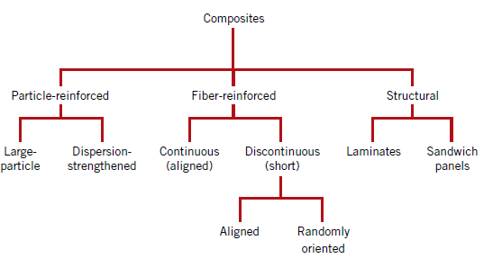{#fig:kompoziti_delitev}

### Ojačitve z delci
<!--
https://mechanicalbase.com/reinforcement-with-particles-and-flakes-in-composite-materials/

deformacija materiala:
https://mechanicalbase.com/deformation-mechanisms-in-metallic-materials/
-->
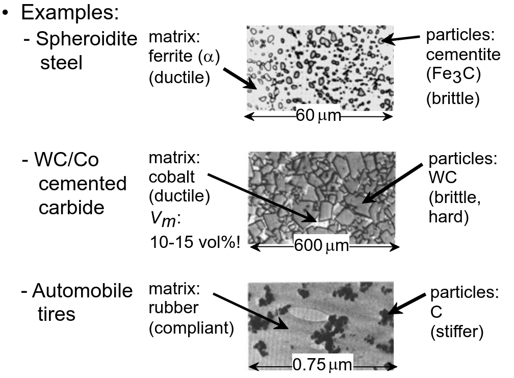{#fig:kompoziti_ojacitev_delci}

Ojačitve z mikroskopsko-majhnimi delci:

- preprečujejo plastično deformacijo (kovin)

Ojačitve z večjimi delci:

- izkoriščamo večjo trdoto armiranega materiala

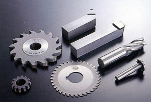{#fig:kompoziti_rezilna_orodja}

Najpomembnejša in najbolj znana uporaba kompozitov, ojačanih z delci, je volframov karbid (WC). To je vrsta cementiranega karbida, pri katerem je volframov karbid v kobaltovem vezivu. Tu je kobaltovo vezivo matrična faza, delci volframovega karbida pa ojačitve delcev.

### Ojačitve z vlakni

- relativno enostavno lahko načrtujemo elastičnosti modul (E) v smeri vlaken
- materiali so anizotrpičeni:
    - različne fizikalne lastnosti v različnih smereh pri usmerjenih vlaknih
    - primer: armiran beton (npr.: ne smemo spremeniti balkona v ploščad)
- ali izotropični:
    - pri naključno razporejenih vlaknih (npr.: vlakna za beton)

Glede na usmeritev vlaken ločimo:

- usmerjena vlakna

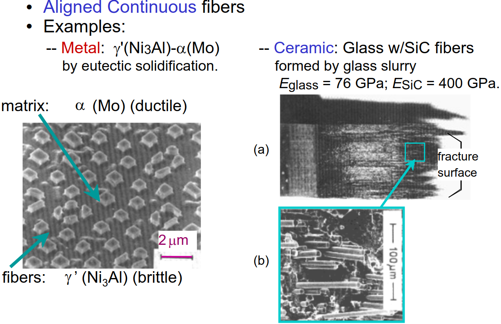{#fig:kompoziti_usmerjena_vlakna}

- naključno postavljena vlakna

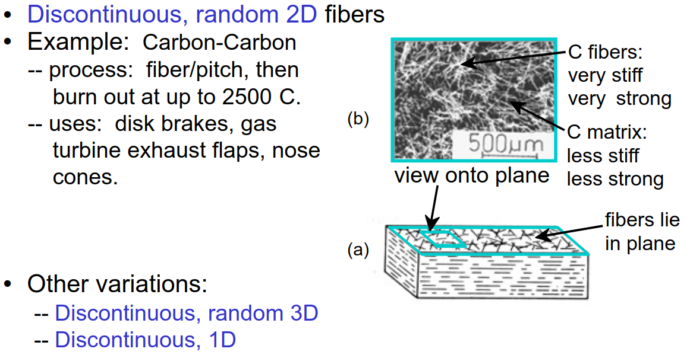{#fig:kompoziti_nakljucna_vlakna}

- neskončna usmerjena vlakna

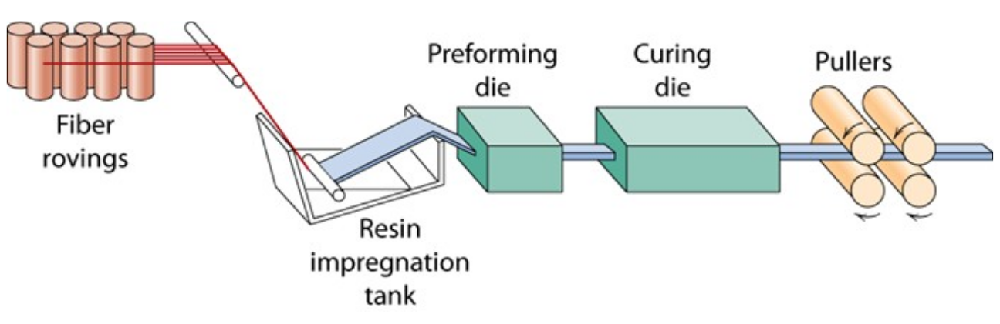{#fig:kompoziti_usmerjena_vl_linija}

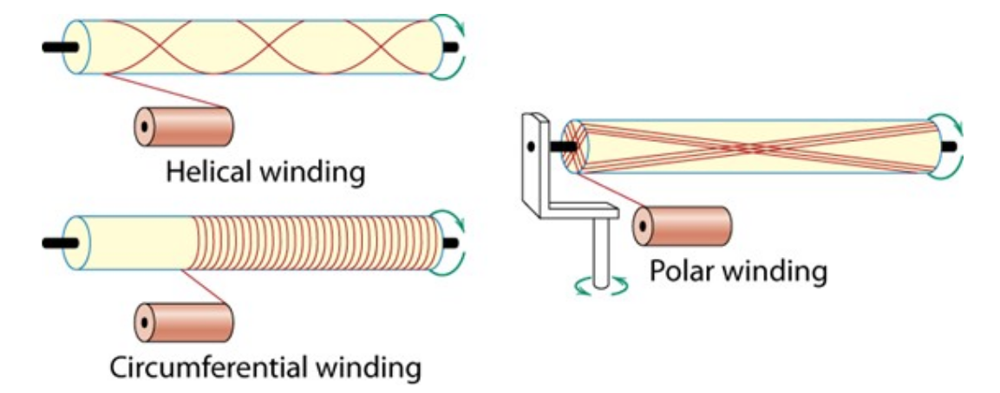{#fig:kompoziti_usmerjena_vl_vanos}

### Strukturirani kompoziti

- med kompoziti najbolj skrbno načrtovani tehnološki postopki,
- odlično razmerje med $E/\rho$

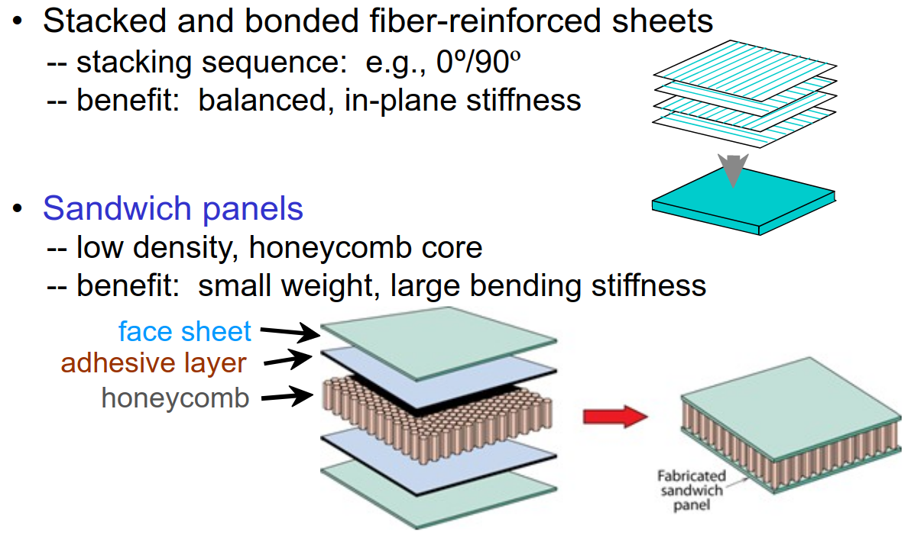{#fig:kompoziti_strukturirani}

## Prednosti kompozitov

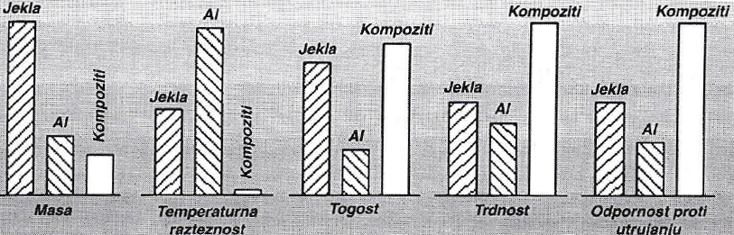{#fig:kompoziti_prednosti}

## Sestava kompozitnih materialov

Kompozitni materiali sestojijo predvsem iz dveh osnovnih sestavin:

- iz matice (osnove) in
- armature (sestavin za povečanje mehanskih lastnosti)

Kompozitni materiali sestojijo iz 5 najbolj razširjenih osnovnih skupin glede na obliko armature:

- kompoziti z vlakni
- kompoziti z delci
- kompoziti s kosmiči
- kompoziti z laminati, lističi
- kompoziti s polnilom.

### Vlakna v kompozitih

Vlakna, ki se uporabljajo za armiranje kompozitov, naj imajo naslednje lastnosti:

- majhno gostoto
- veliko trdnost in modul elastičnosti pri vseh delovnih temperaturah
- minimalno topnost v matrici
- kemično obstojnost
- nimajo faznih transformacij
- primerna so za tehnološke postopke

Vlakna, ki se danes uporabljajo:

- imajo majhno gostoto,
- veliko trdnost jim zagotavlja kovalentna vez
- anizotropne mehanske lastnosti.

Najbolj uporabna vlakna so:

- steklena vlakna:
    - izdelana so iz stekel različne kemične sestave
    - 50% - 60% $SiO_2$ ter oksidi kalija, bora, natrija, aluminija in železa.
- ogljikova vlakna:
    - so izredno trdna, toga in lahka vlakna
    - izredno odporna na visoke temperature
- kovinska vlakna:
    - so iz volframa, berilija, molibdena in visokotrdnih ogljikovih in nerjavnih jekel

#### Vpliv vlaken na fizikalne lastnoati

niso odvisne le od materiala iz katerega so vlakna, pač pa tudi:

- kolikošna je njihova prisotnost (delež),
- kako velika vlakna so,
- kakšno obliko imajo,
- kako so razporejeni v matrici,
- in njihova orientacija.

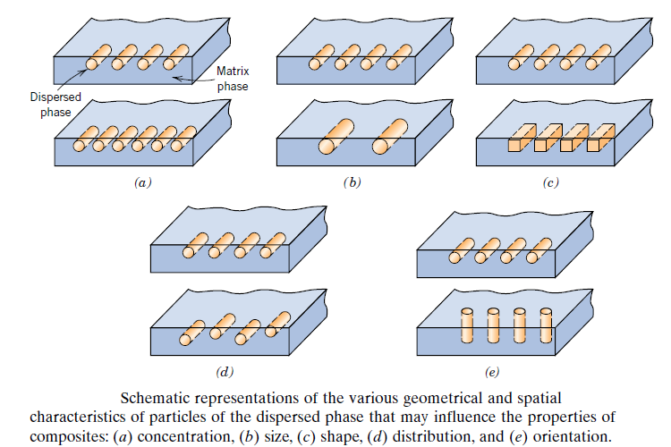{#fig:kompoziti_razporeditev_vlaken}

### Matrica kompozitnega materiala

Matrica daje kompozitnemu materialu:

  - obliko in
  - monolitost
  - določa položaj armature (vlaken)
  - omogoča prenos obremenitve na vlakna, ki so vgrajena v matrico

Način povezave vlaken in matrice bistveno vpliva na:

  - trdnost in
  - žilavost kompozita
  - togost (modul elastičnosti) se z armiranjem vlaken poveča.

Poznamo več vrst matric iz različnih materialov:

- keramične (CMC - ceramic matrix composite)
- polimerne (PMC - polymer matrix composite)
- kovinske (MMC - metal matrix composite)

### Keramične matrice

- so trde in
- krhke (krhkost izboljšamo z vlakni)
- majhno toplotno prevodnost
- majhna natezna trdnost
- velik modul elastičnosti (ob majhnem raztezku se pojavijo velike notranje napetosti)
- manjšo gostoto (od kovin)
- odporne na zelo visoke temperature
- primer uporabe:
    - zavorni diski
    - lopatice v plinskih turbinah (reaktivni motorji)
    - toplotni ščit za vesoljska vozila
- [Keramični matrični kompoziti](https://wikislsl.top/wiki/ceramic_matrix_composite)

### Polimerne matrice

- manjša trdnost
- manjši modul elastičnosti
    - obremenitev se že ob manjših obremenitvah dobro prenaša na vlakna
- niso odporne na višje temperature
- imajo izredno nizko gostoto
- veliko žilavost
- odporne proti kemikalijam in vodi
- postopek izdelave je enostaven in
- poceni
- primer.: epoksi smole, fenolne smole...

### Kovinske matrice

- trdne
- žilave
- togost povečamo s togimi armiranimi vlakni
    - armirana vlakna z velikim modulom elastičnosti

## Primeri uporabe

### Letalska industrija

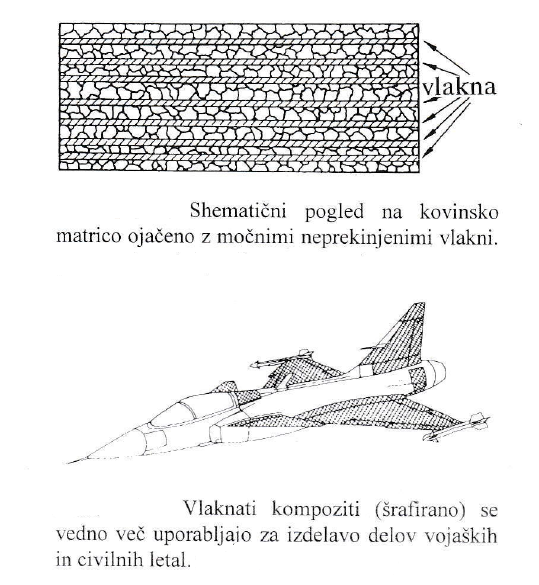{#fig:kompoziti_primer_letalo}

