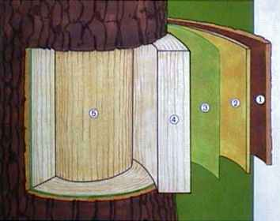
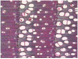

# ZGRADBA LESA

Les se je evolucijsko razvil kot mehansko in transportno tkivo pri kopenskih rastlinah, kar je omogočilo doseganje večjih višin, učinkovitejše prevajanje vode in hranil ter boljšo oporo nadzemnim rastem. Kopenske rastline so se razvile iz morskih, verjetno so prve oblike na kopnem spominjale na lišaje; iz teh preprostih kolonij so se postopoma razvijale bolj kompleksne celične strukture. Kasneje so se pojavile tudi kambiju podobne celice — plast delitvenih celic, ki je bistveno vplivala na sekundarno rast in tvorbo pravega lesa, saj je omogočila debeljenje stebla in nastanek diferenciiranih prevodnih ter podpornih tkiv. Postopoma so se pojavile preproste celične strukture, ki so bile specializirane za prevajanje vode (ksilem) in za transport organske snovi (floem), hkrati pa so se celične stene odebelile z ligninom za večjo trdnost.  V evolucijskem poteku so iglavci (golosemenke) razvili pretežno homogeno in enostavno zgradbo lesa, sestavljeno predvsem iz trahej — dolgih, variabilno debelostenskih celic, ki hkrati omogočajo transport vode in mehansko podporo. Listavci (angiosperme) so kasneje uvedli bolj kompleksne elemente ksilema, kot so vaskularne traheje in ločene celice za mehansko podporo (vlakna), ter izrazitejšo diferenciacijo med prevajnimi in podpor­nimi tipi celic, kar daje njihovemu lesu bolj heterogeno in specializirano zgradbo. Zaradi te razlike v celični specializaciji in raznolikosti tipov celic je les iglavcev po sestavi in strukturi bolj enostaven kot les listavcev.

## Makroskopska zgradba lesa

Makroskopska zgradba lesa obsega strukture, ki so vidne z golim očesom ali z uporabo osnovne optike (lupe, makroobjektiv). Takšno opazovanje je prvo in hitro orodje pri identifikaciji vrste, oceni kakovosti in določanju primernosti lesa za določene namene (gradnja, pohištvo, energija, restavratorska dela). Makroskopski znaki pogosto odražajo celično (mikroskopsko) in kemično sestavo lesa ter njegove rastne pogoje, zato povezava med obliko in funkcijo omogoča interpretacijo lastnosti materiala.

### Osnovne anatomske smeri in prerezi
Tri osnovne anatomske smeri v lesu so:

- vzdolžna (aksialna): vzdolž stebla, smer rasti celic;
- radialna: od sredice proti skorji, skozi sijijske (lesne) trakove;
- tangencialna: tangentno na krožnice letnic.

Tem trem smem ustrezajo trije tipi prereza:

- prečni prerez (sekcijski): prerez pravokotno na rastno os — vidimo letnice kot obroče;

![Primer prečnega prereza z značilnimi vidnimi elementi lesnih struktur[@Leban2010_LesZgradba].](./slike/precni_prerez.png){width=5cm}

- radialni prerez: prerez skozi središče debla, razkrije lesne trakove kot vrstice;

![Radialni prerez z značilnimi vidnimi elementi lesnih struktur[@Leban2010_LesZgradba].](./slike/radialni_prerez.png){width=5cm}

- tangencialni prerez: prerez tangencialno na letnice — dobro prikaže kontrast med ranim in kasnim lesom.

Pravilna identifikacija smeri prereza je ključna pri opisu makroskopskih pojavov in pri pripravi vzorcev za nadaljnje analize.

## Glavni makroskopski deli debla

{#fig:fun_ses_les}

1. Skorja:
   - Zunanja zaščitna plast. Makroskopsko se razlikujeta zunanja (periderma/primitivna skorja) in notranja (flelogenska) plast.
   - Pomen: mehanska zaščita, preprečevanje izgube vode, zaščita pred žuželkami in boleznimi.

2. Ličje (floem)
   - Prevozno tkivo za organske hranilne snovi (sokovi) navzdol; v makroskopskem prerezu je vidno kot temnejši sloj pod skorjo.
   - Vsebuje tudi precej živih celic in rezervnih snovi.

3. Kambij
   - Tanek, pogosto neviden sloj između ličja in beljave. Je meristem (delitvene celice), ki tvori vsako leto novo beljavo navznoter in floem navzven.
   - Aktivnost kambija določa širjenje debla in tvorbo letnic.

4. Beljava
   - Svetel, zunanjim delom pod kambijem pripadajoči del ksilema, funkcionalno aktiven pri prevajanju vode in shranjevanju hranil.
   - Makroskopsko pogosto svetlejše barve; debelina beljave se razlikuje med vrstami in pogoji rasti.

5. Jedrovina 
   - Temnejši, notranji, pogosto trši in odpornejši del ksilema. Nastane iz olesenelih ksilemnih elementov, v katere se deponirajo ekstraktivne snovi (tanini, smole, barvila), kar poveča odpornost proti razgradnji.
   - Jedrovina večinoma ne sodeluje pri prevajanju vode.

6. Olesenel (nekadnji vitalni) les / cilindrični parenhimski elementi
   - V makroskopskem smislu gre pogosto za izraz «olesenel les» kot sled preteklih vitalnih dejavnosti (npr. oleseneli floem ali oleseneli del korenin); pri nekaterih vrstah je lahko makroskopsko opazen kot teksturen presledek.

7. Branika 
   - V okviru letnice ločimo:
     - rani les (earlywood): nastane spomladi, celice imajo večja lumna in tanjše stene — makroskopsko svetlejše in redkejše;
     - kasni les (latewood): nastane pozno v sezoni, ima ožje lumne in debelejše stene — temnejši in gostejši. Kontrast obeh ustvarja letni obroč.

![Prečni prerez debla z osnovnimi značilnimi makroskopskimi elemeti[@Leban2010_LesZgradba].](./slike/precni_prerez.png){#fig:precni_prerez}

8. Lesni trakovi
   - Radialne strukture, ki se prikažejo na radialnem in tangencialnem prerezu. Makroskopsko so lahko zelo ozki (pri iglavcih) ali široki in vidni kot bleščice (pri nekaterih listavcih).
   - Pomembni za radialni transport in shranjevanje rezervnih snovi.

![Vidni večplastni radialni smolni kanali[@Leban2010_LesZgradba].](./slike/radialni_prerez.png){#fig:radialni_prerez width=7cm}

9. Smolni kanali
   - Zlasti pri iglavcih: kanali, ki vsebujejo smolo; na prečnem prerezu so vidni kot majhne krogle, na radialnem/tangencialnem kot podaljšana struktura.
   - Njihova prisotnost in gostota vplivata na tehnološke lastnosti, npr. obdelovanje in dihanje smol.

![Radilani in aksialni smolni kanali[@Leban2010_LesZgradba].](./slike/smolni_kanali.png){#fig:smolni_kanali}

10. Grče
    - Ostanki vejevja v debelini; makroskopsko različni po obliki in zgradbi (trdi/mehki vozli).
    - Zmanjšujejo mehansko homogenost materiala in estetiko, vplivajo na odpornost na lom.

### Letnice — nastanek, interpretacija in pomen

Letnica je letni prirast lesne mase. Njena širina in znotraj-letni vzorec odražata rastne razmere (voda, temperatura, hranila) in zdravje drevesa. Leta s hitrejšo rastjo se kažejo z širšimi letnicami; stresne ali sušne razmere s šibkejšimi in ožjimi letnicami. Letnice se uporabljajo za dendrokronologijo, oceno starosti in analizo okoljskih pogojev [@FPL2010].

**Makroskopske razlike med iglavci in listavci**:  

- **Iglavci**: na makronivoju običajno homogena zgradba z dominanco trajnih vzdolžnih elementov (traheide), jasno ločljivim ranim in kasnim lesom ter prisotnostjo oziroma odsotnostjo smolnih kanalov. Lesni trakovi so pri večini iglavcev ozki.

{#fig:Light-microscopy-images-of-spruce-wood-A-cross-section-B-tangential-section-through_W640 width=7cm}

- **Listavci**: makroskopsko heterogen les z izrazitimi porami/trajekti (traheje), raznolikimi lesnimi trakovi in pogosto bolj kompleksnimi strukturnimi vzorci (npr. prstasti ali raztreseni pore). Pri listavcih je lažje prepoznati vrsto iz poroznosti in razporeditve žarkov [@Ruffinatto2015; @FPL2010].

{#fig:precni_prerez_bukev}

{#fig:precni_prerez_jesen}

### Prirast lesne mase

Prirast lesne mase je posledica usklajenega delovanja fizikalnih in biokemičnih procesov v drevesu: prerazporeditve vode in hranil, fotosinteze in sinkronizirane tvorbe celuloze, hemiceluloz, lignina ter ekstraktivov v kambiju in pri rasti letnicah. V tem podpoglavju povzamemo glavne korake prirasta, kemične poti, ki pretvorijo asimilate v lesno maso, in osnovno CO2-bilanco, ki izhaja iz teh procesov.

{#fig:prirast_lesna_mase}

Opis procesa prirasta

- Transport vode in mineralov: voda se iz tal dviguje skozi ksilem (celice z velikimi lumni - traheide pri iglavcih in traheje pri listavcih) in zagotavlja vodo v lesu ter vnos mikrohranil, potrebnih za primarno rast celic v kambiju [@usfs2010_woodhandbook].
- Fotosinteza in tvorba asimatov: v listih kloroplasti pretvorijo svetlobo v kemijsko energijo in vežejo ogljik iz CO2 v ogljikovih ograjenih molekulah po reakciji:

    6CO2 + 6H2O → C6H12O6 + 6O2  [@taiz2010_plantphys]

- Nastali sladkorji (saharoza, sorbitol, drugih asimilatov) so primarni transportni produkti v floemu.
- Prevajanje sladkorjev: floem prevaja asimilate iz listov proti rastočim tkivom (kambiju, razvijajočemu se lesa, plodom, koreninam). Pretok je kontroliran s koncentracijskimi gradienti in vir–ponor dinamiko.
- Kambialna diferencijacija in letnice: v kambiju se delijo kambialne celice; primerno usmerjene hialinske celice diferenciirajo v celice sekundarnega ksilema (rani in kasni les). V kambiju se s kondenzacijsko reakcijo glukoze tvori celuloza:

    nC6H12O6 → (C6H10O5)n + n H2O

- Hitrost delitve in širina letnice sta sezonsko odvisni (spomladanski hitri rastni val z večjimi lumni pri mnogih vrstah, poletni počasnejši rastni val s tesnejšimi celicami) [@usfs2010_woodhandbook].
- Shramba in premestitev rezerv: del asimilatov se porabi za rast, del pa se shrani v parenhimu kot škrob ali topni sladkorji, ki služijo kot rezervne snovi za zgodnjo pomladno rast ali obnovo poškodovanih tkiv.

Sezonski potek rasti (povzetek)

- Spomladi: intenzivna fotosinteza in premikanje rezerv v rastoče meristeme; hitro oblikovanje rani lesa (s širšimi lumni).
- Poleti: kombinacija rasti lesa in razvoja plodov/iglic; pogosto nastanek kasnejšega lesa z manjšimi celicami.
- Jesen: upad aktivnosti; preusmeritev v shranjevanje rezerv (škrob v korenu in parenhimu) in priprava na dormanco.
- Zima: minimalna celična delitev pri temperiranih pasovih; fiziološko mirovanje [@usfs2010_woodhandbook].

- Vezava CO2: s fotosintezo drevo veže CO2 iz zraka in ga shranjuje v organskih molekulah. Suha masa lesa vsebuje približno 45–50 % ogljika po suhi teži (odvisno od vrste) [@sjostrom1993_woodchemistry].
- Pretvorba ogljika v CO2-ekvivalente: 1 kg ogljika ustreza 3,667 kg CO2 (molekulska masa CO2 / atomska masa C = 44/12 = 3,667). Če predpostavimo, da 1 t suhega lesa vsebuje 0,5 t C, potem ta tona suhega lesa predstavlja vezavo približno 1,83 t CO2:
  - 1 t suhega lesa × 0,50 t C/t lesa = 0,50 t C
  - 0,50 t C × 3,667 = 1,833 t CO2 vezanih v lesu

**Povezava med makroskopsko zgradbo in lastnostmi lesa**:  

- Mehanska trdnost: gostota letnic in delež kasnega lesa povečujeta togost in nosilnost.
    - Široka branika pri iglavcih nakazuje na ugodne pogoje rasti (temperatura, voda) v tem primeru branika vsebuje precej večji delež ranega lesa in zago je gostota manjša. 
    - Ravno nasprotno se zgodi pri venčastno poroznih listavcih, kjer je v dobrih pogojih rasti kasnega lesa precej večji delež in tedaj gostota večja.
    - Pri raztreseno poroznil listavcih pa dobri pogoji ne vplivajo bistveno na gostoto branike, ker traheje (vodni kanali) priraščajo vse leto z enakim deležem.
- Prevodnost vode: funkcionalna debelina beljave in prisotnost velikih lumnov (npr. pri listavcih) izboljšujeta prevodnost vode.
- Odpornost proti propadanju: prisotnost jedrovine in ekstraktivov pogosto povečuje biotsko odpornost.
- Obdelava: smolni kanali, gostota grč in smer lesnih vlaken vplivajo na žaganje, rezkanje in lepljenje.
- Estetika: letnice, barvni prehodi med beljavo in jedrovino, lesni trakovi in grče bistveno vplivajo na videz končnega izdelka.

### Metode makroskopskega opazovanja
- Vizualni pregled: ocena barve, videza letnic, prisotnosti smolnih kanalov in grč.
- Lupe 10–40×: razširjena vidljivost radialnih smolnih kanalov, por in drobnih kanalov.
- Priprava ploskev: gladko izrezan prečni/radialni/tangencialni prerez za bolj natančno opazovanje.
- Vlaženje: vlažen prerez lahko izboljša kontrast in razpoznavanje struktur.
- Dokumentacija: fotografije z merilom, skica in zapisi o smeri prereza, lokaciji vzorca in discernibilnih znakih.

### Uporabne oznake pri opisu vzorca (kontrolni seznam)
- Smer prereza: prečni / radialni / tangencialni
- Vrsta: iglavec / listavec (če je mogoče)
- Barva beljave in jedrovine
- Širina in kontrast letnic (enakomerne / variabilne)
- Prisotnost smolnih kanalov (da/ne; razpored)
- Vidni žarki (širina, frekvenca, vidnost na tangencialnem prerezu — bleščice)
- Vozli in drugi napake (razpuki, značilne rane)

    <!--

## Vaje in naloge za učence
1. Na priloženih vzorcih določite smer prereza in opišite tri prepoznavne makroskopske znake.
2. Primerjajte dva vzorca iste vrste iz različnih rastišč: ali so letnice podobne? Kaj to pove o rastnih razmerah?
3. Opišite, kako bi makroskopsko razlikovali kos smreke od kosa bora — naštejte vsaj tri razlikovalne znake.
4. Pripravite kratek zapis (fotografija + opis) o prisotnosti smolnih kanalov na danem vzorcu.
5. Analiza kakovosti: ocenite vpliv vozla na primernost deske za nosilno konstrukcijo (navedi razloge).

-->

