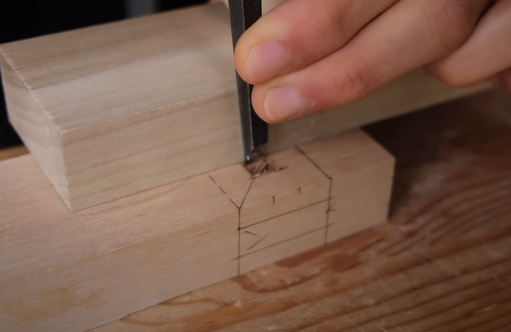

# DLETENJE

>  Slabo orodje je cesta k zamudi, mojstra ukrade in delavca utrudi.

## NAMEN
- odrezovanje:
  - manjših površin
  - težko dostopnih delov
  - ročno odrezovanje

## POSTOPEK OBDELAVE

- [Kako ravnati z dletom](https://www.youtube.com/watch?v=Efxgvo36FiY)
  - deli dleta:
    1. **Rezilo (delovno rob)** – To je oster del dleta, ki je namenjen rezanju ali oblikovanju lesa.
    2. **Telo (rezilo)** – Osrednji del dleta, ki zagotavlja stabilnost in prenaša silo med rezilom in ročajem. Pri **dletu** sta stranski ploskvi telesa poševni, kar je v pomoč pri odrezovanju v ostrih kotih obdelovanca. Pri **dolbilu** sta ti dve ploskvi veno pravokotni na hrbtno stran telesa in pomagata zagotoviti odrezovanje stranskih ploskev pri zarezi.
    3. **Petišče (vrat)** – Prehodni del med rezilom in ročajem, ki povezuje oba dela in absorbira udarce.
    4. **Ročaj** – Namenjen je držanju in vodenju dleta med delom, pogosto je izdelan iz lesa ali plastike.
    5. **Okovje (obroč)** – Kovinski obroč na ročaju, ki preprečuje poškodbe ročaja pri udarjanju s kladivom.
    
  - osnovna postavitev pri odrezovanju (drža)
  - odrezovanje proti sredini obdelovanca
  
  - sekanje vlaken
  - kako zagotoviti pravokotnost
  - koliko lahko še odsekavamo
  - zakaj mora biti zadnje odsekavanje izredno tanko
  - prekrivanje rezila

## Brušenje

Sestoji iz treh glavnih odbelovalnih postopkov:
- grobo brušenje,
- fino brušenje,
- poliranje

### Grobo brušenje

- zagotovimo obliko (kot rezila)
- okvirna granulacijo cca.: 250
- mogoče (zaradi debeline rezila) z dvojnim dvojnim kotom:
    - 25° za prvi kot in
    - 30° za drugi kot.

### Fino brušenje

- zagotovimo rob rezila
- ustvarimo iglo
- granulacija cca.: 1000

### Poliranje

- odstanimo iglo
- granulacija cca.: 8000

> ### NALOGA: Uporaba dleta
>
> 1. Opišite sestavne dele dleta in katere so bistvene lastnosti le-teh:
>   - ročaj,
>   - rezilo,
>      - stranska poševna ploskev,
>      - rezilna ploskev,
>      - rezalni rob.
>
> 2. Opišite vsaj eno tehniko odrezavanja lesnih vlaken z dletom.
>   - zarisovnaje,
>   - rokovanje,
>   - odrezavanje,
>   - čiščenje,
>   - uporaba pripomočkov...

### Spahovanje ravne ploskve

- odrezujemo le 0.5 mm (ali celo manj)
- roka zadaj
- roka za vodenje
- sila iz zadnje noge
- nihanje levo desno
- prekrivavanje dleta z že odrezano površino

- uporabimo lahko prst da ustavimo dleto
- v nasprotnem primeru vlakna iztrgajmo

### Dletenje navpične ploskve

- ni nujno držati za ročaj 
- raje držimo za rezilo
- prvih nekaj zasekov - kot ploskev-dleto naj bo 90°
- naslednji zaseki so lahko celo kako 1° večji
- lahko si pomagamo s pravokotnim blokom, ki ga postavimo na začrtan rob, kot to vidimo na [@fig:dletenje_pravokotno_blok]

{#fig:dletenje_pravokotno_blok}

- zareza z nožkom (vlakna)
- odstranimo kar se da z žago
- zadnji 1mm pa z dletom..
- razpolavljamo dolžino materiala, ki ga moramo odrezati
- režemo od strani,da držimo pravokotnost

- prvi udarec rahel (premaknemo linijo)
- nato malo več...
- šele nato veliko

### Dolbenje zareze

- [Kako izdelati zarezo](https://www.youtube.com/watch?v=q_NXq7_TILA)

## NASTAVITVE ORODJA

- kot klina = 20° - 30°
- 25° in 30°

