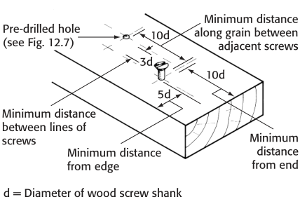

# SPAJANJE LESNIH POLIZDELKOV

## LEPLJENJE

- lepilo je disperzijsko sredstvo (makromulekularna snov razpršena v topilu)
- makromulekularna snov zagotavlja vezavo
- topilo -> prehajanju lepila v lesna vlakna

Lepilo je tekoča snov, ki se strdi med dvema ploskvama lepljenca.

V lepilnem spoju nastanejo močne kohezijske sile (med enakimi molekulami), ki 
preprečujejo trganje spoja v lepilu. Med lesom in lepilom nastanejo adhezijske sile, ki 
vežejo med sabo različne vrste materialov (različne molekule), v našem primeru je to lepilo in les.

{#fig:lepilo_adhezija_kohezija}

### UTRJEVANJE LEPILA:

- = prehod iz tekočega stanja -> želatinasto -> trdno stanje
- načini utrjevanja:
    - fizikalno: voda izhaja iz lepila v les -> zrak
    - kemijsko: kemijska reakcija med snovmi v lepilu otrdijo spoj
    - fizikalno-kemijsko utrjevanje: kombinirano utrjevanje
- pomembnejši  časi utrjevanja lepila:
    - Vmesni čas: od nanosa lepila do začetka stiskanja obdelovancev.
        - Odprti čas: od nanosa lepila do sestave lepljencev.
        - Zaprti čas: čas od sestave lepljencev do vzpostavitve tlaka v stiskalnici. 
    - Čas stiskanja: čas, v katerem se lepilo popolnoma strdi in veže lepljence.

### POMEMBNEJŠE LASTNOSTI LEPIL:

- Vodna odpornost: odpornost proti vodi (vlagi, zunanja uporaba)
- Trdota:
    - mehko, elastično: primerno tam, kjer bo les bolj deloval
    - trdo (v ivernih ploščah): boljša trdnost, večja obraba rezil
- pH: lahko obarvajo les v okolici spoja

- tehnologija lepljenja lesa kot sama zase se zelo redko uporablja
- lepljenje se kombinira z drugimi tehnologijami spajanja
- izjema je **širinsko spajanje lesa**
    - kjer imamo relativno veliko površino vzdolž vlaken
- ~~slab spoj lepljenja na čelni ploskvi vlaken~~
    - čelne ploskve so manjše
    - najšibkejši člen pri čelno lepljenem spoju je vedno lepilo (da, saj lesna vlakna omogočajo izredno velike natezne napetosti v dolžinski smeri; cepilne napetosti so manjše)

### NANOS LEPILA

- zagotoviti čim večjo površino spoja
- lepilo naj bo enakomerno razporejeno po **celi poevršini**
- debelina nanesenega lepila naj bo od 0.1 mm - 0.2 mm
- lepilo lahko nanašamo:
    - čopič
    - nanašalni glavnik
    - nanašalni valjček
    - tlačna posoda
    - strojno z nanašalnimi valji
- lepilo lahko nanesemo le ne eno ploskev, razen:
    - če ploskvi sestavimo z drsnim gibom (čep, rogljična vez)
    - lepilo nanesemo na obe ploskvi (posnetje lepila in nanos lepila)
- kadar je lesna zveza slepa (lameliranje, mozničenje, vez s čepom) predvidimo prostor za iztek lepila
- spoj močno stisnemo s sponami - zagotovimo, da lepilo pronica v lesno strukturo (v lumne trahej, tile)

- [LEPILA IN MATERIALI ZA POVRŠINSKO OBDELAVO IN ZAŠČITO LESA, M. Čermak](https://cpi.si/wp-content/uploads/2020/08/LepilainMaterialiZaPovrsinskoObdelavo.pdf)

## VRSTE LEPIL

V splošnem ločimo:

- naravna in
- sintetična lepila

{#fig:lepila_razvrstitev}

### Naravna lepila

Primer uporabe lepila naravnega izvora v lesarstvu je uporaba rastlinskih lepil. Na primer, lepila, pridobljena iz rastlin, kot so škrob, lignin ali rastlinske smole, se pogosto uporabljajo za lepljenje lesa. Ta lepila so lahko naravno obstojna, okolju prijazna in neškodljiva za zdravje ljudi. Uporabljajo se lahko za lepljenje različnih lesnih materialov, kot so iglavci, trdega lesa ali vezanega lesa.

Primer uporabe lepila živalskega izvora v lesarstvu je uporaba kostnega ali živalskega lepila. Kostno lepilo se pridobiva iz kosti živali in je tradicionalno lepilo, ki se uporablja v lesarstvu. Ta vrsta lepila je pogosto uporabljena za lepljenje furnirja na leseno podlago ali za popravilo lesnih stvari, kot so pohištvo ali glasbila. Kostno lepilo je znano po svoji moči in obstojnosti, pa tudi po naravnem izvoru. Živalsko lepilo, kot je ribje lepilo, se lahko uporablja tudi za lepljenje lesnih materialov, vendar se ta vrsta lepila manj pogosto uporablja kot kostno lepilo."

### Sintetična lepila

Pri sintetičnih lepilih izkoriščamo kemične lastnosti molekul s **funkcionalnimi skupinami**. Najbolj znane funkcionalne skupine so: $-OH$ (hidroksilna), $-COOH$, $-CHO$, $-NH_2$ (amino), $-CH=CH_2$ (vinilna), $-N=C=O$. Sintetična lepila delimo po njihovi kemijski reakciji:

- **Polimerizacija**: nasičeni monomeri z dvojnimi ali trojnimi kemijskimi vezmi se med seboj povežejo v zelo dolge molekule (polimere) in tvorijo trdno, trpežno strukturo.
- **Polikondenzacija**: monomeri, ki vsebujejo hidroksilne skupine se povezujejo med seboj v dolge makromulekule, pri čemer se odceplja voda.
- **Poliadicija**: nenasičene organske spojine (z dvojnimi ali trojnimi kem. vezmi) se spajajo s pomočjo molekul, ki vsebujejo vsaj dve funkcionalni skupini (npr -OH). Pri tem se vodikov atom *pripoji* na dvojno vez.

## POGOSTA LEPILA

<!--
To poglavje moram spremeniti in dopolniti. Poglavje naj bo napisano tako, 
da obravnava lepila, ki so pogosto uporabljena v šoli in v lesarstvu.
Predvsem naj odgovarja na vprašanje "zakaj uporabljamo neko lepilo", v čem
je njegova prednost. Na primer manjka mi:

- UHU lepilo v stiku (seatava, zakaj, kje kako...)
- FF (mislim, da so s tem lepljene iverne plošče, ker je lepilo trdo, je velika obraba rezil)
- Neostik (neoprensko lepilo, zakaj mora biti odprti čas, katera sestavina je uporabljena)
- Sekundno lepilo (imam)
    - [o sekundnem lepilu, Vertasium](https://www.youtube.com/watch?v=Ni82f1-cAXg)
- PVAc (nekako imam)
- PUR (imam)

-->

### Etil-cianoakrilat (sekundno lepilo)

Etil-cianoakrilat je monomer [strultura molekule](https://www.chemspider.com/Chemical-Structure.73564.html) v katerem je en ogljik z dvojno vezjo željan vezave z drugimi elementi, ki lahko oddajo elektron (npr. voda, kjer ima kisik tako tandenco). Ta sprožilec prične verižno reakcijo, v kateri se več monomerov etil-cianoakrilata poveže v polimer. Te dolge molekule zagotovijo trd spoj med dvema površinama (skoraj katerikoli-dvema). Tak spoj ima visoko natezno trdnost, tudi do 25 MPa.

Zaradi hitre reakcije lahko spoj vsebuje notranje napetosti in zato nima visoke udarne trdnosti, niti ne visoke strižne trdnosti. 

To lepilo ne veže dobro snovi, ki so kemijsko inertne (nimajo dvojnih vezi, ali so ne-polarne, ali nimajo prostih ionov...). Na primer plastike, kot so [poli-etilen](https://www.chemspider.com/Chemical-Structure.6085.html), [poli-stiren](https://www.chemspider.com/Chemical-Structure.7220.html), [teflon](https://www.chemspider.com/Chemical-Structure.8000.html) itd. Te snovi so hidrofobne in odbijajo vodo in tudi tako lahko ocenimo, ali jih bo etil-cianoakrilat lepil med seboj.

Za še hitrejšo reakcijo lahko lepilu dodamo pospeševalec [npr.: AC11](https://www.3m.com/3M/sl_SI/p/d/v000197711/) ali [SN 7452](https://www.henkel-adhesives.com/ee/en/product/adhesive-accelerators/loctite_sf_74520.html) s prisotnimi negativnimi ioni, kot je to pri [disulfidu](https://www.chemspider.com/Chemical-Structure.154763.html) in s tem zelo pospeši reakcijo. Vendar s tem nastanejo krajši polimeri in zato bolj trd spoj z manjšo upogibno trdnostjo. Za domačo rabo lahko uporabimo tudi [natrijev bikarbonat](https://www.chemspider.com/Chemical-Structure.8609.html) oz. sodo bikarbono. Le-ta se veže z vodo iz zraka in tvori hidroksidne ione ($OH^-$). Tako se sekundno lepilo strdi še hitreje in tvori trdo zmes. Na ta način lahko uporabimo sekundno lepilo za ojačitev spoja ali kot polnilo lukenj. V nasprotnem primeru, da želimo čas lepljenja podaljšati lahko lepilu dodamo topilo, kot je na primer aceton in tedaj se bojo tvorili daljši polimeri in spoj bo imel večjo upogibno trdnost. Taki pripravki lepila so komercialno dostopni v gel obliki, čeprav v nekaterih primerih podarjanje časa dosežejo tako, da so molekule daljše, kot na primer 2-oktil-cianoakrilat.

Polimerizirane molekule etil-cianoakrilata pri temperaturi $210 ^\circ C$ zopet razpadejo na prvotne monomere. Zato to lepilo ni primerno za visoke temperature. S postopkom destilacije, je proces celo v celoti reverzibilen. To lastnost izkoriščajo v namen poizkusa proizvodnje plastike, ki bi imela boljše reciklirne lastnosti[@Allison2023_plastic_ethyl-cyanoacrylate].

Variacija molekule etil-cianoakrilata z daljšo ogljikovo vrsto: [2-oktil-cianoakrilat](https://www.chemspider.com/Chemical-Structure.7991439.html) omogoča daljši čas utrjevanja lepilnega spoja in s tem manj intenzivnejšo eksotermno reakcijo ter tvorijo se daljši polimeri, ki zagotavljajo nekoliko večjo (upogibno) trdnost. To spojino uporabljamo v pripravku [DERMABOND](https://www.jnjmedtech.com/en-US/product/dermabond-advanced-mini-topical-skin-adhesives), ki se uporablja za brez-šivno celjenje ran (oz. lepljenje ran).

### Polivinilacetatno lepilo

Polivinilacetatno lepilo je vrsta lepila, ki se uporablja za površinsko obdelavo materialov. To lepilo je sestavljeno iz polivinilacetata, ki je polimer, pridobljen iz [vinilacetatnih](https://www.chemspider.com/Chemical-Structure.7616.html) monomerov. Polivinilacetatno lepilo se pogosto uporablja v različnih panogah, kot so lesna industrija, gradbeništvo, embalaža itd.

Prednosti uporabe polivinilacetatnega lepila so številne. To **lepilo je enostavno** za uporabo, saj se nanese s ščetko, valjčkom ali ročnim razpršilcem. Poleg tega se hitro suši in zagotavlja močno vez med materiali. Polivinilacetatno lepilo tudi omogoča fleksibilnost, ki je pomembna pri obdelavi materialov, ki se lahko krčijo ali širijo.

Pomembno je omeniti tudi, da polivinilacetatno lepilo **ni vodoodporno**. Zato ni priporočljivo za uporabo na predmetih, ki bodo izpostavljeni vodi ali vlažnim pogojem. Poleg tega se lahko polivinilacetatno lepilo v določenih pogojih razgradi, kar ga naredi manj primeren za trajne vezave.

V skupnosti površinske obdelave materialov je polivinilacetatno lepilo zelo priljubljeno zaradi svoje enostavne uporabe, močne vezave in prilagodljivosti. Kljub nekaterim omejitvam se pogosto uporablja za številne aplikacije, ki zahtevajo lepljenje materialov, kot so les, tkanine, papir itd."

{#fig:lepila-PVAC}

**PVAc - MEKOL D3**

- najpogosteje lepimo lesne spoje z eno-komponentnim polivinil-acetatnim (PVAc) lepilom. V Sloveniji ga proizvaja tovarna lepil MITOL in ga vodijo pod imenom MEKOL D3.

- [tehnični podatki lepila](https://www.mitol.si/wp-content/uploads/2018/12/MEKOL-D3_SLO.pdf)

- nanos 120-180 $g/m^2$ ali 0.12-0.18 mm 
- stiskanje:  min 0.5 $N/mm^2$
- stiskanje:  30-60min
- ~~čiščenje: operemo z vodo, obrišemo z vlažno krpo~~ (premisli!)
    - počakamo, da se posuši in odbrusimo
    - z brisanjem lahko lepilo nanesemo na lesno površino, ki se vpije v pore in oteži površinsko zaščito
    - najbolje je, da rob spoja zaščitimo s krep lepilnim trakom tako, da ko se ob stisku lepljencev lepilo izteče na lepilni trak (vedno pa te tehnike ni mogoče uporabiti, npr.: rogličenje).

**PVAc - MEKOL D4**

- podobno lepilo kot D3, le da je dvo-komponentno in bolj odporno na vlago in vodo. Primerno za notranjo uporabo, kot tudi za uporabo lesnnih spojev, ki so izpostavljeni vremenskim vplivom.

- [tehnični podatki](https://www.mitol.si/wp-content/uploads/2018/12/MEKOL-D4_SLO.pdf)

### Poliuretanska lepila

Poliuretansko lepilo je vrsta lepila, ki se uporablja za površinsko obdelavo materialov. Gre za sestavljeno mešanico poliuretanske smole, ki se uporablja za lepljenje in spojene različnih materialov, kot so les, kovina, plastika, steklo in keramika. Poliuretansko lepilo se zaradi svoje visoke trdnosti, fleksibilnosti in obstojnosti uporablja v številnih industrijskih in gradbenih aplikacijah. Ima odlične adhezijske lastnosti, ki omogočajo močno in trajno vez med materiali. Poleg tega poliuretansko lepilo zagotavlja tudi odpornost na vlago, temperaturne spremembe in kemijske vplive, kar ga naredi primernega za uporabo v različnih okoljih. Poliuretansko lepilo je na voljo v različnih oblikah, od tekočine do trdnega stanja, in se lahko nanese s ščetkanjem, valjanjem ali brizganjem. Zaradi svojih lastnosti in enostavne uporabe je poliuretansko lepilo vse bolj priljubljena izbira pri površinski obdelavi materialov."

{#fig:lepila-PUR}

**MITOPUR - E20**

- Mitopur E20 je enokomponentno, poliuretansko vodoodporno lepilo brez topil, ki veže na osnovi reakcije z
vodo. Spoj je temperaturno obstojen v območju od –40°C do +90°C in vodoodporen ter ustreza zahtevam
standarda EN 204-D4.

- [tehnični podatki](https://www.mitol.si/wp-content/uploads/2018/12/MITOPUR-E20_SLO.pdf)

{#fig:lepila_polikondenzacijska}

## VIJAČENJE

### SESTAVNI DELI VIJAKA

1. Glava
2. Steblo
3. Navoj
4. Konica

{#fig:vijak_sestava}

### TELO VIJAKA
1. Z vijačnico do konca glave:
    Taki vijaki se za spajanje lesa skoraj ne uporabljajo, ker ne zagotavljajo drsenja zunanjega pritrjevanega elementa. Ko pritrdite dva kosa lesa med seboj in se vijačnica vreže v lesna vlakna obeh elementov in je njuna medsebojna lega določena z vijačnico. Če ta dva elementa ne nalegata in želimo še nekoliko priviti vijak, da bosta elementa nalegala, bomo uničili vijačnico v ožjem elementu ali elementu iz mehkejšega lesa.
    Če s takim vijakom spajamo dva lesna polizdelka, pa v zunanji polizdelek predhodno izvrtamo dovolj široko luknjo, ki omogoča nekaj zračnosti okoli navoja vijaka.
2. Z gladkim steblom:
    Omogoča drsenje zunanjega pritrjevanega elementa.

{#fig:predvrtanje}

### PRED-VRTANJE

Pred-vrtanje je postopek pri vijačenju, pri katera na mesto kamor bomo privili vijak najprej izvrtamo manjšo luknjo. To preprečuje, da bi se vlakna preveč stlačila in zaradi teh napetosti povzročila cepljenje lesnih vlaken.
Premer pred-vrtanja naj bo v večini primerih enak premeru stebla vijaka. Če bomo vijak pritrdili v trši les (Hrast, Bukev) je lahko premer luknje nekoliko povečamo (do 0.5 mm), ali ga zmanjšamo, v kolikor vijačimo v mehkejši les.

### RAZPOREDITEV

Da zmanjšamo verjetnost cepljenja lesnih vlaken velja upoštevati naslednja priporočila razporeditve vijakov.

|       Min razdalja       | brez predvrtanja | s pred-vrtanjem |
|:------------------------:|:----------------:|:---------------:|
|    od čela polizdelka    |        20d       |       10d       |
|    od roba polizdelka    |        5d        |        5d       |
|   med linijama vijakov   |        10d       |        3d       |
| med vijaki vzdolž vlaken |        20d       |       10d       |
Table: Priporočljive minimalne razdalje pri vijačenju(d = premer vijaka brez vijačnice). {#tbl:minRazdaljaVijacenja}

{#fig:necepljenje_vijaki}

### VPLIV SMERI VLAKEN NA VIJAČENJE

Smer vlaken v lesu ima pomemben vpliv na trdnost vijačnega spoja. Ko vijak privijemo pravokotno na smer lesnih vlaken, se vijačnica uspešno ugrizne med vlakna in jih skorajda ne poškoduje. To omogoča stabilno in močno povezavo, saj vlakna okoli vijačnice pomagajo trdno držati vijak na mestu.

V nasprotju pa privijanje vijaka vzporedno z vlakni povzroči rezanje ali poškodovanje vlaken, kar oslabi celovitost povezave. V tem primeru so vlakna lahko presekana, kar poveča tveganje, da se vijak izvleče ali iztrga iz lesa, saj ni več celovite strukture, ki bi ga podpirala.

Če je potrebno povezati dve letvi pod kotom 90 stopinj, npr. eno desko na čelo druge, lahko težavo omilimo z vstavljanjem moznika kake 2 cm od čela letve. Izvrtane luknje pravokotno na vlakna v deski omogočajo mozniku, da deluje kot stabilizator. Ko nato vijak zavrtamo v čelo letve, ga dejansko zavrtamo tudi v moznik, ki ima lesna vlakna pod pravim kotom glede na vijak, kar zagotavlja močnejšo in bolj zanesljivo spojitev.

<!--
Seminarska naloga:
Preskus kako smr vlaken vpliva na vijačenje
-->

### VIJAČNI NASTAVEK

#### PLOŠČATI
vijačni nastavek je namenjen vijakom, ki imajo eno vodoravno vdolbino (režo) v glavi vijaka. Ta oblika je bila prva vrsta razvitega vijačnega pogona, ki je bila več desetletij najpreprostejša in najcenejša za izdelavo. Vendar ta zasnova ni primerna za vijačenje z električnim orodjem, saj pogonski vijač pogosto zdrsne iz reže; to pogosto povzroči poškodbe vijaka in okoliškega materiala.

#### FEARSON
vijačni nastavek je križni z nekoliko bolj ostro konico izvijača. Prednost te oblike je, da en nastavek ustreza več različno velikim glavam vijaka. Od vijakov s Philips vijačnim nastavkom se razlikuje predvsem po tem, da imajo zareze ostre navpične robove in tako omogočajo večji navor vijačenja.

#### PHILIPS
vijačni nastavek je križne oblike. Zareze v glavi vijaka imajo nekoliko poševne robove in  tako nekoliko posebno obliko.  Oblika zareze je bila zasnovana kot neposredna rešitev na več težav z vijačenjem: ne omogoča večjih navorov vijačenja, saj zaradi poševnih robov zareze izvijač izvrže iz zareze, enostavna natančna poravnava izvijača z vijakom, ki preprečuje izmet izvijača na površino elementa ter enostavna uporaba z električnimi orodji. Označujemo ga z oznako **PH** in pripadajočo številko velikosti (#0 - #5).

{#fig:Frearson_vs_Phillips}

#### POZIDRIV
vijačni nastavek je križne oblike, zopet z ravnimi vzporednimi kraki. Med glavnimi kraki so še majhna rebra, ki oklepajo 45° z glavnimi kraki. Zasnovan je bil tako, da omogoča več navora, saj je tedaj električno orodje že omogočalo nastavitev maksimlnaega navora. Zareza v glavi vijaka in konica izvijača se točno prilegata in je tako je manj verjetno, da bo izvijač izskočil iz glave vijaka. Izvijači pozidriv so pogosto označeni z oznako **PZ**, ki jim sledi številka velikosti (#0 - #5). Na glavi vijaka pa so med zarezami ozke črtice, ki pomagajo razločevati pozidriv vijake od philips vijakov.

{#fig:PHvsPZ}

#### ŠESTKOTNI
vijačni nastavek, zaradi poobčnoimenovanja znan inbus (ime podjetja: Innensechskantschraube Bauer und Schaurte), ima obliko pravilne šest-strane prizme. Nastavek izvijača in ugrezno zarezo vijačne glave je izredno enostavno izdelati in je tako cenovno ugodnejša. Zaradi vzporednih robov v zarezi omogoča vijačenje z večjimi navori. V primerjavi s  philips vijakom je v oprijem vijak - izvijač vključenih več stičnih površin, kar manj deformira zarezo vijačne glave. Zahteva pa nekoliko več pozornosti pri poravnavanju izvijača z glavo vijaka.

#### TORX
oblika vijačnega nastavka je 6-strana zvezda. Konica izvijača je rahlo konusne oblike, le toliko, da omogoča lažje poravavanje vijača z galvo vijaka. Čeprav je bil prvotno načrtovan, da bi otežil dostopnost vijakov slehernemu uporabniku, je s časom postal zelo priljubljen zaradi same uporabnosti in priročnosti. Torks blika omogoča zadovoljiv prenos navora, enostavno poravnavaje vijaka in vijača ter nudi relativno visoko odpornost proti deformaciji. Označujemo ga z oznako **T** in pripadajočo števiko velikosti.

{#fig:Torx_sample}

## KONSTRUKCIJSKE VEZI

Konstrukcijske vezi izredno izboljšajo trdnost spoja, saj imajo lesna vlakna veliko natezno in tlačno trdnost. S Konstrukcijskimi vezmi bistveno zmanjšamo obremenitev lepljenih spojev in tako zagotovimo, da bodo spoji trajali dlje. Zlasti pri lesnih zvezah so lepljeni spoji izredno obremenjeni, saj les deluje zaradi krčenja in raztezanja lesa glede na vsebnost vlažnosti.

Konstrukcijske vezi lahko razdelimo glede na smer spajanja:
- širinsko spajanje
- dolžinsko spajanje
- kotno spajanje
- obodno spajanje

### ŠIRINSKO SPAJANJE LESA S SPAHANIM ROBOM

- namen: iz manjših polizdelkov dobimo širše
- tangencialni raztezek lesa je $\beta_t = 6-12\%$
    - pravilna razporeditev polizdelkov

{#fig:sirinsko}

- Pri pripravi lesa za širinsko spajanje na poravnalnem skobeljnem stroju uporabljajte tehniko skladnih kotov vzporednih stranic, ki jo prikazuje [@fig:skladni_koti_vzporednih]. To lahko zagotovimo tako:
    - da polizdeleku najprej poravnamo širšo stranico na poravnalnem skobeljnem stroju,
    - nato nasprotno stranico poravnamo vzporedno s prvo na debelinskem skobeljnem stroju,
    - šele nato poravnamo v pravi kot eno od ožjih stranic,
    - polizdelek obrnemo okoli vzdolžne osi in
    - v pravi kot poravnamo obe nasprotni stranici.

- Ko polizdelke širinsko spajamo, moramo paziti, da se izmenjujejo priležne in nasprotne ploskve poravnanih kotov.

- To isto tehniko lahko uporabljamo pri dolžinskem razrezu na mizarski krožni žagi.

{#fig:skladni_koti_vzporednih}

#### TOPA VEZ

- sosednje robove spahamo (poskobljamo) v paru
    - tehnika izničuje napako v naklonu roba

#### VEZ BRAZDO IN TOPIM ROBOM

- dimenzije peresa in brazde d/2 x d/2
- lepilo po vseh površinah

#### VEZ S PERESOM IN UTOR

- dimenzije peresa d/2 x d/3
- utor je 1mm globji za iztek lepila
- pogosto je čelo utora na skriti stran spoja celo 2 mm nižje, zato da vidna stran zagotavlja tesni ujem (ladijski pod)

#### LASTOVIČJA VEZ

- last. čep d/3 x d/3 (10°-12°) 
- utor d/3 x d/3 (1 mm globji)

#### KLINASTA VEZ

- utor in čep d/3 x d/3

#### ZOBATA VEZ

- glede na orodje
- pogosto oblika zob sovpada z zagozdo 1:20

{#fig:sirinsko_spajanje}

### DOLŽINSKO SPAJANJE LESA

- ~~problem: slab spoj lepljenja v smeri prečno na vlakna~~ 
- nujna tehnološka obdelava, s katero povečamo površino oprijema
- morda celo prehod na fizično vez
- pogosta mehanska obdelava z zobatimi vezmi (rezkalna glava z zobatimi noži)

{#fig:dolzinsko-spajanje-lesa}

### KOTNE VEZI

#### RAVNA PREPLOŠČITEV

- vogalna
- vmesna
- križna

#### ČEP IN ZAREZA

- vogalna
    - enojna
    - dvojna
    - čep s peresom (povečana trdnosti v smeri kota) 
        - dim. čepa 1š x 2/3š
        - dim. peresa 1/3d x 1/3d x 1/3š
    - jeralna (45° rama)

- vmesna
    - ravna
    - razširjena z zagozdama
        - zagozda 1:20 (to razmerje je max, da se ne cepi)
    - slepa z zagozdama

{#fig:kotno_spajanje}

#### Zagozde

Zagozde sodijo med najstarejše in najučinkovitejše mehanske načine spajanja lesenih elementov. Njihova uporaba temelji na preprostem, a zanesljivem principu trenja med zagozdo in lesom, ki nastane zaradi vkleščenja zagozde v pripravljeno odprtino ali režo. Pogosto se uporabljajo takrat, ko želimo izdelati konstrukcijsko vez brez uporabe lepil, bodisi zaradi zahtev po razstavljivosti spoja, bodisi zaradi tehnoloških ali estetskih razlogov. Leseni spoji z zagozdami so še posebej priljubljeni v tradicionalnem mizarstvu in restavratorskih delih, kjer se zahteva naravni, reverzibilen pristop brez kemičnih dodatkov.

Učinkovitost zagozde temelji na razmerju med njeno dolžino in širino. Tipično razmerje **1 : 10** zagotavlja zadostno trenje med površinama, da zagozda po vstavitvi ostane trajno fiksirana. Takšno trenje ustvarja dovolj veliko aksialno silo, da se spoj ne razrahlja niti pri dolgotrajnih obremenitvah ali spremembah vlažnosti lesa. Prav zaradi tega načela je zagozda pogosto uporabljena v spoju moznika, čepa ali utora, kjer zagozda mehansko razširi les in s tem zaklene konstrukcijski element.

Kljub temu imajo spoji z zagozdami tudi svoje pasti. **Sile, ki delujejo prečno na smer vstavitve zagozde, so lahko zelo velike**, zato pri neizkušenih mizarjih pogosto pride do **cepljenja vlaken** na strani, kjer se les razširi. Na primer, če s 300 g kladivom srednje hitro zamahnemo (cca 5m/s) zlahka presežemo silo 1500N. Zagozda z razmerjem 1:10 pa bo to silo še 10x ojačala. Takih prečnih sil lesna vlakna ne bodo prenesla in se pričnejo cepiti. Cepljenje oslabi vez in lahko privede do propada spoja, zlasti pri obremenjenih konstrukcijah.

Da bi se izognili cepljenju, je pomembno **ustrezno oblikovanje in vstavljanje zagozde**. Najboljša praksa vključuje rahlo zaobljeno ali posneto konico, ki postopoma razširi les, ter uporabo kladiva z nadzorovanim udarcem. Prav tako je priporočljivo, da se zagozdo vstavi vzdolž smeri vlaken, kadar je to mogoče, in da se v območju vstavljanja vnaprej izvrtajo manjše pomožne luknje ali razbremenilne reže, ki razbremenijo prečno silo na več vlaken. Pazduho čepa naj stiska rob zareze v katero je vstavljen čep. 

Zagozde tako ostajajo pomemben del mizarske prakse — združujejo preprostost, zanesljivost in estetsko vrednost lesenega spoja. Pravilno načrtovana in vstavljena zagozda omogoča trdno, trajno in po potrebi tudi razstavljivo povezavo, ki ohranja naravni značaj in mehanske lastnosti lesa.

#### JERALNE ČEPNE VEZI

- lice in odlice sta spojena skotom 45° (nariši - kolokvij)

#### MOZNIČENJE

- mozniki so navadno premerov fi = [6, 8 10] mm
- dolžina je l = (5±)x fi
- moznik velikosti za spoj naj bo dim. fi= 1/2d
- luknja naj bo globja za 1mm za iztek lepila

#### VEZI Z LAMELAMI

- jeralna z lamelo

### OBODNE VEZI

#### BRAZDA IN PERO

- kotna
    - brazdna vez in topi rob
        - dim peresa 1d x 1/4d (estetski namen)
- namen: pri omari se tako ne vidi čelo police

#### PERO in UTOR

- kotna
    - dim. peresa 1/3d x 1/3d
    - pokončna peresna vez
    - ležeča peresna vez (pero spodaj preprečuje cepljenje)
- vmesna
    - dim. peresa max 1/2d x 1/3d
    - dno omare
    - ni namenjena za police
        - velike strižne napetosti na peresu

#### RAVNA ROGLJIČNA VEZ

- kotna
    - tehnika ročnega rezanja rogljev obeh spojnih polizdelkov hkrati
        - sprednjega zamaknemo za debelino reza v levo in
        - odrežemo vse dezne robove čepov
        - zamaknemo v desno in
        - odrežemo levi rob čepa
- vmesna

#### LASTOVIČJI ROGLI

- kotna

{#fig:dovetails_making}

- vmesna:
    - le z enim lastovičnim peresom
    - drsni spoj

---

