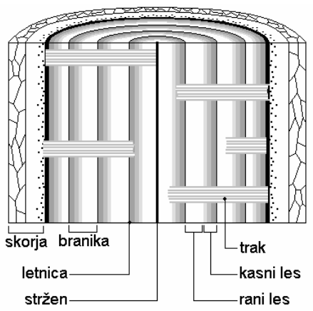

# POMEN GOZDA V SLOVENIJI

- Gospodarska vloga
- Proizvajanje kisika
- Varovalna vloga (preprečuje erozijo)
- Socialna vloga (rekreacija, vikendi)

{#fig:gozd_povrsina}

- cca 60% površine Slovenije
  - bukev 32%
  - smreka 31%
  - jelka 7,5%
  - hrast 7%

## Skladiščenje CO2

- v 1 m3 lesa -> cca (ekvivalent) 1T CO2
- 1T CO2 -> za prirast 1 m3 lesa -> 0,7T O2

# PRIDOBIVANJE LESA

## Sečnja

- smer podiranja
- čiščenje
- zasek

{#fig:secnja_varni_zasek}

- ureditev sečišča
  - veje, vhrove razžagami in zložimo
  - nizki panji
  - ne odlašamo s spravilom lesa

## Motorna žaga

1. Pogonski sklop
    1. Motor:
        * **Funkcija:** Pretvarja kemično energijo goriva v mehansko energijo, ki poganja verigo.
        * **Vzdrževanje:** Uporabljaj ustrezno mešanico goriva in olja po navodilih proizvajalca. Redno čisti hladilna rebra na valju motorja. Redno preverjaj kompresijo in tesnila; menjaj obloge valja in batne obročke, če pride do znakov obrabe.

    2. Bencinski rezervoar
        * **Funkcija:** Shrani gorivo (mešanica bencina in olja).
        * **Vzdrževanje:** Redno menjaj filter goriva (1 krat letno). Uporabljaj svežo mešanico goriva; po dolgotrajni neuporabi izprazni rezervoar, da preprečiš nabiranje usedlin in zamašitve.

    3. Rezervoar za olje
        * **Funkcija:** Dovaja mazalno olje za verigo in vodilno letev.
        * **Vzdrževanje:** Vedno uporabljaj primerno olje za verižne žage. Redno preverjaj pretok olja in očisti zamašene kanale.

    3. Vžigalna svečka
        * **Funkcija:** Ustvari iskro za vžig goriva v valju.
        * **Vzdrževanje:** Čisti elektrodo na vsake 25–50 ur delovanja, menjaj svečko ob znaku obrabe ali težav pri vžigu.

    3. Zračni filter
        * **Funkcija:** Preprečuje vstop prahu, opilkov in drobirja v motor.
        * **Vzdrževanje:** Redno čistiti (po potrebi celo vsakodnevno pri intenzivni uporabi); zamenjati, če je filter poškodovan ali močno zamašen.

    3. Uplinjač
        * **Funkcija:** Meša gorivo in zrak v pravem razmerju za zgorevanje.
        * **Vzdrževanje:** Občasno nastavi vijake za prosti tek in glavno šobo; očisti notranje kanale in membrane. Uporabljaj čisto gorivo in filter za gorivo.

    3. Dovod zraka
        * **Funkcija:** Dovaja čist zrak v uplinjač za zgorevanje.
        * **Vzdrževanje:** Redno odstranjuj prah in smeti z zračnih kanalov.

    3. Izpušni sistem (dušilec)
        * **Funkcija:** Odvaja in duši izpušne pline, zmanjšuje hrup.
        * **Vzdrževanje:** Preverjaj morebitne zamašitve zaradi saj in očisti mrežico proti iskrám (spark arrestor).

    3. Zaganjalnik
        * **Funkcija:** Ročni povratni zaganjalnik z vrvico omogoča zagon motorja.
        * **Vzdrževanje:** Preverjaj vrvico in povratno vzmet, po potrebi namaži in zamenjaj obrabljene dele.

2. Prenosni in rezalni sklop

    3. Sklopka
        * **Funkcija:** Centrifugalna sklopka poveže motor z verigo pri višjih vrtljajih in prepreči vrtenje verige v prostem teku.
        * **Vzdrževanje:** Preverjaj obrabo čeljusti in vzmeti; čistiti ostanke smole in žagovine.

    3. Pogonski zobnik (verižnik)
        * **Funkcija:** Prenese moč motorja na rezalno verigo.
        * **Vzdrževanje:** Preverjaj obrabo zobnika in ga zamenjaj, ko se zobje začnejo koničiti ali nastanejo utori.

    3. Vodila verige
        * **Funkcija:** Vodijo verigo po pravilni poti okrog meča.
        * **Vzdrževanje:** Redno čistiti, mazati z oljem in preverjati, da ni zarez ali poškodb.

    3. Vodilna letev (meč)
        * **Funkcija:** Usmerja rezalno verigo pri rezanju.
        * **Vzdrževanje:** Redno obračaj letev (zgornjo in spodnjo stran), čistiti utor in odprtine za mazanje. Menjaj ob izraziti obrabi utora ali konice.

    3. Napenjalec verige
        * **Funkcija:** Omogoča prilagajanje napetosti verige za učinkovito in varno delovanje.
        * **Vzdrževanje:** Preverjaj delovanje vijaka in vzmeti; vedno napni verigo, da ne visi, a se še prosto giblje z roko.

    3. Rezalna veriga
        * **Funkcija:** Glavni rezalni element za prežagovanje lesa.
        * **Vzdrževanje:** Redno ostri rezalne zobe z ustrezno pilo (pod pravim kotom in enakomerno). Očisti in zamenjaj poškodovane člene. Preverjaj dolžino in stanje verige.
{#fig:Oblika_žaginega_zoba}

    3. Oljna črpalka
        * **Funkcija:** Dovaja mazalno olje na verigo in meč.
        * **Vzdrževanje:** Preverjaj pretok olja in očisti kanale ter šobe. Ne uporabljaj brez olja, da preprečiš pregrevanje verige.

3. Ohišje in varnostni sklopi

    3. Ohišje motorja
        * **Funkcija:** Nosilna konstrukcija, ki združuje vse sklope žage.
        * **Vzdrževanje:** Čisti ohišje, preveri, da ni razpok ali zlomov.

    3. Ročaji (sprednji in zadnji)
        * **Funkcija:** Omogočajo varen in stabilen prijem žage.
        * **Vzdrževanje:** Preverjaj pritrjenost in nepoškodovanost. Čisti, da niso mastni ali spolzki.

    3. Plinska ročica
        * **Funkcija:** Uravnava dovod goriva v motor in s tem hitrost vrtenja verige.
        * **Vzdrževanje:** Preveri gladko gibanje in vračanje v prosti tek. Po potrebi namaži.

    3. Varnostni sprožilec plina
        * **Funkcija:** Preprečuje nenamerno dodajanje plina.
        * **Vzdrževanje:** Preverjaj redno delovanje in odzivnost.

    3. Zavora verige
        * **Funkcija:** S hitrim zaviranjem ustavi verigo pri povratnem udarcu (kickback) ali ko ročico potisneš naprej.
        * **Vzdrževanje:** Redno preverjaj delovanje, čistiti zavorni trak in mehanizem.

    3. Zaščitni lok ročaja
        * **Funkcija:** Ščiti roko in služi za sprožitev zavore verige.
        * **Vzdrževanje:** Preveri celovitost in gibljivost, odstrani smolo in opilke.

    3. Drsni ščitnik verige
        * **Funkcija:** Prekriva zgornji del verige in zmanjšuje nevarnost stika z njo.
        * **Vzdrževanje:** Čisti in preveri pritrjenost.

    3. Pokrov sklopke in verige
        * **Funkcija:** Ščiti sklopko in verižnik ter omogoča dostop za servisiranje.
        * **Vzdrževanje:** Očisti notranjost pokrova od olja in žagovine.

4. Dodatni deli in pripomočki

    3. Napenjalni vijak
        * **Funkcija:** Natančno nastavlja napetost verige.
        * **Vzdrževanje:** Občasno namaži navoj in očisti umazanijo.

    3. Dušilni gumbi (čok in stop-switch)
        * **Funkcija:** Olajšata zagon hladnega motorja in zaustavitev motorja.
        * **Vzdrževanje:** Preverjaj delovanje in čistost gibljivih delov.

    3. Vodilni zob (odbijač)
        * **Funkcija:** Oprijema se lesa in stabilizira rez med delom.
        * **Vzdrževanje:** Preverjaj ostrino in integriteto; po potrebi nabrusi.

    3. Amortizerji vibracij
        * **Funkcija:** Zmanjšujejo vibracije, ki se prenašajo na uporabnika.
        * **Vzdrževanje:** Redno preverjaj celovitost gumijastih oziroma vzmetnih elementov in jih zamenjaj ob znakih obrabe.

    3. Pokrov zračnega filtra
        * **Funkcija:** Omogoča hiter dostop do filtra.
        * **Vzdrževanje:** Redno čistiti, da se filter lahko prosto zamenja.

    3. Pokrov verižnika in meča (transportni pokrov)
        * **Funkcija:** Varuje verigo in uporabnika pri transportu in shranjevanju.
        * **Vzdrževanje:** Čisti in preveri, da ni poškodovan.

## Nevarnosti

1. Dno in vrh zaseka se sekata - ni ščetine!
2. Dno in vrh zaseka se ne stikata v ravni liniji
    - ni ustrezne ščetine
    - smer padanja ni določena
3. Preglobok zasek
    - ne moremo popravljati smeri
    - ni prostora za kline
    - oslabljena ščetina zaradi % olesenelih vlaken
4. Navidezna ščetina pri nizkem zaseku
    - pri močno razraščenem koreninovci (poševna vlakna)
    - možnost prereza ščetine
5. Premajhen kot zaseka
    - ščetina se prehitro pretrga
    - ni kontrole nad padanjem drevesa
6. Pregloboko podžagovanje
7. Prenizko podžagovanje
    - potrebno močnejše klinjenje
    - mogoč zdrs v smer sekača

# LES KOT SUROVINA

Neobdelan les:

-Tehnični les
-Les za kemično predelavo
-Les za kurjavo

OBDELAN les:

- Žagan les
- Tesan les
- Rezan 
- Luščen

{#fig:predelava_lesa}

Tehnični les: 

- Hlodovina za furnir, vžigalice, železniške pragove, za žaganje v plohe in deske;
- Okrogli gradbeni les: drogovi za odre, za napeljavo, ladijskim les, jamski les, jambori, piloti…
- Drobni tehnični les: palice, ročaji, oporniki za vinograde, sadovnjake, hmeljišče…

Les za kemično predelavo:

- Za celulozo in lesovino
- Taninski les
- Za suho destilacijo
- Les za kurjavo: cepanice, peleti, briketi…

# ZGRADBA LESA

Les se je evolucijsko razvil kot mehansko in transportno tkivo pri kopenskih rastlinah, kar je omogočilo doseganje večjih višin, učinkovitejše prevajanje vode in hranil ter boljšo oporo nadzemnim rastem. Kopenske rastline so se razvile iz morskih, verjetno so prve oblike na kopnem spominjale na lišaje; iz teh preprostih kolonij so se postopoma razvijale bolj kompleksne celične strukture. Kasneje so se pojavile tudi kambiju podobne celice — plast delitvenih celic, ki je bistveno vplivala na sekundarno rast in tvorbo pravega lesa, saj je omogočila debeljenje stebla in nastanek diferenciiranih prevodnih ter podpornih tkiv. Postopoma so se pojavile preproste celične strukture, ki so bile specializirane za prevajanje vode (ksilem) in za transport organske snovi (floem), hkrati pa so se celične stene odebelile z ligninom za večjo trdnost.  V evolucijskem poteku so iglavci (golosemenke) razvili pretežno homogeno in enostavno zgradbo lesa, sestavljeno predvsem iz trahej — dolgih, variabilno debelostenskih celic, ki hkrati omogočajo transport vode in mehansko podporo. Listavci (angiosperme) so kasneje uvedli bolj kompleksne elemente ksilema, kot so vaskularne traheje in ločene celice za mehansko podporo (vlakna), ter izrazitejšo diferenciacijo med prevajnimi in podpor­nimi tipi celic, kar daje njihovemu lesu bolj heterogeno in specializirano zgradbo. Zaradi te razlike v celični specializaciji in raznolikosti tipov celic je les iglavcev po sestavi in strukturi bolj enostaven kot les listavcev.

{#fig:fun_ses_les}

1. Lubje

  - Zaščita: Lubje je prva plast, ki ščiti notranje plasti lesa pred mehanskimi poškodbami, kot so udarci, zareze ali žaganje. Prav tako ščiti drevo pred zunanjimi vplivi, kot so voda, sončna svetloba, žuželke in bolezni.
  - Shranjevanje hranil: Lubje vsebuje tanine, smole in škrob, ki se uporabljajo za shranjevanje hranil. Ta hranila so pomembna za preživetje drevesa v obdobjih, ko je dostop do vode in hranil omejen.

2. Ličje (floem)

  - Prevajanje vode in hranil: Lubje vsebuje sloj tkiva, imenovan floem, ki je odgovoren za prenos hranil in vode iz listov do korenin ter obratno. Ta transport hranil je ključen za rast in preživetje drevesa.

3. **Kambij** 

  - Kambij je plast tkiva, ki se nahaja med lesnim delom (ksilemom) in lubjem drevesa. Je odgovorna za sekundarno debeljenje drevesa, kar pomeni, da omogoča rast drevesa v debelino. Kambij je aktivna rastna plast, ki proizvaja nove celice na notranji strani (proti lesu) ter na zunanji strani (proti lubju) drevesa.
  - Na notranji strani proizvaja lesne celice, imenovane ksilem, ki so odgovorne za prenos vode in hranil po deblu drevesa navzgor proti listom. Na zunanji strani pa proizvaja lubje, ki je odgovorno za zaščito in transport snovi navzdol in proti koreninam drevesa.
  - Kambij je zelo pomemben za rast drevesa v debelino, saj omogoča, da drevo postane vse večje in močnejše. Vsako leto proizvede nove plasti lesa in lubja, kar vodi do povečanja premera drevesa. To omogoča tudi boljšo podporo drevesu ter transport hranil in vode po celotni rastlini.
  - Poleg tega je kambij pomemben tudi za zdravje drevesa, saj lahko ob poškodbah ali okužbah proizvaja nove celice, ki obnavljajo poškodovano tkivo. Kambijeva funkcija je torej ključnega pomena za rast, razvoj in preživetje drevesa."

4. Beljava (ksilem)
  - Funkcija ksilema pri drevesu je transport vode in mineralov iz korenin do listov. Ksilem je vaskularno tkivo, ki sestoji iz cevastih elementov, imenovanih ksilemske cevčice. Te cevčice so odgovorne za prenos vode in mineralov navzgor po steblu drevesa. Poleg tega ksilem zagotavlja tudi mehansko oporo drevesu, saj je sestavljen iz močnih in lignificiranih celic.

5. Olesenel les
  - nevitalen del debla, sestavljen je iz parenhimskih celic, ki potekajo tudi radialno do lubja in s tem poskrbijo, da se hranilna snov prevaja tudi v tej smeri.

> Poznavanje smeri gibanja hranilnih snovi v deblu rastočega drevesa je ključno za uspešno sadno obrezovanje. S pravilno izvedeno zarezo nad spečim brstom lahko ustvarimo ugodne pogoje za rast in razvoj drevesa. Hranilne snovi se namreč zberejo na mestu zareze in spodbudijo speči brst k rasti. Tako lahko dosežemo boljšo obliko drevesa, večjo produktivnost in kakovost pridelka. Zato je pomembno, da pri obrezovanju drevesa upoštevamo njegovo naravno smer gibanja hranilnih snovi ter ustrezno izvedemo zarezo nad spečim brstom. Tako bomo drevesu omogočili optimalen razvoj in rast ter dosegli želene rezultate.

## Prirast lesne mase

- prevajanje vode
- fotosinteza
$$ 6CO_2 + 6H_2O = C_6H_{12}O_6 + 6O_2 $${#eq:fotosinteza}
- prevajanje sladkorjev

{#fig:prirast_lesna_mase}

- spomladi:
  - prirast lesne mase
  - prevajanje vode
  - prevajanje zaloge sladkorjev
- poleti:
  - prirast plodov
  - prirast lesne mase
- jesen:
  - shranjevanje sladkorjev
  - prirast lesne mase
- zima:
  - mirovanje

- [Wood Handbook: Wood as an Engineering Material](https://www.fpl.fs.usda.gov/documnts/fplgtr/fpl_gtr190.pdf) - knjiga vsebuje prečne prereze različnih vrst lesa iz katerih je lepo vidna enostavna struktura iglavcev za razliko od listavcev.

## Makroskopska sestava lesa

Les iglavcev je makroskopsko prepoznaven po relativno enostavni zgradbi, v kateri prevladuje ena vrsta celic—traheide—ki opravljajo tako mehansko oporo kot prevod vode. V prečnem prerezu so letnice navadno jasno vidne zaradi kontrasta med ranem lesom (angl. earlywood; širši lumni, tanjše stene, svetlejši) in kasnim lesom (angl. latewood; ožji lumni, debelejše stene, temnejši), kar prispeva k značilni teksturi iglavcev [@FPL2010; @Ruffinatto2015].

V zunanjem delu debla je običajno svetlejša beljava (sapwood), funkcionalno aktiven pri prevajanju vode in rezervnih snovi; proti sredici prehaja v jedrovino (heartwood), ki je praviloma temnejša zaradi odloženih ekstraktivov in ima predvsem strukturno/protikorozijsko vlogo. Meja med beljavo in jedrovino je lahko ostra ali postopna, odvisno od vrste [@FPL2010].

Makroskopskemu opisu lesa pomagajo tri anatomske smeri: vzdolžna (axialna), radialna (od sredice proti skorji, vzporedno z radialnimi trakovi) in tangencialna (tangentno na obroč letnic). Te smeri definirajo tri osnovne opazovalne ploskve (prečni, radialni, tangencialni prerez), na katerih prepoznavamo ključne znake, npr. širino in kontrast letnic, barvo, vidnost trakov in prisotnost smolnih kanalov [@FPL2010; @InsideWood].

Za nekatere iglavce (npr. rodovi Pinus, Picea, Larix) so značilni smolni kanali, ki so na prečnem prerezu vidni kot majhne okrogle ali eliptične „pike“ in na radialnem/tangencialnem kot dolgi kanali; pri drugih (npr. smreka, Taxus) jih ni. Smolni kanali so pri iglavcih navadno nizki in ozki; makroskopsko so pogosto komaj vidni, vendar lahko pri določenih vrstah prispevajo k nežnim radialnim vzorcem [@Ruffinatto2015; @InsideWood].

Za identifikacijo iglavcev na makronivoju so zato ključni: kontrast med ranim/kasnim lesom, širina letnic, prisotnost/razporeditev smolnih kanalov, barvni prehod belež–jedrovina in (kadar je vidno) narava žarkov [@Ruffinatto2015; @FPL2010].

... glej vir [LES ZGRADBA](/home/david/Files/Work/UL-PeF/Vaje/TP-2_Les/Literatura/120_Les_3-LES_ZGRADBA.pdf) 

Prerezi:

- prečni
- vzdolžni
- tangencialni

> Prepoznaj smer prereza pri naslednjih slikah [link](https://www.wood-database.com/softwoods/pinaceae/abies/)

### Prečni prerez

- LETNICA
  Letnica pri drevesu je letni prirastek, ki ga drevo naredi v enem letu. Gre za obroček ali plast lesa, ki se oblikuje med rastno sezono drevesa. Letnica je vidna kot krožna linija na prerezu debla in je sestavljena iz različno obarvanih in gosto ali redko razporejenih celic lesa. Število letnic na deblu drevesa nam omogoča oceno njegove starosti, saj vsaka letnica predstavlja eno leto rasti. Poleg ocene starosti drevesa lahko letnice uporabimo tudi za analizo rasti in razvoja drevesa ter za preučevanje podnebnih sprememb."
- SKORJA
- LIČJE
- KAMBIJ
- BELJAVA
- OLESENELI LES
- BRANIKA
  - rani les
  - kasni les
  - pore
- LESNI TRAK
- STRŽEN

{#fig:precni_prerez}

- Pore pri listavcih (traheje)
  - venčasto porozni
  - raztreseno porozni

### Radialni prerez

- letnica
- skorja
- ličje
- kambij
- beljava
- oleseneli les
- branika
  - rani les
  - kasni les
  - pore
- stržen
- lesni trak
  - izredno široki - bleščice

{#fig:radialni_prerez}

# MIKROSKOPSKA SESTAVA LESA

Mikroskopska zgradba lesa razkriva kompleksno organizacijo celic, ki zagotavlja mehanske lastnosti in transport vode ter hranil. Osnovne sestavine so vodne cevi in traheide, ki omogočajo aksialni transport, ter vlakna, ki prispevajo k trdnosti; parenhimske celice skrbijo za skladiščenje in presnovo, radialni trakovi pa za lateralni transport in rezervne snovi. Vsaka lesna celica ima večslojno celično steno (vključno s sloji S1, S2, S3), sestavljeno iz celuloze, hemiceluloz in lignina; debelina in orientacija mikrofibril v S2 sloju močno vplivata na mehanske lastnosti lesa. Piti v sekundarni steni omogočajo medcelični prehod vode, njihova oblika in porazdelitev pa se razlikujeta med listavci in iglavci, kar je ključno za anatomsko razlikovanje vrst.

## Mikroskopska zgradba lesa

- Celični tipi in njihove funkcije: traheide, vodne cevi (ki omogočajo aksialni transport), vlakna (mehanska trdnost), parenhimske celice (skladiščenje in presnova), radialni trakovi (lateralni transport in rezerve).
- Zgradba celične stene: večslojna sekundarna stena z deli S1, S2, S3; debelina in orientacija mikrofibril v S2 pomembno vplivata na mehanske lastnosti.
- Piknje: strukture za medcelični prehod vode; razlike med listavci in iglavci so anatomsko pomembne.
- Posebne strukture: piknje (pits) s pikensko votlino in membrano ter tile  — izrastki parenhimskih celic, ki zapirajo lumen traheje.

{#fig:mikro_zgradba}

{#fig:mikro_branika_iglavci}

### Opis omenjenih vrst celic in njihova funkcija v lesu
- Traheide
  - Vrsta: prevladujoča pri iglavcih.
  - Funkcije: aksialni transport vode (kapilaren tok) in prispevek k mehanski podpori.
  - Lastnosti: dolge, ozke celice s poboljšanimi stenami; vsebujejo pite za vodni povezovalni promet.
- Traheje: (v ksilemu listavcev; tracheae/vessels)
  - Funkcije: učinkovit aksialni transport vode pri listavcih; večji lumni kot pri traheidah.
  - Lastnosti: serije odmrlih celic z odprtimi konci ali perforacijami.
- Celična stena:
  - Funkcije: glavna nosilna komponenta za mehansko trdnost in togost.
  - Lastnosti: zelo debela sekundarna stena, visoka vsebnost celuloze in orientirane mikrofibrile.
- Parenhimske celice:
  - Funkcije: skladiščenje ogljikovih hidratov, aminokislin, lipidov; metabolna aktivnost; tvorba radialnih trakov.
  - Lastnosti: žive ali žive najdlje med sekundarnimi strukturami; pri nekaterih vrstah oblikujejo homogeni/heterogeni radialni trak.
- Radialni trakovi (ray cells)
  - Funkcije: lateralni transport vode in hranil, shranjevanje rezervnih snovi, gonilna pot za transport čez prirojni sloj.
  - Lastnosti: heterogeni ali homogeni glede na sestavo celic (odvisno od vrste).
- Tile:
  - Funkcija: izrastki parenhimskih celic, ki vdrejo v lumen žilnih elementov in jih zaprejo; pomembno pri blokadi transporta (bolezni, staranju, barjenju lesa).
- Piknje:
  {#fig:poknja}
  - Funkcija: omogočajo medcelični prehod vode med sosednjimi celičnimi lumni; sestavljene iz pikenske votline in pikenske membrane.
  - Razlike: oblika in porazdelitev se razlikujeta med iglavci (pretočne poti med traheidami) in listavci (raznolike vrste perforacij in pitev).

## Kemijska sestava lesa

- celuloza 40% - 50 % (naravni polimer glukoza...)
- hemiceluloza 25% - 40% (polisaharidi)
- lignin 20% - 30% 
    - je amorfna, mrežasta nevodotopna polimerna makromolekula iz fenilpropanskih podenot, ki so med seboj povezane z etrskimi vezmi in vezmi ogljik-ogljik (C-O-C in C-C)
    - pomemben pri termični obdelavi lesa (krivljenje s paro)
- druge snovi manj kot 10% (smole, maščobe, voski, barvila)

### Sestavine celične stene:
Sekundarna celična stena lesa je kompozitna struktura, sestavljena iz:
- Celuloze (primarna strukturna komponenta, mikrofibrile),
- Hemiceluloz (strukturna polsintezna polimerna mreža, povezovalne funkcije),
- Lignina (netopni polimerni fenolni lepilni material, zagotavlja togost in hidrofobnost),
- Manjše količine pektinov v srednji lameli in primarni steni ter nepolimernih snovi (extractives) in mineralov.

Debelina posameznih slojev (S1, S2, S3) in orientacija mikrofibril (mikrofibrilarni kot, MFA) — zlasti v S2 — določata elastičnost, trdnost in krčenje/raztezanje lesa.

### Podrobneje: celuloza
- Zgradba: linearni polisaharid zgrajen iz $\beta$(1-4)-povezanih D-glukoznih enot; dolgi linearni verigi (degree of polymerization, DP, v lesu tipično od nekaj 1000 do >10 000 pri nekaterih vrstah).
- Organizacija: verige tvorijo vodikove vezi in skupaj tvorijo mikrofibrile (=3–25 nm premera, odvisno od definicije in viru). Mikrofibrile imajo kristalinične in amorfne regije; višja stopnja kristaliničnosti povečuje natezno trdnost in odpornost proti encimatskemu napadu.
- Lastnosti:
  - Mehanske: visoka natezna trdnost zaradi linearnih verig in orientacije.
  - Kemijske: topna le v močno polarnih topilih ali po kemični modifikaciji; stabilna pri pH srednjih razmerah.
  - Fizikalne: hidrofilna (širok potencial za vezavo vode preko OH skupin).
- Vloga v lesu: glavna nosilna mreža, zagotavlja natezno trdnost celične stene in deluje kot okvir za polimere, ki polnijo prostorske medreže.

### Podrobneje: hemiceluloze
- Sestava: heterogeni niz kratkih, razvejanih polisaharidov (ni linearne, visoko kristalinične strukture kot celuloza). V iglavcih prevladujeji galakto-glukomanani (glucomannans), v listavcih pa xilani (npr. O-acetilirano 4-O-metil-D-glukuronoxilan).
- Molekulska masa: bistveno nižja kot celuloza (DP pogosto 100–300).
- Funkcije:
  - Povezujejo mikrofibrile celuloze zlahka preko vodikovih vezi in tvorijo amorfno matriko.
  - Posredujejo prenos obremenitev med mikrofibrilami in ligninom.
  - Vplivajo na lastnosti kot so vpojnost vode, termično obnašanje in reakcija pri kemijskih obdelavah (npr. pri pulpanju).
- Kemijske lastnosti: pogosto acetilirane ali uronilirane (oksidirane sladkorne enote), kar vpliva na topnost in reaktivnost.

### Podrobneje: lignin
- Strukturna narava: tridimenzionalen amorfni polimer fenolnih enot, zgrajen iz tri osnovnih monomerov (monolignolov):
  - p‑coumaryl alkohol (H enota),
  - coniferyl alkohol (G enota),
  - sinapyl alkohol (S enota).
- Povezave: kompleksna mreža eteričnih, oksidativnih in ogljikovih vezi ($\beta$-O-4 povezave so najpogostejše, prisotne so tudi $\beta - \beta$, $\beta - 5$, 5‑5 itn.).
- Lastnosti:
  - Hidrofobnost: lignin izpolnjuje funkcijo "lepila", ki povezuje celulozo in hemiceluloze ter potiska vodo stran, kar poveča odpornost na vlago in mikrobno razgradnjo.
  - Trdnost in togost: zagotavlja tlačno trdnost in togost lesa; poveča modul elastičnosti v radialni in aksialni smeri.
  - Kemijska obstojnost: manj reaktiven za encime, a občutljiv na alkalno razgrajevanje (osnovno pulpanje) in oksidativne reakcije.
- Vloga v lesu: daje lesu togost, odpornost proti mikrobi in kemijsko zaščito; porazdelitev lignina v sekundarnih stenah in v srednji lameli je pomembna za medcelično vez.

### Še ena pomembna sestavina: pektini (in extractives kot praktičen dopolnilni opis)
- Pektini
  - Lokacija: predvsem v srednji lameli in primarni steni.
  - Kemija: kompleksni polisaharidi z visokimi vsebnostmi galakturonske kisline in esterificiranimi skupinami.
  - Funkcija: "cement" med celicami, usklajujejo adhezijo celic in vplivajo na začetno plastičnost primarne stene.
  - Pomembnost: kljub manjšemu deležu v zrelem lesu znižujejo adhezijo med celicami ob vandranju in so pomembni pri mehanskih prelomih in kemijskih procesih, kot je predelava biomase.
- Extractives (smole, terpenski derivati, fenoli itd.)
  - Narava: mešanica nizkomolekularnih organskih spojin, vodoodpornih ali topnih v organskih topilih.
  - Vloga: zaščita pred škodljivci, barvni in dišavni vpliv, vpliv na pulpanje in kemijsko predelavo.

## Iglavci

Les iglavcev je pod mikroskopom viden kot tkivo z zelo urejenimi nizi celic. Te celice so aksialne traheide, ki opravljajo v lesu iglavcev tako prevajalno kot oporno funkcijo. Traheide ranega lesa imajo tanjše celične stene in večje lumne. Priraščajo na začetku rastne dobe, to je spomladi. Traheide kasnega lesa pa imajo zelo debele celične stene in majhne lumne. Priraščajo poleti, ko drevo proizvaja največ hrane. Aksialne traheide so v drevesu usmerjene vzporedno z osjo drevesa. Trakovne traheide pa najdemo v lesnih trakovih.

### Predstavniki

- SMREKA

{#fig:mikro_znaki_smreka}<++>

Iglavec z neobarvano jedrovino. Letnice na prečnem prerezu razločne. Postopen 
prehod ranega v kasni les. Smolni kanali na prečnem prerezu vidni. Trakovno tkivo je heterocelularno, pretežno enoredno, lahko tudi večredno z vključenimi radialnimi smolnimi kanali. Številne majhne kupresoidne in piceoidne piknje v križnih poljih med osnimi traheidami in trakovnim parenhimom. Številne obokane piknje.

- BOR

{#fig:mikro_znaki_bor}

Iglavec z obarvano jedrovino. Letnice na prečnem prerezu razločne, ostra meja med ranim in kasnim lesom, smolni kanali vidni kot bele pike v kasnem lesu. Trakovno tkivo je heterocelularno, pretežno enoredno, lahko tudi večredno z vključenimi radialnimi smolnimi kanali. Oknaste piknje na križnem polju med aksialnimi aksialnimi traheidami in trakovnim parenhimom. Številne obokane piknje. 

- JELKA

{#fig:mikro_znaki_jelka}

Iglavec z neobarvano jedrovino. Letnice na prečnem prerezu razločne. Postopen 
prehod ranega v kasni les. Trakovno tkivo je homocelularno, pretežno enoredno. 
Številne majhne taksodioidne piknje na križnem polju med osnimi traheidami in 
trakovnim parenhimom. Številne obokane piknje. Les ne vsebuje smolnih kanalov.

## Listavci

- TRAHEIDE
  - samo mehanska funkcija

- TRAHEJE
  - ali pore (ker so lumni bistveno večji in vidni s prostim očesom)
  - prevanjanje vode

- PARENHIMSKE CELICE
  - vač parnhimskih celic v osni smeri kot pri iglavcih
  - trakovi so:
    - večji, širši (tudi po 100 vzporednih par. cel.)
    - in več jih je kot pri iglavcih
    - nad 10-redni trakovi so pogosto višji od 1 mm (pri hrastu in bukvi)

{#fig:mikro_listavci}

### Venčasto porozni listavci

- pore vidne, veliki lumni
- nahajajo se v ranem selu
  - v ranem lesu velike
  - v karnem z majhnimi lumni
- venčaSto porozne vrse so (skoraj vse tiste s S-jem na 3. ali 4. mestu imena):
    + HRA**S**T
    + BRE**S**T
    + KO**S**TANJ
    + JE**S**EN

### Pol-venčasto porozne vsrste

- pore vidne, srednje vlike
- razporejene po celi braniki
- v ranem lesu jih je več ali pa so večje
- lesne vrste so:
    + OREH
    + ČEŠNJA

### Raztreseno porozne vrste

- pore (lumni) so majhni
- por s prostim očesom ne vidimo
- razporejene so po celi braniki
- predstavnike razdelimo v 4 skupine:
  1. SADNI:
      - jablana
      - hruška
      - sliva
  2. MEHAK LES:
      - lipa
      - topol
  3. IZRAZITI TRAKOVI
      - bukev
      - javor
      - gaber
  4. PARNEHIMSKE PEGE
      - breza
      - jelša

### Predstavniki

- BUKEV

{#fig:mikro_bukev}

Raztreseno porozen listavec. Običajno je les na prečnem prerezu enakomerne barve, pogosto pojav "rdečega srca". Letnice so razločne, trakovi široki. Pore na prečnem prerezu številne z majhnim premerom. Trakovi dveh velikosti: 2-4 redni ter nad 10- redni in visoki do 5mm, razporejeni na tangencialnem prerezu v značilnem vzorcu (vretenca), na prečnem prerezu se ob letnici kolenčasto razširijo. Perforacije med trahejnimi elementi enostavne in lestvičaste.

- HRAST

{#fig:mikro_hrast}

Venčasto porozen listavec z obarvano jedrovino. Letnice razločne. Pore ranega lesa vidne s prostim očesom. Pore kasnega lesa majhne, nanizane v radialnih nizih. Pogoste tile v trahejah ranega lesa v jedrovini. Trakovi so enoredni in nad 10-redni. Nad 10-redni trakovi široki tudi več kot 1mm in visoki tudi več cm. Med trahejnimi elementi enostavne perforacije. V parenhimskih celicah trakov in v kamrastih celicah lahko rombični kristali.

# FIZIKALNE LASTNOSTI LESA

## Gostota

- neposreden vpliv na fizikalne lastnosti lesa
  - boljša trdota
  - boljša upogibna trdnost

$$ \rho_u = \frac{m_u}{V_u} $${#eq:gostota}

pri čemer je:  

- $\rho_u$ = gostota lesa pri določeni vlažnosti [kg/m3] 
- $m_u$ = masa lesa pri določeni vlažnosti [kg] 
- $V_u$ = prostornina lesa pri določeni vlažnosti [m3]

{#fig:gostota_lesa}

Premisli:

- iglavci vs raztreseno porozni listavci vs  venčasto porozni listavci

### Širina branike

- delež kasnega lesa !

- Iglavci:
  - širina kasnega lesa  = enaka (ni odvisna od vremenskih razmer spomladi in poleti)
  - široka branika - nižja gostota

- Venčasto porozni
  - širina ranega lesa = enaka,
  - široka branika - večja gostota

- Raztreseno porozni
  - neodvisno od širine branike

