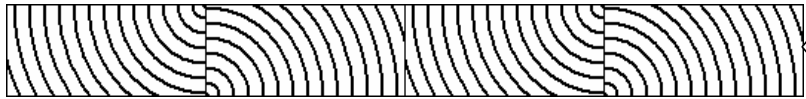

 LASTNOSTI LESA
================================================================================

Les je naraven material, ki ga pridobivamo iz dreves. Ima številne lastnosti,
ki ga naredijo zelo uporabnega v številnih industrijah, vključno z gradbeništvom,
pohištvom, papirjem in drugimi. 

**Fizikalne lastnosti lesa vključujejo**:

1. Gostota: Gostota lesa se razlikuje glede na vrsto drevesa. Gostota vpliva na težo lesa ter na njegovo trdnost in trpežnost.

2. Vlažnost: Les vsebuje vlago, ki vpliva na njegove lastnosti. Prekomerna vlažnost lahko privede do deformacij in gnilobe.

3. Toplotna prevodnost: Les je slab toplotni prevodnik, kar pomeni, da je dober izolator.

4. Akustične lastnosti: Les je znan po svojih odličnih akustičnih lastnostih, zaradi česar je priljubljen material za izdelavo glasbenih instrumentov.

5. Optične lastnosti: Les ima edinstveno teksturo in barvo, ki jo določa vrsta drevesa. To daje lesu estetsko vrednost.

6. Biološka odpornost: Les se razlikuje po svoji odpornosti na glive, žuželke in druge biološke dejavnike. Nekatere vrste lesa so naravno odporne, druge pa je potrebno zaščititi. 

7. Higroskopnost: Les je higroskopen material, kar pomeni, da absorbira in sprošča vlago iz okolja, kar lahko vpliva na njegovo velikost in obliko.

**Mehanske lastnosti lesa vključujejo**:

1. Trdnost: Les je material, ki lahko prenese velike obremenitve. Trdnost lesa se lahko razlikuje glede na vrsto drevesa iz katerega je bil pridobljen.

2. Elastičnost: Les je elastičen material, kar pomeni, da se lahko upogne, ne da bi se zlomil. Elastičnost lesa je koristna lastnost pri izdelavi pohištva ali drugega oblikovanja.

3. Togost: Les se upira spremembam oblike, ko je podvržen obremenitvi. Togost lesa je pomembna pri gradnji stavb in drugih struktur.

4. Odpornost proti obrabi: Les je odporen na obrabo, kar pomeni, da se ne obrabi ali poškoduje enostavno.

## FIZIKALNE LASTNOSTI LESA

- močno odvisne od same vrste
- nihanja pri isti vrsti
- napake v lesu

- gostota (delež kasnega lesa -> trdota, trdnost)
- vlažnost lesa (bolj suh boljša trdnost) temperatura (plastične deformacije lignina -> namjša trdnost)

### VLAŽNOST LESA

Vlažnost lesa izračunamo:

$$ U = \frac{m_v}{m_0} $${#eq:vlaznost_lesa}

kjer je:  

- $u$ = vlažnost lesa v [%]
- $m_v$ = masa vode
- $m_0$ = masa abs. suhega lesa

Podatek $u = 15 \%$ pomeni, da 100 g absolutno suhega lesa 
vsebuje 15 g vode. 

#### Prosta in vezana voda

{#fig:prosta_vezana_voda}

- vezana voda je v celičnih stenah
- prosta voda je v celičnih lumnih
- ko v lumnih ni vode:
    - TNCS: točka nasičenosti celičnih sten
    - VPLIV na krčenje lesa!

#### Krlčenje lesa

- le kadar se spremeni % vode v celičnih stenah
- krčenj je odvisna od smeri krčenja,
- maksimalni skrčki glede na smer so:
  - vzdolž vlaken $\beta_l = 0.3\ ..\ 0.6\%$
  - v radialni smeri $\beta_r = 3\ ..\ 6\%$
  - v tangencialni smeri $\beta_t = 6\ ..\ 12\%$

{#fig:skrcki_lesa}

Kos lesa bi se skrčil za maksimalno dolžino $\Delta L_{max}$, če bi se posušil
iz lesne vlažnosti $u=30\%$ na absolutno suh les $u=0\%$.

- MAKSIMALNI SKRČEK:

$$ \Delta L_{max} = \beta\ L_{u30} $${#eq:max_skrcek}

Ker se lesni izdelki ne posušijo do absolutno suhega lesa, vendar le do neke ravnovesne
vlažnosti, moramo izračunati delni odstotek krčenja $\beta_{\Delta u}$.

- DELNI ODSTOTEK KRČENJA

$$ \beta_{\Delta u} = \frac{\beta\ \Delta u}{30 \%} $${#eq:delni_skrcek}

kjer je:

- $\beta_{\Delta u}$ = delni odstotek krčenja
- $\Delta u$ = razlika vlažnosti (le v območju 30%)

Tako lahko izračunamo dejansko dolžino krčenja, ki je odvisna od same vrste lesa
(različni maksimalni skrčki $\beta$), od smeri krčenja ($\beta_r, \beta_t, \beta_l$),
od spremenjene lesne vlažnosti $\Delta u$ in od dolžine izdelka $L$.

- DEJANSKI SKRČEK

$$ \Delta L_{\Delta u} = \beta_{\Delta u} L $${#eq:dejanski_skrcek}

> ### NALOGA: Izračunaj končne dimenzije izdelka po sušenju
>
> Bukova gredica š = 80.0 mm, d = 40.0 mm, l = 2.500 m, z vlažnostjo 40%,
> posušimo na 10%. Izračunaj dimenzije po sušenju. (73.7 mm × 38.5 mm × 2495 mm)

{#fig:gredica_80x40x2500}

#### Nepravilnosti zaradi krčenja

{#fig:nepravilnosti_susenje}

- stržen se precej manj krči kot oddaljen tangencialni les
- bočnica se ukrivi na način, da se bolj tangencialni les skrči bolj
- kvadravtni presek (letnice diagonalno) se posuši v rombasto obliko preseka

#### Ukrepi za zmanjševanje posledic krčenja

- ustrezna vrsta lesa
- ustrezna osušenost lesa pri obdelavi

{#fig:primerna_vlaznost_lesa}

- premazi zavirajo prehajanje vode
- konstrukcijske vezi namesto lepljenih spojev
- pravilno širinsko spajamo

{#fig:sirinsko_spajanje}

{#fig:debelinsko_spajanje}

## MEHANSKE LASTNOSTI LESA

### TRDOTA LESA

> Trdota je odpor, s katerim se les upira prodiranju tujega telesa vanj.

- zabijanje žeblja v les
- odrezovanje

{#fig:brinell_hardness}

- po Brinellu (oznaka HB)

Jekleno kroglico z določenim premerom in določeno silo potisnemo v les. Trdota je razmerje med uporabljeno silo in vtisnjeno površino. Naprimer pri HBW(10,3000) se uporablja kroglica s premerom 10mm, potisna sila pa ustreza masi 3000 kg uteži.

$$ HBW = \frac{F}{A} = \frac{F}{\frac{\pi D(D-\sqrt{D^2-d^2)}}{2}} $${#eq:brinell_hardness}

kjer je:

- W - se pogosto pripiše glede na material iz katerega je kroglica (W - wolfram, S - steel)
- F - sile pritiska
- D - premer kroglice
- d - premer odtisa

{#fig:harness_example}

(file:///home/david/Downloads/forests-11-00878-v2.pdf)

|    Lesna vrsta | Trdota po Brinellu - HBW [GPa] |
|---------------:|:------------------------------:|
|            Bor |               2,2              |
|          Brest |               3,9              |
|          Breza |               2,7              |
|  Bukev parjena |               4,0              |
|         Češnja |               2,9              |
|          Hrast |               3,7              |
|         Hruška |               2,4              |
| Javor evropski |               3,7              |
| Javor kanadski |               4,2              |
|          Jelša |               2,1              |
|          Jesen |               3,8              |
|        Kostanj |               2,3              |
|        Macesen |               2,5              |
|           Oreh |               3,5              |
|         Smreka |               1,3              |
Table: Trdota različnih lesnih vrst po Brinellu HBW(10, 3000). {#tbl:trdota_HBW}

> p.s.: V lesarstvu se pogosto uporablja termin trdote v povezavi z orodji. Naj le omenimo, da se trdota jekla pogosto meri z Rockwell-ovo lestvico - HRC, kjer se vtisne diamantni stožec, za mehkejša jekla pa se uporablja HRB -  kjer se vtisne jeklena kroglica.

### TRDNOST LESA
 
Trdnost materiala (lesa) je sposobnost, da se upira spremembi 
oblike in porušitvi zaradi delovanja zunanjih sil. Kadar trdno telo 
obremenimo z zunanjo silo, se upira spremembi tako, da v telesu 
nastanejo napetosti.  

$$ \sigma = \frac{F}{A} $${#eq:napetost}

Kjer je :

- $\sigma$ - natezna, tlačna, ... napetost [MPa = N/mm²]
- $F$ - sila, ki deluje pri obremenitvi [N]
- $A$ - površina, na kateri se ustvarja napetost

Pri obremenjevanju izdelkov lahko zaznamo deformacije izdelka v določenih smereh.
Spremembe dimenzij $\Delta l$ pogosto predstavimo v relativni obliki s specifičnim
raztezkom:

$$ \epsilon = \frac{\Delta l}{l_0} $${#eq:spec_raztezek}

Kjer je:

- $\epsilon$ - specifični (ali relativni) raztezek
- $\Delta l$ - raztezek 
- $l_0$ - prvotna dimenzija

Obremenilna napetost in raztezek sta premosorazmerna in jih povezuje elastični
modul $E$.

$$\sigma = E\ \epsilon = E\ \frac{\Delta l}{l_0}$${#eq:elas_modul}

Vrste obremenitev:

- Tlačna
- Natezna
- Strižna
- Upogibna
- Torzijska
- Uklonska

<!--
mehanske lastnosti stisnejenega lesa
https://vb.nweurope.eu/media/14468/aftb-mech-props.pdf
-->

#### Napetostno-deformacijska krivulja

Napetostno-deformacijska krivulja prikazuje odnos med napetostjo in deformacijo materiala, ko nanj delujemo z obremenitvijo. Na začetku krivulje je del, kjer napetost narašča premo sorazmerno z deformacijo. To območje imenujemo **elastično območje**, saj se material po odstranitvi obremenitve vrne v prvotno obliko.

Ko napetost preseže to mejo plastičnosti (ang.: yield strength), material vstopi v **plastično območje**. V tem delu krivulje deformacije postanejo trajne, kar pomeni, da material ne povrne več svoje prvotne oblike. Krivulja doseže najvišjo točko, ki označuje maksimalno napetost, ali t. i. natezno trdnost, kjer material prenese največjo možno obremenitev.

Po presežku maksimalne napetosti krivulja začne padati, kar kaže na slabitev materiala, dokler ne doseže točke zloma, kjer se material popolnoma pretrga. Ta analiza je ključna za razumevanje obnašanja materialov pod različnimi obremenitvami.

{#fig:S-e_steel}

{#fig:S-e_wood}

#### DOPUSTNA NAPETOST

Materialov ne smemo obremeniti do njihove maksimalne 
napetosti, obremenimo jih le do dopustne napetosti, ki se vedno 
nahaja v območju elastičnih deformacij. Tako izkoristimo le del 
njihove trdnosti. Dopustno napetost določajo predpisi in standardi. 
Izračunamo jo s pomočjo varnostnega količnika. Varnostni količnik 
je razmerje med največjo napetostjo v materialu ($\sigma_{max}$) in 
dopustno napetostjo ($\sigma_{dop}$). Pri lesnih konstrukcijah  lahko znaša 
varnostni količnik (varnostno število ) od 2 do 15, odvisno od 
namena konstrukcije, vrste obremenitve in drugih vplivov.  
(Leban, 2004)

$$ \sigma_{dop}  = \frac{\sigma_{max}}{k_v} $${#eq:sigma_dop}

|        les        | smer | Nateg[MPa] | Tlak[MPa] | Upogib[MPa] | Strig[MPa] | Mod. Ealst.[MPa] |
|:-----------------:|:----:|:----------:|:---------:|:-----------:|:----------:|:----------------:|
| Smreka, Jelka,Bor |  ll  |     10     |     11    |      13     |     0.9    |       12000      |
|                   |   T  |      -     |     2     |      -      |     0.9    |        460       |
|    Hrast,Bukev    |  ll  |     11     |     12    |      14     |     1.2    |       13000      |
|                   |   T  |      -     |     3     |      -      |     1.2    |       1000       |
Table: Dopustne napetosti za nekatere vrste lesa v MPa, pri zračno suhem lesu ($u=18\%$). {#tbl:sigma_dop_tab}

Ta tabela[^1] prikazuje mehanske lastnosti lesa za različne vrste obremenitev, pri čemer je pomembna smer obremenitve glede na lesna vlakna.

[^1]: Trdnost za srednje šole, Hadalin, J. in Hvasti, K., 2010

Smer obremenitve:

"ll": Obremenitve vzporedno z lesnimi vlakni (longitudinalna smer).
"T": Obremenitve pravokotno na vlakna (transverzalna smer).

Lastnosti materiala:

- Nateg: Največja napetost, ki jo les prenese pri nategovanju.
- Tlak: Največja napetost, ki jo les prenese pri stisku.
- Upogib: Največja napetost pri upogibanju.
- Strig: Napetost, ki jo les prenese pri strižni obremenitvi.
- Modul elastičnosti (E): Mera togosti lesa, ki kaže, kako se les upira deformacijam pod obremenitvijo.

Les ima višje vrednosti za nateg, tlak in upogib, ko je obremenjen vzporedno z vlakni (smer "ll"), kar pomeni, da je v tej smeri močnejši.
Pravokotno na vlakna (smer "T") so vrednosti za tlak in strig bistveno nižje, kar kaže na manjšo odpornost lesa v tej smeri. Podatki niso najbolj točni za strižne obremenitve, saj pri obremenitvah vzporedno z vlakni pride do cepljenja (porušitev lignina).
Hrast in bukev imata nekoliko višje mehanske lastnosti v primerjavi s smreko, jelko in borom, kar pomeni, da imajo večjo trdnost.

#### NATEZNA IN TLAČNA TRDNOST LESA

raztezek:  
$$ \epsilon = \frac{\Delta l}{l_0} = \frac{l_1 - l_0}{l_0} $${#eq:raztezek}

- $\epsilon$ - specifični raztezek
- $\Delta l$ - dejanski raztezek
- $l_1$ - nova dolžina
- $l_0$ - prvotna dolžina

Ob tej deformaciji se ustvarijo napetosti:

$$ \sigma = E \frac{\Delta l}{l_0} $${#eq:napetost_nateg}

- $\sigma$ - napetost
- $E$ - modul elastičnosti
- $\epsilon$ - specifični raztezek
- $\Delta l$ - raztezek
- $l_0$ - prvotna dolžina

> Primer: smrekovina 8cm x 8cm, dolžine 1,8m ; natezna sila 45 kN.  
>
> - Kolikšna je dejanska napetost?
> - Ali presežemo dopustno napetost obremenitve?
> - Kolikšen je raztezek?
>
> (Odgovor: $\sigma = 7.03 MPa$; Ne,$\sigma_{dop}=10 MPa$;$\Delta l = 1.05 mm$)

<!--
sigma = F/A = 45 kN / (8cm)² = 7.03 MPa
sigma = E * dL / L0 -> dL = sigma * L0 / E =
dL = 7.03MPa * 1,8m / 12GPa = 1.06 mm
-->

#### STRIŽNA TRDNOST

Strižna trdnost je odpor lesa proti strigu lesnih plasti s silo, ki 
deluje v ravnini lesnih vlaken ali redko, prečno na lesna vlakna.  

- prečno na vlakna : čepna vez
- vzdolž vlaken : poševnik v legi nadstreška

- strižna napetost

$$ \tau = \frac{F}{A} $${#eq:strig}

>Enojna zarezna čepna vez iz smrekovega lesa je obremenjena s silo 1 500 N. Čep je visok 
>80 mm. Določite najmanjšo dopustno širino čepa.( R: $\tau_{dop}$ = 90 N/cm², A = 16,7 cm², b = 21 mm ) 

>Naložena polica tehta 70 kg. Mozničili smo jo z bukovimi mozniki premera 8 mm. 
>Izračunajte koliko moznikov smo uporabili pri izdelavi konstrukcije.
>( R: $\tau_{dop}$ = 120 N/cm2, S1 = 50,265 mm2, k = 1, A = 5,83 cm2, N = 12 ) 

#### UPOGIBNA TRDNOST

Upogibna trdnost je odpor lesnega nosilca med oporama proti maksimalni sili, ki deluje pravokotno na os nosilca. 

{#fig:upogibna_trdnost}

Pri dimenzioniranju na upogib upoštevamo samo največji, maksimalni
upogibni moment, saj tam nastopijo največje napetosti.

$$ \sigma_U = \frac{M_{max}}{W_x} $${#eq:napetosti_upogib}

- $\sigma_U$ - mehanska napetost v nosilcu
- $M_{max}$ - največji navor, ki ga povzroča mehanska obremenitev na nosilec
- $W_x$ - odpornostni moment nosilca (odvisen od oblike prereza nosilca)

| Prerez nosilca |    Vztrajnostni moment    |     Odpornostni moment    |
|---------------:|:-------------------------:|:-------------------------:|
|      kvadratni |   $I_x = \frac{a^4}{12}$  |    $W_x=\frac{a^3}{6}$    |
|     pravokotni | $I_x = \frac{b\ h^3}{12}$ |   $W_x=\frac{b\ h^2}{6}$  |
|        okrogli | $I_x=\frac{\pi\ d^4}{64}$ | $W_x=\frac{\pi\ d^3}{32}$ |

Table: Vztrajnostni in odpornostmi momenti za različne prereze nosilcev. Kjer je: a - dolžina stranice kvadratnega, b - širina in h - višina pravokotnega ter d - premer okroglega prereza. {#tbl:momenti_presekov}

{#fig:nosilci}

- $f$ - poves
- $F$ - sila obremenitve
- $L$ - dolžina nosilca
- $E$ - elastični modul
- $I_X$ - vztrajnostni moment v vodoravni smeri
- $\sigma_U$ - upogibna napetost v nosilcu

> Izračunajte s kakšno silo lahko obremenite prostoležeči nosilec iz smrekovega
> lesa 1 kategorije. Dolžina nosilca je 4 m, širina je 16 cm, višina je 20 cm.
> Sila deluje na nosilec v sredini.
> ( R: $\sigma$ = 1 300 N/cm2 , Wx = 1 066,66 cm3 , Mmax = 13 866,66 Nm, F = 13,8 kN )

> Dimenzionirajte pravokotni prerez hrastovega trama dolžine 4 m. To je
> prostoležeči nosilec, ki je po celi dolžini obremenjen z zvezno
> obremenitvijo 1800 N/m. Stranici b in h sta v razmerju 7:5. Dopustna upogibna
> napetost je 1400 N/mm2 , elastični modul pa je 12 500 MPa. Izračunajte tudi
> poves hrastovega nosilca.
>( R: Mmax = 3600 Nm, Wx = 257 142,8 mm³ , b = 92,3 mm = 93 mm,
> h = 129,26 mm = 130 mm, IX = 17 026 750 $mm^4$ , f = 28,2 mm )

> Kakšno je najugodnejše razmerje stranic nosilca, ki je obremenjen na upogibi in ga moramo izrezati iz debla z okroglim presekom? V praksi se pogosto uporablja razmerje 5:7, ali lahko potrdiš, da je to res najučinkoviteje. (R: Podatek je resničen za primer, ko nosilec izrežemo iz okroglega preseka.)

#### UKLONSKA TRDNOST  

**Vitkost**:

$\lambda = \frac{l_0}{i}$

- $l_0$ prosta uklonska dolžina ([@tbl:nacin_vpetja_stebra])
- i - vztrajnostni polmer, ki ga izračunamo iz vztrajnostnega momenta in prereza na katerega sila deluje:

$$ i=\sqrt{\frac{I_{min}}{A}} $$

Večja ko je vitkost, večja je nevarnost uklona. Uklonsko kritično napetost
določamo po treh različnih postopkih, v odvisnosti od vitkosti.

1. $\lambda \leq 60$ dimenzioniranje na čisti tlak
2. ... kombinacija obremenitve na tlak in uklon
3. $\lambda \geq 100$ - dimenzioniranje po Eulerjevem postopku

##### Eulerjev postopek

uklonska sila (kritična slia)

$$ F_k = \frac{\pi^2 E I_{min}}{l_0^2} $$

uklonska napetost

$$ \sigma_k = \frac{F_k}{A} $$

dopustna sila

$$ F_{dop} = \frac{F_k}{k_v}  $$

- $k_v = 10 (les)$

**Način vpetja**

|     konec A     |     konec B     | prosta uklonska dolžina - $l_0$ |
|:---------------:|:---------------:|:-------------------------------:|
|    togo vpet    |   prosti konec  |              $2\ l$             |
|       togo      |   togo vpetje   |            $0.65\ l$            |
|   togo vpetje   | členasto vpetje |             $0.8\ l$            |
| členasto vpetje | členasto vpetje |               $l$               |
Table: Tabela z izračuni proste uklonske dolžine $l_0$ glede na način vpetja lesenega vitkega stebra z dolžino $l$. {#tbl:nacin_vpetja_stebra}

> Smrekov steber pravokotnega prereza je na eni strani vpet členkasto na 
> drugi pa togo. Dolžina stebra je 5 m. Obremenjen je s silo 45 kN.
>
> Izračunajte dimenziji stranic pravokotnika, če sta v razmerju 2 :3.
> Varnostni faktor je 10. 
> ( R: l0 = 4 000 mm, Imin = 72 951 252 mm4 , b = 155,4 mm, h = 233,14 mm, i = 44,87 mm, $\lambda$ = 111,4 zato lahko dimenzioniramo po Eulerju. )

#### CEPILNA TRDNOST

Cepljivost je lastnost lesa, da se cepi ali razdvaja vzdolžno (v 
smeri lesnih vlaken ). Les navadno cepimo z orodjem v obliki

{#fig:cepljenje_vijaki}

{#fig:necepljenje_zeblji}

