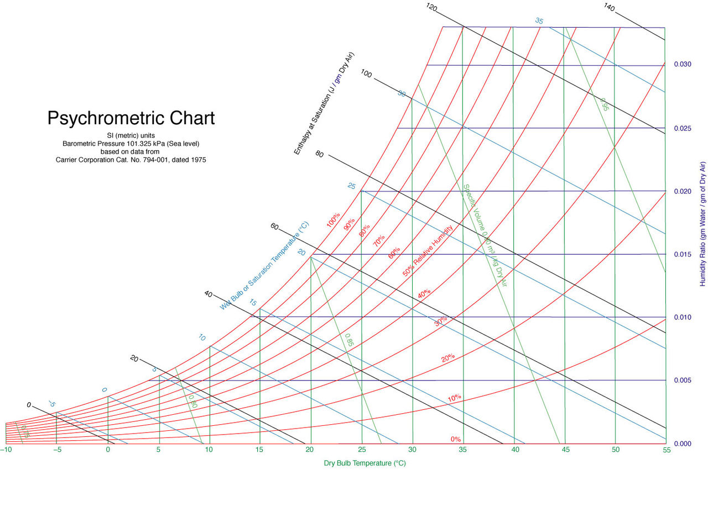
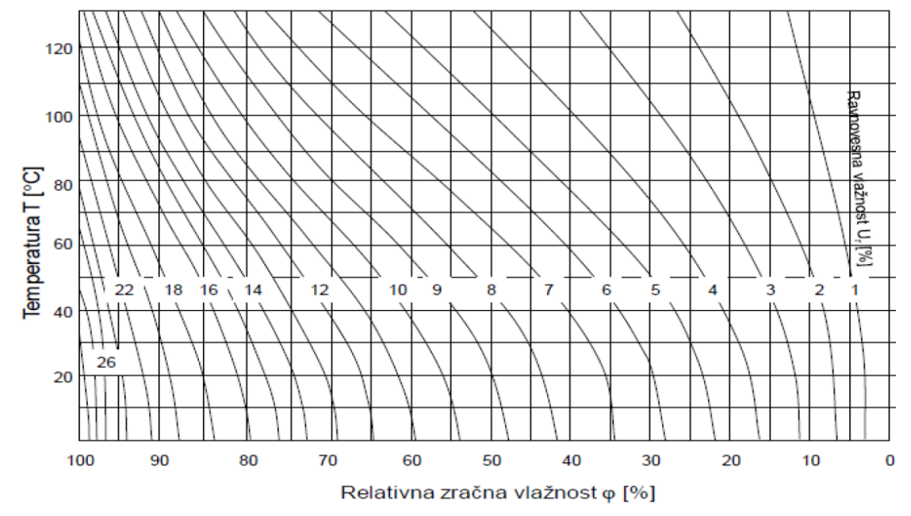
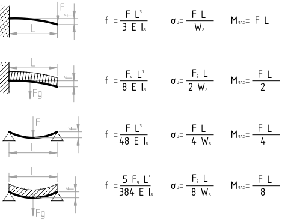

# RELATIVNA ZRAČNA VLAŽNOST

{#fig:PsychrometricChart-SI}

{#fig:ravnovesna_vlaznost_lesa height=60mm}

# HIGROSKOPIČNOST LESA

## NAJVEČJI SKRČEK:

$$ \Delta L_{max} = \beta\ L_{TNCS} $${#eq:max_skrcek}

>- $\Delta L$ - maksimalni skrček
>- $\beta$ - koeficient maksimalnega krčenja lesa (od TNCS -> 0%)
>- $L_{TNCS}$ - dolžina kosa pri vlažnosti TNCS

## DELNI KOEFICIENT KRČENJA:

$$ \beta_{\Delta u} = \frac{\beta \Delta u}{30 \%} $${#eq:delni_skrcek}

> - $\beta_{\Delta u}$ - delni koeficient krčenja
> - $\beta$ - koeficient maksimalnega krčenja
> - $\Delta u$ - razlika relativne vlažnosti lesa (v območju pod TNCS)

## DEJANSKI SKRČEK

$$ \Delta L = \beta_{\Delta u} L $${#eq:dejanski_skrcek}

> - $\Delta L$ - dejanski skrček
> - $\beta_{\Delta u}$ - delni odstotek krčenja
> - $L$ - prvotna dolžina

## KOEFICIENT MAKSIMALNEGA KRČENJA LESA

| Vrsta lesa | vzdolžno - $\beta_L$ | radialno - $\beta_R$ | tangencialno - $\beta_T$ |
|-----------:|:--------------------:|:--------------------:|:------------------------:|
|     smreka |          0.3         |          3.6         |            7.9           |
|    macesen |          0.3         |          3.8         |            9.1           |
|   bukovina |          0.3         |          5.8         |           11.8           |
|      hrast |          0.4         |          4.3         |            8.9           |
|       lipa |         0.25         |          6.1         |            9.9           |
|      topol |          0.3         |          4.3         |            8.5           |

Table: Koeficienti maksimalnih relativnih skrčkov lesa. {#tbl:tabela_maksimalnih_skrčkov}

## RELATIVNA RAVNOVESNA VLAŽNOST VGRAJENIH LESNIH IZDELKOV

|                    Mesto vgradnje lesnih izdelkov | Ravnovesna vlažnost lesa [%] |
|--------------------------------------------------:|:----------------------------:|
|           gradbeni les, ograje, balkoni, ostrešje |            13 - 17           |
|                               okna, zunanja vrata |            12 - 16           |
|      pohištvo v prostorih s centralnim ogravanjem |            8 - 10            |
|        pohištvo, kjer ogrevamo s klasičnimi pečmi |            10 - 12           |
| stopne obloge v prostorih s centralnim ogrevanjem |             6 - 8            |
|      stopne obloge (ogrevanje s klasičnimi pečmi) |            8 - 10            |
|       glasbila (prostori s centralnim ogrevanjem) |             5 - 8            |
|            glasbila (prostori s klasičnimi pečmi) |            8 - 11            |

Table: Tabela ravnovesnih vlažnosti lesa glede na mesto vgradnje. {#tbl:rel_vla_vgradnja}

# TRDNOST LESA

$$ \sigma = \frac{F}{A};\ \epsilon = \frac{\Delta l}{l_0};\ \sigma = E\ \epsilon $${#eq:napetost}

> - $\sigma$ - napetost v materialu zaradi zunanje sile
> - $F$ - zunanja sila F
> - $A$ - presek predmeta na katerega deluje zunanja sila
> - $\epsilon$ - specifični raztezek
> - $\Delta l$ - raztezek
> - $l_0$ - prvotna dimenzija
> - $E$ - elastični modul

## DOPUSTNA NAPETOST

$$ \sigma_{dop}  = \frac{\sigma_{max}}{k_v} $${#eq:sigma_dop}

> - $\sigma_{dop}$ - dopustna napetost
> - $\sigma_{max}$ - največja, porušna napetost
> - $k_v$ - varnostni koeficient [2 .. 15]

|     Vrsta les     | smer | Nateg | Tlak | Upogib | Strig | Mod. Ealst. |
|:-----------------:|:----:|:-----:|:----:|:------:|:-----:|:-----------:|
| Smreka, Jelka,Bor |  ll  |   10  |  11  |   13   |  0.9  |    12000    |
|                   |   T  |   -   |   2  |    -   |  0.9  |     460     |
|    Hrast,Bukev    |  ll  |   11  |  12  |   14   |  1.2  |    13000    |
|                   |   T  |   -   |   3  |    -   |  1.2  |     1000    |

Table: Dopustne napetosti za nekatere vrste lesa pri mirni obremenitvi (v MPa). {#tbl:sigma_dop_tab}

## NATEZNA in TLAČNA TRDNOST

$$ \sigma_N =\frac{F}{A} = E \frac{\Delta l}{l_0} = E \epsilon $${#eq:napetost_nateg}

> - $\sigma_N$ - natezna napetost v materialu
> - $F$ - zunanja sial F
> - $A$ - presek predmeta
> - $E$ - elastični modul
> - $\Delta l$ - absolutni skrček
> - $l_0$ - prvotna dolžina izdelka
> - $\epsilon$ - specifični raztezek

## UPOGIBNA TRDNOST

$$ \sigma_U = \frac{M_{max}}{W_x} $${#eq:napetosti_upogib}

> - $\sigma_U$ - mehanska napetost v nosilcu
> - $M_{max}$ - največji navor, ki ga povzroča mehanska obremenitev na nosilec
> - $W_x$ - odpornostni moment nosilca (odvisen od oblike prereza nosilca)

| Prerez nosilca |    Vztrajnostni moment    |     Odpornostni moment    |
|---------------:|:-------------------------:|:-------------------------:|
|      kvadratni |   $I_x = \frac{a^4}{12}$  |    $W_x=\frac{a^3}{6}$    |
|     pravokotni | $I_x = \frac{b\ h^3}{12}$ |   $W_x=\frac{b\ h^2}{6}$  |
|        okrogli | $I_x=\frac{\pi\ d^4}{64}$ | $W_x=\frac{\pi\ d^3}{32}$ |

Table: Vztrajnostni in odpornostmi momenti za različne prereze nosilcev. Kjer je: a - dolžina stranice kvadratnega, b - širina in h - višina pravokotnega ter d - premer okroglega prereza. {#tbl:momenti_presekov}

{#fig:nosilci}

>- $f$ - poves
>- $F$ - sila obremenitve
>- $L$ - dolžina nosilca
>- $E$ - elastični modul
>- $I_X$ - vztrajnostni moment v vodoravni smeri
>- $\sigma_U$ - upogibna napetost v nosilcu
