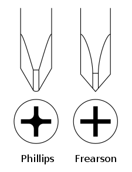
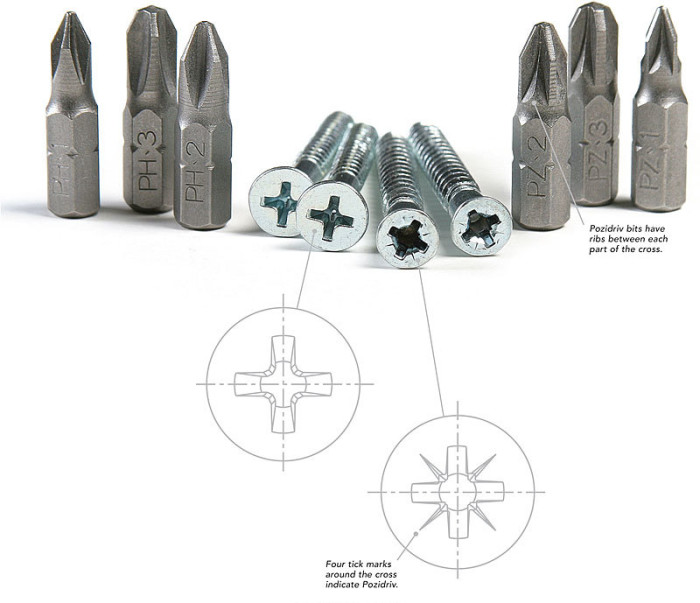
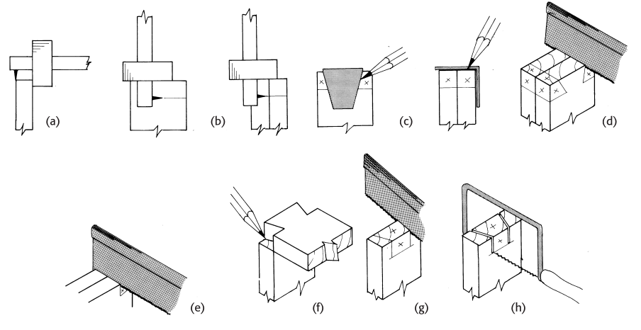

# Oddaja (Študent odda poročilo)

Študent za vsako vajo odda poročilo, ki jo pripravi po predlogi( [PDF predloga poročila](../Porocila/TP2_KV_Delovno_poročilo_za_tisk.pdf)). Poročilo mora vključevati naslednje vsebine:

## Naslov vaje

- obvezna tehniška pisava
- skica
- izpolnjeni podatki.

## Predstavitev vaje

- kratko in jedrnato

## Materiali

## Stroji, naprave, orodja, pripomočki

## Tehnologija izdelave

+ opis tehnološkega postopka ali
+ opis tehnike (zakaj tako in ne drugače)

## Varnost pri delu in varovanje okolja

+ kako ste poskrbeli za varno delo?
  * priprava del. mesta,
  * varna uporaba orodij
  * ureditev del. mesta

## Priloge (skice, načrti, vzorci, slike)

+ PRILOGE (!)
  * skice (__tehniška pisava!__)
  * načrti (__tehniška pisava!__)
  * teh. dokumentacija je z glavami (__tehniška pisava!__)

- [predloga sestavne risbe](../Porocila/tehniska_risba_sestavna.pdf)
- [predloga delavniške risbe](../Porocila/tehniska_risba_delavniska.pdf)
- [DXF format predloge ](../Porocila/tehniska_risba.dxf)

# SLOVENSKE VRSTE LESA

Prepoznavanje lesne vrste je pomembno za:

  - ustrezno izbiro materiala za določen namen,
  - primerno izbiro orodja.
  - OGL (obdelava gradiv - les):
    - učenci morajo prepoznati:
      - lipa
      - smreka
      - bukev
      - hrast

## literatura:
- [podatki o lesnih vrstah](http://www.wood-database.com/)
- [slo. vrste lesa](http://www2.arnes.si/~evelik1/les/index.htm)
- Irena Leban: OSNOVE LESARSTVA: Lastnosti lesa
- Irena Leban: OSNOVE LESARSTVA: Zgradba lesa

## __vaja 1__: Slovenske vrste lesa
V poročilo narišite kako bi teoretično ločili naslednje vrste lesa:
  - smreka
  - hrast
  - bukev
  - lipa

Pri risbi lesa poudarite očitne značilnosti lesa, narišite tudi
prečni in vzdolžni prerez.
Navedite glavne lastnosti lesa:

  - cena za m³ (lahko tudi rang)
  - gostota
  - trdota
  - trdnost
  - žilavost
  - relativni raztezek v vseh treh glavnih smereh (vzd., rad., tan.)
  - vremenska odpornost

# PREPOZNAVANJE VRST LESA

## Iglavci

### Traheide

- prevanjanje vode
- mehanska funkcija
- enakomeren prehod velikih lumnov (spomladi) -> mali lumni (jeseni)

### Parenhimske celice

- prevanjanje organskih snovi
    - glukoza
    - aminokisline ...
    - 50cm/h
- tvorba radialnih trakov
    - homogeni (sestavljeni samo iz par. cel.) = JELKA
    - heterogeni (par. cel. in traheide) = SMREKA BOR

## Listavci

### Traheide

- samo mehanska funkcija

### Traheje

- ali pore (ker so lumni bistveno večji in vidni s prostim očesom)
- prevanjanje vode

#### Venčasto porozni listavci

- pore vidne, veliki lumni
- nahajajo se v ranem selu
- venčaSto porozne vrse so (skoraj vse tiste s S-jem):
    + HRAST
    + KOSTANJ
    + BREST
    + JESEN

#### Pol-venčasto porozne vsrste

- pore vidne, srednje vlike
- razporejene po celi braniki
- v ranem lesu jih je več ali pa so večje
- lesne vrste so:
    + OREH
    + ČEŠNJA

#### Raztreseno porozne vrste

- pore (lumni) so majhno
- por s prostim očesom ne vidimo
- razporejene so po celi braniki
- predstavnike razdelimo v 4 skupine:
  1. SADNI:
      - jablana
      - hruška
      - sliva
  2. MEHAK LES:
      - lipa
      - topol
  3. IZRAZITI TRAKOVI
      - bukev
      - javor
      - gaber
  4. PARNEHIMSKE PEGE
      - breza
      - jelša

### Parenhimske celice

- vač parnhimskih celic v osni smeri kot pri iglavcih
- trakovi so:
    - večji, širši (tudi po 100 vzporednih par. cel.)
    - in več jih je kot pri iglavcih.


### __vaja 3__: Strojno razžagovanje - (formatna) mizarska krožna žaga
1. __IZOGIB UREZNINAM__
  - zdrs!
  - nepozornost
  - seganje po obdelovanec, ki ni na dosegu
  - rezanje premajhnih obdelovancev
2. __IZOGIB POVRATNEMU UDARCU__
  - [povratni udarec](https://www.youtube.com/watch?v=u7sRrC2Jpp4)
  - fi(ž.l.) 40 -> r=20cm, o=1,25m, w=3400/min=57/s -> 57/s*1,25m => 71m/s = __256km/h__
  - odrezek med vzdolžnim prislonom in ž.l.
  - zobje ž.l. povlečejo odrezek

#### Sestavni deli
1. masivno ogrodje - zagotavlja togost stroja, varnost
2. asinhronski motor
3. žagin list
4. razporni klin - preprečuje "zapiranje žaginega lista", preprečuje povratni udarec
5. pokrov ali kapa - preprečuje slučajnostni stik z žag. listom, pomaga odsesovati, (s sistemom za preprečevanje povratnega udarca)
6. odsesovalni vod
7. stikalo ON/OFF - OFF stikalo je večje in tudi ob strani
8. vzdolžni prislon
9. prečni prislon
10. potisna letev
11. predrezilo - vrti se v smeri podajanja, preprečuje odtrgavanje lesnih vlaken

#### Nastavitev stroja

- pravokotnost rezila
- __višina rezila__ = 1/2 - 1 višina zoba nad obdelovancem (debelina obdelovanca, moč motorja)
  - bolje je nastaviti nižjo višino, ker:
    + zob ž.l. izstopi iz obdelovanca bolj pod ostrim kotom in zato manj zarga lesna vlakna, zadnja odrezana vlakna imajo več podpore in se manj cepijo
    + več zob je v stiku z obdelovancem - večje trenje
    + manjša možnost ureza
    + [nastavitev višine rezila](https://www.youtube.com/watch?v=JL8-1bmt7XY)
  - po končanem delu naj bo rezilo spuščeno

- __prečni razrez__
  + odmaknemo vzdolžno letev (Zakaj?: Ker se odrezek ne bo tiščal prislona in je nevarnost povratnega udarca res majhna)
  + obdelovanec prislonimo k prečni letvi
  + roke imamo na levi strani obdelovanca in žaginega lista
  + ne hitimo z odmikanjem odstranjevanja odrezka, odrezek je dokaj varen.
  + [nastavitev prečnega prislona](https://www.youtube.com/watch?v=UbG-n--LFgQ)
      
- __vzdolžni razrez__
  + ker je obd. med vzdolžnim prislonom in ž.l. je povečana verjetnost za povratni udarec
  + zagotovljen mora biti raven rob obdelovanca, ki ga prislonimo k vodilu
  + leva roka vodi levi rob obdelovanca 5-10 cm pred ž.l.
  - z njo ne sledimo obdelovancu, ker bi na neki točki bočno obremenjevali ž.l.
  + desna roka potiska obdelovanec v razrez
    + pri potiskanju skozi razrezovanje si lahko pomagamo tudi s potisno palico
    + s potisno palico potiskamo bližje ž.l. zato, da ustvarjamo navor v desno in s tem pritiskamo obdelovanec k prislonu (razen če uporabljamo razporni klin)
  + razrez zaključimo z desno roko tako, da obdelovanec potisnemo še nekaj cm za ž.l.
  + odrezek, ki je na levi strani pustimo dokler se ž.l. ne ustavi

- **Poravnanje prečnega prislona**
  + na prislon poravnamo večji obdelovanec in ga odrežemo, ta rez označimo kot 1.
  + odžagan rez prislonimo k prečnemu prislonu in proces ponovimo.

#### Pomembnejše začetniške napake

1. __zapiranje žaginega lista:__
  - žaganje brez razpornega klina ob vzdolžnem prislonu, zlasti pri masivnem lesu
  - vžagovanje utorov ob necelostni podpori deske
  - vzdolžno ne odžagujemo ukrivljenih desk, ker ne moremo zagotoviti popolnega stika z vzdolžnim prislonom
2. __uporaba potisne letve__
  - če je potisna letev daleč stran od žag. lista, z njim ustvarja več navora nanj in žag. lis "zapiramo" (povratni udarec, ožganine)
  + če uporabljamo dve potisni letvi:
      + imamo desno blizu ob ž.l. (1-2 cm stran),
      + z levo potisno letvijo najprej pritiskamo obdelovanec k prislonu pred ž.l.
      + v zadnjem delu razreza (zadnjih 5-10 cm) prestavimo levo potisno letev za ž.l. in še vedno potiskamo obdelovanec k vzdolžnemu prislonu
3. __ožganine poslabšajo__ razmere kot so:
  - bočni pritisk na ž.l.
  - neostro rezilo
  - trši les
  - debelejšo kos lesa
  - __počasnejši odrez__
    + če imamo prešibek motor, se temu lahko izognemo tako, da najprej odrežemo do polovice in nato odrez ponovimo z iste strani z bolj izvlečenim ž.l.
    + ti isto tehniko lahko uporabimo kadar želimo zmanjšati zatrgovanje vlaken ob razrezu
4. __prečno razžagovanje__ (pozabimo odmakniti vzdolžni prislon!!!)
  - pri tem razrezu NE uporabljamo vzdolžnega prislona, ker obstaja večja verjetnost, da se bo odrezek tiščal ž.l. in tako se možnost povratnega udarca poveča


# Poravnalni skobeljni stroj

- za poravnavanje ploskev obdelovanca
- za poravnavanje dveh ploskev v pravi kot

## Postopek obdelave

Poravnavanje ploskve:  
- najprej stroj pravilno nastavimo (glej Nastavitev stroja)
- izberemo širšo stranico
- preverimo ukrivljenost in izberemo konkavno stranico
- preverimo smer vlaken in obdelovanec obrnemo tako, da je kot med smerjo vlaken in cepilno ploskvijo večji od rezilnega kota
- obdelovanec postavimo na odvzemno mizo
- ga rahlo pritisnemo nanjo (toliko da ne ukrivimo obdelovanca)
- vodimo preko odrezovalnega vretena 
- prestavimo roke na sprejemno mizo in 
- vodimo preko vretena.

Poravnavanje v prav kot:
- obdelovanec ob prislon in rahlo tudi navzdol na odvzemno in sporejemno mizo
- vodenje enako kot prej...

## Sestavni deli

1. Masivno ohišje
2. Sprejemna miza
3. Odvzemna miza
4. Skobeljno vreteno
5. Zaščita vretena
6. Prislon
7. Stikalo za vklop in izklop

## Nastavitev stroja

### Nastavitev prislona

### Nastavitev odvzemne mize

- vpliva na debelino odvzema
- odvisna je od:
    - zmogljivosti stroja
    - trdote lesa
    - stanje odrezovalnega orodja

### Nastavitev odvzemne mize

- vpliva na poravnanost obdelovanca
  1. PREVISOKA NASTAVITEV
    - povzroča zadevanje obdelovanca v mizo
  2. PRENIZKA NASTAVITEV
    - poravnan obdelovanec je na koncu preveč stanjšan
  3. PRAVILNA NASTAVITEV
    - sprejemna miza naj bo 0.1 mm pod rezilnim krogom skobeljnega vrena
    - če na sprejemno mizo postavimo raven kos lesa in zavrtimo skobeljno vreteno za eno rezilo, se mora obdelovanec premakniti za 3-5 mm.
- na novo jo nastavimo ob:
  - zaznanem nepravilnem odrezovanju
  - zamenjavi skobeljnih rezil

## Nevarnosti

- nevarnost povratnega udarca (nimamo nobenega varovala za ta primer)
  + manjši odvzem
  + uporaba potisnih pripomočkov
- dotik vretena z roko
  + zaščita vretena naj ne bo več kot 0.5 cm stran od obdelovanca
- skobljanci lahko nekontrolirano letijo proti delavcu
  + odsesovalna naprava
  + obvezno nošenje zaščitnih očal
- poravnavanje kratkih kosov lesa
  + izdelamo si pripomoček za vodenje obdelovanca
- pri menjavi rezil se lahko urežemo
  + obvezno nošenje zaščitnih rokavic
- velik hrup
  + obvezno nošenje glušnikov


# Debelinski skobeljni stroj

- za poravnanje po dve ploskvi v vzporedno odvisnost
- za stanjšanje obdelovanca na točno dimenzijo

## Postopek obdelave

- najprej ustrezno nastavimo mizo na začetno višino (glej nastavitev stroja)
- izberemo ožjo stranico, ki smo jo že poravnali na por. skob. stroju
- to stranico položimo na mizo in
- obdelovanec potisnemo do prvega nazabčanega podajalnega valja
- obdelovanec prepustimo strojnemu podajanju in
- ga izvlečemo na drugi strani rezilnega orodja (zadnji podajalni valj je gladek)
- nato preverimo površino in dimenzije obdelovanca, če te niso zadovoljive postopek ponovimo:
- najprej zmanjšamo višino mize (cca 1mm) ter
- vstavimo obdelovanec

Skobljanju tanjše stranice sledi skobljanje širše po enakem postopku.

## Sestavni deli

1. skobeljno vreteno
2. podajalni valji (nazobčeni in gladki)
3. pritisni čevlji (to funk. lahko opravljajo tudi podajalni valji)
4. proti povratni klini
5. skobeljna miza

## Nastavitev stroja

- nastavitev miza približno nastavimo na nekoliko večjo dimenzijo kot je obdelovanec
- obdelovanec potisnemo do podajalnih valjev in mizo postopno dvigujemo dokler se obdelovanec ne prične pomikati
- v kolikor odrezovanje ne slišimo, lahko mizo sproti še nekoliko dvignemo
- ko imamo višino mize nastavljeno na ustrezno začetno višino je ne smemo več spreminjati med odrezovanjem

## Nevarnosti
- nevarnost povratnega udarca
  + proti-povratni klini
- ne skobljamo manjših obdelovancev, katerih dolžina ne presega razdalje med podajalnima valjema
- skobljanci lahko nekontrolirano letijo proti delavcu (zlasti grče)
    - odsesovalna naprava
    - obvezno nošenje zaščitnih očal
- velik hrup
    - obvezno nošenje zaščitnih glušnikov
# ROČNO RAZŽAGOVANJE

**NAMEN UPORABE**

- razžagovanje manjših elementov
- izdelava čepov
- odžagovanje zatičev
- žaganje pod kotom
- žaganje težko dostopnih delov

**PREDNOSTI**

- varna uporaba
- nadzorovan proces odreza
- relativno tihe (ni potrebno nositi glušnikov)
- odrezki veliki in kontroliran izmet (ni portebno nositi očal in mask proti prahu)

**POIMENOVANJA VRST ROČNIH ŽAG**

- lisičji rep s hrbtom (angl.: Dovetail handsaw, nem.: Schwalbenschwanz-Säge)
- lisičji rep (angl.: Hand panel saw; nem.: Fuchsschwanzsäge)
- kopirna rezljača (angl.: fretsaw, coping saw; nem.: Laubsäge (list), Bewältigungssäge (kopiranje))
- izravnalna žaga (angl.: flush trim hand saw; nem.: Rasiersäge)

## Postopek obdelave

Ločimo predvsem dve različni odrezovalni smeri:

- prečno na vlakna in
- vzdolžno na vlakna.

**PRIPRAVA OBDELOVANCA**

- Glede na smer odrezovanja izberemo ročno žago z ustreznimi zobmi
- obdelovanec togo vpnemo v obdelovalno mizo:
  + ki naj ne bo previsoko vpet (vibracije)
- rez naj bo poravnan z navpično smerjo

**ROKOVANJE IN POSTAVITEV**

- Žago držimo v nam dominanrni roki (d.r.),
- z iztegnjenim kazalcem v smeri reza (opcijsko?!).
- Postavimo se v smeri reza z ne-dominantno nogo naprej,
- dominantno nogo pa postavimo nazaj s katero bomo zagotavljali potrebno silo odreza.
- Dominantna roka mora imeti dovolj prostora v smeri odrezovanja.
- Z ne-dominantno roko vodimo žagin list (a le prvih nekaj rezov).
- Že je možno lahko obdelovanec "uščipnemo" točno na črti zarezovanja in tako vodimo obe skrajni točki.
- Če se žagini zobje pri prvih nekaj rezih preveč ugreznejo v les:
    + moramo nekoliko spremeniti položaj žage tako, da vključimo več zob v odrezovanje.
- Navpičnost reza prilagajmo glede na navor, ki ga povzroča hrbtišče žage.
- Žago ne tiščimo navzdol, zadovoljiv odrez mora zagotoviti rezilo samo.
- Pravokotnost reza lahko preverjamo tudi z odsevom slike v žaginem listu.

**TEHNIKA ODREZOVANJA**

1. Z odrezovanjem sledimo le eni zarisani strani,
    - najprej na zgornji strani,
    - na to spuščamo žagin list in vodimo rezilo po črti, ki jo lahko opazujemo na naši strani,
    - na nasprotnem konecu pa naj žagin list ne napreduje z rezom.
2. Ko z rezom končamo na vidni strani lahko z rezom nadaljujemo na nasprotni strani in tedaj
    - spuščamo le prednji konec žaginega lista in odrezovanje opazujemo.
    - Zadnji konec žaginega lista pa nam vodi zareza.
3. Z zadnjim odrezovanjem odrežemo še sredinski del, kjer
    - žago poravnamo v vodoravni položaj,
    - prednji in zadnji konec žaginega lista nam vodita obe zarezi zato,
    - pazimo le na navpičnost in na končno zarezo.

## Sestavni deli (lisičji rep s hrbtom)

1. ročaj (širok, masiven, z udobnimi krivinami)
2. žagin list
3. žagini zobje (za prečni ali vzdolžni rez, razperjeni)
4. hrbtišče

## Nastavitve orodja (lisičji rep s hrbtom)

Za fino rezanje čepov ali rogljev bomo potrebovali lisičji rep s hrbtom z ustreznimi nastavitvami. Najprej si oglejmo terminologijo pri poimenovanju ozobčenja na [@fig:ozobcenje]:

{#fig:ozobcenje}

- a = prosti kot
- b = kot klina
- c = cepilni kot
- d = rezilni kot
- t1 = razmak med zobmi (delitev zob)
- t2 = razmak med zobmi (delitev agresivnejših zob)

Vsota vseh treh kotov je enaka 90°, kar pomeni, da vsaka sprememba enega kota, vpliva na ostala dva kota..

- Prosti kot $\alpha$
    - Prosti kot se giblje med -30° in +30°.
- Kot klina $\beta$
    - Kot zoba določa žilavost, čvrstost in trdnost
    - Določa ga oblika pile in je zato 60°.
- Cepilni kot $\gamma$
    - cepilni kot narekuje agresivnost odreza zato ga lagko povečamo, ko odrezujemo mehak les in ga moramo zmajšati, ko režemo trši les. Če je cepili kot velik, bodo odrezki veliki in zato morate imeti tudi več prostora med zobmi in večji prosti kot.
    - Manjši cepilni kot bo povzročil tudi manj iztrganih vlaken na spodnji/zadnji strani obdelovanca.
    - Pri večjih potrebah točnega odreza in ne iztrgovanja vlaken lahko celo uporabljamo negativni cepilni kot
    - Negativni cepilni (-30°) kot uporabljamo tudi pri prvih zobeh, s katerimi začnemo rez.

**ZOBJE ZA VZDOLŽNI RAZREZ**

- [oblika zob za vzdolžni razrez](https://youtu.be/UA5DixEaaUo?t=411)

**ZOBJE ZA PREČNI  RAZREZ**

- [oblika zob za prečni razrez](https://youtu.be/UA5DixEaaUo?t=566)


> ### NALOGA: Uporaba ročne žage  
> 1. V poročilo narišite vsaj dve različni obliki zob in jim določite značilne karakteristike:
> - delitev (t)
> - višina zob (d)
> - prosti kot (alpha)
> - kot klina (beta)
> - cepilni kot (gama)
> - razperitev
>
> 2. Žage z različnimi zobni preskusite na obdelovancih s po tremi rezi v različnih situacijah lahko naredite tudi matriko 2x2 in v vsak kvadratek opišite:
> - trd/mehak les
> - vzdolžni/prečni rez
> Pozorno spremljajte:
> - hitrost reza,
> - izgled robov zareze
> - vloženi napor (manjši kot klina, večji d, -> večji odrez -> težje)
> - vodenje žage (razperitev, trenje, kako lahko lovite začrtano črto)

### __izdelek__: prislonska peresna letev
https://www.google.com/search?q=featherboard&tbm=isch

#### Primeri:
Youtube:
- Paul Sellers (https://www.youtube.com/channel/UCc3EpWncNq5QL0QhwUNQb7w)
- Rob Cosman (https://www.youtube.com/channel/UCqp8oXLR84eiryfhNXK-nTA)
- Matthias Wandel (https://www.youtube.com/user/Matthiaswandel)

Brušenje žage (https://www.youtube.com/watch?v=UA5DixEaaUo)
```python
#__________________________________________________________
#                                                          |
#                                                          |
#_____  _  _  _  _  _  _  _  _  _  _  _  _  _  _  _  _  _  |
#     \( \( \( \( \( \( \( \( \( \( \/ \/ \/ \/ \/ \/ \/ \/
#        zobje za žaganje                zobje za začetek
#              ostali del žage --->|<----- 2 palca ------->|
```

#### prečno
+ ostrinski kot = kot klina = 60° (-> oblika pile -> izraba)
+ naklonski (delta) kot = 0°-10° (ker moramo "presekati" vlakna)

#### vzdolžno
+ stranski kot olajšuje prečni prerez
+ ostrinski kot = kot klina = 60° (-> oblika pile -> izraba)
+ naklonski kot (delta) = 15°-30° (prerez vlaken, v obe strani)


# ZARISOVANJE IN PRENOS MER

## MERILNI PRIPOMOČKI in TEHNIKE

### Kovinski merilni trak

  - točen (vzemite več merilnih trakov in jih primerjajte med seboj)
  - kontrastno merilo (rumena-črna bela-crna)
  - premikajoč zatič (točno za debelino zatiča)
  - protiudarna vzmet ob zatiču

  - dodaten trn in luknja za izris krožnice
  - 90° zadnji rob ohišja za merjenje notranjih mer

### Kovinsko merilo

  - vzporednost obeh robov
  - nekoliko upogljiv (nepravilne krivulje)
  - (cesarski aka imerial imajo različne razdelke 1/8", 1/16", 1/32")

### Nastavljivi kotnik

  - dobro vidne oznake

### Kombinirani kotnik

  - masiven ročaj
  - pomično ravnilo (90°)
  - zareze v pomičnem merilu
  - 45° prislon
  - libela
  - zarisovalna igla

  - prenos mer

### Kljunasto merilo

  - digitalno vs analogno
  - zunanje čeljusti (ostri in topi del)
  - notranje čeljusti
  - globinsko merilo
  - pomično kolesce (reduktor)
  - pritrdilni vijak (zarisovanje)
  - imperična skala naj bo razdeljena na 1/16" ne na 1/10!

### Kotnik

  - masivni prislon
  - širok prislon (za nastavitev pravokotnosti orodnih rezil)
  - zunanje merilo z 0 na robu
  - notranje merilo z 0 v kotu kotnika

## ZARISOVALNI PRIPOMOČKI

  - zarisovalni nožek
  - svinčnik
  - vzporednik

## Prenos mer

###  Prenos mere z obdelovancem

### Prenos s kljunastim merilom

### Prenos širine utora z dvema letvama in spono

### Zamik obdelovanca za širino rezila

Izdelava utora:

- naredimo 1. rez
- zamaknemo obdelovanec za širino hrbta (čepa)
- hrbet zamenjamo za letev debeline lista in
- pristavimo prislon
# DLETENJE

## NAMEN

## PREDNOSTI


## POSTOPEK OBDELAVE

### Čiščenje pazduhe

- le 2 mm
- roka zadaj
- roka za vodenje
- sila iz zadnje noge
- nihanje levo desno

- uporabimo lahko prst da ustavimo dleto
- v nasprotnem primeru vlakna iztrgajmo

### Dletenje navpične ploskve

- ni nujno držati za ročaj 
- raje držimo za rezilo
- prvih nekaj zasekov - kot ploskev-dleto naj bo 90°
- naslednji zaseki so lahko celo kako 1° večji
- lahko si pomagamo s pravokotnim blokom, ki ga postavimo na začrtan rob, kot to vidimo na [@fig:dletenje_pravokotno_blok]

{#fig:dletenje_pravokotno_blok}

- zareza z nožkom (vlakna)
- odstranimo kar se da z žago
- zadnji 1mm pa z dletom..
- razpolavljamo dolžino materiala, ki ga moramo odrezati
- režemo od strani,da držimo pravokotnost

- prvi udarec rahel (premaknemo linijo)
- nato malo več...
- šele nato veliko

### Dletenje zareze

- 

## NASTAVITVE ORODJA

- kot klina = 20° - 30°
- 25° in 30°

# SPAJANJE LESNIH POLIZDELKOV

## LEPLJENJE

- tehnologija lepljenja lesa kot sama zase se zelo redko uporablja
- lepljenje se kombinira z drugimi tehnologijami spajanja
- izjema je **širinsko spajanje lesa**
    - kjer imamo relativno veliko površino vzdolž vlaken
- smer vlaken zelo vpliva na trdnost leplenja
    - slab spoj lepljenja v smeri prečno na vlakna
    - zelo dober spoj v smeri vzdolž vlaken

- zagotoviti čim večjo površino spoja
- lepilna ploskev naj bo vzporedna s smerjo vlaken
- lepilo naj bo enakomerno razporejeno po **celi poevršini**
- debelina nanesenega lepila naj bo od 0.1 mm - 0.2 mm
- lepilo lahko nanesemo le ne eno ploskev, razen
    - če ploskvi sestavimo z drsnim gibom (čep, rogljična vez)
    - lepilo nanesemo na obe ploskvi (posnetje lepila in nanos lepila)
- kadar je lesna zveza slepa (lameliranje, mozničenje, vez s čepom) predvidimo prostor za iztek lepila
- spoj močno stisnemo s sponami - zagotovimo, da lepilo pronica v lesno strukturo (v lumne trahej, tile)

### POGOSTA LEPILA 

#### D3
- najpogosteje lepimo lesne spoje z eno-komponentnim polivinil-acetatnim (PVAc) lepilom. V Sloveniji ga proizvaja tovarna lepil MITOL in ga vodijo pod imenom MEKOL D3.

[tehnični podatki lepila](https://www.mitol.si/wp-content/uploads/2018/12/MEKOL-D3_SLO.pdf)

- nanos 120-180 g/m² ali 0.12-0.18 mm 
- stiskanje:  min 0.5 N/mm²
- stiskanje:  30-60min
- ~~čiščenje: operemo z vodo, obrišemo z vlažno krpo~~
    - počakamo, da se posuši in odbrusimo
    - z brisanjem lahko lepilo nanesemo na lesno površino, ki se vpije v pore in oteži površinsko zaščito

#### D4
- podobno lepilo kot D3, le da je dvo-komponentno in bolj odporno na vlago in vodo. Primerno za notranjo uporabo , kot tudi za uporabo lesnnih spojev, ki so izpostavljeni vremenskim vplivom.

[tehnični podatki](https://www.mitol.si/wp-content/uploads/2018/12/MEKOL-D4_SLO.pdf)

#### E20

- Mitopur E20 je enokomponentno, poliuretansko vodoodporno lepilo brez topil, ki veže na osnovi reakcije z
vodo. Spoj je temperaturno obstojen v območju od –40°C do +90°C in vodoodporen ter ustreza zahtevam
standarda EN 204-D4.

## VIJAČENJE

### SESTAVNI DELI VIJAKA
1. Glava
2. Steblo
3. Navoj
4. Konica

### TELO VIJAKA
1. Z vijačnico do konca glave:
    Taki vijaki se za spajanje lesa skoraj ne uporabljajo, ker ne zagotavljajo drsenja zunanjega pritrjevanega elementa. Ko pritrdite dva kosa lesa med seboj in se vijačnica vreže v lesna vlakna obeh elementov in je njuna medsebojna lega določena z vijačnico. Če ta dva elementa ne nalegata in želimo še nekoliko priviti vijak, da bosta elementa nalegala, bomo uničili vijačnico v ožjem elementu ali elementu iz mehkejšega lesa.
    Če s takim vijakom spajamo dva lesna polizdelka, pa v zunanji polizdelek predhodno izvrtamo dovolj široko luknjo, ki omogoča nekaj zračnosti okoli navoja vijaka.
2. Z gladkim steblom:
    Omogoča drsenje zunanjega pritrjevanega elementa.

### PRED-VRTANJE

Pred-vrtanje je postopek pri vijačenju, pri katera na mesto kamor bomo privili vijak najprej izvrtamo manjšo luknjo. To preprečuje, da bi se vlakna preveč stlačila in zaradi teh napetosti povzročila cepljenje lesnih vlaken.
Premer pred-vrtanja naj bo v večini primerih enak premeru stebla vijaka. Če bomo vijak pritrdili v trši les (Hrast, Bukev) je lahko premer luknje nekoliko povečamo (do 0.5 mm), ali ga zmanjšamo, v kolikor vijačimo v mehkejši les.

### RAZPOREDITEV

Da zmanjšamo verjetnost cepljenja lesnih vlaken velja upoštevati naslednja priporočila razporeditve vijakov.


|       Min razdalja       | brez predvrtanja | s pred-vrtanjem |
|:------------------------:|:----------------:|:---------------:|
|    od čela polizdelka    |        20d       |       10d       |
|    od roba polizdelka    |        5d        |        5d       |
|   med linijama vijakov   |        10d       |        3d       |
| med vijaki vzdolž vlaken |        20d       |       10d       |
Table: Priporočljive minimalne razdalje pri vijačenju(d = premer vijaka z vijačnico). {#tbl:minRazdaljaVijacenja}

### VIJAČNI NASTAVEK

#### PLOŠČATI
vijačni nastavek je namenjen vijakom, ki imajo eno vodoravno vdolbino (režo) v glavi vijaka. Ta oblika je bila prva vrsta razvitega vijačnega pogona, ki je bila več desetletij najpreprostejša in najcenejša za izdelavo. Vendar ta zasnova ni primerna za vijačenje z električnim orodjem, saj pogonski vijač pogosto zdrsne iz reže; to pogosto povzroči poškodbe vijaka in okoliškega materiala.

#### FEARSON
vijačni nastavek je križni z nekoliko bolj ostro konico izvijača. Prednost te oblike je, da en nastavek ustreza več različno velikim glavam vijaka. Od vijakov s Philips vijačnim nastavkom se razlikuje predvsem po tem, da imajo zareze ostre navpične robove in tako omogočajo večji navor vijačenja.

#### PHILIPS
vijačni nastavek je križne oblike. Zareze v glavi vijaka imajo nekoliko poševne robove in  tako nekoliko posebno obliko.  Oblika zareze je bila zasnovana kot neposredna rešitev na več težav z vijačenjem: ne omogoča večjih navorov vijačenja, saj zaradi poševnih robov zareze izvijač izvrže iz zareze, enostavna natančna poravnava izvijača z vijakom, ki preprečuje izmet izvijača na površino elementa ter enostavna uporaba z električnimi orodji. Označujemo ga z oznako **PH** in pripadajočo številko velikosti (#0 - #5).

{#fig:Frearson_vs_Phillips}

#### POZIDRIV
vijačni nastavek je križne oblike, zopet z ravnimi vzporednimi kraki. Med glavnimi kraki so še majhna rebra, ki oklepajo 45° z glavnimi kraki. Zasnovan je bil tako, da omogoča več navora, saj je tedaj električno orodje že omogočalo nastavitev maksimlnaega navora. Zareza v glavi vijaka in konica izvijača se točno prilegata in je tako je manj verjetno, da bo izvijač izskočil iz glave vijaka. Izvijači pozidriv so pogosto označeni z oznako **PZ**, ki jim sledi številka velikosti (#0 - #5). Na glavi vijaka pa so med zarezami ozke črtice, ki pomagajo razločevati pozidriv vijake od philips vijakov.

{#fig:PHvsPZ}

#### ŠESTKOTNI
vijačni nastavek, zaradi poobčnoimenovanja znan inbus (ime podjetja: Innensechskantschraube Bauer und Schaurte), ima obliko pravilne šest-strane prizme. Nastavek izvijača in ugrezno zarezo vijačne glave je izredno enostavno izdelati in je tako cenovno ugodnejša. Zaradi vzporednih robov v zarezi omogoča vijačenje z večjimi navori. V primerjavi s  philips vijakom je v oprijem vijak - izvijač vključenih več stičnih površin, kar manj deformira zarezo vijačne glave. Zahteva pa nekoliko več pozornosti pri poravnavanju izvijača z glavo vijaka.

#### TORX
oblika vijačnega nastavka je 6-strana zvezda. Konica izvijača je rahlo konusne oblike, le toliko, da omogoča lažje poravavanje vijača z galvo vijaka. Čeprav je bil prvotno načrtovan, da bi otežil dostopnost vijakov slehernemu uporabniku, je s časom postal zelo priljubljen zaradi same uporabnosti in priročnosti. Torks blika omogoča zadovoljiv prenos navora, enostavno poravnavaje vijaka in vijača ter nudi relativno visoko odpornost proti deformaciji. Označujemo ga z oznako **T** in pripadajočo števiko velikosti.

{#fig:Torx_sample}

## KONSTRUKCIJSKE VEZI

### ŠIRINSKO SPAJANJE LESA S SPAHANIM ROBOM

- namen: iz manjših polizdelkov dobimo širše
- tangencialni raztezek lesa je $\beta_t = 6-12\%$
    - pravilna razporeditev polizdelkov

{#fig:sirinsko}

#### TOPA VEZ

- sosednje robove spahamo (poskobljamo) v paru
    - tehnika izničuje napako v naklonu roba

#### VEZ S PERESOM IN BRAZDO

- dimenzije peresa in brazde d/2 x d/2
- lepilo po vseh površinah

#### VEZ S PERESOM IN UTOR

- dimenzije peresa d/2 x d/3
- utor je 1mm globji za iztek lepila

#### LASTOVIČJA VEZ

- last. čep d/3 x d/3 (10°-12°) 
- utor d/3 x d/3 (1 mm globji)

#### KLINASTA VEZ

- utor in čep d/3 x d/3

#### ZOBATA VEZ

- glede na orodje
- zob je dimen. cca 20x
- pogosto oblika zob sovpada z zagozdo 1:10

### DOLŽINSKO SPAJANJE LESA

- ~~problem: slab spoj lepljenja v smeri prečno na vlakna~~ 
- nujna tehnološka obdelava, s katero povečamo površino oprijema
- morda celo prehod na fizično vez
- pogosta mehanska obdelava z zobatimi vezmi (rezkalna glava z zobatimi noži)

{#fig:dolzinsko-spajanje-lesa}

### KOTNE VEZI

#### RAVNA PREPLOŠČITEV

- vogalna
- vmesna
- križna

#### ČEP IN ZAREZA

- vogalna
    - enojna
    - dvojna
    - čep s peresom (povečana trdnosti v smeri kota) 
        - dim. čepa 1š x 2/3š
        - dim. peresa 1/3d x 1/3d x 1/3š
    - jeralna (45° rama)

- vmesna
    - ravna
    - razširjena z zagozdama
        - zagozda 1:10 (to razmerje je max, da se ne cepi)
    - slepa z zagozama

#### MOZNIČENJE

- mozniki so navadno premerov fi = [6, 8 10] mm
- dolžina je l = (5±)x fi
- moznik velikosti za spoj naj bo dim. fi= 1/2d
- luknja naj bo globja za 1mm

#### VEZI Z LAMELAMI

- jeralna z lamelo

### OBODNE VEZI

#### BRAZDA IN PERO

- kotna
    - brazda s peresom in topi rob
        - dim peresa 1d x 1/4d (estetski namen)
    - brazda s peresom z obeh smeri
        - dim. peresa 1/2d x 1/2d

#### BRAZDA-PERO in UTOR

- kotna
    - dim. peresa 1/3d x 1/3d
- vmesna
    - dim. peresa max 1/2d x 1/3d
    - dno omare
    - ni namenjena za police - cepljenje pri peresu
        - bolje, če je pero na spodnji strani

#### RAVNA ROGLJIČNA VEZ

- kotna
    - tehnika ročnega rezanja rogljev obeh spojnih polizdelkov hkrati
        - sprednjega zamaknemo za debelino reza v levo in
        - odrežemo vse dezne robove čepov
        - zamaknemo v desno in
        - odrežemo levi rob čepa
- vmesna

#### LASTOVIČJI ROGLI

- kotna

{#fig:dovetails_making}

- vmesna:
    - le z enim lastovičnim peresom
    - drsni spoj

# ORODJA IN PRIPOMOČKI ZA OBDELAVO LESA

## Zaščitna oprema

- glušnike,
- rokavice,
- protiprašne maske (brušenje) (ne vem, zakaj vsega tega ne uporabljamo)

## Odrezovanje

- dleta:
  - 6mm
  - 12mm in
  - 25mm (za čiščenje)

## Zarisovnanje

- zarisovalni nožek (https://www.aliexpress.com/item/33059676452.html?spm=a2g0o.productlist.0.0.220f61ceL99efv&algo_pvid=9f8dd291-9797-4311-8b0e-8a8260387395&algo_expid=9f8dd291-9797-4311-8b0e-8a8260387395-6&btsid=0bb0623f16118718910346232e6547&ws_ab_test=searchweb0_0,searchweb201602_,searchweb201603_)
- vzporedni črtalnik (https://www.aliexpress.com/item/1005001976766352.html?spm=a2g0o.productlist.0.0.220f61ceL99efv&algo_pvid=97041d56-bd61-4fc1-a7a2-1dad7a77f334&algo_expid=97041d56-bd61-4fc1-a7a2-1dad7a77f334-29&btsid=0b0a556a16118719617293130edf6a&ws_ab_test=searchweb0_0,searchweb201602_,searchweb201603_)
- potisne klade za skobljanje (https://www.aliexpress.com/item/1005001940145939.html?spm=a2g0o.productlist.0.0.2a121b56zRR90d&algo_pvid=5dcfd9a1-7bf6-49e1-aefb-89851508f4c5&algo_expid=5dcfd9a1-7bf6-49e1-aefb-89851508f4c5-6&btsid=0bb0623c16118732759903950e227a&ws_ab_test=searchweb0_0,searchweb201602_,searchweb201603_)
- kombinirani kotnik (https://www.aliexpress.com/item/4001139266429.html?spm=a2g0o.detail.1000014.1.10d43021TTDi7J&gps-id=pcDetailBottomMoreOtherSeller&scm=1007.13338.183346.0&scm_id=1007.13338.183346.0&scm-url=1007.13338.183346.0&pvid=f25bdfa7-daab-47c7-845a-1955db750ed2&_t=gps-id:pcDetailBottomMoreOtherSeller,scm-url:1007.13338.183346.0,pvid:f25bdfa7-daab-47c7-845a-1955db750ed2,tpp_buckets:668%230%23131923%2323_668%23888%233325%233_3338%230%23183346%230_3338%233142%239890%239_668%232846%238113%231998_668%232717%237560%23220_668%231000022185%231000066058%230_668%233422%2315392%23958)
