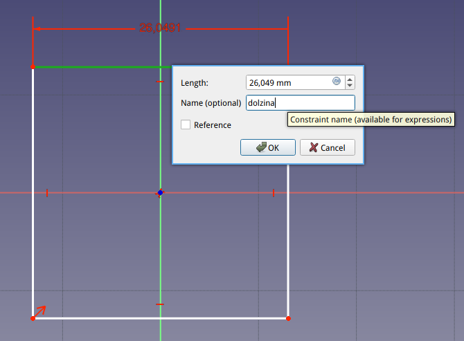
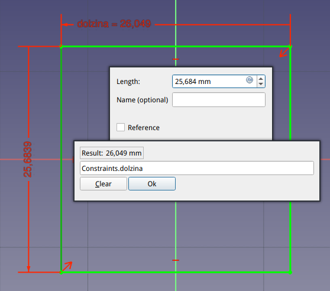
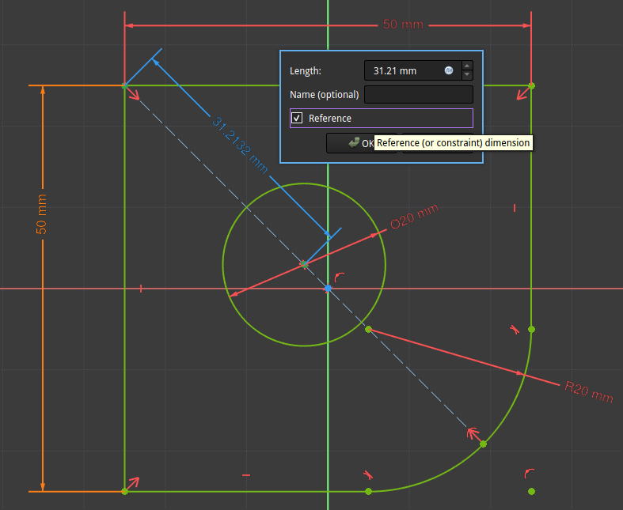
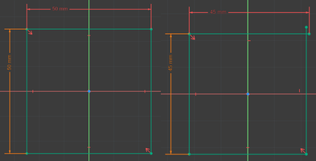
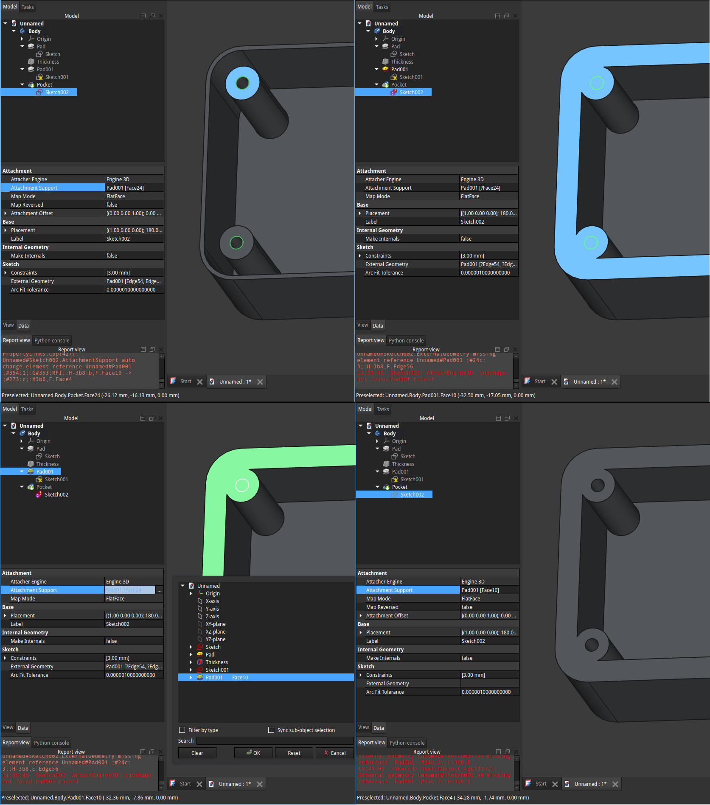
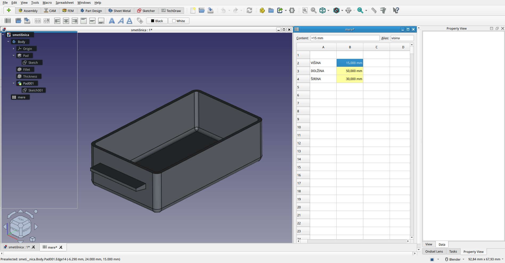
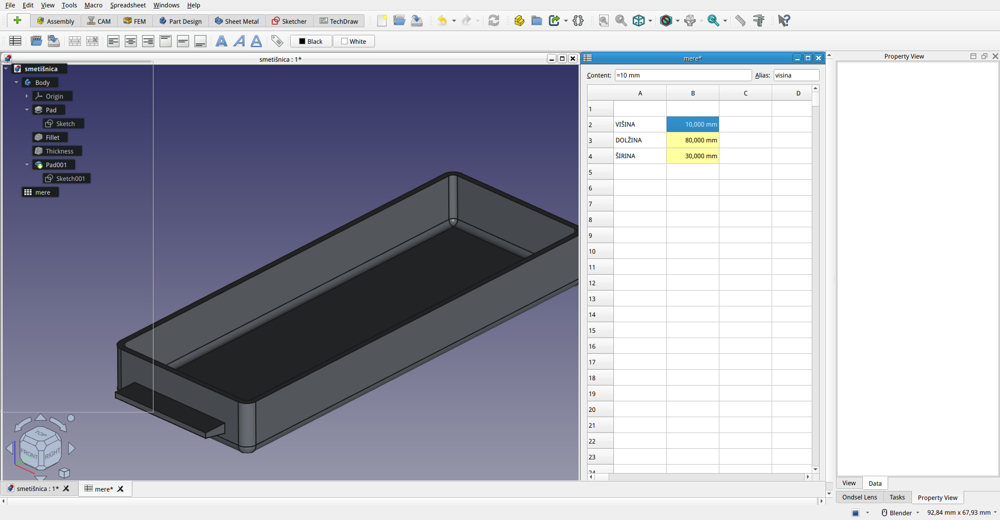
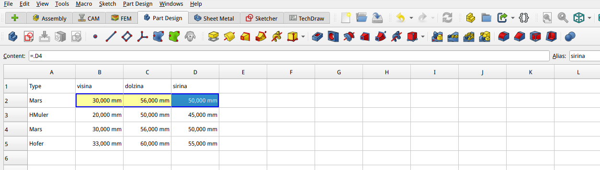
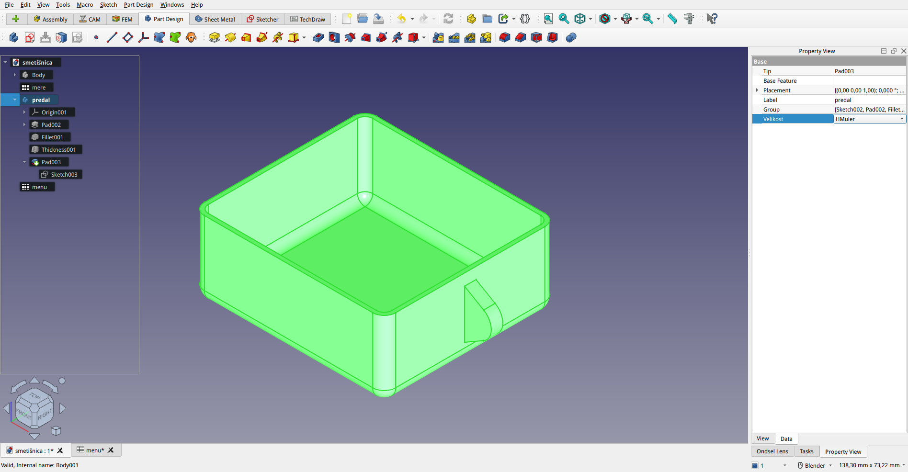
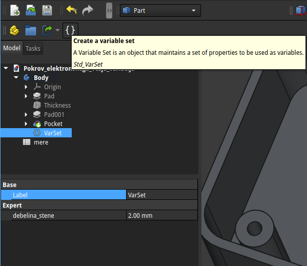

 PARAMETRIČNO MODELIRANJE
================================================================================

Parametrično modeliranje je pristop k oblikovanju 3D modelov, kjer so geometrijske entitete kot so točke, črte, ploskve in tridimenzionalna telesa ter njihove odvisnosti med seboj definirane skozi matematične parametre. Te parametre lahko kadarkoli spremenimo in posledično se bo spremenil celoten model.

Vsaka značilnost modela (dolžina, širina, višina, polmer itd.) se lahko določi z matematično enačbo, ki lahko vključuje konstante ali druge parametre. Tako lahko z enostavnim spreminjanjem teh parametrov hitro in enostavno prilagajamo model brez potrebe po ponovnem risanju.

Parametrično modeliranje v programu FreeCAD omogoča veliko fleksibilnost in natančnost pri oblikovanju modelov. Omogoča nam, da naredimo kompleksne spremembe modelov s preprostimi prilagoditvami parametrov, kar bistveno poveča učinkovitost in produktivnost oblikovalnega procesa.

Poleg tega parametrično modeliranje omogoča tudi reševanje zapletenih oblikovalskih problemov, saj nam omogoča, da modeliramo zapletene geometrijske oblike, ki bi bile z drugimi metodami težje dosegljive.

## Sklicevanje na dimenzije modela

1. Ustvarjanje modela: Začnete z ustvarjanjem modela v programu FreeCAD. To lahko storite s pomočjo različnih orodij za oblikovanje, kot so Sketcher, Part Design, itd.

2. Določanje dimenzij: Ko je model ustvarjen, lahko začnete dodajati dimenzije. To storite na skici modela s klikom na gumb \"Dimenzije\" v orodni vrstici. Nato izberite dve točki na modelu, med katerima želite izmeriti razdaljo.

3. Poimenovanje dimenzije: V istem uporabniškem oknu imamo možnost dimenzijo tudi poimenovati. V polje `Name(optional)` lahko vpišemo ime dimenzije (npr. `dolzina`) in se bomo lahko kasneje nanjo sklicevali.

{#fig:sklic_na_dimenzije_1 width=10cm}

{#fig:sklic_na_dimenzije_2 width=10cm}

4. Sklic na poimenovano dolžino: [Sklic](https://wiki.freecad.org/Expressions#Reference_to_CAD_data) na dimenzije je postopek, pri katerem se določene dimenzije modela uporabljajo kot referenca za druge dele modela. Če želimo to storiti, lahko v polje kamor bi vpisali razdaljo, vpišemo njen sklic. Sklic je sestavljen iz `<<object_label>>.Constrains.dolzina`, kjer je napis objekta (ang. Label) v `<<` in zaključen z `>>`. Če gre za skic na dimenzijo v isti skici, ime objekta izpustimo in vpišemo le `Constrains.dolzina`.

5. Uporaba referenčnih mer: Reference se lahko uporabijo na različne načine. Pogosto pridejo prav pri [izračunih](https://wiki.freecad.org/Expressions) drugih dimenzij modela. Pri naslednji [@fig:Params_REFERENCE] je prikazan primer, kjer je izvrtina s premerom $d=20mm$ pozicionirana na sredini diagonale med ogliščem in krožnim lokom. Izračun te dimenzije je nekoliko zapletenejši, zato je enostavnejše, da jo dejansko izmerimo, to dimenzijo določimo kot `referenčno dimenzijo` in jo nato lahko uporabimo v drugih skicah.

{#fig:Params_REFERENCE}

## Topološke težave s parametričnim modeliranjem

Topološke težave v parametričnem modeliranju nastanejo, ko spremenljive (parametri) povzročijo, da geometrija modela postane nedefinirana ali neusklajena – na primer, ko se podane mere med seboj izključujejo in tvorijo geometrijskih konfliktih.

Primer: Predstavljajte si preprost model škatle, ki je definiran s parametrično postavitvijo v FreeCAD-u. V modelu so definirane višina, širina in globina preko parametrov, ki so lahko urejeni v Spreadsheetu. Če spremenimo parameter, recimo povečamo širino, ne da bi ustrezno prilagodili presečišča in omejitve (kot so zaklenjene robne črte v skici, glej [@fig:Params_tololoske_napake_1]), lahko pride do situacije, da robovi ne sestavljajo več zaprtih ploskev – s tem se “pretrga” topologija modela. To lahko povzroči, da se model zaključi z nepravilnimi (npr. prekritimi ali podvojeno definiranimi) robovi oziroma celo izpadejo nekateri elementi (npr. plošče ali robovi postanejo "degenerirani") in model postane nezanesljiv za nadaljnjo obdelavo (npr. za 3D tisk ali nadaljnje oblikovanje).

{#fig:Params_tololoske_napake_1}

Zakaj se to dogaja?  
    - Parametrično modeliranje temelji na matematičnih izrazih in relacijah med geometrijskimi entitetami.  
    - Če izrazi postanejo med seboj neskladni (npr. ko spremenimo eno mero, ki mora biti sorazmerna z drugo, vendar ta odvisnost ni ustrezno definirana), rezultat ni več veljavna geometrijska konfiguracija.  
    - To se zlasti pokaže pri kompleksnejših modelih, kjer več parametrov medsebojno vpliva drug na drugega.

Običajen postopek reševanja te težave v FreeCAD-u vključuje:

1. **Validacijo modela:** Pred spreminjanjem parametrov preverite stanje modela s funkcijami, kot je "Validate sketch", da se prepričate, da so vse reference sklicevanja v redu.
2. **Postopno prilagajanje parametrov:** Spreminjajte parametre postopoma in po vsakem koraku preverite, kje je prišlo do spremembe topologije.
3. **Ročno popravljanje referenc:** Če se reference spremenijo, lahko ročno obnovite "attachment support" v skicah, tako da navedete novo pravilno ploskev oziroma prilagodite geometrijske reference.
4. **Uporaba konstrukcijskih profilov ali vmesnih korakov:** Včasih je smiselno model razdeliti na več delov, kjer so posamezni deli manj občutljivi na globalne spremembe parametrov, kar zmanjša možnost, da bi majhna sprememba povzročila popolno preureditev topologije.

S tem pristopom lahko kontrolirano preučite, kako sprememba parametrov vpliva na celoten model, in pravočasno posežete, da zagotovite, da vse reference med skicami in pritrdilnimi podporami ostanejo pravilne, kar je ključno za nadaljnje modeliranje in proizvodnjo.

### Topološka poimenovanja ploskev, robov in točk

Topološke napake v parametričnem modeliranju se pogosto zgodijo tudi, ko spremembe parametrov povzročijo spremembo števila in organizacije ploskev (tudi robov in točk) modela, kar lahko vpliva na reference med skicami in nadaljnje postopke modeliranja. 

Primer: Predstavljajte si, da izdelujete model ohišja, ki vključuje več skic za pritrditev dodatnih elementov. Za osnovo uporabljate parametrični model, kjer so dimenzije, kot so debelina ohišja ali robovi, definirane z uporabo spodaj definiranih parametrov. V skicah uporabljate funkcijo "attachment support", ki se sklicuje na določene ploskve zunanjega modela. 

{#fig:Param_topol_error}

Težava s topološkim poimenovanjem nastane, če s spremembo parametra – recimo debeline materiala – pride do večje spremembe topologije. Na primer:
    - V privzetem stanju ima model ohišja določeno število ploskev in eno to ploskev smo uporabili kot referenco za skico (glej [@fig:Param_topol_error] levo zgoraj, označena površina z imenom `...Face24`).
    - Ko povečamo debelino ([@fig:Param_topol_error] desno zgoraj), se model preoblikuje in število ploskev se spremeni ter s tem prelomi prvotno topologijo modela. Ime ploskve se spremeni iz `...Face24` v `Face10`.
    -  Posledično se imena (in številka) ploskev spremenijo – tiste, na katere se skica z "attachment support" sklicuje, postanejo napačne ali celo neobstoječe.
    -  To lahko popravimo tako, da skici določimo novo ustrezno ploskev ([@fig:Param_topol_error] levo spodaj).

To razbijanje referenc povzroči, da pritrdilne točke in drugi elementi skice, ki so bili povezani z originalnimi ploskvami, izgubijo svoje prave reference, kar vodi do neuspešnega recomputing modela ali nepravilnih pritrdilnih točk. 

## Parametri v tabeli

Priklic parametrov je v programu FreeCAD možen na več načinov. Najosnovnejši je sklicevanje na parametre, ki so zapisani v preglednici v dotočni celici. V FreeCAD lahko ustvarimo preglednico s parametri tako, da uporabimo `Spreadsheet delovni prostor`, in v tabelo vpišemo pomembnejše parametre modela. 

1. Ustvari Spreadsheet:
    - Odpri novo datoteko in pojdi v Spreadsheet delovni prostor (Workbench).
    - Ustvari nov Spreadsheet objekt in vanj vnesi dimenzijske vrednosti, pri čemer vsaki celici dodeliš ime (npr. `dolzina`, `visina` itd.) ali prilagojen sklic ("Alias").
    - Poimenuj Spreadsheet (npr. "Mere").

2. Sklicevanje v skicah:
    - Odpri Sketcher in v ustreznih dimenzijskih poljih (npr. constraint vrednostih) uporabiš izraz, ki se sklicuje na celico v Spreadsheet. Primer: če želiš dolžino, nastaviš constraint na vrednost `Mere.dolzina`.
    - Izrazi se posodobijo, ko spremenite vrednosti v Spreadsheet-u, kar omogoča variabilnost modela.

S tem dobiš usklajen način upravljanja dimenzij: sprememba vrednosti v tabeli avtomatično vpliva na geometrijo skic oziroma modela.

Vsak parameter ali dimenzijo modela, ki jo želite spreminjati, moramo vnesti v to preglednico kot samostojno celico tabele. Vsaka vrstica naj vsebuje ime parametra, njegovo trenutno vrednost in morebitne opombe ali opise, ki jih želite dodati. Ti parametri so nato povezani z ustreznimi dimenzijami modela, tako da se vsaka sprememba parametra v preglednici neposredno odraža v modelu.

{#fig:parametric_table_1}

{#fig:parametric_table_2}

To je izjemno uporabna funkcija, ker omogoča enostaven način za hitro spreminjanje ključnih dimenzij modela. Namesto da bi morali ročno najti in spremeniti vsako dimenzijo v modelu, lahko uporabniki preprosto spremenijo vrednost v preglednici in opazujejo, kako se model samodejno prilagaja.

To ne le pospeši postopek modeliranja, temveč omogoča tudi veliko večjo natančnost in doslednost. Ker so vse dimenzije shranjene na enem mestu, je možnost napak ali neskladnosti med različnimi deli modela minimalna.

Poleg tega je ta funkcija izjemno uporabna tudi pri iterativnem oblikovanju. Če želite preizkusiti različne različice modela, lahko preprosto spremenite parametre in takoj vidite rezultate, ne da bi morali model popolnoma preoblikovati.

## Variacije modela

V preglednici lahko ustvarite posebno vrsto tabele, ki vsebuje vse potrebne parametre različnih variacij modela. Pomembno je, da je taka tabela pravilno organizirana.

1. V preglednici ustvari tabelo z lastnostmi

|        | visina | dolzina | sirina |
|:------:|:------:|:-------:|:------:|
| prazna |        |         |        |
| HMuler |  20 mm |  50 mm  |  45 mm |
|  Mars  |  30 mm |  56 mm  |  50 mm |
|  Hofer |  45 mm |  60 mm  |  55 mm |
Table: Tabela z vrednostmi. {#tbl:vrednosti_parametrov}

2. Prvo vrstico pod naslovom tabele pustimo prazno in z njo pričnemo označbo A2:D5
3. Desni klik -> `Configuration table...`
    - popravimo označbo `A2:D5`
    - v `Property:` vpišemo ime objekta in ime lastnosti `<<predal>>.Velikost`.
4. Če smo storili prav, se `prazna vrstica tabele` izpolni s trenutno izbranimi podatki iz tabele spodaj.
5. Nastavimo imena (`Alias:`) celic prve vrstice (B2, C2 in D2) s podatki.

{#fig:lastnosti_modela_1}

6. Narišemo model in se v skici sklicujemo na imena celic z ustreznimi dimenzijami.

7. Nazadnje lahko med lahstnosti našega modela `<<Predal>>` izbiramo tudi po tipu modela.

{#fig:izbira_lastnosti_s_parametri}

## Dodajanje parametrov med lastnosti modela

Spodaj so kratka navodila za dodajanje modelskih parametrov med lastnosti z uporabo "Create variable set" v FreeCAD-u:

1. Odpri dokument in izberi objekt, ki ga želiš parametrizirati.

2. V lastnostih objekta poišči polja, kjer želiš uporabiti parametre, in klikni z desno tipko (ali uporabi ustrezno ukazno možnost) ter izberi "Create variable set". S tem ustvariš sklop spremenljivk, ki jih lahko kasneje uporabiš kot izraze za dinamično nadzorovanje lastnosti.

3. V oknu "Variable set" dodaj nove spremenljivke (npr. višina, širina, debelina) tako, da navedeš njihova imena in začetne vrednosti. Te vrednosti bodo predstavljale osnovne parametre modela.

4. V poljih lastnosti objekta vnesi izraze, ki se sklicujejo na ustrezne spremenljivke iz variable seta (npr. "VarSet.Height" ali podobno, odvisno od imena, ki si ga določil). Tako se bo model prilagodil vrednostim, določenim v variable setu.

5. Po spremembi vrednosti v variable setu izberi "Recompute" (ponovni izračun), da se model posodobi glede na nove parametre. S tem se ohrani konsistentnost med lastnostmi in omogoči fleksibilno prilagajanje modela.

{#fig:Params_Variable_Set height=10cm}

Na ta način centralno upravljaš modele parametre, kar omogoča enostavno spreminjanje in nadzor nad geometrijskimi lastnostmi brez potrebe po ročnem popravljanju vsake posamezne lastnosti.

## Dodajanje parametrov k objektom

Namestite Workbench DynamicData Workbench.
