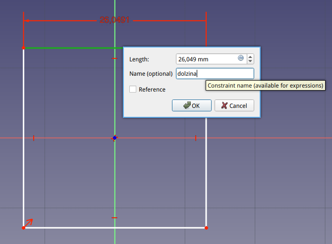
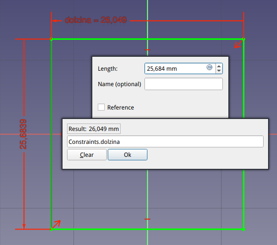
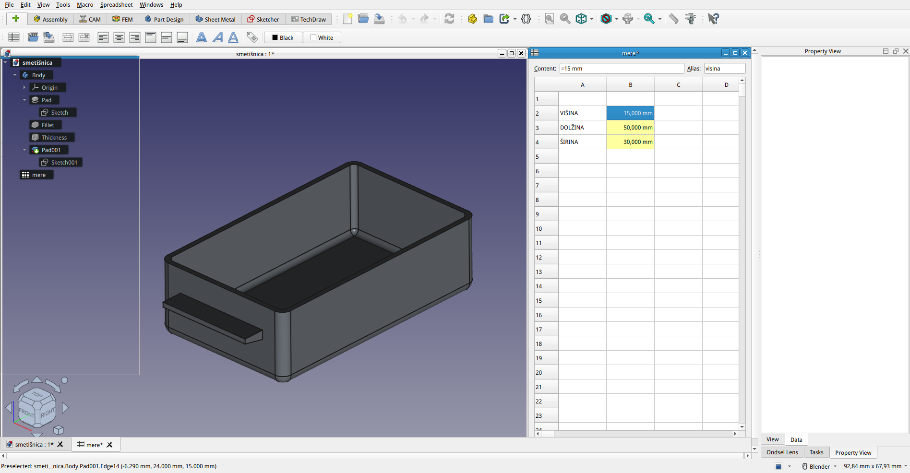
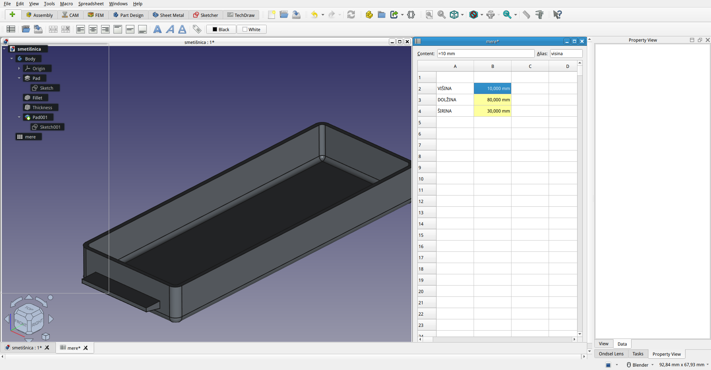
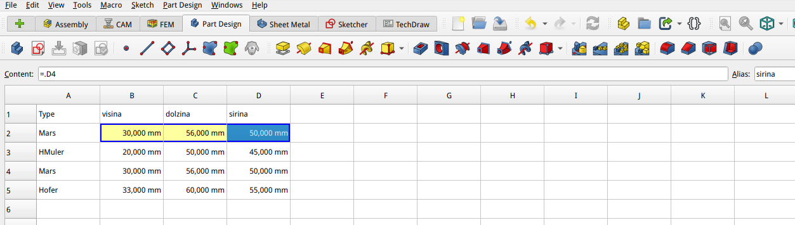
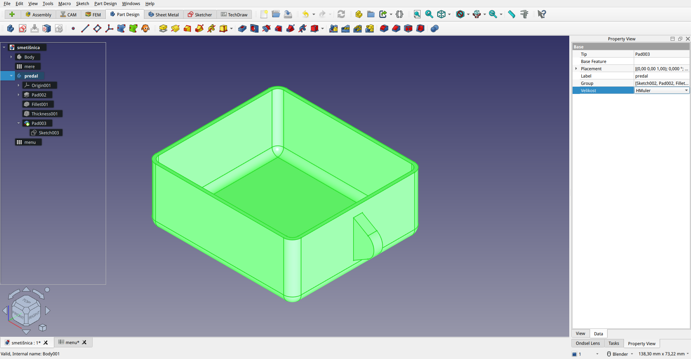

 PARAMETRIČNO MODELIRANJE
================================================================================

Parametrično modeliranje je pristop k oblikovanju 3D modelov, kjer so geometrijske entitete kot so točke, črte, ploskve in tridimenzionalna telesa ter njihove odvisnosti med seboj definirane skozi matematične parametre. Te parametre lahko kadarkoli spremenimo in posledično se bo spremenil celoten model.

Vsaka značilnost modela (dolžina, širina, višina, polmer itd.) se lahko določi z matematično enačbo, ki lahko vključuje konstante ali druge parametre. Tako lahko z enostavnim spreminjanjem teh parametrov hitro in enostavno prilagajamo model brez potrebe po ponovnem risanju.

Parametrično modeliranje v programu FreeCAD omogoča veliko fleksibilnost in natančnost pri oblikovanju modelov. Omogoča nam, da naredimo kompleksne spremembe modelov s preprostimi prilagoditvami parametrov, kar bistveno poveča učinkovitost in produktivnost oblikovalnega procesa.

Poleg tega parametrično modeliranje omogoča tudi reševanje zapletenih oblikovalskih problemov, saj nam omogoča, da modeliramo zapletene geometrijske oblike, ki bi bile z drugimi metodami težje dosegljive.

## Sklicevanje na dimenzije modela

1. Ustvarjanje modela: Začnete z ustvarjanjem modela v programu FreeCAD. To lahko storite s pomočjo različnih orodij za oblikovanje, kot so Sketcher, Part Design, itd.

2. Določanje dimenzij: Ko je model ustvarjen, lahko začnete dodajati dimenzije. To storite na skici modela s klikom na gumb \"Dimenzije\" v orodni vrstici. Nato izberite dve točki na modelu, med katerima želite izmeriti razdaljo.

3. Poimenovanje dimenzije: V istem uporabniškem oknu imamo možnost dimenzijo tudi poimenovati. V polje `Name(optional)` lahko vpišemo ime dimenzije (npr. `dolzina`) in se bomo lahko kasneje nanjo sklicevali.

{#fig:sklic_na_dimenzije_1 width=10cm}

{#fig:sklic_na_dimenzije_2 width=10cm}

4. Sklic na dimenzijo: [Sklic](https://wiki.freecad.org/Expressions#Reference_to_CAD_data) na dimenzije je postopek, pri katerem se določene dimenzije modela uporabljajo kot referenca za druge dele modela. Če želimo to storiti, lahko v polje kamor bi vpisali razdaljo, vpišemo njen sklic. Sklic je sestavljen iz `<<object_label>>.Constrains.dolzina`, kjer je napis objekta (ang. Label) v `<<` in zaključen z `>>`.

5. Uporaba reference CAD podatkov: Reference CAD podatkov se lahko uporabijo na različne načine. Na primer, lahko jih uporabite za uvoz ali izvoz dimenzij, oblik in drugih podatkov med različnimi CAD programi. Prav tako jih lahko uporabite kot osnovo za ustvarjanje novih modelov ali za določanje dimenzij pri obstoječih modelih. Pogosto pridejo prav pri [izračunih](https://wiki.freecad.org/Expressions) drugih dimenzij objekta.

## Parametri v tabeli

FreeCAD podpira uporabo parametričnega modeliranja s funkcionalnostjo, imenovano `Spreadsheet Workbench`. Ta delovna miza omogoča uporabnikom, da ustvarijo preglednico znotraj svojega projekta, kjer lahko zbirajo in opisujejo parametre svojih modelov.

Vsak parameter ali dimenzija modela, ki ga želite nadzorovati, je vnesen v to preglednico kot posamezna vrstica. Vsaka vrstica vsebuje ime parametra, njegovo trenutno vrednost in morebitne opombe ali opise, ki jih želite dodati. Ta parametri so nato povezani z ustreznimi deli modela, tako da se vsaka sprememba v preglednici neposredno odraža v modelu.

{#fig:parametric_table_1}

{#fig:parametric_table_2}

To je izjemno uporabna funkcija, ker omogoča enostaven način za hitro spreminjanje ključnih dimenzij modela. Namesto da bi morali ročno najti in spremeniti vsako dimenzijo v modelu, lahko uporabniki preprosto spremenijo vrednost v preglednici in opazujejo, kako se model samodejno prilagaja.

To ne le pospeši postopek modeliranja, temveč omogoča tudi veliko večjo natančnost in doslednost. Ker so vse dimenzije shranjene na enem mestu, je možnost napak ali neskladnosti med različnimi deli modela minimalna.

Poleg tega je ta funkcija izjemno uporabna tudi pri iterativnem oblikovanju. Če želite preizkusiti različne različice modela, lahko preprosto spremenite parametre in takoj vidite rezultate, ne da bi morali model popolnoma preoblikovati.

## Izbirni meni z definiranimi lastnostmi

1. V preglednici ustvari tabelo z lastnostmi

|        | visina | dolzina | sirina |
|:------:|:------:|:-------:|:------:|
| prazna |        |         |        |
| HMuler |  20 mm |  50 mm  |  45 mm |
|  Mars  |  30 mm |  56 mm  |  50 mm |
|  Hofer |  45 mm |  60 mm  |  55 mm |
Table: Tabela z vrednostmi. {#tbl:vrednosti_parametrov}

2. Prvo vrstico pod naslovom tabele pustimo prazno in z njo pričnemo označbo A2:D5
3. Desni klik -> `Configuration table...`
    - popravimo označbo `A2:D5`
    - v `Property:` vpišemo ime objekta in ime lastnosti `<<predal>>.Velikost`.
4. Nastavimo imena (`Alias:`) celic prve vrstice (B2, C2 in D2).

{#fig:lastnosti_modela_1}

5. Narišemo model in se v skici sklicujemo na imena celic z ustreznimi dimenzijami.

{#fig:izbira_lastnosti_s_parametri}

## Dodajanje parametrov k objektom

Namestite Workbench DynamicData Workbench.
