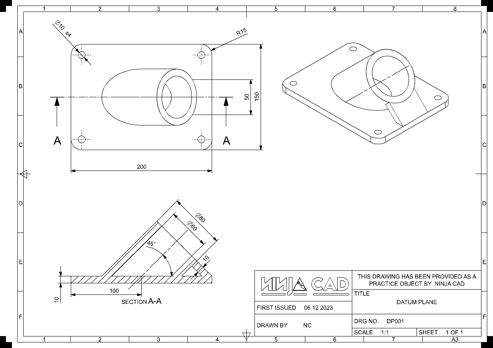

 NAPREDNAORODJA SUBSHAPEBINDER ARRAY SKECHONSURFACE
================================================================================

Napredni modelirni pristopi v FreeCAD-u ponujajo širok spekter orodij, ki omogočajo natančno in učinkovito oblikovanje kompleksnih projektov. Študentje pedagoške fakultete, ki študirajo smer tehnika in tehnologija, se bodo skozi njihovo uporabo naučili, kako se lotiti realnih inženirskih izzivov z inovativnim pristopom. Ključna orodja, ki jih bomo obravnavali, vključujejo: Pomožna ravnina (Datum Plane), SubShape Binder, Linear Array (iz orodij Lattice2) in Sketch on Surface.

## Nepogrešljive situacije za ta orodja:

1. **Prilagodljivost in modularnost pri konstrukcijah:**
   - **Pomožna ravnina (Datum Plane)** je bistvenega pomena pri ustvarjanju novih referenčnih točk in ravnin, kar je ključno v projektih, kjer morate modelirati objekte z večslojno kompleksno geometrijo, kot so deli strojev ali arhitekturne strukture.

2. **Medsebojno povezani modeli:**
   - **SubShape Binder** omogoča delo z medsebojno odvisnimi deli. To orodje je še posebej uporabno pri projektih, kjer je potrebna konsistenca med različnimi deli modela, kot so sestavljeni izdelki z več komponentami.

3. **Ustvarjanje ponavljajočih se vzorcev:**
   - **Linear Array (Lattice2)** omogoča ponavljanje geometrij v določenih vzorcih, kar je idealno za dizajne, ki zahtevajo simetrijo in ponavljanje, kot pri gradbenih konstrukcijah ali proizvodnji teksturiranih površin.

4. **Modeliranje kompleksnih površin:**
   - **Sketch on Surface** je nepogrešljiv za oblikovanje izdelkov z ukrivljenimi površinami, kot so aerodinamične komponente ali ergonomični pripomočki. To omogoča natančno delovanje na katerikoli tridimenzionalni površini.

## Predstavitev orodij:

- **Pomožna ravnina (Datum Plane):**
  Uporablja se za ustvarjanje dodatnih referenčnih ravnin ali osi, kar daje večjo fleksibilnost v kompleksnih modelih. Z njimi lahko natančno določite lokacije za nove geometrije neodvisno od osnovne modelne osi.
    - primer je odtočna cev za spajanje pod kotom 45
    - nosilec za drog (45 stopinj)

{#fig:1747589019036}

- **Sub-Shape Binder:**
  Omogoča ponovno uporabo in referenciranje obstoječe geometrije iz enega dela na drugega. S tem orodjem se zagotovi, da spremembe v originalni geometriji samodejno posodobijo povezane modele, kar poenostavi delo na več-modelnih projektih.
    - škatlica in pokrov
    - pri modeliranju cevi s prerezi in potjo, kjer je pot sestavljena iz večih skic.

- **Linear Array (Lattice2):**
  To orodje omogoča ustvarjanje zaporedij ali polj ponovitev objekta s točnimi intervali. To je idealno za kreiranje rešetkastih struktur ali serijsko proizvodnjo enakih komponent.
    - perjenica za badbinton

- **Sketch on Surface:**
  Omogoča ustvarjanje in manipulacijo skic neposredno na 3D ukrivljenih površinah, kar omogoča ustvarjanje naprednih in estetsko izboljšanih oblik. Olajša delo pri projektih, kot so avtomobilski deli ali potrošniška elektronika, kjer je krojljivost velik izziv.
    - perjenica za badbinton

