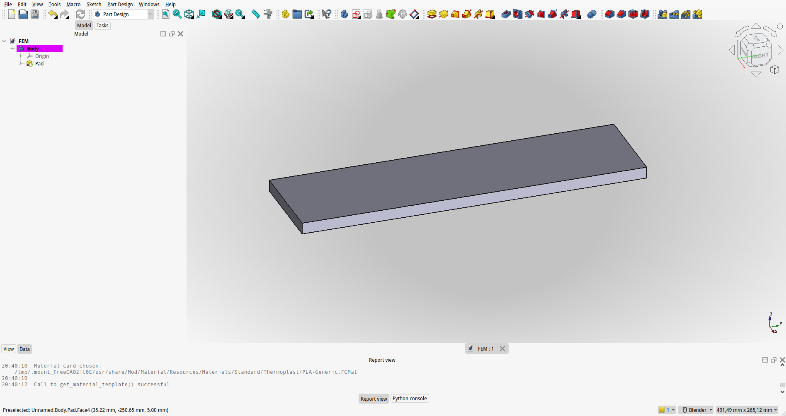
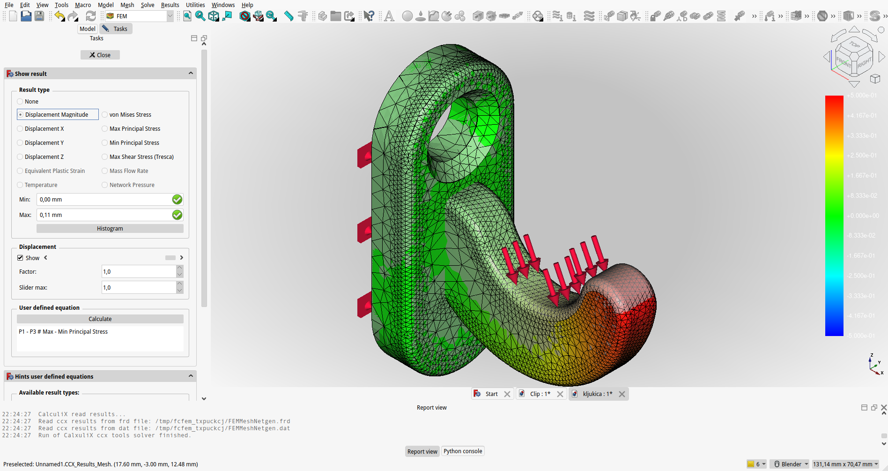

UVOD V ANALIZO MODELA S KONČNIMI ELEMENTI (FEM) V FREECAD-U
================================================================================

Modeliranje in analiza s končnimi elementi (Finite Element Method - FEM) predstavljata ključno metodo za analizo kompleksnih strukturnih in mehanskih problemov v inženiringu in znanosti o materialih. V zadnjih desetletjih so računalniška orodja za FEM postala nepogrešljiva pri načrtovanju in optimizaciji izdelkov in konstrukcij. Ena izmed priljubljenih odprtokodnih rešitev za izvajanje FEM analiz je FreeCAD, ki ponuja celovit nabor orodij za modeliranje in simulacijo.

## Kaj je FEM?

Metoda končnih elementov (FEM) je numerična tehnika za reševanje diferencialnih enačb, ki opisujejo različne fizikalne pojave, kot so mehanska napetost, toplotni pretok, elektromagnetizem in drugo. Osnovna ideja FEM je razdelitev kompleksne geometrije in fizikalnega problema na manjše, bolj obvladljive dele, imenovane končni elementi. Vsak element ima preprostejšo obliko in je povezan z drugimi elementi na vozliščih, kar omogoča sestavljanje sistema enačb, ki opisuje celoten problem.

## Uporaba FEM v FreeCAD-u

FreeCAD je odprtokodna CAD programska oprema, ki vključuje modul za analizo s končnimi elementi (FEM). Ta modul omogoča uporabnikom, da ustvarijo geometrijske modele, jih obremenijo z različnimi vrstami obremenitev, določijo materialne lastnosti in izvedejo FEM analizo za oceno napetosti, deformacij in drugih pomembnih fizikalnih parametrov.

### Ključni Koraki v FEM Analizi z FreeCAD

#### Kreiranje Geometrijskega Modela:

Uporabniki začnejo s kreiranjem 3D modela v FreeCAD-u. Modeliranje vključuje definicijo oblike in dimenzij objekta, ki ga želimo analizirati.

{#fig:FEM_50_model}

#### Določanje Materialnih Lastnosti:

Uporabniki določijo materialne lastnosti modela, kot so modul elastičnosti, Poissonovo razmerje, trdnost materiala in druge potrebne parametre.

{#fig:FEM_52_material}

#### Nalaganje in Mejne Pogoje:

Definirajo se obremenitve (kot so sile, tlaki, temperature) in mejni pogoji (pritrditve, simetrijski pogoji), ki delujejo na model. Ti pogoji definirajo, kako se model interagira z okoljem.

{#fig:FEM_53_sile}

{#fig:FEM_54_obremenitev}

#### Mreženje (Meshing):

Geometrija modela se razdeli na manjše dele, imenovane končne elemente. Kakovost in gostota mreže sta ključna za natančnost analize, saj bolj fina mreža običajno pomeni natančnejše rezultate, vendar tudi večje računalniške zahteve.

{#fig:FEM_55_mreza}

#### Reševanje in Analiza Rezultatov:

FreeCAD uporabi numerične metode za rešitev sistema enačb in izračuna odziv modela na definirane obremenitve. Rezultati analize vključujejo napetosti, deformacije, temperature in druge pomembne fizikalne veličine.

{#fig:FEM_56_izracun}

#### Vizualizacija in Interpretacija:

Rezultati FEM analize so vizualizirani v FreeCAD-u, kar omogoča uporabnikom, da interpretirajo in ocenijo odziv modela. Barvne karte, deformirane oblike in animacije so nekatere od orodij za prikaz rezultatov.

{#fig:FEM_57_rezultati}

### Prednosti uporabe FreeCAD za FEM

- Dostopnost: FreeCAD je odprtokodna in brezplačna programska oprema, kar omogoča širok dostop in uporabo brez finančnih obremenitev.
- Integracija: FreeCAD ponuja celovit nabor funkcionalnosti za CAD modeliranje in FEM analizo znotraj ene platforme.
- Prilagodljivost: Uporabniki lahko prilagajajo in razvijajo dodatke ter funkcionalnosti glede na specifične potrebe svojih projektov.
- Analiza s končnimi elementi v FreeCAD-u je močno orodje za inženirje, znanstvenike in oblikovalce, ki omogoča podrobno razumevanje kompleksnih problemov in podporo pri odločitvah pri načrtovanju in optimizaciji.

## TRDNOST MATERIALOV
 
Trdnost materiala je sposobnost, da se upira spremembi 
oblike in porušitvi zaradi delovanja zunanjih sil. Kadar trdno telo 
obremenimo z zunanjo silo, se upira spremembi tako, da v telesu 
nastanejo napetosti.  

$$ \sigma = \frac{F}{A} $${#eq:napetost}

Kjer je :

- $\sigma$ - natezna, tlačna, ... napetost [MPa = N/mm²]
- $F$ - sila, ki deluje pri obremenitvi [N]
- $A$ - površina, na kateri se ustvarja napetost

Pri obremenjevanju izdelkov lahko zaznamo deformacije izdelka v določenih smereh.
Spremembe dimenzij $\Delta l$ pogosto predstavimo v relativni obliki s specifičnim
raztezkom:

$$ \epsilon = \frac{\Delta l}{l_0} $${#eq:spec_raztezek}

Kjer je:

- $\epsilon$ - specifični (ali relativni) raztezek
- $\Delta l$ - raztezek 
- $l_0$ - prvotna dimenzija

Obremenilna napetost in raztezek sta premosorazmerna in jih povezuje elastični
modul $E$.

$$\sigma = E\ \epsilon = E\ \frac{\Delta l}{l_0}$${#eq:elas_modul}

Vrste obremenitev:

- Tlačna
- Natezna
- Strižna
- Upogibna
- Torzijska
- Uklonska

### DOPUSTNA NAPETOST

Materialov ne smemo obremeniti do njihove maksimalne 
napetosti, obremenimo jih le do dopustne napetosti, ki se vedno 
nahaja v območju elastičnih deformacij. Tako izkoristimo le del 
njihove trdnosti. Dopustno napetost določajo predpisi in standardi. 

| Material | Dopustna napetost [MPa] | Elastični modul [GPa] |
|:--------:|:-----------------------:|:---------------------:|
|    PLA   |         50 - 70         |       2.7 - 3.5       |
|    ABS   |         40 - 60         |       1.5 - 2.5       |
|   PETG   |         45 - 65         |       2.0 - 2.4       |
|    Les   |         10 - 15         |       0.5 - 13.0      |
|   Jeklo  |        250 - 400        |       200 - 210       |
| Aluminij |          30 -60         |        65 - 75        |
Table: Primerjava dopustnih napetosti in elastičnega modula za različne materiale. {#tbl:sigma_dop_tab}

### NATEZNA IN TLAČNA TRDNOST LESA

raztezek:  
$$ \epsilon = \frac{\Delta l}{l_0} = \frac{l_1 - l_0}{l_0} $${#eq:raztezek}

- $\epsilon$ - specifični raztezek
- $\Delta l$ - dejanski raztezek
- $l_1$ - nova dolžina
- $l_0$ - prvotna dolžina

Ob tej deformaciji se ustvarijo napetosti:

$$ \sigma = E \frac{\Delta l}{l_0} $${#eq:napetost_nateg}

- $\sigma$ - napetost
- $E$ - modul elastičnosti
- $\epsilon$ - specifični raztezek
- $\Delta l$ - raztezek
- $l_0$ - prvotna dolžina

### STRIŽNA TRDNOST

Strižna trdnost je odpor lesa proti strigu lesnih plasti s silo, ki 
deluje v ravnini lesnih vlaken ali redko, prečno na lesna vlakna.  

- prečno na vlakna : čepna vez
- vzdolž vlaken : poševnik v legi nadstreška

- strižna napetost

$$ \tau = \frac{F}{A} $${#eq:strig}

### UPOGIBNA TRDNOST

Upogibna trdnost je odpor lesnega nosilca med oporama proti maksimalni sili, ki deluje pravokotno na os nosilca. 

{#fig:upogibna_trdnost}

Pri dimenzioniranju na upogib upoštevamo samo največji, maksimalni
upogibni moment, saj tam nastopijo največje napetosti.

$$ \sigma_U = \frac{M_{max}}{W_x} $${#eq:napetosti_upogib}

- $\sigma_U$ - mehanska napetost v nosilcu
- $M_{max}$ - največji navor, ki ga povzroča mehanska obremenitev na nosilec
- $W_x$ - odpornostni moment nosilca (odvisen od oblike prereza nosilca)

| Prerez nosilca |    Vztrajnostni moment    |     Odpornostni moment    |
|---------------:|:-------------------------:|:-------------------------:|
|      kvadratni |   $I_x = \frac{a^4}{12}$  |    $W_x=\frac{a^3}{6}$    |
|     pravokotni | $I_x = \frac{b\ h^3}{12}$ |   $W_x=\frac{b\ h^2}{6}$  |
|        okrogli | $I_x=\frac{\pi\ d^4}{64}$ | $W_x=\frac{\pi\ d^3}{32}$ |

Table: Vztrajnostni in odpornostmi momenti za različne prereze nosilcev. Kjer je: a - dolžina stranice kvadratnega, b - širina in h - višina pravokotnega ter d - premer okroglega prereza. {#tbl:momenti_presekov}

{#fig:nosilci}

- $f$ - poves
- $F$ - sila obremenitve
- $L$ - dolžina nosilca
- $E$ - elastični modul
- $I_X$ - vztrajnostni moment v vodoravni smeri
- $\sigma_U$ - upogibna napetost v nosilcu

> Nosilec je togo vpet na levi stranici in obremenjen po celotni zgornji površini s silo 10 N. Prerez nosilca je 10 mm x 80 mm. Dolžina nosilca pa je 300 mm. Nosilec je natisnjen iz PLA materiala z elastičnim modulom $E=3.64 MPa$, dopustna napetost v materialu pa je $\sigma_{dop}=50 MPa$. Izračunajte poves in napetosti v nosilcu. Rezultate primerjajte z rezultati iz analize s končnimi elementi naslednjo obremenitev enostavnega vpetega nosilca na [@fig:FEM_50_model]. 
>
> ( R: $\sigma$ = 1.13 MPa , f = 1.4 mm, Wx = 1333 cm3 , Ix = 6667 mm4 )

> ### NALOGA: Skonstruirajte obešalo za brisačo
>
> Skonstruirajte obešalo za kopalno brisačo. Obešalo bomo privijačili na omaro v kopalnici, nanjo pa bomo obesili brisačo z maso 50 N. Pri tem naj poves obešala ne bo večji od $ t = 0.1 mm $ in naj ne preseže dopustne napetosti $\sigma = 50 MPa$.

{#fig:FEM_obesalo}

> ### NALOGA: Načrtuj sponko
>
> Načrtuj sponko tako, da bomo njene zatiče enostavno premaknili z roko (cca. 10 N) in da ne bomo prekoračili dopustnih napetosti v materialu ($\sigma=50MPa$) .

{#fig:FEM_Nacrtovanje_klipsne}
