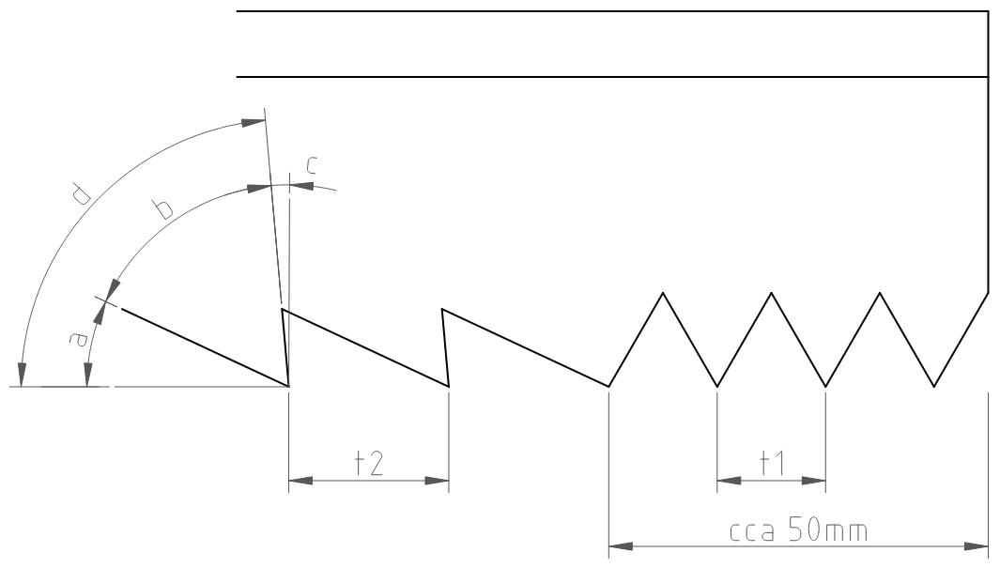

# ROČNO RAZŽAGOVANJE

**NAMEN UPORABE**

- razžagovanje manjših elementov
- izdelava čepov
- odžagovanje zatičev
- žaganje pod kotom
- žaganje težko dostopnih delov

**PREDNOSTI**

- varna uporaba
- nadzorovan proces odreza
- relativno tihe (ni potrebno nositi glušnikov)
- odrezki veliki in kontroliran izmet (ni portebno nositi očal in mask proti prahu)

## VRSTE ROČNIH ŽAG

- **lisičji rep s hrbtom** (angl.: Dovetail handsaw, nem.: Schwalbenschwanz-Säge)
  - Žaga je namenjena kratkim, ravnim, čistim rezom. S to žago je mogoče izdelati ravne ploskve
    čepov in zarez tako, da teh površin ni potrebno dodatno čistiti z dletom.
  - Rezilo je nekoliko debelejše, da se ne ukloni ob nepravilnostih v lesu (grče) in ojačano s hrbtom.
  - Zaradi ozobljenja z manjšimi zobmi vlaken ne iztrgje in površine ni potrebno dodatno obdelovati pred lepljenjem.
  - Ročaj je ergonomsko oblikovan tako, da nudi kar največji nadzor vodoravne smeri odžagovanja.
- **lisičji rep** (angl.: Hand panel saw; nem.: Fuchsschwanzsäge)
- **kopirna rezljača** (angl.: fretsaw, coping saw; nem.: Laubsäge (list), Bewältigungssäge (kopiranje))
- **izravnalna žaga** (angl.: flush trim hand saw; nem.: Rasiersäge)

## Postopek obdelave

Ločimo predvsem dve različni odrezovalni smeri:

- prečno na vlakna in
- vzdolžno na vlakna.

**PRIPRAVA OBDELOVANCA**

- Glede na smer odrezovanja izberemo ročno žago z ustreznimi zobmi
- obdelovanec togo vpnemo v obdelovalno mizo:
  + ki naj ne bo previsoko vpet (vibracije)
- rez naj bo poravnan z navpično smerjo (teža žage naravno vleče žago v navpično smer)

**ROKOVANJE IN POSTAVITEV**

- Žago držimo v nam dominanrni roki (d.r.),
- z iztegnjenim kazalcem v smeri reza (opcijsko?!).
- Postavimo se v smeri reza z ne-dominantno nogo naprej,
- dominantno nogo pa postavimo nazaj s katero bomo zagotavljali potrebno silo odreza.
- Dominantna roka mora imeti dovolj prostora v smeri odrezovanja.
- S prstom ne-dominantne roke vodimo žagin list (a le prvih nekaj rezov).

**TEHNIKA ODREZOVANJA**

1. Rez pričnemo na oddaljenem robu odbelovanca:
    - palec prislonimo na oddaljen rob obdelovanca in k njemu prislonimo žagin list prislonimo tako, da zarisan rez razpolovimo.
    - prst in žagin list tiščimo nekoliko skupaj.
    - Z žaganjem pričnemo na oddaljenem robu in napredujedujemo po risu na sprednji rob (tako lahko enostavno nadzorujemo rez).
    - Navpičnosti reza ne naklonimo veliko pozornosti.
    - Če se žagini zobje pri prvih nekaj rezih preveč ugreznejo v les:
        + moramo nekoliko spremeniti položaj žage tako, da vključimo več zob v odrezovanje in tako
        + sprostimo prevelik tlak na parih zobeh, ki povzroča, da se zobje vgreznejo v les.
        + V tej situaciji preverite tudi ostrino zob.
2. Rez nadaljujemo od začetnega roba preko celotne zgornje površine na nasprotni rob. Tako naredimo 2-3 mm globok rez. Pri tem pazimo na:
    + točnost odrezovanja po črti:
        - Minimalne pomike zagotovimo tako, da vodilni prst bolj ali manj pritisnemo k obdelovancu.
        - Tako se prst bolj ali manj splošči in s tem njegova dimenzija spremeni do $\pm 0.5 mm$.
    + na navpičnost reza:
        - Navpičnost (v smeri navzdol) reza prilagajmo glede na navor, ki ga povzroča hrbtišče žage.
        - Pravokotnost (glede na vzdolžni rob obdelovanca) reza lahko preverjamo tudi z odsevom slike v žaginem listu (2x bolj točno).
        - Žago ne tiščimo navzdol, zadovoljiv odrez mora zagotoviti rezilo samo s svojim cepilnim kotom zoba. Če imamo občutek, da žaga ne napreduje dovolj, preverite ostrino zob.
3. Z odrezovanjem sledimo le eni zarisani strani,
    - Spuščamo žagin list in vodimo rezilo po črti, ki jo lahko opazujemo na naši strani.
    - Če moramo popraviti smer reza to najbolje storimo tako, da nekaj rezov opravimo skoraj na mestu reza z nekoliko večjim pritiskom v željeni smeri.
    - Nasprotni konec žaginega lista naj bo ujet v zarezi in naj ne napreduje z rezom.
    - Tako nam zareza vodi žagin list in smo lahko pozorni na le eno stran reza (pazimo na pravokotnost).
4. Ko z rezom na vidni strani končamo, lahko obdelovanec obrnemo in postopek iz prejšnje točke ponovimo (boljša tehnika).
    - Eventuelno (bolj napredna tehnika) lahko z rezom tudi nadaljujemo na nasprotni strani in tedaj: spuščamo le prednji konec žaginega lista in odrezovanje opazujemo, zadnji konec žaginega lista pa nam vodi zareza.
5. Z zadnjim odrezovanjem odrežemo še sredinski del, kjer
    - žago poravnamo v vodoravni položaj,
    - prednji in zadnji konec žaginega lista nam vodita obe zarezi zato,
    - pazimo le na navpičnost in na končno zarezo.

## Sestavni deli (lisičji rep s hrbtom)

1. ročaj (širok, masiven, z udobnimi krivinami)
2. žagin list
3. žagini zobje (za prečni ali vzdolžni rez, razperjeni)
4. hrbtišče

## Nastavitve orodja (lisičji rep s hrbtom)

Za fino rezanje čepov ali rogljev bomo potrebovali lisičji rep s hrbtom z ustreznimi nastavitvami. Najprej si oglejmo terminologijo pri poimenovanju ozobčenja na [@fig:ozobcenje]:

{#fig:ozobcenje}

- a = prosti kot
- b = kot klina
- c = cepilni kot
- d = rezilni kot
- t1 = razmak med zobmi (delitev zob)
- t2 = razmak med zobmi (delitev agresivnejših zob)

Vsota vseh treh kotov je enaka 90°, kar pomeni, da vsaka sprememba enega kota, vpliva na ostala dva kota..

- Prosti kot $\alpha$
    - Prosti kot se giblje med -30° in +30°.
- Kot klina $\beta$
    - Kot zoba določa žilavost, čvrstost in trdnost
    - Določa ga oblika pile in je zato 60°.
- Cepilni kot $\gamma$
    - cepilni kot narekuje agresivnost odreza zato ga lagko povečamo, ko odrezujemo mehak les in ga moramo zmajšati, ko režemo trši les. Če je cepili kot velik, bodo odrezki veliki in zato morate imeti tudi več prostora med zobmi in večji prosti kot.
    - Manjši cepilni kot bo povzročil tudi manj iztrganih vlaken na spodnji/zadnji strani obdelovanca.
    - Pri večjih potrebah točnega odreza in ne iztrgovanja vlaken lahko celo uporabljamo negativni cepilni kot
    - Negativni cepilni (-30°) kot uporabljamo tudi pri prvih zobeh, s katerimi začnemo rez.

**ZOBJE ZA VZDOLŽNI RAZREZ**

- [oblika zob za vzdolžni razrez](https://youtu.be/UA5DixEaaUo?t=411)

**ZOBJE ZA PREČNI  RAZREZ**

- [oblika zob za prečni razrez](https://youtu.be/UA5DixEaaUo?t=566)

\newpage
> ### NALOGA: Uporaba ročne žage  
>
> 1. V poročilo narišite več različni obliki zob in jim določite **značilne karakteristike ročne žage** (lahko tudi slikate in sliko povečate, ter nato prerišite ozobljenje):
> - označba ročne žage
> - delitev (v TPI)
> - prosti kot ($\alpha$)
> - kot klina ($\beta$)
> - cepilni kot ($\gamma$)
> - razperitev (v mm)
>
> K tem lastnostim dodajte tudi druge lastnosti sestavnih delov ročne žage:
> - ročaj,
> - tip lista (s hrbtom, brez nejga...)
>
> 2. Preizkusite (tudi eksperimentirajte) **tehniko žaganja z ročno žago**. Na polizdelek si narišite več (cca 10 rezov) vzporednih črt in skušajte odrezati tako, da rez razpolovite. Skušajte slediti opisani tehniki in spreminjajte kak njen parameter ter ugotovite kako le-ta vpliva na učinkovitost odrezovanja.
>
> Opredelite/opišite:
>
> - vpetost obdelovanca (priprava),
> - prijem žage (položaj roke, prstov ...),
> - postavitev nog,
> - vodenje žage (s prstom, z dvema prstoma),
> - začetni rez,
> - vodenje žaginega lista z zarezo,
> - pravokotnost odrezovanja (sedenje zarisu, spremljanje pravokotnosti z odsevom obdelovanca v žaginem listu, odrezovanje ob šabloni, ...)
> - obtežbo na hrbtni strani žage,
> - ... (dodajte svoj predlog tehnike odžagovanja).
>
> 3. Med seboj primerjajte različne žage z različnimi ozobljenji za isti primer razreza. Preizkus naredite s po tremi rezi z isto žago in si zabeležite ugotovitve:
>
> - trdših / mehkejših lesnih vrstah
> - vzdolžnem / prečnem razrezu
> - hitrost reza,
> - izgled robov zareze (iztrgovanje vlaken)
> - vloženi napor (manjši kot klina, manjša delitev zob, -> večji odrez -> težje)
> - vodenje žage (razperitev, trenje, kako lahko lovite začrtano črto)
>
> ... Preskusite vse žage (primerjajte tudi podobne žage med seboj, morda ugotovite, da je razlika v ostrini zob)
> 
> Lahko si pripravite tudi tabelo:
>

| Žagin list (ozobljenje, delitev, $\gamma$) | trši les | mehk. les | vzdolž vlaken | prečno na vl. | robovi odreza | sila odr. | vode. žage |
|:------------------------------------------:|:--------:|-----------|---------------|---------------|---------------|-----------|------------|
|                                            |          |           |               |               |               |           |            |
|                                            |          |           |               |               |               |           |            |
Table: Značilnosti odreza z različnimi žaginimi listi. {#tbl:odrez_ročna_žaga}

### __izdelek__: prislonska peresna letev
https://www.google.com/search?q=featherboard&tbm=isch

#### Primeri:
Youtube:
- Paul Sellers (https://www.youtube.com/channel/UCc3EpWncNq5QL0QhwUNQb7w)
- Rob Cosman (https://www.youtube.com/channel/UCqp8oXLR84eiryfhNXK-nTA)
- Matthias Wandel (https://www.youtube.com/user/Matthiaswandel)

Brušenje žage (https://www.youtube.com/watch?v=UA5DixEaaUo)
```python
#__________________________________________________________
#                                                          |
#                                                          |
#_____  _  _  _  _  _  _  _  _  _  _  _  _  _  _  _  _  _  |
#     \( \( \( \( \( \( \( \( \( \( \/ \/ \/ \/ \/ \/ \/ \/
#        zobje za žaganje                zobje za začetek
#              ostali del žage --->|<----- 2 palca ------->|
```

#### prečno
+ ostrinski kot = kot klina = 60° (-> oblika pile -> izraba)
+ naklonski (delta) kot = 0°-10° (ker moramo "presekati" vlakna)

#### vzdolžno
+ stranski kot olajšuje prečni prerez
+ ostrinski kot = kot klina = 60° (-> oblika pile -> izraba)
+ naklonski kot (delta) = 15°-30° (prerez vlaken, v obe strani)


