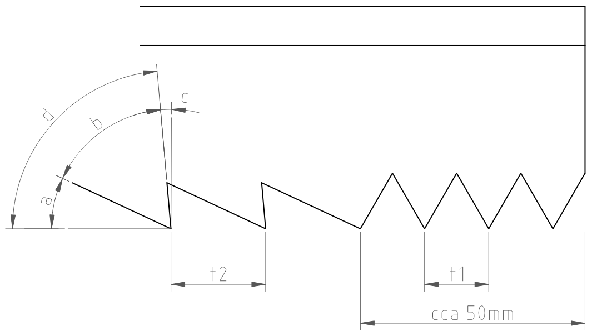

# ROČNO RAZŽAGOVANJE

**NAMEN UPORABE**

- razžagovanje manjših elementov
- izdelava čepov
- odžagovanje zatičev
- žaganje pod kotom
- žaganje težko dostopnih delov

**PREDNOSTI**

- varna uporaba
- nadzorovan proces odreza
- relativno tihe (ni potrebno nositi glušnikov)
- odrezki veliki in kontroliran izmet (ni portebno nositi očal in mask proti prahu)

**POIMENOVANJA VRST ROČNIH ŽAG**

- lisičji rep s hrbtom (angl.: Dovetail handsaw, nem.: Schwalbenschwanz-Säge)
- lisičji rep (angl.: Hand panel saw; nem.: Fuchsschwanzsäge)
- kopirna rezljača (angl.: fretsaw, coping saw; nem.: Laubsäge (list), Bewältigungssäge (kopiranje))
- izravnalna žaga (angl.: flush trim hand saw; nem.: Rasiersäge)

## Postopek obdelave

Ločimo predvsem dve različni odrezovalni smeri:

- prečno na vlakna in
- vzdolžno na vlakna.

**PRIPRAVA OBDELOVANCA**

- Glede na smer odrezovanja izberemo ročno žago z ustreznimi zobmi
- obdelovanec togo vpnemo v obdelovalno mizo:
  + ki naj ne bo previsoko vpet (vibracije)
- rez naj bo poravnan z navpično smerjo

**ROKOVANJE IN POSTAVITEV**

- Žago držimo v nam dominanrni roki (d.r.),
- z iztegnjenim kazalcem v smeri reza (opcijsko?!).
- Postavimo se v smeri reza z ne-dominantno nogo naprej,
- dominantno nogo pa postavimo nazaj s katero bomo zagotavljali potrebno silo odreza.
- Dominantna roka mora imeti dovolj prostora v smeri odrezovanja.
- Z ne-dominantno roko vodimo žagin list (a le prvih nekaj rezov).
- Že je možno lahko obdelovanec "uščipnemo" točno na črti zarezovanja in tako vodimo obe skrajni točki.
- Če se žagini zobje pri prvih nekaj rezih preveč ugreznejo v les:
    + moramo nekoliko spremeniti položaj žage tako, da vključimo več zob v odrezovanje.
- Navpičnost reza prilagajmo glede na navor, ki ga povzroča hrbtišče žage.
- Žago ne tiščimo navzdol, zadovoljiv odrez mora zagotoviti rezilo samo.
- Pravokotnost reza lahko preverjamo tudi z odsevom slike v žaginem listu.

**TEHNIKA ODREZOVANJA**

1. Z odrezovanjem sledimo le eni zarisani strani,
    - najprej na zgornji strani,
    - na to spuščamo žagin list in vodimo rezilo po črti, ki jo lahko opazujemo na naši strani,
    - na nasprotnem konecu pa naj žagin list ne napreduje z rezom.
2. Ko z rezom končamo na vidni strani lahko z rezom nadaljujemo na nasprotni strani in tedaj
    - spuščamo le prednji konec žaginega lista in odrezovanje opazujemo.
    - Zadnji konec žaginega lista pa nam vodi zareza.
3. Z zadnjim odrezovanjem odrežemo še sredinski del, kjer
    - žago poravnamo v vodoravni položaj,
    - prednji in zadnji konec žaginega lista nam vodita obe zarezi zato,
    - pazimo le na navpičnost in na končno zarezo.

## Sestavni deli (lisičji rep s hrbtom)

1. ročaj (širok, masiven, z udobnimi krivinami)
2. žagin list
3. žagini zobje (za prečni ali vzdolžni rez, razperjeni)
4. hrbtišče

## Nastavitve orodja (lisičji rep s hrbtom)

Za fino rezanje čepov ali rogljev bomo potrebovali lisičji rep s hrbtom z ustreznimi nastavitvami. Najprej si oglejmo terminologijo pri poimenovanju ozobčenja na [@fig:ozobcenje]:

{#fig:ozobcenje}

- a = prosti kot
- b = kot klina
- c = cepilni kot
- d = rezilni kot
- t1 = razmak med zobmi (delitev zob)
- t2 = razmak med zobmi (delitev agresivnejših zob)

Vsota vseh treh kotov je enaka 90°, kar pomeni, da vsaka sprememba enega kota, vpliva na ostala dva kota..

- Prosti kot $\alpha$
    - Prosti kot se giblje med -30° in +30°.
- Kot klina $\beta$
    - Kot zoba določa žilavost, čvrstost in trdnost
    - Določa ga oblika pile in je zato 60°.
- Cepilni kot $\gamma$
    - cepilni kot narekuje agresivnost odreza zato ga lagko povečamo, ko odrezujemo mehak les in ga moramo zmajšati, ko režemo trši les. Če je cepili kot velik, bodo odrezki veliki in zato morate imeti tudi več prostora med zobmi in večji prosti kot.
    - Manjši cepilni kot bo povzročil tudi manj iztrganih vlaken na spodnji/zadnji strani obdelovanca.
    - Pri večjih potrebah točnega odreza in ne iztrgovanja vlaken lahko celo uporabljamo negativni cepilni kot
    - Negativni cepilni (-30°) kot uporabljamo tudi pri prvih zobeh, s katerimi začnemo rez.

**ZOBJE ZA VZDOLŽNI RAZREZ**

- [oblika zob za vzdolžni razrez](https://youtu.be/UA5DixEaaUo?t=411)

**ZOBJE ZA PREČNI  RAZREZ**

- [oblika zob za prečni razrez](https://youtu.be/UA5DixEaaUo?t=566)


> ### NALOGA: Uporaba ročne žage  
> 1. V poročilo narišite vsaj dve različni obliki zob in jim določite značilne karakteristike:
> - delitev (t)
> - višina zob (d)
> - prosti kot (alpha)
> - kot klina (beta)
> - cepilni kot (gama)
> - razperitev
>
> 2. Žage z različnimi zobni preskusite na obdelovancih s po tremi rezi v različnih situacijah lahko naredite tudi matriko 2x2 in v vsak kvadratek opišite:
> - trd/mehak les
> - vzdolžni/prečni rez
> Pozorno spremljajte:
> - hitrost reza,
> - izgled robov zareze
> - vloženi napor (manjši kot klina, večji d, -> večji odrez -> težje)
> - vodenje žage (razperitev, trenje, kako lahko lovite začrtano črto)

### __izdelek__: prislonska peresna letev
https://www.google.com/search?q=featherboard&tbm=isch

#### Primeri:
Youtube:
- Paul Sellers (https://www.youtube.com/channel/UCc3EpWncNq5QL0QhwUNQb7w)
- Rob Cosman (https://www.youtube.com/channel/UCqp8oXLR84eiryfhNXK-nTA)
- Matthias Wandel (https://www.youtube.com/user/Matthiaswandel)

Brušenje žage (https://www.youtube.com/watch?v=UA5DixEaaUo)
```python
#__________________________________________________________
#                                                          |
#                                                          |
#_____  _  _  _  _  _  _  _  _  _  _  _  _  _  _  _  _  _  |
#     \( \( \( \( \( \( \( \( \( \( \/ \/ \/ \/ \/ \/ \/ \/
#        zobje za žaganje                zobje za začetek
#              ostali del žage --->|<----- 2 palca ------->|
```

#### prečno
+ ostrinski kot = kot klina = 60° (-> oblika pile -> izraba)
+ naklonski (delta) kot = 0°-10° (ker moramo "presekati" vlakna)

#### vzdolžno
+ stranski kot olajšuje prečni prerez
+ ostrinski kot = kot klina = 60° (-> oblika pile -> izraba)
+ naklonski kot (delta) = 15°-30° (prerez vlaken, v obe strani)


