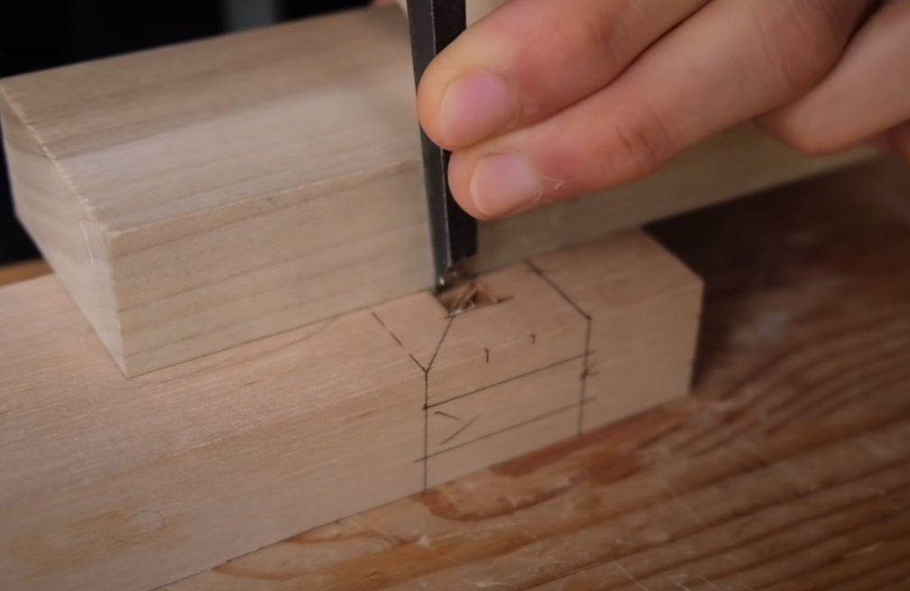

# DLETENJE

>  Slabo orodje je cesta k zamudi, mojstra ukrade in delavca utrudi.

## NAMEN
- odrezovanje:
  - manjših površin
  - težko dostopnih delov
  - ročno odrezovanje

## POSTOPEK OBDELAVE

- [Kako ravnati z dletom](https://www.youtube.com/watch?v=Efxgvo36FiY)
  - deli dleta in bršenje
  - osnovna postavitev pri odrezovanju (drža)
  - odrezovanje proti sredini obdelovanca
  
  - sekanje vlaken
  - kako zagotoviti pravokotnost
  - koliko lahko še odsekavamo
  - zakaj mora biti zadnje odsekavanje izredno tanko
  - prekrivanje rezila

### Čiščenje pazduhe

- le 2 mm
- roka zadaj
- roka za vodenje
- sila iz zadnje noge
- nihanje levo desno

- uporabimo lahko prst da ustavimo dleto
- v nasprotnem primeru vlakna iztrgajmo

### Dletenje navpične ploskve

- ni nujno držati za ročaj 
- raje držimo za rezilo
- prvih nekaj zasekov - kot ploskev-dleto naj bo 90°
- naslednji zaseki so lahko celo kako 1° večji
- lahko si pomagamo s pravokotnim blokom, ki ga postavimo na začrtan rob, kot to vidimo na [@fig:dletenje_pravokotno_blok]

{#fig:dletenje_pravokotno_blok}

- zareza z nožkom (vlakna)
- odstranimo kar se da z žago
- zadnji 1mm pa z dletom..
- razpolavljamo dolžino materiala, ki ga moramo odrezati
- režemo od strani,da držimo pravokotnost

- prvi udarec rahel (premaknemo linijo)
- nato malo več...
- šele nato veliko

### Dletenje zareze

- [Kako izdelati zarezo](https://www.youtube.com/watch?v=q_NXq7_TILA)

## NASTAVITVE ORODJA

- kot klina = 20° - 30°
- 25° in 30°

