# SPAJANJE LESNIH POLIZDELKOV

## LEPLJENJE

Lepilo je tekoča snov, ki se strdi med dvema ploskvama lepljenca.

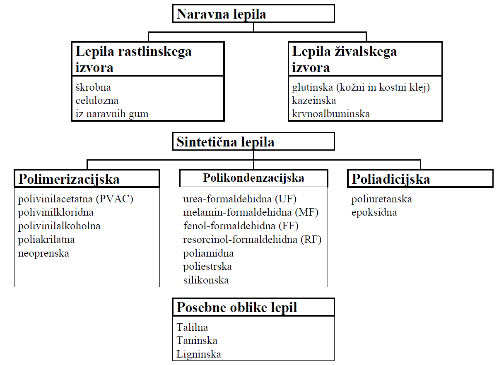{#fig:lepila_razvrstitev}

V lepilnem spoju nastanejo močne kohezijske sile (med enakimi molekulami), ki 
preprečujejo trganje spoja v lepilu. Med lesom in lepilom nastanejo adhezijske sile, ki 
vežejo med sabo različne vrste materialov (različne molekule), v našem primeru je to lepilo in les.

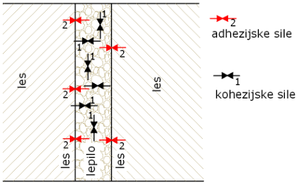{#fig:lepilo_adhezija_kohezija}

### POGOSTA LEPILA

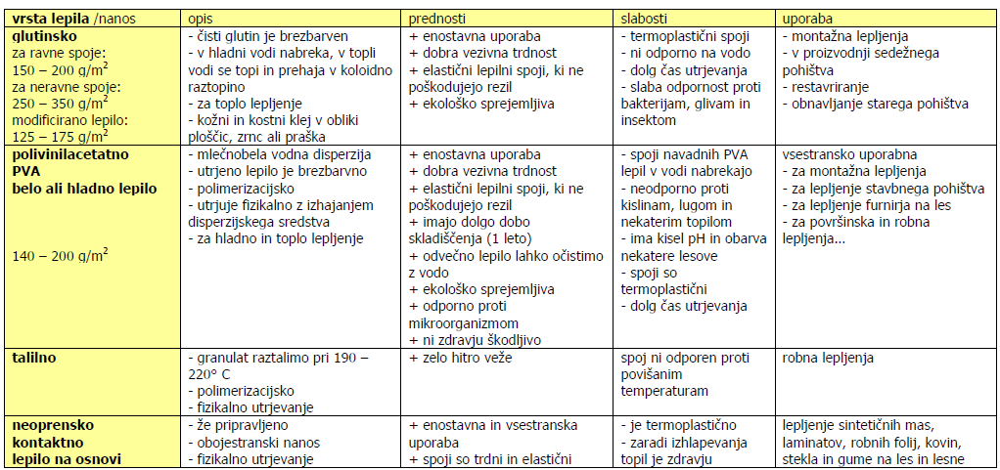{#fig:lepila-PVAC}

**PVAc - MEKOL D3**

- najpogosteje lepimo lesne spoje z eno-komponentnim polivinil-acetatnim (PVAc) lepilom. V Sloveniji ga proizvaja tovarna lepil MITOL in ga vodijo pod imenom MEKOL D3.

- [tehnični podatki lepila](https://www.mitol.si/wp-content/uploads/2018/12/MEKOL-D3_SLO.pdf)

- nanos 120-180 g/m² ali 0.12-0.18 mm 
- stiskanje:  min 0.5 N/mm²
- stiskanje:  30-60min
- ~~čiščenje: operemo z vodo, obrišemo z vlažno krpo~~
    - počakamo, da se posuši in odbrusimo
    - z brisanjem lahko lepilo nanesemo na lesno površino, ki se vpije v pore in oteži površinsko zaščito
    - najbolje je, da rob spoja zaščitimo s krep lepilnim trakom tako, da ko se ob stisku lepljencev lepilo izteče na lepilni trak (vedno pa te tehnike ni mogoče uporabiti, npr.: rogličenje).

**PVAc - MEKOL D4**

- podobno lepilo kot D3, le da je dvo-komponentno in bolj odporno na vlago in vodo. Primerno za notranjo uporabo , kot tudi za uporabo lesnnih spojev, ki so izpostavljeni vremenskim vplivom.

- [tehnični podatki](https://www.mitol.si/wp-content/uploads/2018/12/MEKOL-D4_SLO.pdf)

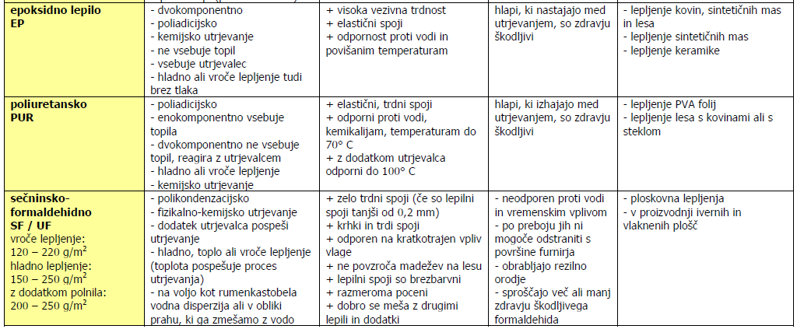{#fig:lepila-PUR}

**MITOPUR - E20**

- Mitopur E20 je enokomponentno, poliuretansko vodoodporno lepilo brez topil, ki veže na osnovi reakcije z
vodo. Spoj je temperaturno obstojen v območju od –40°C do +90°C in vodoodporen ter ustreza zahtevam
standarda EN 204-D4.

- [tehnični podatki](https://www.mitol.si/wp-content/uploads/2018/12/MITOPUR-E20_SLO.pdf)

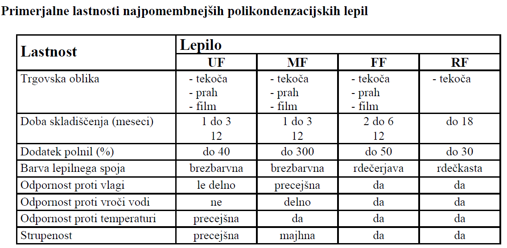{#fig:lepila_polikondenzacijska}

### ZGRADBA LEPILA:

- lepilo je disperzijsko sredstvo (makromulekularna snov razpršena v topilu)
- makromulekularna snov zagotavlja vezavo
- topilo -> prehajanju lepila v lesna vlakna

### UTRJEVANJE LEPILA:

- = prehod iz tekočega stanja -> želatinasto -> trdno stanje
- načini utrjevanja:
    - fizikalno: voda izhaja iz lepila v les -> zrak
    - kemijsko: kemijska reakcija med snovmi v lepilu otrdijo spoj
    - fizikalno-kemijsko utrjevanje: kombinirano utrjevanje
- pomembnejši  časi utrjevanja lepila:
    - Vmesni čas: od nanosa lepila do začetka stiskanja obdelovancev.
        - Odprti čas: od nanosa lepila do sestave lepljencev.
        - Zaprti čas: čas od sestave lepljencev do vzpostavitve tlaka v stiskalnici. 
    - Čas stiskanja: čas, v katerem se lepilo popolnoma strdi in veže lepljence.

### POMEMBNEJŠE LASTNOSTI LEPIL:

- Vodna odpornost: odpornost proti vodi (vlagi, zunanja uporaba)
- Trdota:
    - mehko, elastično: primerno tam, kjer bo les bolj deloval
    - trdo (v ivernih ploščah): boljša trdnost, večja obraba rezil
- pH: lahko obarvajo les v okolici spoja

- tehnologija lepljenja lesa kot sama zase se zelo redko uporablja
- lepljenje se kombinira z drugimi tehnologijami spajanja
- izjema je **širinsko spajanje lesa**
    - kjer imamo relativno veliko površino vzdolž vlaken
- ~~slab spoj lepljenja na čelni ploskvi vlaken~~
    - čelne ploskve so manjše
    - najšibkejši člen pri čelno lepljenem spoju je vedno lepilo (da, daj lesna vlakna omogočajo izredno velike natezne napetosti v dolžinski smeri; cepilne napetosti so manjše)

### NANOS LEPILA

- zagotoviti čim večjo površino spoja
- lepilo naj bo enakomerno razporejeno po **celi poevršini**
- debelina nanesenega lepila naj bo od 0.1 mm - 0.2 mm
- lepilo lahko nanašamo:
    - čopič
    - nanašalni glavnik
    - nanašalni valjček
    - tlačna posoda
    - strojno z nanašalnimi valji
- lepilo lahko nanesemo le ne eno ploskev, razen:
    - če ploskvi sestavimo z drsnim gibom (čep, rogljična vez)
    - lepilo nanesemo na obe ploskvi (posnetje lepila in nanos lepila)
- kadar je lesna zveza slepa (lameliranje, mozničenje, vez s čepom) predvidimo prostor za iztek lepila
- spoj močno stisnemo s sponami - zagotovimo, da lepilo pronica v lesno strukturo (v lumne trahej, tile)

## VIJAČENJE

### SESTAVNI DELI VIJAKA

1. Glava
2. Steblo
3. Navoj
4. Konica

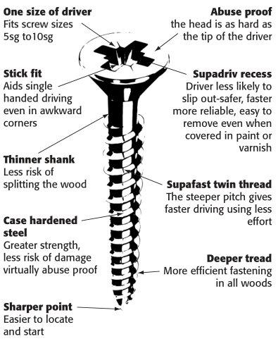{#fig:vijak_sestava}

### TELO VIJAKA
1. Z vijačnico do konca glave:
    Taki vijaki se za spajanje lesa skoraj ne uporabljajo, ker ne zagotavljajo drsenja zunanjega pritrjevanega elementa. Ko pritrdite dva kosa lesa med seboj in se vijačnica vreže v lesna vlakna obeh elementov in je njuna medsebojna lega določena z vijačnico. Če ta dva elementa ne nalegata in želimo še nekoliko priviti vijak, da bosta elementa nalegala, bomo uničili vijačnico v ožjem elementu ali elementu iz mehkejšega lesa.
    Če s takim vijakom spajamo dva lesna polizdelka, pa v zunanji polizdelek predhodno izvrtamo dovolj široko luknjo, ki omogoča nekaj zračnosti okoli navoja vijaka.
2. Z gladkim steblom:
    Omogoča drsenje zunanjega pritrjevanega elementa.

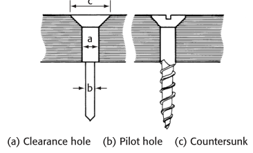{#fig:predvrtanje}

### PRED-VRTANJE

Pred-vrtanje je postopek pri vijačenju, pri katera na mesto kamor bomo privili vijak najprej izvrtamo manjšo luknjo. To preprečuje, da bi se vlakna preveč stlačila in zaradi teh napetosti povzročila cepljenje lesnih vlaken.
Premer pred-vrtanja naj bo v večini primerih enak premeru stebla vijaka. Če bomo vijak pritrdili v trši les (Hrast, Bukev) je lahko premer luknje nekoliko povečamo (do 0.5 mm), ali ga zmanjšamo, v kolikor vijačimo v mehkejši les.

### RAZPOREDITEV

Da zmanjšamo verjetnost cepljenja lesnih vlaken velja upoštevati naslednja priporočila razporeditve vijakov.

|       Min razdalja       | brez predvrtanja | s pred-vrtanjem |
|:------------------------:|:----------------:|:---------------:|
|    od čela polizdelka    |        20d       |       10d       |
|    od roba polizdelka    |        5d        |        5d       |
|   med linijama vijakov   |        10d       |        3d       |
| med vijaki vzdolž vlaken |        20d       |       10d       |
Table: Priporočljive minimalne razdalje pri vijačenju(d = premer vijaka z vijačnico). {#tbl:minRazdaljaVijacenja}

{#fig:necepljenje_vijaki}

### VIJAČNI NASTAVEK

#### PLOŠČATI
vijačni nastavek je namenjen vijakom, ki imajo eno vodoravno vdolbino (režo) v glavi vijaka. Ta oblika je bila prva vrsta razvitega vijačnega pogona, ki je bila več desetletij najpreprostejša in najcenejša za izdelavo. Vendar ta zasnova ni primerna za vijačenje z električnim orodjem, saj pogonski vijač pogosto zdrsne iz reže; to pogosto povzroči poškodbe vijaka in okoliškega materiala.

#### FEARSON
vijačni nastavek je križni z nekoliko bolj ostro konico izvijača. Prednost te oblike je, da en nastavek ustreza več različno velikim glavam vijaka. Od vijakov s Philips vijačnim nastavkom se razlikuje predvsem po tem, da imajo zareze ostre navpične robove in tako omogočajo večji navor vijačenja.

#### PHILIPS
vijačni nastavek je križne oblike. Zareze v glavi vijaka imajo nekoliko poševne robove in  tako nekoliko posebno obliko.  Oblika zareze je bila zasnovana kot neposredna rešitev na več težav z vijačenjem: ne omogoča večjih navorov vijačenja, saj zaradi poševnih robov zareze izvijač izvrže iz zareze, enostavna natančna poravnava izvijača z vijakom, ki preprečuje izmet izvijača na površino elementa ter enostavna uporaba z električnimi orodji. Označujemo ga z oznako **PH** in pripadajočo številko velikosti (#0 - #5).

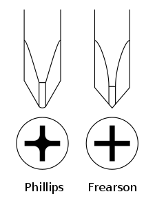{#fig:Frearson_vs_Phillips}

#### POZIDRIV
vijačni nastavek je križne oblike, zopet z ravnimi vzporednimi kraki. Med glavnimi kraki so še majhna rebra, ki oklepajo 45° z glavnimi kraki. Zasnovan je bil tako, da omogoča več navora, saj je tedaj električno orodje že omogočalo nastavitev maksimlnaega navora. Zareza v glavi vijaka in konica izvijača se točno prilegata in je tako je manj verjetno, da bo izvijač izskočil iz glave vijaka. Izvijači pozidriv so pogosto označeni z oznako **PZ**, ki jim sledi številka velikosti (#0 - #5). Na glavi vijaka pa so med zarezami ozke črtice, ki pomagajo razločevati pozidriv vijake od philips vijakov.

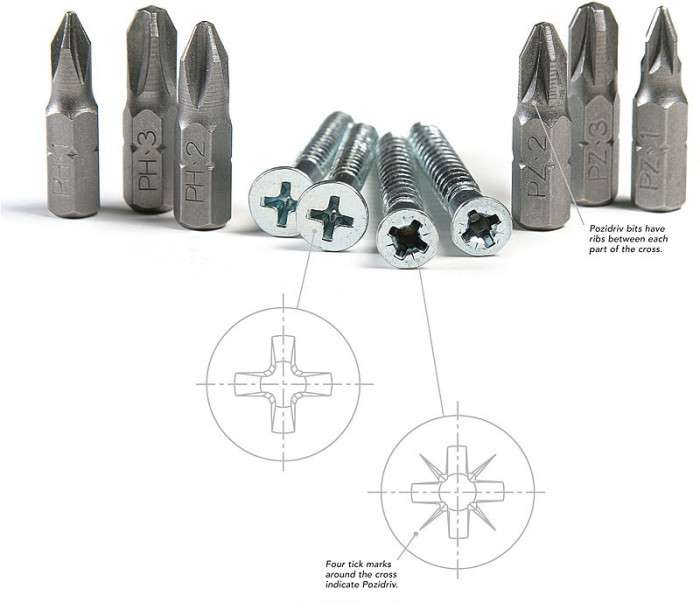{#fig:PHvsPZ}

#### ŠESTKOTNI
vijačni nastavek, zaradi poobčnoimenovanja znan inbus (ime podjetja: Innensechskantschraube Bauer und Schaurte), ima obliko pravilne šest-strane prizme. Nastavek izvijača in ugrezno zarezo vijačne glave je izredno enostavno izdelati in je tako cenovno ugodnejša. Zaradi vzporednih robov v zarezi omogoča vijačenje z večjimi navori. V primerjavi s  philips vijakom je v oprijem vijak - izvijač vključenih več stičnih površin, kar manj deformira zarezo vijačne glave. Zahteva pa nekoliko več pozornosti pri poravnavanju izvijača z glavo vijaka.

#### TORX
oblika vijačnega nastavka je 6-strana zvezda. Konica izvijača je rahlo konusne oblike, le toliko, da omogoča lažje poravavanje vijača z galvo vijaka. Čeprav je bil prvotno načrtovan, da bi otežil dostopnost vijakov slehernemu uporabniku, je s časom postal zelo priljubljen zaradi same uporabnosti in priročnosti. Torks blika omogoča zadovoljiv prenos navora, enostavno poravnavaje vijaka in vijača ter nudi relativno visoko odpornost proti deformaciji. Označujemo ga z oznako **T** in pripadajočo števiko velikosti.

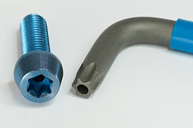{#fig:Torx_sample}

## KONSTRUKCIJSKE VEZI

Konstrukcijske vezi izredno izboljšajo trdnost spoja, saj imajo lesna vlakna veliko natezno in tlačno trdnost.

Konstrukcijske vezi lahko razdelimo glede na smer spajanja:
- širinsko spajanje
- dolžinsko spajanje
- kotno spajanje
- obodno spajanje

### ŠIRINSKO SPAJANJE LESA S SPAHANIM ROBOM

- namen: iz manjših polizdelkov dobimo širše
- tangencialni raztezek lesa je $\beta_t = 6-12\%$
    - pravilna razporeditev polizdelkov

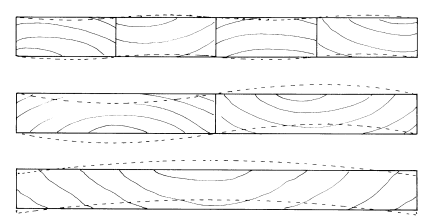{#fig:sirinsko}

- Pri pripravi lesa za širinsko spajanje na poravnalnem skobeljnem stroju uporabljajte tehniko skladnih kotov vzporednih stranic, ki jo prikazuje [@fig:skladni_koti_vzporednih]. To lahko zagotovimo tako:
    - da polizdeleku najprej poravnamo širšo stranico na poravnalnem skobeljnem stroju,
    - nato nasprotno stranico poravnamo vzporedno s prvo na debelinskem skobeljnem stroju,
    - šele nato poravnamo v pravi kot eno od ožjih stranic,
    - polizdelek obrnemo okoli vzdolžne osi in
    - v pravi kot poravnamo obe nasprotni stranici.

- Ko polizdelke širinsko spajamo, moramo paziti, da se izmenjujejo priležne in nasprotne ploskve poravnanih kotov.

- To isto tehniko lahko uporabljamo pri dolžinskem razrezu na mizarski krožni žagi.

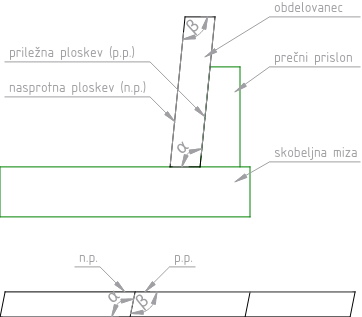{#fig:skladni_koti_vzporednih}

#### TOPA VEZ

- sosednje robove spahamo (poskobljamo) v paru
    - tehnika izničuje napako v naklonu roba

#### VEZ S PERESOM IN BRAZDO

- dimenzije peresa in brazde d/2 x d/2
- lepilo po vseh površinah

#### VEZ S PERESOM IN UTOR

- dimenzije peresa d/2 x d/3
- utor je 1mm globji za iztek lepila

#### LASTOVIČJA VEZ

- last. čep d/3 x d/3 (10°-12°) 
- utor d/3 x d/3 (1 mm globji)

#### KLINASTA VEZ

- utor in čep d/3 x d/3

#### ZOBATA VEZ

- glede na orodje
- pogosto oblika zob sovpada z zagozdo 1:20

{#fig:sirinsko_spajanje}

### DOLŽINSKO SPAJANJE LESA

- ~~problem: slab spoj lepljenja v smeri prečno na vlakna~~ 
- nujna tehnološka obdelava, s katero povečamo površino oprijema
- morda celo prehod na fizično vez
- pogosta mehanska obdelava z zobatimi vezmi (rezkalna glava z zobatimi noži)

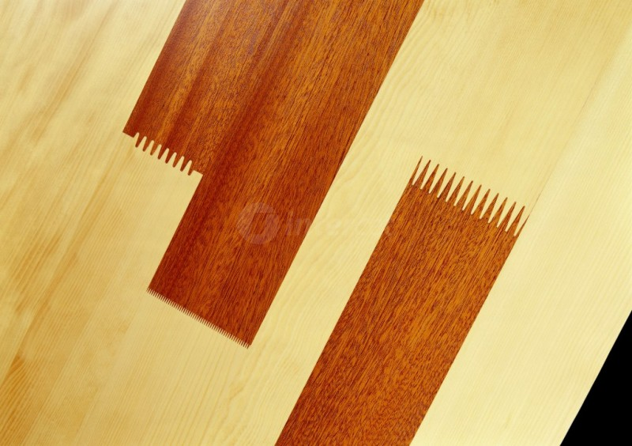{#fig:dolzinsko-spajanje-lesa}

### KOTNE VEZI

#### RAVNA PREPLOŠČITEV

- vogalna
- vmesna
- križna

#### ČEP IN ZAREZA

- vogalna
    - enojna
    - dvojna
    - čep s peresom (povečana trdnosti v smeri kota) 
        - dim. čepa 1š x 2/3š
        - dim. peresa 1/3d x 1/3d x 1/3š
    - jeralna (45° rama)

- vmesna
    - ravna
    - razširjena z zagozdama
        - zagozda 1:20 (to razmerje je max, da se ne cepi)
    - slepa z zagozdama

{#fig:kotno_spajanje}

#### JERALNE ČEPNE VEZI

- lice in odlice sta spojena skotom 45° (nariši - kolokvij)

#### MOZNIČENJE

- mozniki so navadno premerov fi = [6, 8 10] mm
- dolžina je l = (5±)x fi
- moznik velikosti za spoj naj bo dim. fi= 1/2d
- luknja naj bo globja za 1mm

#### VEZI Z LAMELAMI

- jeralna z lamelo

### OBODNE VEZI

#### BRAZDA IN PERO

- kotna
    - brazdna vez in topi rob
        - dim peresa 1d x 1/4d (estetski namen)
- namen: pri omari se tako ne vidi čelo police

#### PERO in UTOR

- kotna
    - dim. peresa 1/3d x 1/3d
    - pokončna peresna vez
    - ležeča peresna vez (pero spodaj preprečuje cepljenje)
- vmesna
    - dim. peresa max 1/2d x 1/3d
    - dno omare
    - ni namenjena za police
        - velike strižne napetosti na peresu

#### RAVNA ROGLJIČNA VEZ

- kotna
    - tehnika ročnega rezanja rogljev obeh spojnih polizdelkov hkrati
        - sprednjega zamaknemo za debelino reza v levo in
        - odrežemo vse dezne robove čepov
        - zamaknemo v desno in
        - odrežemo levi rob čepa
- vmesna

#### LASTOVIČJI ROGLI

- kotna

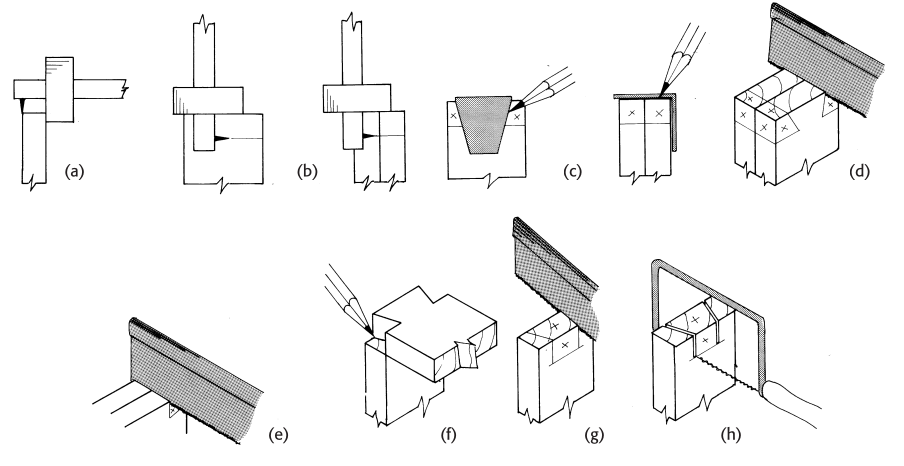{#fig:dovetails_making}

- vmesna:
    - le z enim lastovičnim peresom
    - drsni spoj

