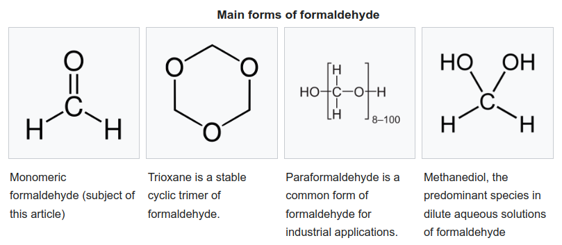
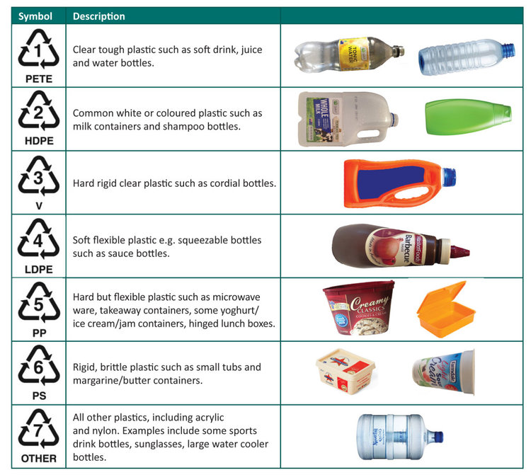
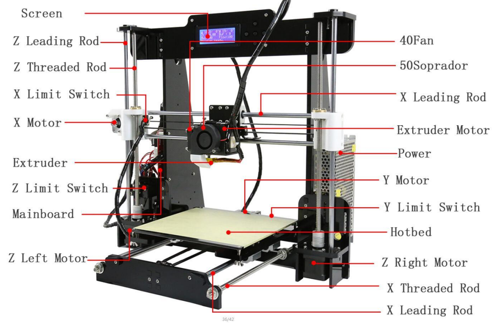
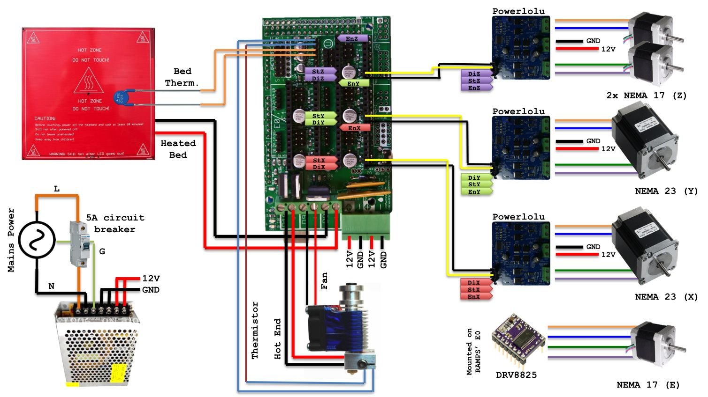
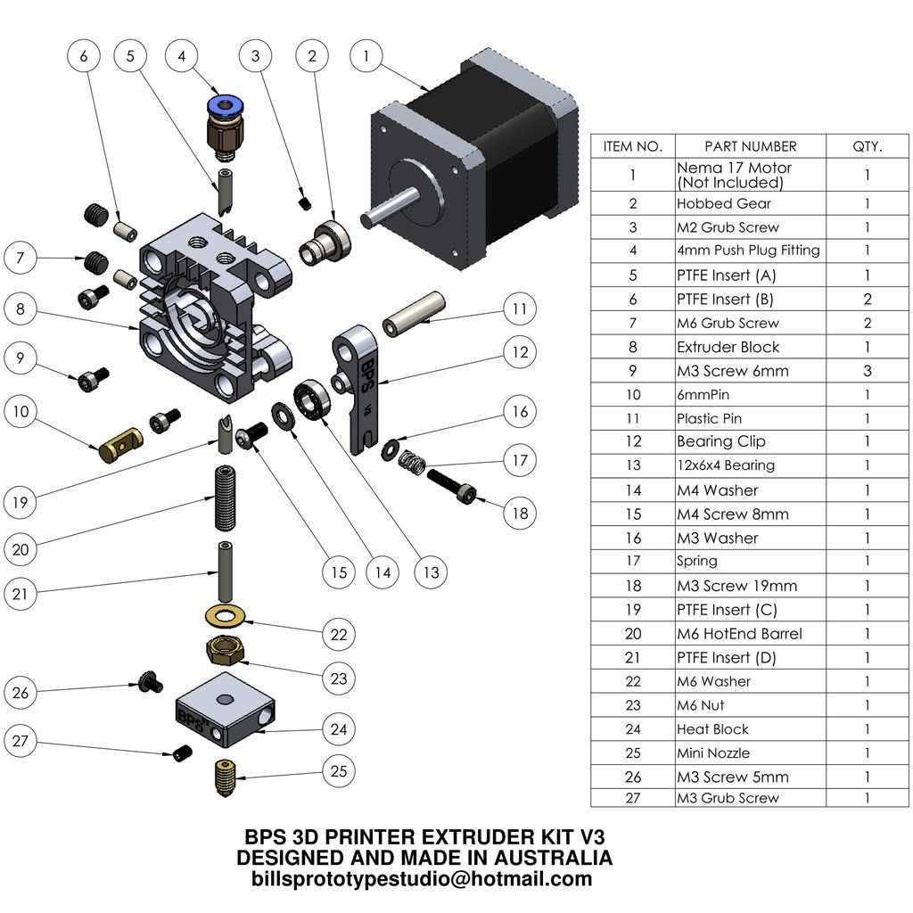
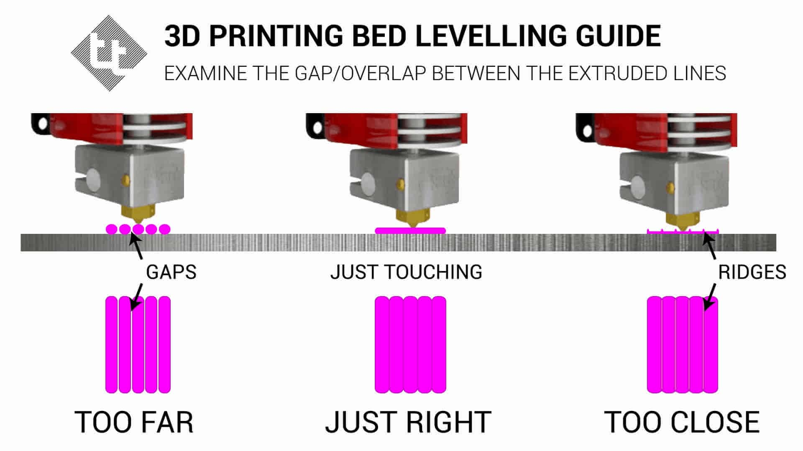
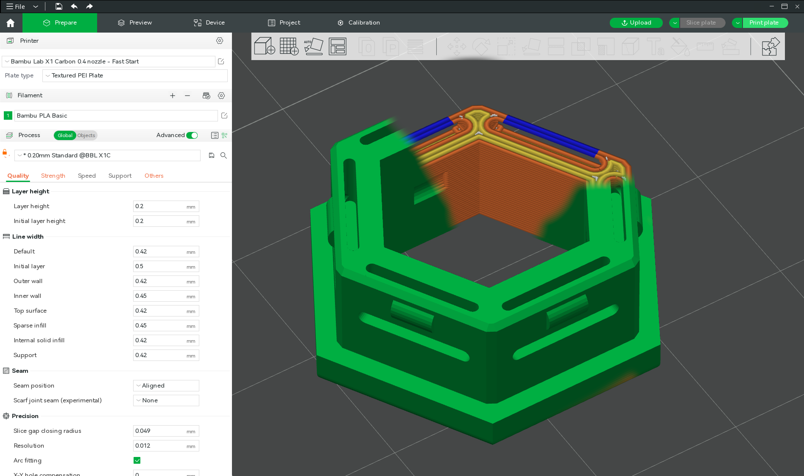

# Umetne snovi

## Polimerizacija

Polimerizacija je kemijski proces, v katerem se monomer ali mešanica monomerov pretvori v polimer.


Najbolj linearno polimerizirajo alkeni (nenasičeni ogljikovodiki, imajo dvojno vez med C=C), ki so relativno stabilni zaradi $\sigma$ vezi med ogljikovimi atomi. V to kategorijo spadata tudi najbolj pogosto uporabljeni polimeri plastičnih materialov:

1. [polietilen](https://en.wikipedia.org/wiki/Polyethylene),
2. [polipropilen](https://en.wikipedia.org/wiki/Polypropylene) in
3. [polivinilklorid](https://en.wikipedia.org/wiki/Polyvinyl_chloride) (PVC).

Delu molekule, zaradi katerega se monomeri spajajo skupaj imenujemo **funkcionalne skupine** (npr.: -OH, -COOH, $-NH_2$, -NCO ...).

Nekateri monomeri (prisotnost kisika `O`), kot so formaldehid hidrati ali enostavneje formaldehid, lahko polimerizirajo že pri zelo nizkih temperaturah (cca: -80 °C) in tvorijo trimere, polimere, sestavljene iz treh monomernih enot.[4] Ti polimeri lahko tvorijo obroče in s še enim monomerom tetramere.

{#fig:Formaldehidni_polimeri}

Kadar se v polimerih nahajajo funkcionalne skupine, ki imajo zaradi svoje kemijske strukture polarne lastnosti, taktrat so polimeri bolj higroskopični. To se zgodi zaradi polarnih vezi v teh skupinah, ki ustvarjajo električna privlačna polja, na katera voda (polarna molekula) močno reagira.

Ključne funkcionalne skupine, ki prispevajo k higroskopičnosti:

- Amino skupine (-CONH-): Poliamidi, kot sta Nylon PA6 in PA12, imajo amidne vezi, ki vsebujejo polarna kisikova in dušikova atoma. Ta atoma lahko tvorita vodikove vezi z molekulami vode, kar vodi v visoko higroskopičnost.
- Etrične vezi (-O-): V polimerih, kot je TPU, najdemo etrne vezi, ki so manj polarne kot amidne, vendar še vedno dovolj polarne, da lahko privlačijo vodo.
- Hidroksilne skupine (-OH): Čeprav te skupine niso prisotne v vseh polimerih, se lahko pojavijo v nekaterih formulacijah polimerov in prav tako povečajo privlačnost vode zaradi svoje polarne narave.

## Izvor polimerov

- glej razdelitev na prosojnicah predavanj (dr. S Avsec)

### Naravno polimeri

- kavčuk (latex), celuloza, škrob, DNK, beljakovinski polimeri

### Sintetični polimeri

- Pridobivanje: iz surovin, ki vsebujejo veliko ogljiko - vodikov:
    - nafta, premog, plin (biomasa)

#### Polimerizati:

- monomeri se spajajo v polimere (dvojna vez razpade v enojo z drugimi monomeri)
- primer : **polietilen** : eten ($CH_2=CH_2$) -> polietilen (PE $n-CH_2-CH_2-CH_2-n$)
- pri tem procesu ne nastajajo stranski produkti

#### Polikondenzati

- pri združevanju monomerov se izloči druga molekula (npr.: voda, vodikov klorid...)
- primer : 
    - **polietilenftalat** : dimetil-tetraftalat + etilen-glikol -> (pre-estrenje in polikondenzacija) -> poli-etilen-tetraftalat + 2 etilen-glikol

## Polimeri

- monomeri -> polimere (primer: vinil-klorid $H_2-CHCl$ -—> $n(-CH_2-CHCl-)$ = PVC)
- visoka molska masa : 1.000 .. 6.000.000 g/mol (npr.: 1mol $^{12}C$ = 12g)
- polimerizacijska stopnja = koliko monomerov je skupaj v polimer
- oblika polimerov
    - linearni,
    - razvejani,
    - zamreženi
- oblika -> lastnosti polimerov
  - npr.: oblika polimerov vpliva na viskoznost,
    kar je zelo pomembno pri mazivnih sredstvih (motorno olje)
    - celo različna oblika pri različni temperaturi (sintetična motorna olja)

## Lastnosti umetnih snovi

- mehanske lastnosti:
    - trdnost, trdota, žilavost
- tehnološke lastnosti 
    - dobra obdelovalnost,
- kemijske lastnosti
    - odpornost proti atmosferskim vplivom ter večini   kislin,
- fizikalne lastnosti 
    - dobra prosojnost, slaba električna prevodnost, dobra toplotna izolacija.

Odvisne od:

- vrste molekul, atomov,
- dolžine polimernih verig (polimerizacijska stopnja)
- oblike polimernih verig (linearne, razvejene, prepletene (amorfni, kristalni))

### Amorfni polimeri

Amorfni polimeri so polimerni materiali, ki nimajo kristalne urejenosti (npr.: polivinil klorid (PVC), poli-karbonat (PC), poli-stiren (PS)). Njihove molekule so naključno razporejene, kar jim daje amorfno strukturo. To pomeni, da nimajo jasno opredeljenih talilnih lastnosti. 

Bistvene lastnosti in značilnosti amorfnih polimerov vključujejo:

1. Prozornost: Amorfni polimeri so običajno prozorni ali prosojni materiali, kar jih naredi primernega za uporabo v različnih optičnih aplikacijah (CD je iz PC).
2. Mehanska fleksibilnost: Zaradi naključne razporeditve molekul imajo amorfni polimeri večjo fleksibilnost in elastičnost kot kristalinični polimeri.
3. Nizka talilna temperatura: Večina amorfih polimerov ima nižjo talilno temperaturo kot kristalinični polimeri, kar olajša obdelavo in predelavo.
4. **Visoka trdnost**: Amorfni polimeri imajo lahko visoko trdnost, vendar se ta lahko zmanjša zaradi povečane gibljivosti molekul.
5. Plastičnost: Zaradi svoje amorfne strukture imajo amorfni polimeri sposobnost plastičnosti, kar pomeni, da se lahko preoblikujejo in oblikujejo pod vplivom toplote.
6. Odpornost na udarce: Zaradi svoje fleksibilnosti so amorfni polimeri običajno odporni na udarce in lahko absorbirajo energijo ob trčenju.
7. Nizka toplotna prevodnost: Amorfni polimeri imajo običajno nizko toplotno prevodnost, kar jim omogoča dobro izolacijsko lastnost.

Vendar pa je treba opozoriti, da so lastnosti in značilnosti amorfne polimerne snovi odvisne od specifičnega materiala, saj se lahko razlikujejo glede na sestavo in strukturo polimera.

Predstavniki:

- polivinilklorid (PVC),
- polikarmonat (PC),
- polistiren (PS).

### Kristalični polimeri

Kristalični polimeri so polimerni materiali, ki imajo urejeno kristalno strukturo na molekularni ravni. Njihove bistvene lastnosti in značilnosti vključujejo visoko stopnjo urejenosti molekul, kar jim daje togo in močno strukturo. Imajo tudi visoko tališče in temperaturno odpornost, kar pomeni, da ohranjajo svojo obliko in lastnosti pri visokih temperaturah.

Lastnosti kristaličnih polimerov so običajno:
- večja trdota, 
- odporni proti obrabi ter mehansko in kemično stabilni,
- boljša temperaturna odpornost.

Kristalični polimeri se pogosto uporabljajo v industriji za izdelavo plastike, vlaken, filmov in drugih materialov, ki zahtevajo visoko trdnost, trdoto in obstojnost.

Predstavniki so:

- poliamid (PA),
- polietilen (PE),
- polipropilen (PP)

## Prednosti umetnih snovi

- **Lahko jih predelujemo**:
Plastične snovi so primerne za masovno proizvodnjo in lahko iz njih
uspešno izdelujemo tudi predmete zelo kompliciranih oblik v velikih
serijah in po nizki ceni.
- **Majhna gostota**:
Na splošno je gostota plastičnih snovi manjša kot gostota kovin in so zato predmeti, narejeni iz plastičnih snovi, lahki.
- **Korozijska odpornost**:
Večina plastičnih snovi je odporna proti koroziji, zato jih uporabljamo v primerih agresivnih medijev.
- **Elektro-izolacijske lastnosti**:
Mnogi plastični materiali so odlični električni izolatorji.
- **Toplotna izolacija**:
Plastične snovi so v bistvu slabi prevodniki toplote in v penasti obliki so eni najboljših termičnih izolatorjev.
- **Dekorativni efekti**:
Plastične snovi so lahko prozorne, prosojne in neprozorne. Barvamo jih v neomejenem številu barv in nians. Pravilno izbrane in oblikovane lahko dajo izredno dobre dekorativne efekte.
- **Nizka zvočna prevodnost**:
Plastične snovi dušijo vibracije bolje kot katerikoli drugi material in jih zaradi tega uspešno uporabljamo kot zvočne izolatorje.
- **Kemijska odpornost**: Dobra kemijska stabilnost (oksidacija, vremenski vplivi (voda, zunanja temp.)
- **Biološka odpornost**: insekti, gljive

## Pomanjkljivosti umetnih snovi

- **Slaba dimenzionalna stabilnost**:
Plastične snovi se pogosto krivijo, krčijo in izgubljajo trdnost pri dolgotrajni, pa čeprav majhni obremenitvi, razen tega so relativno mehke in se lahko mehansko poškodujejo.
- **Trajnost**:
Veliko plastičnih snovi je UV občutljivih in zato je trajnost teh izdelkov izredno omejena -> $W_{UV\ foton} = 3\ .. 124\ eV$, ionizacijska $W_C = 12 eV$.
- **Nizka trdnost**:
Praviloma je trdnost plastičnih snovi manjša kot trdnost kovin, tudi takrat, če upoštevamo njihovo nizko gostoto.
- **Toplotna nestabilnost**:
Ne moremo jih greti do visokih temperatur (npr. do rdečega žara).
- **Gorljivost**:
Večina plastičnih snovi je gorljiva, nekatere so celo nevarne zaradi gorljivosti.
- **Naelektritev**:
Zaradi različnih, kemijskih vezi z nizko ionizacijsko energijo in hkrati električnimi izolacijskimi lastnostmi, se polimeri enostavno naelektrijo.
- **Vonj**:
Mnoge plastične snovi imajo izrazit in često neprijeten vonj.
- **Težko jih popravljamo**:
Zlomljene ali pokvarjene dele navadno zelo težko popravimo in je zato večkrat bolje cel del zamenjati z novim, kot pa poskušati popraviti pokvarjeni del z lepljenjem ali varjenjem.
- **Cena**:
Številne plastične snovi, posebno nove za posebne tehnične namene, so drage in je zato v mnogih primerih ekonomično le, če jih izdelujemo v velikih serijah.
- **Okoljska obremenitev**:
Večina umetnih polimernih snovi je nerazgradljivih v naravnem okolju in s tem onesnažuje okolje.

## Izboljšanje lastnosti polimerov

### Funkcijski dodatki

- **Antioksidanti**:
povečujejo življenjsko dobo polimerov s tem, da preprečijo oksidacijsko razgradnjo (poliolefini, ABS,..).
- **Antistatiki**:
naredijo površino plastičnega predmeta prevodno (npr.: saje, grafit, metali, .. - notranji).
- **Dodatki za samogasnost**:
npr.: soli Sb, Zn, Mo, Al,…
- **Barvila**:
so netopni anorganski in organski pigmenti, npr.: za belo barvo Ti dioksid, za rdečo Fe oksid, za zeleno Cr oksid, ..
- **Maziva**:
za izboljšanje drsnosti in zmanjšanje obrabe, npr.: Mo sulfid, grafit, ..
- **Stabilizatorji**:
delujejo tako, da absorbirajo UV žarke. Predvsem PVC jih rabi.

### Polnila in ojačitvene snovi

- **Polnila**:
so organska in anorganska. Od organskih npr. celulozna moka poveča udarno žilavost in material poceni. Od anorganskih npr. sljuda močno poveča E – modul, udarno žilavost in el. upornost.
- **Ojačitvene snovi**:
so razna vlakna:
  - Naravna organska – lesna vlakna;
  - Sintetična organska – poliestrska, poliamidna,…  vlakna;
  - Naravna anorganska – azbestna so najstarejša;
  - Sintetična anorganska – steklena, ogljikova, metalna, .. vlakna;

## Predstavniki polimerov:

### Polimerizati:

{#fig:Plastic-recycling-codes}

- **Poli-etilen (PE)**:
je najpogostejša plastika. Njegova osnovna uporaba je v embalaži (plastične vrečke, plastične folije, posode, vključno s plastenkami, itd.). Veliko različnih vrst polietena je znanih, večina jih ima molekulsko formulo (C2H4)n. PE je običajno zmes podobnih polimerov iz etena z različnimi vrednosti n. V to spadajo PETE, HDPE (se ne razgrajuje), LDPE (ob prisotnosti čistil lahko topna).
- **Poli-vinil-klorid (PVC)**:
zelo pogosto uporabljena plastika, ni primerna za prehrambeno industrijo. Najdemo jo vsepovsod: igrače, vodna inštalacija, elektro inšt., ohišje elektronike, okvirji oken, vrat ... med polimeri zelo obstojna, trda plastika.
- **Poli-propilen (PP)**:
pogosta uporaba tudi v prehrambeni ind. (slamice, kozarčki..., zamaški plastenk, košarice v prehrambeni ind., kosila za s sabo) nekoliko mehkejša plastika od PVC a bolj obstojna od PE, cenovno ugodnejša glede na trdnost.
- **Poli-stiren (PS)**:
zelo pogosto uporabljen, tudi v prehrambeni ind. kjer ne pričakujemo povišanih temperatur (pribor za enkratno uporabo, slamice, kozarčki,... ), lahko je tudi prozoren (ovitek za CD-je in DVD-je ipd.) ali pa v penjeni strukturi kot **ekspandiran polistiren** (EPS - poznamo ga kot stiropor) ali pa **ekstrudiran polistiren** (XPS), ki jih uporabljamo v izolacijski tehniki.
Postopka izdelave za EPS in XPS sta različna. Pri EPS zmes (polistirena in pentana) segrejejo, granule ekspandirajo in ohladijo, da se dimenzijsko stabilizirajo.
Pri XPS pa zmes (PS in co2, penila) pripravijo pod višjim tlakom in temperaturo, nato pa jo nabrizgajo v stiskalnico (komoro).
- **Poli-metil-metakrilat (PMMA)**:
akrilno steklo
- **Poli-tetra-flour-eten (PTFE)**:
Visokotemperaturna plastika PTFE – TEFLON  je zelo dobro kemijsko in UV obstojna, ima nizek koeficient trenja in visoko temperaturno območje uporabe, je samougasna, vendar v stiku s plamenom sprošča strupen plin Fluor. Delovna temperatura materiala je od -200°C do +260°C. Uporabno predvsem za: Ohišja črpalk, ohišja filtrov, sedeži ventilov, rešetke, obloge rezervoarjev, visoko frekvenčni izolatorji, cevovodi, gonilniki črpalk, prevleke valjev, tesnila, drsni ležaji, drsne letve...
- **Etilen-vinil-acetat (EVA)**:
je polimer, ki sestoji iz dveh vrst monomolekul etilena in vinili-acetata. Spada med polimere z nizko gostoto (kot naprimer LDPE), ki ga odlikuje zelo nizka trdota (je mehak) in izredna prožnost. Uporablja se za razne mehke podlage, obutev (japonke, kroksice).
- **Poli-butadien**:
predvsem v gumarski industriji (pnevmatike, )

---

- **Poli-etilen-terfeflatat (PET)**:
polietilentereftalat je konstrukcijska plastična masa, ki se uporablja predvsem tam, kjer se zahteva visoka dimenzijska obstojnost. Material ima dobre drsne in obrabne lastnosti, kakor tudi odlične termične lastnosti. Delovna temperatura materiala je od -20°C do +100°C. Odlikujejo ga lastnosti kot: visoka trdnost, trdota, togost, visoka žilavost, nizka vpojnost vlage, dobre drsne lastnosti, visoka dimenzijska stabilnost, obstojnost proti obrabi, dobro drobljivi odrezki, dobre električno izolacijske lastnosti, dobro se lepi in vari, dobro se polira. Uporaba: zobniki, deli ohišja, nosilci, distančne letve, oporni obroči...
- **Poli-etilen-tereflatat-glikol (PET-G)**:
je termoplastični polimer, znan po visoki trdnosti, fleksibilnosti in odpornosti na udarce, zaradi česar je priljubljen za 3D-tiskanje in embalažo. V primerjavi s PLA ima PET-G boljšo toplotno odpornost in je manj krhek, zaradi česar je primernejši za izdelke, ki zahtevajo večjo vzdržljivost. Poleg tega se PET-G enostavno obdeluje, omogoča gladko površino, in se dobro oprime na različne podlage, kar je prednost pri tiskanju kompleksnih struktur. Slabost PET-G je njegova večja higroskopičnost – absorbira vlago iz zraka, kar lahko poslabša kakovost tiskanja, če material pred uporabo ni ustrezno shranjen ali posušen. Kemijska struktura [PET-G](https://www.molinstincts.com/structure/PETG-cstr-CT1103556678.html).
- **Akrilni-butadien-stiren (ABS)**:
je amorfen polimer, ki ga pridobimo z emulzijsko polimerizacijo, ali polimerizacijo v masi, akrilonitrila in stirena s prisotnostjo polibutadiena. Najpomembnejši lastnosti ABS-a sta odpornost na udarce in žilavost, ima pa tudi zelo nizko higroskopičnost zarasi svoje [kemijske strukture](https://en.wikipedia.org/wiki/Acrylonitrile_butadiene_styrene). Uporaben je na veliko področjih: igrače (LEGO kocke),3D tisk, potrošno blago, telefoni, varnostne čelade, notranje obloge vrat, stebri, sedežne obloge, rešetke, armaturne plošče, ohišja ogledal ...
- **Akrilonitril stiren akrilat (ASA)**:
je vremensko odporen termoplast, zasnovan kot UV-odporna alternativa ABS-u, ki ga nadomešča v 3D-tiskanju, zlasti pri zunanjih prototipih in avtomobilskih komponentah. ASA dobro ohranja barvo, sijaj in mehanske lastnosti na prostem ter ima izboljšano kemično in toplotno odpornost. Čeprav je le blago higroskopičeni -  [kemijska struktura](https://en.wikipedia.org/wiki/Acrylonitrile_styrene_acrylate), ga je pred uporabo včasih potrebno sušiti, saj prisotnost vlage lahko vpliva na kakovost izdelave.
- **Termoplastični poliuretan (TPU)**: je elastičen in odporen termoplastični elastomer, ki združuje prožnost, odpornost na obrabo ter odpornost na olja in maščobe. Zaradi teh lastnosti je TPU priljubljen za 3D-tiskanje fleksibilnih izdelkov ter se uporablja v avtomobilizmu, športni opremi, medicinskih napravah in zaščitnih ohišjih. TPU se ponaša z visoko elastičnostjo, dobro odpornostjo na nizke temperature in visoko odpornostjo na mehanske poškodbe, kar omogoča izdelavo trajnih, a fleksibilnih struktur. Material je zmeren higroskopik ([kemijska struktura](https://www.molinstincts.com/structure/urethane-cstr-CT1001349103) ), zato je priporočljivo, da ga pred uporabo v 3D-tiskanju ustrezno posušimo, saj vlaga lahko vpliva na kakovost tiska.


#### Polikondenzati

- **Polimerična kislina (PLA)**:
je biorazgradljiv polimer, pridobljen iz obnovljivih virov, kot je koruzni škrob. Zaradi svojih okolju prijaznih lastnosti se uporablja v različnih panogah, predvsem v 3D-tiskanju, embalaži in medicinskih pripomočkih. Ima nizko temperaturo taljenja (190°C) kar omogoča tiskanje na velikem razponu tiskalnikov. Med tiskanjem se ne zvija. Ima majhne temperaturne skrčke, ki zagotavljajo izdelkom visoko dimenzijsko točnost in je manj higroskopičen zaradi svoje [kemijkske sturkture](https://www.molinstincts.com/structure/lactic-acid-cstr-CT1078640572). V svoji polimerni obliki izgubi veliko $-OH$ vezi, poleg tega pa so vezi $-O-$ zasenčene z $=O$ in $-CH_3$ [strukturo](https://en.wikipedia.org/wiki/Polylactic_acid#Synthesis).
- **Poli-amid (PA)**:
ali Nylon je v aditivni proizvodnji priljubljen termoplast zaradi svoje fleksibilnosti, trpežnosti in odpornosti na udarce in obrabo. Najpogosteje se uporablja v obliki prahu ali filamenta, predvsem v tehnologijah, kot so SLS, Multi Jet Fusion in FDM. Najbolj znane vrste najlona v 3D-tiskanju so PA12, PA11 in PA6. PA12 in PA11 sta v prahu ter ponujata visoke mehanske in toplotne lastnosti, kjer PA11 izkazuje boljšo UV odpornost, PA12 pa manjšo vpojnost vlage. Nylon PA6 je pogost filament, znan po fleksibilnosti in vzdržljivosti, vendar je higroskopičen, zato ga je treba ustrezno shranjevati, da vlaga ne vpliva na kakovost tiska. Uporabljen je v izdelkih kot so: zobniki, drsni ležaji, drsne tirnice, puše, verižna vodila...
- **Poli-ester (PES)**:
tekstilna vlakna
- **Feno-plasti**:
lepila, barve, laki, zaščitnih premazi, stikala, ohišja, razdelilniki, elektro-izolatorji
- **Amino-plasti**:
vodoodporna veziva, premazi


|         Material | Tališče (°C) | Temp. mize (°C) | Trdnost (MPa) | Trdota (RHR) | Mehanska odpornost (1-10) | Higros-kopičnost (1-10) | Namen uporabe                                            |
|-----------------:|:------------:|:---------------:|:-------------:|:------------:|:-------------------------:|:-----------------------:|:---------------------------------------------------------|
|          **PLA** |    180–220   |      60–70      |       48      |    110–120   |             4             |            3            | Prototipiranje, okrasni deli, notranji deli              |
|        **PET-G** |    230–250   |      70–80      |       50      |    106–110   |             8             |            5            | Industrijski deli, embalaža, funkcionalni prototipi      |
|          **ABS** |    210–240   |      90–110     |       40      |    95–105    |             8             |            5            | Funkcionalni prototipi, avtomobilski deli                |
|          **ASA** |    220–240   |      90–110     |       45      |    95–100    |             9             |            3            | Zunanji deli, avtomobilski deli, funkcionalni prototipi  |
|          **TPU** |    200–230   |       0–60      |       25      |     85–90    |             10            |            8            | Fleksibilni deli, zaščitne prevleke, blažilni elementi   |
|  **Nylon (PA6)** |    250–260   |      70–90      |       55      |    120–130   |             9             |            10           | Tehnični deli, zobniki, gibljivi deli, funkcionalni deli |
| **Nylon (PA12)** |   240 - 270  |      70–90      |       50      |    115–120   |             9             |            7            | Tehnični deli, prototipi, deli za zunanjo uporabo        |
Table: Seznam nekaterih lastosti termoplastov, ki se uporabljajo v 3D tisku[^1]. Opombe: **PLA** ima visoko Rockwell trdoto, vendar omejeno mehansko odpornost. **PET-G** ima uravnoteženo trdoto in mehansko odpornost, kar je koristno za funkcionalne prototipe. **ABS** je nekoliko mehkejši od PLA, vendar z dobro odpornostjo na udarce. **ASA** je podobno trden kot ABS, z izboljšano UV odpornostjo za zunanje aplikacije. **TPU** je mehak in zelo fleksibilen, primeren za elastične aplikacije. **Nylon (PA6 in PA12)** imata višjo Rockwell trdoto, vendar PA6 zahteva dodatno sušenje pred uporabo zaradi visoke higroskopičnosti. {#tbl:3d_print_preferences}

[^1]: Povzeto po: https://www.simplify3d.com/resources/materials-guide/properties-table/

# Tehnologija umetnih snovi

Oglej si naslednje video vsebine:

- [Izdelava plastenke - PET](https://www.youtube.com/watch?v=pJW6IKRLSyk)
- [Postopki predelave umetnih snovi](https://vimeo.com/209791560)
- [Brizganje](https://www.youtube.com/watch?v=b1U9W4iNDiQ)
- [3D tisk](https://www.youtube.com/watch?v=Yi9HeGAUuYc)
- [Valjanje, kalandriranje](https://www.youtube.com/watch?v=0E5L_SsPxDE)
- [Pihanje](https://www.youtube.com/watch?v=AD_Y4yZc54U)
- [Stiskanje](https://www.youtube.com/watch?v=vL3wayZK-is)
- [Ekstrudiranje](https://www.youtube.com/watch?v=ZU1bbXonMkY)

## 3D Tisk

## 3D Tiskalnik

{#fig:3d_print_basic_parts}

{#fig:3d_print_elScheme}

{#fig:3d_print_nozzle}

### Krmiljenje CNC strojev
- [Marlin G-code](https://marlinfw.org/meta/gcode/)
- [Pronterface](https://www.pronterface.com/)
  - `G0`  - hitri premik
  - `G1`  - delovni premik
  - `G28` - premik na izhodišče
  - `G90` - absolutno pozicioniranje
  - `G91` - relativno pozicioniranje
  - `M112`- zasilno ustavljanje
  - `M503`- pregled nastavitev

```
  ;####################################
  ; Basic Movement settings
  ;####################################
  M92 X79.19 Y79.19   ; XY steps/mm
  M92 Z793.65         ; Z  steps/mm
  M92 E746.00         ; Extruder st/mm
  M204 P300           ; proba kocka_20_20 Acceleration Printing 300 m/s²
  ;####################################
  ; Pre-heating
  ;####################################
  G90                 ; absolute mode
  G28                 ; home
  G92 E0              ; reset E koordinate
  M140 S65            ; prea heat bed
  M104 S180 T0        ; preaheat E1 and E2
  M104 S190 T1
  M109 S190 T1        ; wait E2
  M190 S65            ; wait bed
  G1 F900 X50 E3.215  ; 50 mm crte v X
  G1 Z50              ; odmik mize
```

### Nastavitve 3D tiskalnika

Podrobna navodila na spletni strani:

- [Teaching Tech 3D Printer Calibration](https://teachingtechyt.github.io/calibration.html)

#### Pregled mehanskih komponent

  - mehanske komponente tudi mehansko odpovedo

#### Nastavitev temperature šobe

  - cca 200°C

#### Pomik filamenta

  - ali je `G1 E100 F50` res pomik filamenta za 100 mm pri hitrosti pomika 50 mm/min

#### Odmik šobe od delovne mize

  - vzporedna z ravnino tiskanja
  - `0.1 mm` od šobe
  - natisnemo `X` (ali kvadratke na 4 kotih delovne mize)

{#fig:3d_print_nozzle_distance}

  - preverite tudi, če je delovna miza uklonjena

#### Osnovni print

  - natisnite nek osnovni kos, ki vam bo služil za ocenjevanje kvalitete tiska

#### Debelina plasti

  - uskladite količino iztisnjenega filamenta s predpripravo plasti

#### Navor koračnih motorjev

  - nastavitev toka, ki poganja koračne motorje moramo:
    - zmanjšati, če opazimo, da so koračni motorji vroči
    - povečati, če opazimo, da koračni motor izpušča korake

#### Temperatura tiskanja

  - temperatura tiskanja je izrednega pomena, vpliva na:
    - viskoznost in s tem na dodajanje materiala
    - spajanje materiala s spodnjo plastjo

#### Odvzem filamenta

  - pri premikanji šobe iz ene lokacije na drugo moramo učinkovito prekiniti dovod filamenta v šobo,
  - to storimo s povratnim hodom filamenta (odvzem filamenta) kjer lahko spremenimo:
      - količino (dolžino) filamenta (najbolj pomembna nastavitev pri odvzemu filamenta)
      - hitrost povratnega pomika filamenta
      - dodatno količino filamenta pri ponovni vzpostavitvi tiskanja
      - hitrost dodajanja filamenta pred tiskanjem
      - dvig šobe pri premikanju iz ene lokacije na drugo

#### Hitrosti in pospeški pri premikanju šobe

  - prevelike hitrosti in  pospeševanja lahko povzroči vibracije šobe zaradi katerih so vidne podvojene oblike robov na sami ploskvi tiskanca
  - pomembni dejavniki pri nastavitvi maksimalnih hitrosti in pospeškov so:
      - kako hitro lahko podajamo in uspemo taliti filament
        - nastavitve hitrosti podajanja: `G1 E50 F180` in ekperimentiramo `F200` ...
        - nastavitve hitrosti pomika: `G1 X50 Y50 E85 F150`
      - kako togo konstrukcijo 3D printerja imamo
        - nastavitve pospeševanja: `M204 P800`
        - odklon poti:`M205 J0.05` ali trzaj (sprememba pospeška) `M205 X8 Y8`

#### Naprednejše linearno brizganje

  - ko vključimo koračni motor za podajanje filamenta, se zaradi viskoznosti staljene plastike
    iztekanje prične nekoliko kasneje in
  - ko ustavimo koračni motor, plastika še vedno lahko izteka

  - temu pojavu se lahko izognemo z bolj točnim časovnim krmiljenjem podajalnega motorja
  - [Nastavitve K-vrednosti](https://marlinfw.org/tools/lin_advance/k-factor.html)
    - preverimo nastavitve `M900`
    - nastavimo k vrednost: `M900 K0.11`
    - shranimo v EEPROM: `M500`

#### Nastavitve X, Y, Z pomika

  - te nastavitve so mehansko definirane s prenosi in prestavnimi razmerji (načeloma točno nastavljene)
  - netočne dimenzije natisnjenca so pogosto posledica netočne nastavitve podajanja filamenta in ne X, Y in Z pomikov
  - uporabimo lahko [kalkulator za koračne motorje](https://blog.prusaprinters.org/calculator_3416/#stepspermmbelt)
  - preverimo dosedanje nastavitve `M503`
  - 10 mm pomike `G0 X10` lahko izmerimo z mikrometrom
  - izračunamo in nastavimo novo število pomikov `M92 X81.23`

## Modeliranje


{#fig:3D_print_slicering}

## Priprava plasti

- splošno v uporabi šoba $\Phi_{šobe} = 0.4 mm$
- debelina plasti max 80% fi_š (potreben pritisk na spodnjo ploskev)
- širina linije 100% - 120% fi_š

- debelina zunanje plasti (naj bo večkratnik debeline/višine linije tiskanja):
  - debelina dna
  - debelina zgornje plasti
  - debelina stene

- nastavitve polnila:
  - kolikšno naj bo 20% - 100%
  - kakšne oblike: šestkotne...

- začetni in končni proces
  - nastavitve procesov so v nastavitvah stroja
  - predhodno iztiskanje filamenta
  - predhodno gretje šobe in mize

- nastavitve temperature tiskanja (Material)
  - nastavitve hlajenja
    - PLA: 100%
    - ABS: mostiščenje, previsne ploskve
    - PET-G nakateri 100% , drugi le pri previsu

- nastavitve hitrosti in pospeškov (Speed)
  - počasnejši prvi sloj - boljši oprijem
  - nižji pospeški - manj tresljajev

- odvzem filamenta (Travel)
  - pri prestavljanju šobe iz ene lokacije na drugo

- podporne strukture (Support)
  - pri previsnih strukturah 55° (90° - pomeni vodoravno)

- dodatni oprijem na ploščo (Plate Adhesion)
  - brim 10 mm

- spirale mode (Special Modes)

## Tiskanje


# Penjeni materiali

- so EKSPANDIRANI materiali, z nižjo gostoto kot je osnovni material
- peniti se dajo skoraj vsi polimeri, v praksi pa to največkrat izvajamo s (z):
    - PVC (poli-vinil-klorid),
    - PS (poli-stiren),
    - PE (poli-etilen),
    - PP (poli-propilen),
    - EVA (etilen-vinil-acetat),
    - PMMA (poli-metil-metakrilat),
    - PC (poli-karbonate),
    - PF (poli-formaldehid),
    - UF (urea-formaldehid),
    - MF (melamin-folmadehidne)

- EKSPANDIRANJE vs EKSTRUDRANJE:
    - postopek EKSPANDIRANJA:
      - granule PS ekspandiramo na pari
      - tako dobimo ekspandirane krigljice PS z nizko gostoto (20 kg/m³),
      - takega lahko s termično obdelavo oblikujemo v različnih modulih
      - med krogljicami EPS-a je nekaj prostora za vodo (3-4%)!!
    - postopek EKSTRUDRANJA:
      - plastični material PS pod tlakom in T=200C stalimo,
      - dodamo utekočinjen plin ($CO_2$) tako, da dobimo zmes PS in plina,
      - zmes ekstrudiramo (nanesemo) na mizo pri normalnem zračnem tlaku,
      - masa nabrekne in dobimo homogeno formo zaprtih celic s plinom
      - ni prostora za vodo (do 0.3%)
- [EPS vs XPS](https://www.youtube.com/watch?v=aiH4zXEE60g)
- [vpojnost vode EPS-a in XPS-a](https://www.youtube.com/watch?v=vN2Qjt51gFQ)

- postopki predelave so:
  - stiroporni postopek - EPS (PE, PS, PF,..)
  - termoplastično brizganje - TSG (PP, UF, ..)
  - reakcijsko brizganje - RSG (PS, PC, PVC, PMMA, PUR, …)
- ločimo trde in mehke pene;

# Elastomeri

- izredno obsežno elastično (ne plastično) območje
  - plastična vs elastična deformacija (glej $\sigma(\epsilon)$)
  - relacija med makromolekualmi (elektro-kemijski privlak)

- prvi  elastomer je bil kavčuk (poli-izopren)
  - lepljiva, žilava plastična masa z zelo dolgimi, popustljivimi in upogljivimi molekulnimi verigami

```
Izoprene:
         H
   H  H HCH H
   |  |  |  |
   C==C--C==C
   |        |
   H        H

Poli-izopren:

   H  H     H    H  H     H    H  H     H  
   |  |     |    |  |     |    |  |     |  
 --C--C==C--C----C--C==C--C----C--C==C--C--
   |     |  |    |     |  |    |     |  |  
   H    HCH H    H    HCH H    H    HCH H  
         H             H             |     
                                     S
         H             H             |     
   H  H HCH H    H  H HCH H    H  H HCH H  
   |  |  |  |    |  |  |  |    |  |  |  |  
 --C--C==C--C----C--C==C--C----C--C==C--C--
   |        |    |        |    |        |  
   H        H    H        H    H        H  
```
- nitaste makromolekule kavčuka elastično povežemo
- postopek povezovanja makromolekul se imenuje vulkanizacija
- vulkanizacijo je odkril Charles Goodyear (patent 1843)
- pomembno vlogo veznega člena imajo atomi žvepla
- za boljšo odpornost gume pa primešamo tudi saje (črna guma)
- dodamo pospeševalce za učinkovito vulkanizacijo (preprečimo vezi -S-S-S-S-)
- elastična vez omogoča veliko raztegljivost snovi
- tako iz plastičnega kavčuka dobimo elastično gumo
- členkaste vezi molekule niso razdružljive, taljivost ni mogoča
- trdoto gume določa število veznih elementov med posameznimi makromolekulami:
  - mehki materiali imajo malo veznih točk (cca 2% žvepla - gumica za lase),
  - trdi materiali veliko veznih točk (25% žvepla - avtomobilska pnevmatika).

- [Vulkanizacija](https://www.youtube.com/watch?v=r6kNX7CS1V4)
