# POMEN GOZDA V SLOVENIJI

- Gospodarska vloga
- Proizvajanje kisika
- Varovalna vloga (preprečuje erozijo)
- Socialna vloga (rekreacija, vikendi)

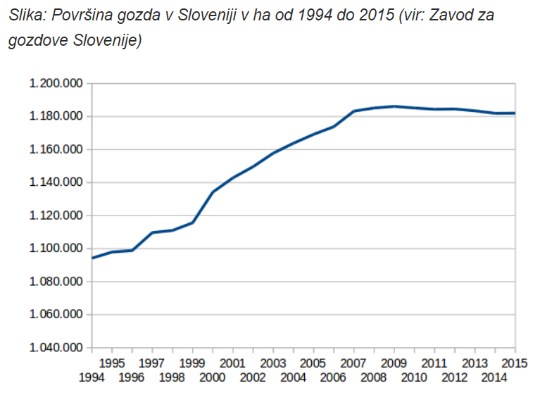{#fig:gozd_povrsina}

- cca 60% površine Slovenije
  - bukev 32%
  - smreka 31%
  - jelka 7,5%
  - hrast 7%

## Skladiščenje CO2

- v 1 m3 lesa -> cca (ekvivalent) 1T CO2
- 1T CO2 -> za prirast 1 m3 lesa -> 0,7T O2

# Pridobivanje lesa

## Sečnja

- smer podiranja
- čiščenje
- zasek

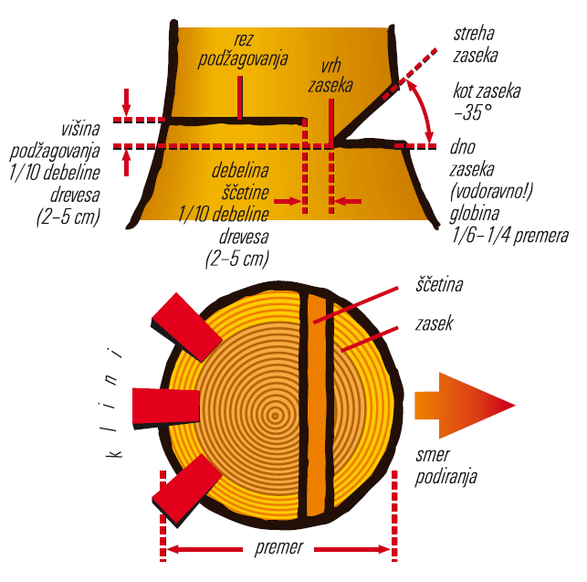{#fig:secnja_varni_zasek}

- ureditev sečišča
  - veje, vhrove razžagami in zložimo
  - nizki panji
  - ne odlašamo s spravilom lesa

## Nevarnosti

1. Dno in vrh zaseka se sekata - ni ščetine!
2. Dno in vrh zaseka se ne stikata v ravni liniji
    - ni ustrezne ščetine
    - smer padanja ni določena
3. Preglobok zasek
    - ne moremo popravljati smeri
    - ni prostora za kline
    - oslabljena ščetina zaradi % olesenelih vlaken
4. Navidezna ščetina pri nizkem zaseku
    - pri močno razraščenem koreninovci (poševna vlakna)
    - možnost prereza ščetine
5. Premajhen kot zaseka
    - ščetina se prehitro pretrga
    - ni kontrole nad padanjem drevesa
6. Pregloboko podžagovanje
7. Prenizko podžagovanje
    - potrebno močnejše klinjenje
    - mogoč zdrs v smer sekača

# Les kot surovina

Neobdelan les:

-Tehnični les
-Les za kemično predelavo
-Les za kurjavo

OBDELAN les:

- Žagan les
- Tesan les
- Rezan 
- Luščen

{#fig:predelava_lesa}

Tehnični les: 

- Hlodovina za furnir, vžigalice, železniške pragove, za žaganje v plohe in deske;
- Okrogli gradbeni les: drogovi za odre, za napeljavo, ladijskim les, jamski les, jambori, piloti…
- Drobni tehnični les: palice, ročaji, oporniki za vinograde, sadovnjake, hmeljišče…

Les za kemično predelavo:

- Za celulozo in lesovino
- Taninski les
- Za suho destilacijo
- Les za kurjavo: cepanice, peleti, briketi…

# Zgradba lesa

## Prirast lesne mase

- prevajanje vode
- fotosinteza
$$ 6CO_2 + 6H_2O = C_6H_{12}O_6 + 6O_2 $${#eq:fotosinteza}
- prevajanje sladkorjev

{#fig:prirast_lesna_mase}

- spomladi:
  - prirast lesne mase
  - prevajanje vode
  - prevajanje zaloge sladkorjev
- poleti:
  - prirast plodov
  - prirast lesne mase
- jesen:
  - shranjevanje sladkorjev
  - prirast lesne mase
- zima:
  - mirovanje

## Funkcionalna sestava lesa

{#fig:fun_ses_les}

1. Lubje
2. Ličje
3. Kambij
4. Beljava
5. Olesenel les

Premisli:

- spodbujanje spečih brstov

## Kemijska sestava lesa

- celuloza 40% - 50 % (naravni polimer glukoza...)
- hemiceluloza 25% - 40% (polisaharidi)
- lignin 20% - 30% 
    - je amorfna, mrežasta nevodotopna polimerna makromolekula iz fenilpropanskih podenot, ki so med seboj povezane z etrskimi vezmi in vezmi ogljik-ogljik (C-O-C in C-C)
    - pomemben pri termični obdelavi lesa (krivljenje s paro)
- druge snovi manj kot 10% (smole, maščobe, voski, barvila)

## Makroskopska sestava lesa

... glej vir [LES ZGRADBA](/home/david/Files/Work/UL-PeF/Vaje/TP-2_Les/Literatura/120_Les_3-LES_ZGRADBA.pdf) 

Prerezi:

- prečni
- vzdolžni
- tangencialni

### Prečni prerez

- letnica
- skorja
- ličje
- kambij
- beljava
- oleseneli les
- branika
  - rani les
  - kasni les
  - pore
- lesni trak
- stržen

{#fig:precni_prerez}

- Pore pri listavcih (traheje)
  - venčasto porozni
  - raztreseno porozni

### Radialni prerez

- letnica
- skorja
- ličje
- kambij
- beljava
- oleseneli les
- branika
  - rani les
  - kasni les
  - pore
- stržen
- lesni trak
  - izredno široki - bleščice

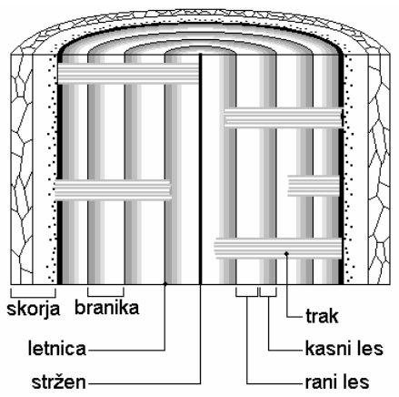{#fig:radialni_prerez}

# Mikroskopska sestava lesa

## Iglavci

- Traheide
  - prevanjanje vode
  - mehanska funkcija
  - enakomeren prehod velikih lumnov (spomladi) -> mali lumni (jeseni)

- Parenhimske celice
  - prevanjanje organskih snovi
      - glukoza
      - aminokisline ...
      - 50cm/h
  - tvorba radialnih trakov
      - homogeni (sestavljeni samo iz par. cel.) = JELKA
      - heterogeni (par. cel. in traheide) = SMREKA BOR

{#fig:mikro_zgradba}

Les iglavcev je pod mikroskopom viden kot tkivo z zelo urejenimi nizi celic. Te celice so aksialne traheide, ki opravljajo v lesu iglavcev tako prevajalno kot oporno funkcijo. Traheide ranega lesa imajo tanjše celične stene in večje lumne. Priraščajo na začetku rastne dobe, to je spomladi. Traheide kasnega lesa pa imajo zelo debele celične stene in majhne lumne. Priraščajo poleti, ko drevo proizvaja največ hrane. Aksialne traheide so v drevesu usmerjene vzporedno z osjo drevesa. Trakovne traheide pa najdemo v lesnih trakovih.

{#fig:mikro_branika_iglavci}

### Predstavniki

- smreka

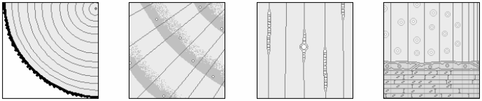{#fig:mikro_znaki_smreka}<++>

Iglavec z neobarvano jedrovino. Letnice na prečnem prerezu razločne. Postopen 
prehod ranega v kasni les. Smolni kanali na prečnem prerezu vidni. Trakovno tkivo je 
heterocelularno, pretežno enoredno, lahko tudi večredno z vključenimi radialnimi 
smolnimi kanali. Številne majhne kupresoidne in piceoidne piknje v križnih poljih med 

- bor

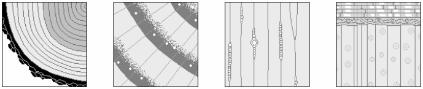{#fig:mikro_znaki_bor}

Iglavec z obarvano jedrovino. Letnice na prečnem prerezu razločne, ostra meja med 
ranim in kasnim lesom, smolni kanali vidni kot bele pike v kasnem lesu. Trakovno 
tkivo je heterocelularno, pretežno enoredno, lahko tudi večredno z vključenimi 
radialnimi smolnimi kanali. Oknaste piknje na križnem polju med aksialnimi 

- jelka

{#fig:mikro_znaki_jelka}

Iglavec z neobarvano jedrovino. Letnice na prečnem prerezu razločne. Postopen 
prehod ranega v kasni les. Trakovno tkivo je homocelularno, pretežno enoredno. 
Številne majhne taksodioidne piknje na križnem polju med osnimi traheidami in 
trakovnim parenhimom. Številne obokane piknje. Les ne vsebuje smolnih kanalov.

## Listavci

- Traheide
  - samo mehanska funkcija
- Traheje
  - ali pore (ker so lumni bistveno večji in vidni s prostim očesom)
  - prevanjanje vode
- Parenhimske celic
  - vač parnhimskih celic v osni smeri kot pri iglavcih
  - trakovi so:
    - večji, širši (tudi po 100 vzporednih par. cel.)
    - in več jih je kot pri iglavcih
    - nad 10-redni trakovi so pogosto višji od 1 mm (pri hrastu in bukvi)

{#fig:mikro_listavci}

### Venčasto porozni listavci

- pore vidne, veliki lumni
- nahajajo se v ranem selu
  - v ranem lesu velike
  - v karnem z majhnimi lumni
- venčaSto porozne vrse so (skoraj vse tiste s S-jem):
    + HRAST
    + KOSTANJ
    + BREST
    + JESEN

### Pol-venčasto porozne vsrste

- pore vidne, srednje vlike
- razporejene po celi braniki
- v ranem lesu jih je več ali pa so večje
- lesne vrste so:
    + OREH
    + ČEŠNJA

### Raztreseno porozne vrste

- pore (lumni) so majhni
- por s prostim očesom ne vidimo
- razporejene so po celi braniki
- predstavnike razdelimo v 4 skupine:
  1. SADNI:
      - jablana
      - hruška
      - sliva
  2. MEHAK LES:
      - lipa
      - topol
  3. IZRAZITI TRAKOVI
      - bukev
      - javor
      - gaber
  4. PARNEHIMSKE PEGE
      - breza
      - jelša

### Predstavniki

- bukev

{#fig:mikro_bukev}

Raztreseno porozen listavec. Običajno je les na prečnem prerezu enakomerne barve, 
pogosto pojav "rdečega srca". Letnice so razločne, trakovi široki. Pore na prečnem 
prerezu številne z majhnim premerom. Trakovi dveh velikosti: 2-4 redni ter nad 10-
redni in visoki do 5mm, razporejeni na tangencialnem prerezu v značilnem vzorcu 
(vretenca), na prečnem prerezu se ob letnici kolenčasto razširijo. Perforacije med trahejnimi elementi enostavne in lestvičaste.

- hrast

{#fig:mikro_hrast}

Venčasto porozen listavec z obarvano jedrovino. Letnice razločne. Pore ranega lesa 
vidne s prostim očesom. Pore kasnega lesa majhne, nanizane v radialnih nizih. 
Pogoste tile v trahejah ranega lesa v jedrovini. Trakovi so enoredni in nad 10-redni. 
Nad 10-redni trakovi široki tudi več kot 1mm in visoki tudi več cm. Med trahejnimi 
elementi enostavne perforacije. V parenhimskih celicah trakov in v kamrastih celicah
lahko rombični kristali.

## Piknje

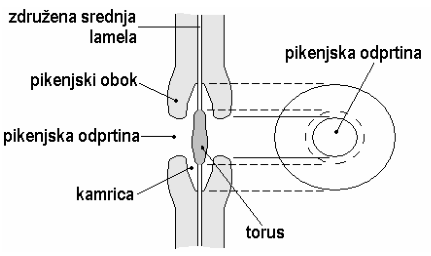{#fig:poknja}

Prevajanje snovi med celicami v lesu bi bilo zaradi debelih celičnih 
sten zelo oteženo ali nemogoče. V celičnih stenah lahko opazimo 
vrzeli in membrane, ki celice zapirajo navzven. Te vrzeli 
imenujemo piknje in jih sestavljajo pikenjska votlina in pikenjska 
membrana.

### Tile

Tile so mehurjasti ali vrečasti vrastki parenhimskih celic v lumen traheje.
Njihova funkcija je da zaprejo lumne odmrlih celic trahej.

# Fizikalne lastnosti lesa

## Gostota

- neposreden vpliv na fizikalne lastnosti lesa
  - boljša trdota
  - boljša upogibna trdnost

$$ \rho_u = \frac{m_u}{V_u} $${#eq:gostota}

pri čemer je:  

- $\rho_u$ = gostota lesa pri določeni vlažnosti [kg/m3] 
- $m_u$ = masa lesa pri določeni vlažnosti [kg] 
- $V_u$ = prostornina lesa pri določeni vlažnosti [m3]

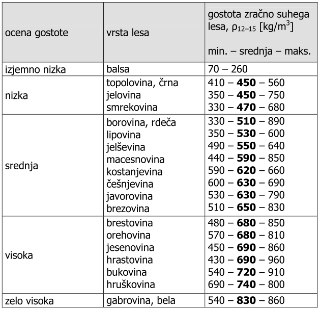{#fig:gostota_lesa}

Premisli:

- iglavci vs raztreseno porozni listavci vs  venčasto porozni listavci

### Širina branike

- delež kasnega lesa !

- Iglavci:
  - širina kasnega lesa  = enaka (ni odvisna od vremenskih razmer spomladi in poleti)
  - široka branika - nižja gostota

- Venčasto porozni
  - širina ranega lesa = enaka,
  - široka branika - večja gostota

- Raztreseno porozni
  - neodvisno od širine branike

## Higroskopnost

Vlažnost lesa izračunamo:

$$ U = \frac{m_v}{m_0} $${#eq:vlaznost lesa}

kjer je:  

- u = vlažnost lesa v [%]
- $m_v$ = masa vode
- $m_0$ = masa abs. suhega lesa

Podatek u = 15 % pomeni, da 100 g absolutno suhega lesa 
vsebuje 15 g vode. 

### Prosta in vezana voda

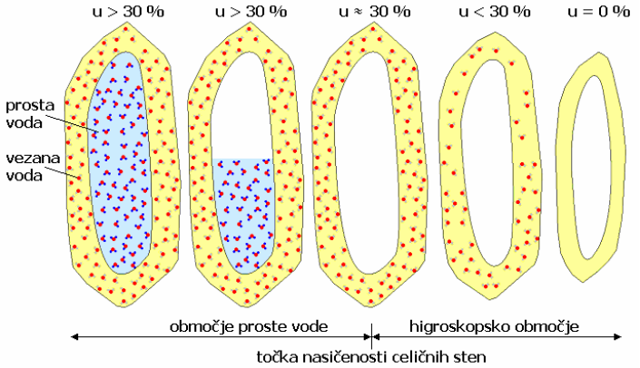{#fig:prosta_vezana_voda}

- vezana voda je v celičnih stenah
- prosta voda je v celičnih lumnih
- ko v lumnih ni vode:
    - TNCS: točka nasičenosti celičnih sten
    - VPLIV na krčenje lesa!

### Krlčenje lesa

- le kadar se spremeni % vode v celičnih stenah
- krčenj je odvisna od smeri krčenja:
  - vzdolž vlahen 0.3 - 0.6%
  - v radialni smeri 3 -6 %
  - v tangencialni 6 - 12 %

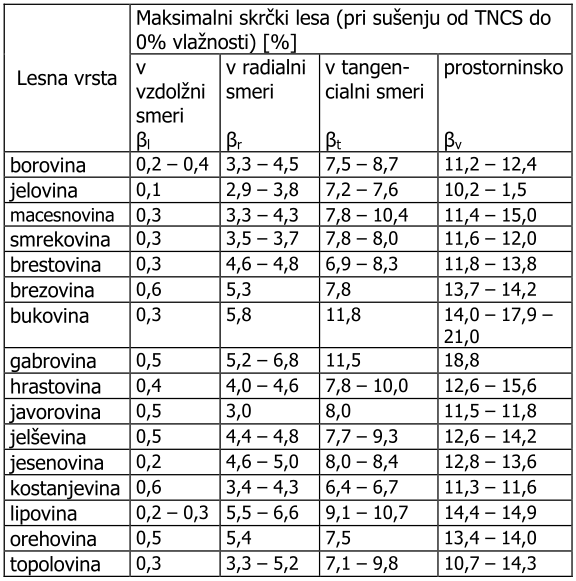{#fig:skrcki_lesa}

- Skrček:

$$ \Delta L = \beta\ L_{u30} $${#eq:max_skrcek}

- delni odstotek krčenja

$$ \beta_{\Delta u} = \frac{\beta \Delta u}{30 \%} $${#eq:delni_skrcek}

kjer je:

- $\beta_{\Delta u}$ = delni odstotek krčenja
- $\Delta u$ = razlika vlažnosti (le v območju 30%)

- dejanski skrček

$$ \Delta L = \beta_{\Delta u} L $${#eq:dejanski_skrcek}

Naloga:

Bukova gredica š=75mm, d=40mm, l=2,5m, z vlažnostjo 40%, posušimo na 10%. Izračunaj dimenzije po sušenju.

<!--
dš = 6mm
dd = 1,5 mm
dl = 5mm
-->

### Nepravilnosti zaradi krčenja

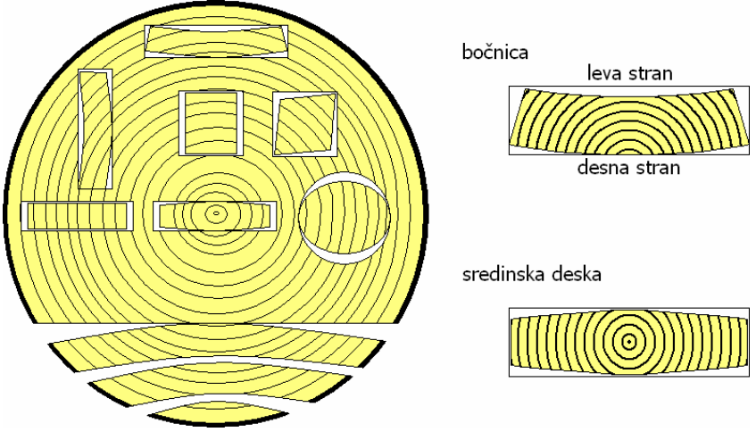{#fig:nepravilnosti_susenje}

- stržen se precej manj krči kot oddaljen tangencialni les
- bočnica se ukrivi na način, da se bolj tangencialni les skrči bolj
- kvadravtni presek (letnice diagonalno) se posuši v rombasto obliko preseka

### Ukrepi za zmanjševanje posledic krčenja

- ustrezna vrsta lesa
- ustrezna osušenost lesa pri obdelavi

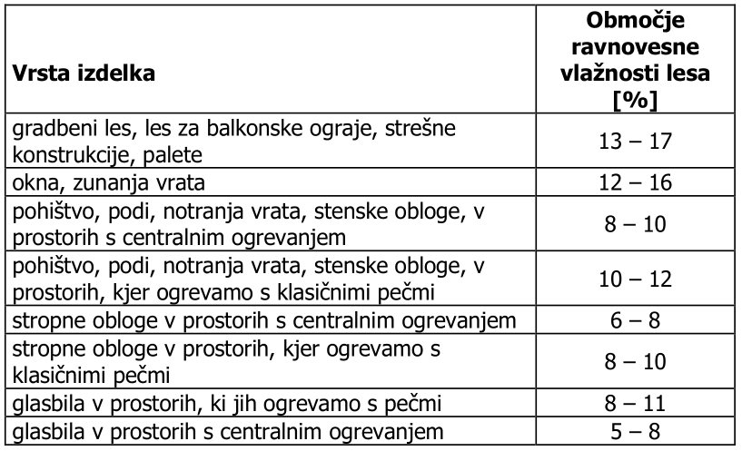{#fig:primerna_vlaznost_lesa}

- premazi zavirajo prehajanje vode
- konstrukcijske vezi namesto lepljenih spojev
- pravilno širinsko spajamo

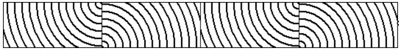{#fig:sirinsko_spajanje}

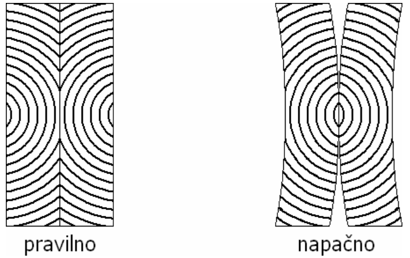{#fig:debelinsko_spajanje}

