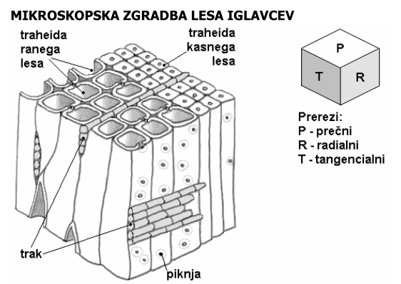
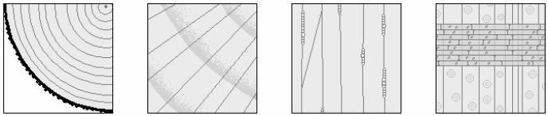
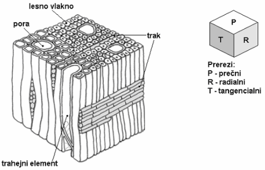

# POMEN GOZDA V SLOVENIJI

- Gospodarska vloga
- Proizvajanje kisika
- Varovalna vloga (preprečuje erozijo)
- Socialna vloga (rekreacija, vikendi)

{#fig:gozd_povrsina}

- cca 60% površine Slovenije
  - bukev 32%
  - smreka 31%
  - jelka 7,5%
  - hrast 7%

## Skladiščenje CO2

- v 1 m3 lesa -> cca (ekvivalent) 1T CO2
- 1T CO2 -> za prirast 1 m3 lesa -> 0,7T O2

# PRIDOBIVANJE LESA

## Sečnja

- smer podiranja
- čiščenje
- zasek

{#fig:secnja_varni_zasek}

- ureditev sečišča
  - veje, vhrove razžagami in zložimo
  - nizki panji
  - ne odlašamo s spravilom lesa

## Motorna žaga

Bistveni sestavni deli motorne žage vključujejo:

1. Motor: Motor je srce motorne žage in je odgovoren za zagotavljanje energije, potrebne za vrtenje verige. Motorne žage lahko delujejo na električni energiji ali na notranje zgorevalne motorje, kot so motorji na bencin ali na mešanico bencina in olja.

2. Veriga: Veriga je sestavljena iz povezanih členov, ki so pritrjeni na vodnik verige. Veriga je odgovorna za rezanje lesa. Verige so izdelane iz trpežnih kovinskih materialov, kot je jeklo, in so lahko zobate ali gladke, odvisno od namena uporabe motorne žage.

{#fig:Oblika_žaginega_zoba}

3. Vodnik verige: Vodnik verige je plošča, po kateri poteka veriga. Na vodniku verige so nameščeni tudi vodilni zobje, ki usmerjajo verigo med rezanjem lesa. Vodniki verig so izdelani iz trpežnih kovinskih materialov, kot je jeklo ali titan, in so na voljo v različnih dolžinah, odvisno od velikosti motorne žage.

4. Ročaj: Ročaj je del motorne žage, ki ga držimo med uporabo. Ročaji motorne žage so običajno ergonomsko oblikovani, da zagotavljajo udoben oprijem in dober nadzor nad žago med delovanjem. Ročaji so praviloma izdelani iz trpežnih materialov, kot je plastika ali kovina.

5. Zaganjalnik: Zaganjalnik je mehanizem, ki se uporablja za zagon motorja motorne žage. Zaganjalnik je običajno opremljen s posebnim ročajem, ki ga vlečemo, da zavrtimo motor in ga zaženemo. Odvisno od vrste motorne žage, lahko zaganjalnik deluje z ročnim potegom, električnim vžigom ali s pomočjo vzvodov.

6. Rezervoar za gorivo: Rezervoar za gorivo je posoda, v kateri se shranjuje gorivo za motor motorne žage. Odvisno od vrste motorja, motorne žage uporabljajo bencin, mešanico bencina in olja ali električno energijo. Rezervoarji za gorivo so običajno izdelani iz trpežne plastike in imajo priključek za polnjenje goriva.

7. Izklopna zavora: Izklopna zavora je varnostni mehanizem, ki preprečuje, da bi veriga še naprej delovala, ko motorne žage niso v uporabi ali ko se pojavi nevarnost. Izklopna zavora se aktivira ob sprostitvi ročaja za zagon ali ob nenadnem zasuku motorne žage.

Poleg teh bistvenih sestavnih delov motorne žage lahko obstajajo tudi drugi dodatni deli, kot so dušilniki zvoka, zračni filtri, napenjalniki verig, sistem za mazanje verige in drugi, odvisno od modela in namena motorne žage."

## Nevarnosti

1. Dno in vrh zaseka se sekata - ni ščetine!
2. Dno in vrh zaseka se ne stikata v ravni liniji
    - ni ustrezne ščetine
    - smer padanja ni določena
3. Preglobok zasek
    - ne moremo popravljati smeri
    - ni prostora za kline
    - oslabljena ščetina zaradi % olesenelih vlaken
4. Navidezna ščetina pri nizkem zaseku
    - pri močno razraščenem koreninovci (poševna vlakna)
    - možnost prereza ščetine
5. Premajhen kot zaseka
    - ščetina se prehitro pretrga
    - ni kontrole nad padanjem drevesa
6. Pregloboko podžagovanje
7. Prenizko podžagovanje
    - potrebno močnejše klinjenje
    - mogoč zdrs v smer sekača

# Les kot surovina

Neobdelan les:

-Tehnični les
-Les za kemično predelavo
-Les za kurjavo

OBDELAN les:

- Žagan les
- Tesan les
- Rezan 
- Luščen

{#fig:predelava_lesa}

Tehnični les: 

- Hlodovina za furnir, vžigalice, železniške pragove, za žaganje v plohe in deske;
- Okrogli gradbeni les: drogovi za odre, za napeljavo, ladijskim les, jamski les, jambori, piloti…
- Drobni tehnični les: palice, ročaji, oporniki za vinograde, sadovnjake, hmeljišče…

Les za kemično predelavo:

- Za celulozo in lesovino
- Taninski les
- Za suho destilacijo
- Les za kurjavo: cepanice, peleti, briketi…

# Zgradba lesa

## Prirast lesne mase

- prevajanje vode
- fotosinteza
$$ 6CO_2 + 6H_2O = C_6H_{12}O_6 + 6O_2 $${#eq:fotosinteza}
- prevajanje sladkorjev

{#fig:prirast_lesna_mase}

- spomladi:
  - prirast lesne mase
  - prevajanje vode
  - prevajanje zaloge sladkorjev
- poleti:
  - prirast plodov
  - prirast lesne mase
- jesen:
  - shranjevanje sladkorjev
  - prirast lesne mase
- zima:
  - mirovanje

## Funkcionalna sestava lesa

{#fig:fun_ses_les}

1. Lubje

  - Zaščita: Lubje je prva plast, ki ščiti notranje plasti lesa pred mehanskimi poškodbami, kot so udarci, zareze ali žaganje. Prav tako ščiti drevo pred zunanjimi vplivi, kot so voda, sončna svetloba, žuželke in bolezni.
  - Shranjevanje hranil: Lubje vsebuje tanine, smole in škrob, ki se uporabljajo za shranjevanje hranil. Ta hranila so pomembna za preživetje drevesa v obdobjih, ko je dostop do vode in hranil omejen.

2. Ličje (floem)

  - Prevajanje vode in hranil: Lubje vsebuje sloj tkiva, imenovan floem, ki je odgovoren za prenos hranil in vode iz listov do korenin ter obratno. Ta transport hranil je ključen za rast in preživetje drevesa.

3. **Kambij** 

  - Kambij je plast tkiva, ki se nahaja med lesnim delom (ksilemom) in lubjem drevesa. Je odgovorna za sekundarno debeljenje drevesa, kar pomeni, da omogoča rast drevesa v debelino. Kambij je aktivna rastna plast, ki proizvaja nove celice na notranji strani (proti lesu) ter na zunanji strani (proti lubju) drevesa.
  - Na notranji strani proizvaja lesne celice, imenovane ksilem, ki so odgovorne za prenos vode in hranil po deblu drevesa navzgor proti listom. Na zunanji strani pa proizvaja lubje, ki je odgovorno za zaščito in transport snovi navzdol in proti koreninam drevesa.
  - Kambij je zelo pomemben za rast drevesa v debelino, saj omogoča, da drevo postane vse večje in močnejše. Vsako leto proizvede nove plasti lesa in lubja, kar vodi do povečanja premera drevesa. To omogoča tudi boljšo podporo drevesu ter transport hranil in vode po celotni rastlini.
  - Poleg tega je kambij pomemben tudi za zdravje drevesa, saj lahko ob poškodbah ali okužbah proizvaja nove celice, ki obnavljajo poškodovano tkivo. Kambijeva funkcija je torej ključnega pomena za rast, razvoj in preživetje drevesa."

4. Beljava (ksilem)
  - Funkcija ksilema pri drevesu je transport vode in mineralov iz korenin do listov. Ksilem je vaskularno tkivo, ki sestoji iz cevastih elementov, imenovanih ksilemske cevčice. Te cevčice so odgovorne za prenos vode in mineralov navzgor po steblu drevesa. Poleg tega ksilem zagotavlja tudi mehansko oporo drevesu, saj je sestavljen iz močnih in lignificiranih celic.

5. Olesenel les
  - nevitalen del debla, sestavljen je iz parenhimskih celic, ki potekajo tudi radialno do lubja in s tem poskrbijo, da se hranilna snov prevaja tudi v tej smeri.

> Poznavanje smeri gibanja hranilnih snovi v deblu rastočega drevesa je ključno za uspešno sadno obrezovanje. S pravilno izvedeno zarezo nad spečim brstom lahko ustvarimo ugodne pogoje za rast in razvoj drevesa. Hranilne snovi se namreč zberejo na mestu zareze in spodbudijo speči brst k rasti. Tako lahko dosežemo boljšo obliko drevesa, večjo produktivnost in kakovost pridelka. Zato je pomembno, da pri obrezovanju drevesa upoštevamo njegovo naravno smer gibanja hranilnih snovi ter ustrezno izvedemo zarezo nad spečim brstom. Tako bomo drevesu omogočili optimalen razvoj in rast ter dosegli želene rezultate.

## Kemijska sestava lesa

- celuloza 40% - 50 % (naravni polimer glukoza...)
- hemiceluloza 25% - 40% (polisaharidi)
- lignin 20% - 30% 
    - je amorfna, mrežasta nevodotopna polimerna makromolekula iz fenilpropanskih podenot, ki so med seboj povezane z etrskimi vezmi in vezmi ogljik-ogljik (C-O-C in C-C)
    - pomemben pri termični obdelavi lesa (krivljenje s paro)
- druge snovi manj kot 10% (smole, maščobe, voski, barvila)

## Makroskopska sestava lesa

... glej vir [LES ZGRADBA](/home/david/Files/Work/UL-PeF/Vaje/TP-2_Les/Literatura/120_Les_3-LES_ZGRADBA.pdf) 

Prerezi:

- prečni
- vzdolžni
- tangencialni

> Prepoznaj smer prereza pri naslednjih slikah [link](https://www.wood-database.com/softwoods/pinaceae/abies/)

### Prečni prerez

- LETNICA
  Letnica pri drevesu je letni prirastek, ki ga drevo naredi v enem letu. Gre za obroček ali plast lesa, ki se oblikuje med rastno sezono drevesa. Letnica je vidna kot krožna linija na prerezu debla in je sestavljena iz različno obarvanih in gosto ali redko razporejenih celic lesa. Število letnic na deblu drevesa nam omogoča oceno njegove starosti, saj vsaka letnica predstavlja eno leto rasti. Poleg ocene starosti drevesa lahko letnice uporabimo tudi za analizo rasti in razvoja drevesa ter za preučevanje podnebnih sprememb."
- SKORJA
- LIČJE
- KAMBIJ
- BELJAVA
- OLESENELI LES
- BRANIKA
  - rani les
  - kasni les
  - pore
- LESNI TRAK
- STRŽEN

{#fig:precni_prerez}

- Pore pri listavcih (traheje)
  - venčasto porozni
  - raztreseno porozni

### Radialni prerez

- letnica
- skorja
- ličje
- kambij
- beljava
- oleseneli les
- branika
  - rani les
  - kasni les
  - pore
- stržen
- lesni trak
  - izredno široki - bleščice

{#fig:radialni_prerez}

# MIKROSKOPSKA SESTAVA LESA

{#fig:mikro_zgradba}

## TRAHEIDE
  - prevanjanje vode
  - mehanska funkcija
  - enakomeren prehod velikih lumnov (spomladi) -> mali lumni (jeseni)

## PARENHIMSKE CELICE
  - prevanjanje organskih snovi
      - glukoza
      - aminokisline ...
      - 50cm/h
  - tvorba radialnih trakov
      - homogeni (sestavljeni samo iz par. cel.) = JELKA
      - heterogeni (par. cel. in traheide) = SMREKA BOR

{#fig:mikro_branika_iglavci}

## PIKNJE

{#fig:poknja}

Prevajanje snovi med celicami v lesu bi bilo zaradi debelih celičnih 
sten zelo oteženo ali nemogoče. V celičnih stenah lahko opazimo 
vrzeli in membrane, ki celice zapirajo navzven. Te vrzeli 
imenujemo piknje in jih sestavljajo pikenjska votlina in pikenjska 
membrana.

### Tile

Tile so mehurjasti ali vrečasti vrastki parenhimskih celic v lumen traheje.
Njihova funkcija je da zaprejo lumne odmrlih celic trahej.

## Iglavci

Les iglavcev je pod mikroskopom viden kot tkivo z zelo urejenimi nizi celic. Te celice so aksialne traheide, ki opravljajo v lesu iglavcev tako prevajalno kot oporno funkcijo. Traheide ranega lesa imajo tanjše celične stene in večje lumne. Priraščajo na začetku rastne dobe, to je spomladi. Traheide kasnega lesa pa imajo zelo debele celične stene in majhne lumne. Priraščajo poleti, ko drevo proizvaja največ hrane. Aksialne traheide so v drevesu usmerjene vzporedno z osjo drevesa. Trakovne traheide pa najdemo v lesnih trakovih.

### Predstavniki

- SMREKA

{#fig:mikro_znaki_smreka}<++>

Iglavec z neobarvano jedrovino. Letnice na prečnem prerezu razločne. Postopen 
prehod ranega v kasni les. Smolni kanali na prečnem prerezu vidni. Trakovno tkivo je heterocelularno, pretežno enoredno, lahko tudi večredno z vključenimi radialnimi smolnimi kanali. Številne majhne kupresoidne in piceoidne piknje v križnih poljih med osnimi traheidami in trakovnim parenhimom. Številne obokane piknje.

- BOR

{#fig:mikro_znaki_bor}

Iglavec z obarvano jedrovino. Letnice na prečnem prerezu razločne, ostra meja med ranim in kasnim lesom, smolni kanali vidni kot bele pike v kasnem lesu. Trakovno tkivo je heterocelularno, pretežno enoredno, lahko tudi večredno z vključenimi radialnimi smolnimi kanali. Oknaste piknje na križnem polju med aksialnimi aksialnimi traheidami in trakovnim parenhimom. Številne obokane piknje. 

- JELKA

{#fig:mikro_znaki_jelka}

Iglavec z neobarvano jedrovino. Letnice na prečnem prerezu razločne. Postopen 
prehod ranega v kasni les. Trakovno tkivo je homocelularno, pretežno enoredno. 
Številne majhne taksodioidne piknje na križnem polju med osnimi traheidami in 
trakovnim parenhimom. Številne obokane piknje. Les ne vsebuje smolnih kanalov.

## Listavci

- TRAHEIDE
  - samo mehanska funkcija

- TRAHEJE
  - ali pore (ker so lumni bistveno večji in vidni s prostim očesom)
  - prevanjanje vode

- PARENHIMSKE CELICE
  - vač parnhimskih celic v osni smeri kot pri iglavcih
  - trakovi so:
    - večji, širši (tudi po 100 vzporednih par. cel.)
    - in več jih je kot pri iglavcih
    - nad 10-redni trakovi so pogosto višji od 1 mm (pri hrastu in bukvi)

{#fig:mikro_listavci}

### Venčasto porozni listavci

- pore vidne, veliki lumni
- nahajajo se v ranem selu
  - v ranem lesu velike
  - v karnem z majhnimi lumni
- venčaSto porozne vrse so (skoraj vse tiste s S-jem na 3. ali 4. mestu imena):
    + HRA**S**T
    + BRE**S**T
    + KO**S**TANJ
    + JE**S**EN

### Pol-venčasto porozne vsrste

- pore vidne, srednje vlike
- razporejene po celi braniki
- v ranem lesu jih je več ali pa so večje
- lesne vrste so:
    + OREH
    + ČEŠNJA

### Raztreseno porozne vrste

- pore (lumni) so majhni
- por s prostim očesom ne vidimo
- razporejene so po celi braniki
- predstavnike razdelimo v 4 skupine:
  1. SADNI:
      - jablana
      - hruška
      - sliva
  2. MEHAK LES:
      - lipa
      - topol
  3. IZRAZITI TRAKOVI
      - bukev
      - javor
      - gaber
  4. PARNEHIMSKE PEGE
      - breza
      - jelša

### Predstavniki

- BUKEV

{#fig:mikro_bukev}

Raztreseno porozen listavec. Običajno je les na prečnem prerezu enakomerne barve, pogosto pojav "rdečega srca". Letnice so razločne, trakovi široki. Pore na prečnem prerezu številne z majhnim premerom. Trakovi dveh velikosti: 2-4 redni ter nad 10- redni in visoki do 5mm, razporejeni na tangencialnem prerezu v značilnem vzorcu (vretenca), na prečnem prerezu se ob letnici kolenčasto razširijo. Perforacije med trahejnimi elementi enostavne in lestvičaste.

- HRAST

{#fig:mikro_hrast}

Venčasto porozen listavec z obarvano jedrovino. Letnice razločne. Pore ranega lesa vidne s prostim očesom. Pore kasnega lesa majhne, nanizane v radialnih nizih. Pogoste tile v trahejah ranega lesa v jedrovini. Trakovi so enoredni in nad 10-redni. Nad 10-redni trakovi široki tudi več kot 1mm in visoki tudi več cm. Med trahejnimi elementi enostavne perforacije. V parenhimskih celicah trakov in v kamrastih celicah lahko rombični kristali.

# FIZIKALNE LASTNOSTI LESA

## Gostota

- neposreden vpliv na fizikalne lastnosti lesa
  - boljša trdota
  - boljša upogibna trdnost

$$ \rho_u = \frac{m_u}{V_u} $${#eq:gostota}

pri čemer je:  

- $\rho_u$ = gostota lesa pri določeni vlažnosti [kg/m3] 
- $m_u$ = masa lesa pri določeni vlažnosti [kg] 
- $V_u$ = prostornina lesa pri določeni vlažnosti [m3]

{#fig:gostota_lesa}

Premisli:

- iglavci vs raztreseno porozni listavci vs  venčasto porozni listavci

### Širina branike

- delež kasnega lesa !

- Iglavci:
  - širina kasnega lesa  = enaka (ni odvisna od vremenskih razmer spomladi in poleti)
  - široka branika - nižja gostota

- Venčasto porozni
  - širina ranega lesa = enaka,
  - široka branika - večja gostota

- Raztreseno porozni
  - neodvisno od širine branike

