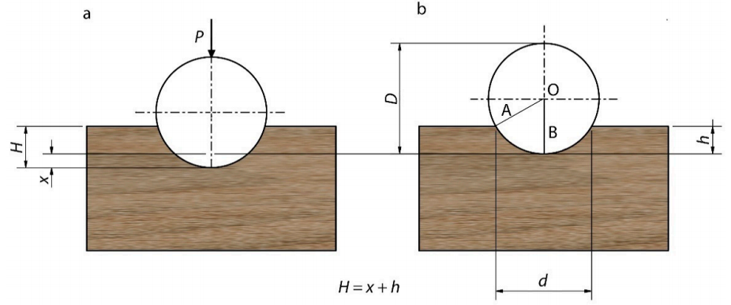
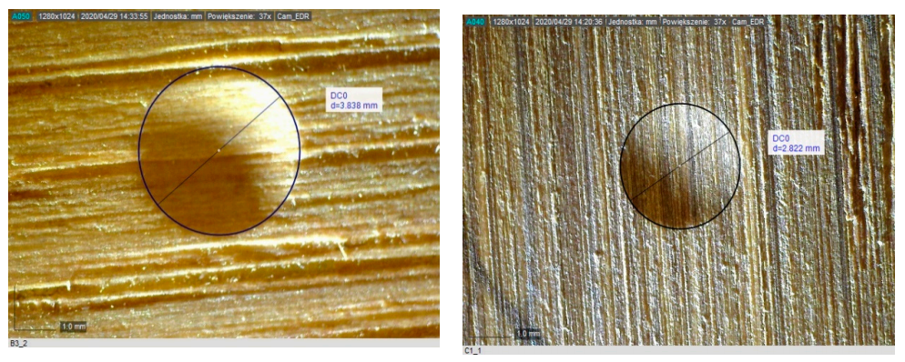
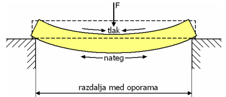
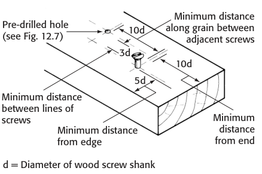
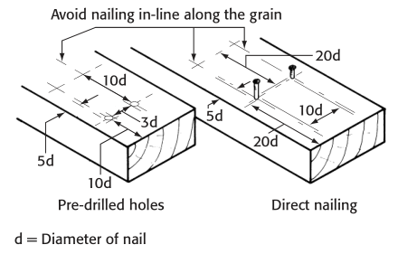

# Mehanske lastnosti lesa

- močno odvisne od same vrste
- nihanja pri isti vrsti
- napake v lesu

- gostota (delež kasnega lesa -> trdota, trdnost)
- vlažnost lesa (bolj suh boljša trdnost)
- temperatura (plastične deformacije lignina -> namjša trdnost)

# Trdota lesa

> Trdota je odpor, s katerim se les upira prodiranju tujega telesa vanj.

- zabijanje žeblja v les
- odrezovanje

{#fig:brinell_hardness}

- po Brinellu (oznaka HB)

Jekleno kroglico z določenim premerom in določeno silo potisnemo v les. Trdota je razmerje med uporabljeno silo in vtisnjeno površino. Naprimer pri HBW(10,3000) se uporablja kroglica s premerom 10mm, potisna sila pa ustreza masi 3000 kg uteži.

$$ HBW = \frac{2 F[kg]}{\pi D(D-\sqrt{D^2-d^2})} $${#eq:brinell_hardness}

kjer je:

- F - sile pritiska v kg
- D - premer kroglice
- d - premer odtisa

{#fig:harness_example}
(file:///home/david/Downloads/forests-11-00878-v2.pdf)

- Bor 2,2 MPa
- Brest 3,9 MPa
- Breza 2,7 MPa
- Bukev parjena 4,0 MPa
- Češnja 2,9 MPa
- Hrast 3,7 MPa
- Hruška 2,4 MPa
- Javor evropski 3,7 MPa
- Javor kanadski 4,2 MPa
- Jelša 2,1 MPa
- Jesen 3,8 MPa
- Kostanj 2,3 MPa
- Macesen 2,5 MPa
- Oreh 3,5 MPa
- Smreka 1,3 MPa

# TRDNOST
 
Trdnost materiala (lesa) je sposobnost, da se upira spremembi 
oblike in porušitvi zaradi delovanja zunanjih sil. Kadar trdno telo 
obremenimo z zunanjo silo, se upira spremembi tako, da v telesu 
nastanejo napetosti.  

$$ \sigma = \frac{F}{A} $${#eq:napetost}

- Tlačna
- Natezna
- Strižna
- Upogibna
- Torzijska
- Uklonska

## Dopustna napetost

Materialov ne smemo obremeniti do njihove maksimalne 
napetosti, obremenimo jih le do dopustne napetosti, ki se vedno 
nahaja v območju elastičnih deformacij. Tako izkoristimo le del 
njihove trdnosti. Dopustno napetost določajo predpisi in standardi. 
Izračunamo jo s pomočjo varnostnega količnika. Varnostni količnik 
je razmerje med največjo napetostjo v materialu ($\sigma_{max}$) in 
dopustno napetostjo ($\sigma_{dop}$). Pri lesnih konstrukcijah  lahko znaša 
varnostni količnik (varnostno število ) od 2 do 15, odvisno od 
namena konstrukcije, vrste obremenitve in drugih vplivov.  
(Leban, 2004)

$$ \sigma_{dop}  = \frac{\sigma_{max}}{k_v} $${#eq:sigma_dop}

|        les        | smer | Nateg | Tlak | Upogib | Strig | Mod. Ealst. |
|:-----------------:|:----:|:-----:|:----:|:------:|:-----:|:-----------:|
| Smreka, Jelka,Bor |  ll  |   10  |  11  |   13   |  0.9  |    12000    |
|                   |   T  |   -   |   2  |    -   |  0.9  |     460     |
|    Hrast,Bukev    |  ll  |   11  |  12  |   14   |  1.2  |    13000    |
|                   |   T  |   -   |   3  |    -   |  1.2  |     1000    |
Table: Dopustne napetosti za nekatere vrste lesa v MPa. {#tbl:sigma_dop_tab}

### Nateg

raztezek:  
$$ \epsilon=\frac{l_1 - l_0}{l_0} $${#eq:raztezek}

- specifični raztezek
- $l_1$ - nova dolžina
- $l_0$ - prvotna dolžina

Ob tej deformaciji se ustvarijo napetosti:

$$ \sigma = E \frac{\Delta l}{l_0} $${#eq:napetost_nateg}

- napetost
- E - modul elastičnosti
- specifični raztezek
- $dl $ - raztezek
- $l_0$ - prvotna dolžina

> Primer: smrekovina 8cm x 8cm, dolžine 1,8m ; natezna sila 45 kN. Dejanska napetost? Raztezek? (Odgovor: 7.03 MPa, 1.15mm)

### Uklonska trdnost

vitkost

$\lambda = \frac{l_0}{i}$

- prvotna dolžina
- i - vztrajnostni polmer

$$ i=\sqrt{\frac{I_{min}}{A}} $$

Večja je vitkost, večja je nevarnost uklona. Uklonsko kritično napetost
določamo po treh različnih postopkih, v odvisnosti od vitkosti.

1. $\lambda \leq 60$ dimenzioniranje na čisti tlak
2. $\lambda \geq 100$ - dimenzioniranje po Eulerjevem postopku

#### Eulerjev postopek

uklonska sila

$$ F_k = \frac{\pi^2 E I_{min}}{l_0^2} $$

uklonska napetost

$$ \sigma_k = \frac{F_k}{A} $$

dopustna sila

$$ F_{dop} = \frac{F_k}{k_v}  $$

- $k_v = 10 (za les)$

### Vztrajnostni momenti

- kvadratni presek:

$$ I_x=\frac{ a^4 }{ 12 } \ ;\ W_x = \frac{ a^3 }{ 6 } $$

- pravokotni presek:

$$ I_x=\frac{ b\ h^3 }{ 12 } \ ;\ W_x = \frac{ b\ h^2 }{ 6 } $$

- okrogli presek:

$$ I_x=\frac{ \pi\ d^4 }{ 64 } \ ;\ W_x = \frac{ \pi\ d^3 }{ 32 } $$

>Smrekov steber pravokotnega prereza je na eni strani vpet členkasto na drugi pa trdo. Dolžina stebra
>je 5 m. Obremenjen je s silo 45 kN. Izračunajte dimenziji stranic pravokotnika, če sta v razmerju 2 :3.
>Varnostni faktor je 10.
>( R: l0 = 4 000 mm, Imin = 72 951 252 mm4 , b = 155,4 mm, h = 233,14 mm, i = 44,87 mm, $\lambda$ = 111,4 zato lahko dimenzioniramo po Eulerju. )

## Upogibna trdnost

Upogibna trdnost je odpor lesnega nosilca med oporama proti maksimalni sili, ki deluje pravokotno na os nosilca. 

{#fig:upogibna_trdnost}

Pri dimenzioniranju na upogib upoštevamo samo največji, maksimalni
upogibni moment, saj tam nastopijo največje napetosti.

$$ \sigma = \frac{M_{max}}{W} $${#eq:napetosti_upogib}

- upogibna napetost
- M_max - največji moment (navor)
- W - odpornostni moment

### Obrementive

### Primeri

>Izračunajte s kakšno silo lahko obremenite prostoležeči nosilec iz smrekovega lesa 1 kategorije.
>Dolžina nosilca je 4 m, širina je 16 cm, višina je 20 cm. Sila deluje na nosilec v sredini.
>( R: $\sigma$ = 1 300 N/cm2 , Wx = 1 066,66 cm3 , Mmax = 13 866,66 Nm, F = 13,8 kN )

> Dimenzionirajte pravokotni prerez hrastovega trama dolžine 4 m. To je prostoležeči nosilec, ki je po
> celi dolžini obremenjen z zvezno obremenitvijo 1800 N/m. Stranici b in h sta v razmerju 7:5. Dopustna
> upogibna napetost je 1400 N/mm2 , elastični modul pa je 12 500 MPa. Izračunajte tudi poves hrastovega
>nosilca.
>( R: Mmax = 3600 Nm, Wx = 257 142,8 mm3 , b = 92,3 mm = 93 mm, h = 129,26 mm = 130 mm, IX = 17 026
> 750 mm4 , f = 28,2 mm )

> Kakšno je najugodnejše razmerje stranic nosilca, ki je obremenjen na upogibi in ga moramo izrezati iz debla z okroglim presekom? V praksi se pogosto uporablja razmerje 5:7, ali lahko potrdiš, da je to res najučinkoviteje.

## Strig

Strižna trdnost je odpor lesa proti strigu lesnih plasti s silo, ki 
deluje v ravnini lesnih vlaken ali redko, prečno na lesna vlakna.  

- prečno na vlakna : čepna vez
- vzdolž vlaken : poševnik v legi nadstreška

- strižna napetost

$$ \tau = \frac{F}{A} $${#eq:strig}

>Enojna zarezna čepna vez iz smrekovega lesa je obremenjena s silo 1 500 N. Čep je visok 
>80 mm. Določite najmanjšo dopustno širino čepa. ( R: $\tau_{dop}$ = 90 N/cm2, Scel = 16,66 cm2, b = 2 cm ) 

>Naložena polica tehta 70 kg. Mozničili smo jo z bukovimi mozniki premera 8 mm. 
>Izračunajte koliko moznikov smo uporabili pri izdelavi konstrukcije.
>( R: $\tau_{dop}$ = 120 N/cm2, S1 = 50,265 mm2, k = 1, Scel = 5,83 cm2, N = 12 ) 

## Cepilna trdnost

Cepljivost je lastnost lesa, da se cepi ali razdvaja vzdolžno (v 
smeri lesnih vlaken ). Les navadno cepimo z orodjem v obliki

{#fig:cepljenje_vijaki}

{#fig:necepljenje_zeblji}

