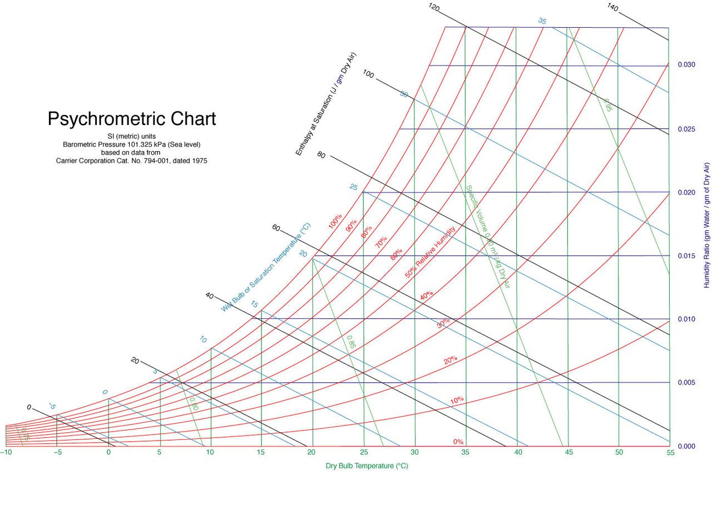
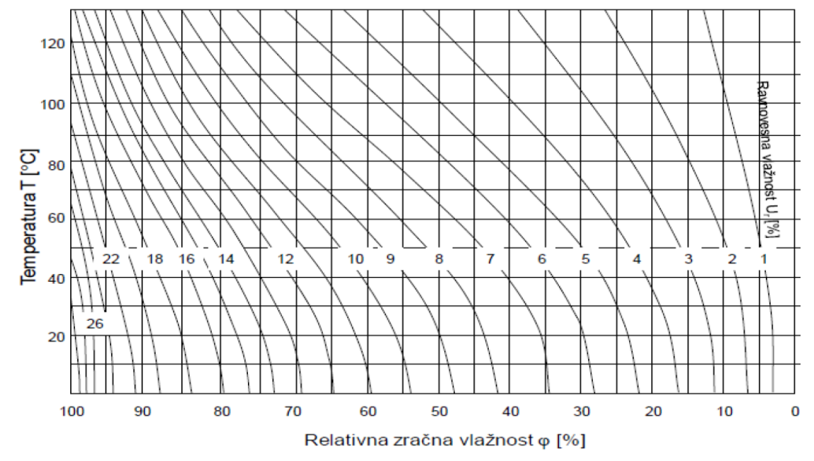
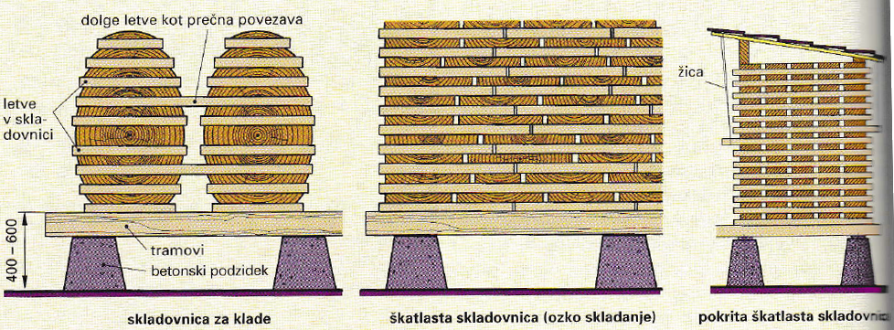
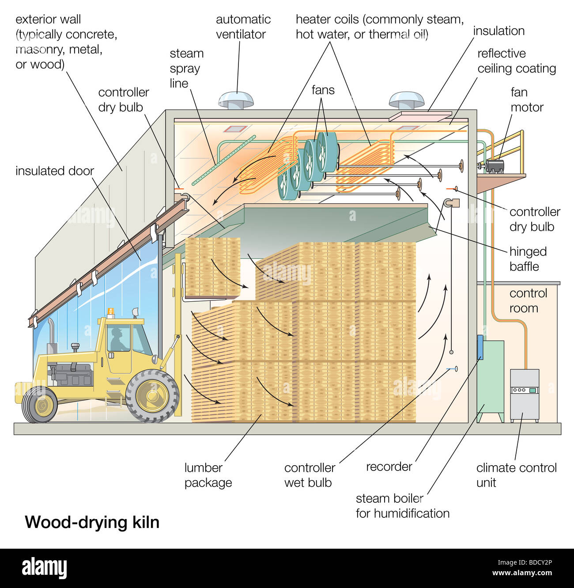
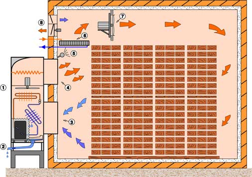
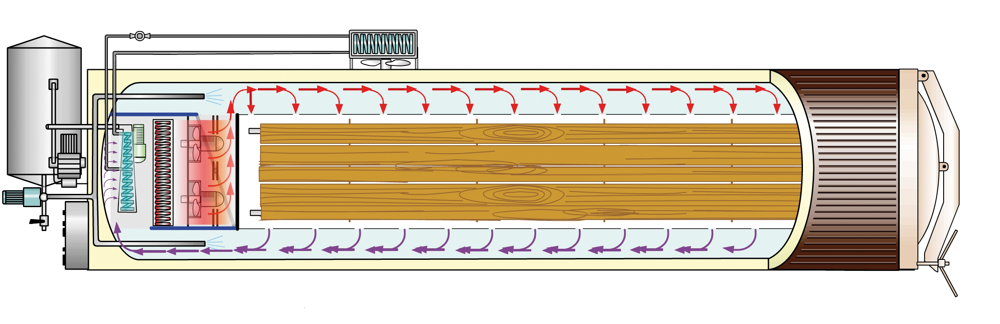

# Sušenje lesa

## Pomen sušenja lesa

- zagotavljanje dimenzijske stabilnosti
- boljša biološka odpornost
- izboljšane mehanske lastnosti

- manjša teža obdelovalnih polizdelkov
- lažja obdelava materiala

- spremenijo se tudi:
  - toplotne,energijske, električne in akustične lastnosti. 

Tehnologija sušenja lesa je izrednega pomena, saj v lesni industriji:

- predstavlja velik strošek in
- proces je časovno potraten.

## Klasifikacija vlažnosti lesa

| klasifikacija lesa | $\nu$ - vlažnost lesa |
|:------------------:|:---------------------:|
|      svež les      |      več kot 55%      |
|     polsuh les     |         do 55%        |
|    predsušen les   |         do 20%        |
|       suh les      |         do 15%        |
Table: Klasifikacija lesa glede na vlažnost lesa. {#tbl:klasi_vlaznost}

## Tehnologija sušenja

Les sušimo z namenom, da ga bomo predelali in vgradili v doličen izdelek,ki bo izpostavljen 
določenim pogojem. Izdelek se običajno nahaja pri neki povprečni temperaturi in relativni 
zračni vlagi, kateri pa odgovarja določena ravnovesna vlaga lesa. Naloga sušenja je ta, da se 
les posuši na ravnovesno vlago, ki jo zahteva izdelek, saj s tem zagotovimo dimenzijsko 
stabilnost in kvaliteto izdelka.

V ta namen se lahko poslužujemo:
- naravno sušenje
- tehnično sušenje

### Zrak in zračna vlažnost

- (suhi) zrak:
  - dušik (78%)
  - kisik (21%)
  - drugi plini (1%)
- normalni zrak: suhi zrak + vodne pare

#### Absolutna vlažnost zraka

Absolutna vlažnost zraka je definirana z razmerjem med maso vodne pare in maso suhega zraka.

$$ Y=\frac{m_{vodne pare}}{m_{suhega zraka}} $${#eq:abs_vlaznost}

kjer je:

- Y - absolutna vlažnost zraka
- $m_{vodne pare}$ - masa vodne pare
- $m_{suhega zraka}$ - masa suhega zraka

- ni odvisna od temperature
- s temperaturo pa se spremeni **relativno zračna vlažnost**.

#### Relativna zračna vlažnost

Relativno zračno vlago računamo s pomočjo tlakov par in sicer razmerjem med delnim 
tlakom in tlakom nasičenja vodnih par.

$$ \Phi=\frac{p_v}{p_n} $${#eq:rel_vlaznost}

kjer je:

- $\Phi$ - relativna zračna vlažnost
- $p_v$ - delni tlak vodne pare
- $p_n$ - tlak nasičenja vodne pare

| Temp. zraka [°C] | Nasič. vla. [$g/m^3$] | $p_n$ [Pa] |
|:----------------:|:---------------------:|:----------:|
|        -20       |         0.881         |     103    |
|         0        |         4.847         |     610    |
|        20        |          17.3         |    2.3 k   |
|        40        |          51.2         |    8.2 k   |
|        60        |          130          |    20 k    |
|        80        |          293          |    70 k    |
|        100       |          597          |    101 k   |
Table: Hidro-termične lastnosti nasičenega zraka z vodno paro. {#tbl:nas_tlak_vodne_pare}

**Psihro-meter**

Praktično ugotavljanje relativne zračne vlažnosti poteka s pomočjo **psihrometra**. 

Sestava psihrometra:
- suhi termometer
- mokri termometer
- bombažna tkanina
- posoda z destilirano vodo

- izhlapevanje vode ohladi `mokri termometer`
- gibanje zraka 2 m/s

Iz grafa na [@fig:PsychrometricChart-SI] lahko odčitamo relativno zračno vlažnost na podlagi temperatur suhega in mokrega termometra.

**Odčitavanje in razlaga diagrama na [@fig:PsychrometricChart-SI]**:

1. Na x-osi je razvrščena temperatura suhega termometra.
2. Nad x-osjo se vzpenjajo (rdeče) krivulje relativne zračne vlažnosti $\Phi$.
3. Na zadnji krivulji z relativno zračno vlažnostjo (RZV) $\Phi=100\%$ so razvrščene
  temperature mokrega termometra. To je tudi točka rosišča. Opazimo lahko, da te
  temperature sovpadajo s temperaturami suhega termometra, saj pri 100% 
  RZV voda ne izhlapeva.
4. Temperaturo mokrega termometra, pri različnih RZV, ponazarja modri poltrak,
  ki se nadaljuje desno navzdol od oznake temperature mokrega termometra na
  krivulji $\Phi=100\%$.
5. Na y-osi je razvrščena absolutna zračna vlažnost (AZV), ki jo navaja [@eq:abs_vlaznost]
  (razmerje mase vode in zraka). Ker le ta ni odvisna od temperature zraka,
  lahko to skalo uporabljamo pri načrtovanju RZV, ko se temperature zraka spremeni.
  V takem primeru ostane AZV konstantna do točke rosišča.

Na spletnem portalu [Interactive Psychrometric Chart](http://www.flycarpet.net/en/PsyOnline) si lahko ogledate in preizkusite psihometrični diagram.

{#fig:PsychrometricChart-SI}

> ### NALOGA: Odčitaj relativno zračno vlažnost
>
> Izmerili smo temperaturo zraka v prostoru (t.i. suha temperatura) $T_s = 25^\circ C$
> in temperaturo tkanine iz katere izhlapeva voda (t.i. mokra temperatura)
> $T_s = 20^\circ C$. Iz psihometričnega diagrama na [@fig:PsychrometricChart-SI]
> odčitaj relativno zračno vlago. ($\Phi=65\%$)

> ### NALOGA: Predvidi relativno zračno vlažnost, pri spremembi temperature zraka
>
> V prostoru imamo temperaturo zraka $T_z=18.5^\circ C$ in relativno zračno vlažnost
> $\Phi = 60\%$. Pri tem je mokra temperatura $T_m = 13.8^\circ C$. Nato prostor
> segrejemo na $T_z = 25^\circ C$. Kolikšna bo tedaj relativna zračna vlažnost v
> prostoru? ($\Phi_2 = 40\%$)

### Ravnovesna vlažnost lesa

- odvisna od:
  - temperature
  - relativne vlažnosti zraka

{#fig:ravnovesna_vlaznost_lesa}

> #### NALOGA: Uporaba psihometričnega diagrama
> 
> Poišči ravnovesno vlažnost lesa, če bomo izdelek imeli v prostoru z relativno
> vlažnostjo $\Phi = 55%$ s temperaturo 30°C. ($\nu=9,5%$)

### Naravno sušenje

- energijsko najcenejše načine sušenja
- velika poraba prostora
- dolg čas sušenja
- vezanega kapitala v zalogah
- omejeno osušenost lesa
- ne-nadzorovana hitrost sušenja (razpoke na čelu)

#### Skladovnica žaganega lesa

{#fig:susenje_skladovnica}

- orientacija skladovnice je odvisna od povprečne smeri vetra
- na suhem terenu ! (zemlja vsebuje zelo veliko vlage)
- odvodnavanje tal
- betonski podstavek ($h=30-60\ cm$)

- posamezne skladovnice ločimo s tramovi ($d=10\ cm$)
- pravilno letvičenje
  - letvice zložene ena nad drugo (preprečuje krivljenje lesa)
  - položaj zunanjih letvic naj bo blizu čela deske (preprečuje krivljenje)
  - primerna debelina letvic omogoča zadosten pretok zraka ($d_{letvice}=\frac{1}{2}d_{lesa}$)
- pokrite s primerno streho z zadostnim nagibom za odvodnavanje

- lahko poteka tudi v skladiščih z:
  - naravnim zračnim vlekom (dimniški efekt)
  - prisilnim gibanjem zraka (ventilatorji)

#### Čas sušenja

- zelo odvisen od: klime, začetne vlage lesa, letnega časa pričetka sušenja, lokacije, načina zlaganja, vrste lesa, debeline lesa.
- zelo nepredvidljivo

**Kesnerjeva ocena časa naravnega sušenja lesa**:

$$ T = k_K\ d_{lesa} $${#eq:kesner_time}

Kjer je :

- T - čas sušenja v mesecih
- $k_K$ - kesnerjev koeficient za zračno suh les
- d - debelina lesa v cm

Kesnerjevi koeficienti za različne vrste lesa so podani v [@tbl:kesner_koef]

| Vrsta lesa | $k_K\ [\frac{mesec}{cm}]$ |
|:----------:|:-------------------------:|
|   smreka   |            3.2            |
|    topol   |            3.5            |
|   macesen  |            3.8            |
|     bor    |            4.5            |
|    brest   |            5.0            |
|    javor   |            5.0            |
|    bukev   |            5.3            |
|    hrast   |            5.3            |
Table: Kesnerjevi koeficienti za različne vrste lesa. {#tbl:kesner_koef}

### Tehnično sušenje

- razvoj z masovno proizvodnjo lesnih izdelkov

**Delitev tehničnega sušenje glede na sušeči les:**

- stacionarno (komorsko, saržno)
- pretočno (kanalsko, posamezne cone z različno klimo)

**Delitev tehničnega sušenje glede na temperaturo:**

- nizko-temperaturno sušenje: 15°C - 45°C
- normalno-temperaturno suš.: 40°C - 90°C
- visoko-temperaturno suše.: 90°C - 130°C

**Delitev tehničnega sušenje glede na tehnološki postopek:**

- konvekcijsko komorsko sušenje (normalno-temperaturno)
- kondenzacijsko sušenje
- vakuumsko sušenje
- IR sušenje
- visokofrekvenčno sušenje

#### Komorska sušilnica

Tehnologija sušenja v sušilnici obsega:

- zunanji zrak vstopa v sušilnico
- zrak segrejemo -> zmanjšamo $\Phi$ zraka
- les teži k novi relativni vlažnosti $\nu$
- nasičen topel zrak izstopi iz sušilnice

- [Preprosta domača komorska sušilnica](https://www.youtube.com/watch?v=MwN47RDEodA)

{#fig:komorska_susilnica}

Sestavni deli sušilnice:

- ohišje sušilnic
    - odpornost proti koroziji
    - izolacijske lastnosti ( $\lambda = 0.3-1.2\frac{W}{m^2}$ )
- sistem za gretje sušilnice 
- sistem za vlaženje 
    - preprečujemo prehitro sušenje (razpoke na čelu polizdelkov)
- kroženje zraka 
    - z ventilatorji
    - tipična $v = 2 \frac{m}{s}$
- izmenjava zraka 
    - dovodne in odvodne lopute
- naprave za merjenje in regulacijo klime 
    - senzorji:
        - relativna zračna vlažnost vstopnega zraka
        - temperatura vstopnega zraka
        - vlažnost lesa
    - aktuatorji
        - krmiljenje hitrosti zraka (ventilatorji)
        - grelna telesa
        - servo-motorji za krmiljenje vhodih in izstopnih loput

#### Kondenzacijska sušilnica

- nižje temperature (40°C - 60°C )
- počasnejše in kvalitetnejše sušenje
- zahtevnejše drevesne vrste

- manjša poraba energije (manjše dogrevanje zraka)
- predvsem uporabno za predsušenje

Osnovna tehnologij kondenzacijskega sušenja:

1. zrak se ohladi
2. relativna zračna vlažnost se poveča
3. preostanek vodne pare se kondenzira
4. zrak zopet segrejemo
5. relativna zračna vlažnost se zmanjša
6. zrak vrnemo v sušilno komoro

{#fig:kondenzacijska_susilnica}

Glavni sestavni deli:

1. Toplotna črpalka.
2. Odtočna cev kondenzacijske vode.
3. Vstopna loputa vlažnega zraka.
4. Izstop ogretega zraka z nižjo $\Phi$ zračno vlago.
5. Regulacija relativne zračne vlažnosti.
6. Toplotni izmenjevalec.
7. Ventilator (zagotavljanje zračnega pretoka).
8. Dodatne zračne lopute za izmenjevanje zraka.

#### Vakuumske sušilnice

- čas sušenja 3-5 krat hitrejši
- gradient vlažnosti lesa je majhen (voda se bistveno hitreje lahko giblje iz notranjosti)

- manjše količine lesa (dimenzije komore so omejene)
- energetsko potratno

{#fig:vakuumska_susilnila_komora}

Glavni sestavni deli:

- vakuumska črpalka
- kondenzacijsko telo
- grelec
- ventilatorji
- dovodni sistem zraka
- lesna skladovnica
- odvodni sistem zraka

Osnovna tehnologij vakuumskega sušenja:

1. znižamo tlak v sušilni komori (zniža se parni tlak vode)
2. tlak v komori je $p = [5 .. 20]\ kPa$ ($p_{zračni}=100kPa$)
3. vrelišče vode pri $p=5.32\ kPa$ je $T_v = 30^\circ C$
4. s tem povečamo difuzijo vezane vode v zrak
5. ... Ostala tehnologija je enaka kot pri kondenzacijskem sušenju

#### Visokofrekvenčno sušenje

Osnovna tehnologij vakuumskega sušenja:

- vlažen les vstavimo med dve elektrodi (kovinski plošči)
- na elektrodi priključimo visokofrekvenčni generator
- voda in drugi prosti ioni raztopljeni v njej se orientirajo v električnem polju
- ustvarja se toplota (trenje)
- les se zelo hitro segreje po celem preseku
- les ne sme vsebovati delcev kovin (preboj, iskra, požar)

{#fig:hf_susilna_komora}

## Viri in Literatura

Novak, M. (2008). VIŠJEŠOLSKI STROKOVNI PROGRAM LESARSTVO SUŠENJE LESA. Retrieved from http://www.impletum.zavod-irc.si/docs/Skriti_dokumenti/Susenje_lesa-Novak_NU.pdf

