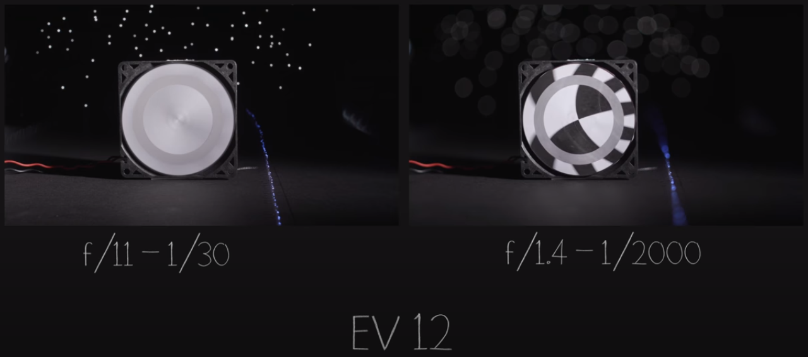

# SVETLOBNA IZPOSTAVLJENOST FOTOGRAFSKEGA MEDIJA

- angl.: Expousure

- prejeta svetlobna energija
- a.k.a - količina svetlobe, ki vpade na fotografski medij

- POD-OSVETLJENA fotografija je temnajša
- NAD-OSVETOLJENA fotografija je svetlejša

Na svetlobno izpostavljenos vplivajo:

- svetilnost svetlobnega telesa, ki osvetljuje objekt
- odbojnost objekta
- lastnosti objektiva
- velikost zaslonke
- čas osvetljevanja
- ~~občutljivost foto. medija (ISO vrednost)~~

Nekaj osnovnih pojmov, ki se navezujejo na človeško zaznavanje svetlobe in njene jakosti.

## SVETILNOST (LIGHT INTENSITY)

$$ I_V[cd] = \frac{\Phi_V[lm]}{\Omega[sr]} $${#eq:light_intensity}

- V splošnem fizikalnem pomenu je svetilnost razmerje med svetlobnim tokom $P$, ki ga svetlobno telo izseva v nek $\sphericalangle$ steridian prostorskega kota $\Omega$. Za merjenje svetilnosti v fiziološkem merilu (kako svetla se nam zdi luč) uporabljamo enoto **KANDELA**.

#### KANDELA

je določena na podlagi izsevane enobarvne svetlobe z valovno dolžino $\lambda = 555 nm$. Pri tej svetlobi je človeško oko najbolj občutljivo in jo vidimo kot zeleno-rumeno barvo. Če svetlobno telo izseva v dani smeri 1/683 W svetlobne moči v vsak steridian (st) prostorskega kota, ima to svetilo svetilnost 1 kandele.

#### STERIDIAN

je prostorski kot, ki bi ga orisal vrh stožca, če ga narišemo iz središče sfere z radijem r in ima ploščino osnovne ploskve velikosti r². Prostorski kot sfere meri $4\pi$.

## SVETLOBNI TOK (LUMINANCE FLUX)

$$  \Phi_V[lm]=\frac{I_V[cd]}{\Omega[sr]} $${#eq:luminance_flux}

- Svetlobni tok (oznaka P) je fizikalna količina, ki pove količino izsevane svetlobne energije v časovni enoti = svetlobna moč. Celotni svetlobni tok skozi zaključeno ploskev okrog svetila je enak moči sevalca.

- Kadar govorimo o vidnem svetlobnem toku, ga merimo v lumnih in ga določimo na podlagi svetilnosti merjene v kandelah. Tako je 1 lumen svetlobna moč, ki se širi v prostorski kot 1 steridiana, ki ga izseva svetlobno telo s svetilnostjo 1 kandele.

- Ker je prostorski kot sfere enak $4\pi$ ima tako ena sveča svetlobno tok $4\pi$ lumnov = 12.56 lm. Bolj oprijemljiv podatek o svetlobnem toku svetil pa lahko najdemo na njihovi embalaži, kjer lahko najdete vrednosti od 600 - 1000 lumnov.

## OSVETLJENOST (ILLUMINANCE)

$$ E_V [lux] = \frac{\Phi_V[lm]}{A[m^2]}$${#eq:illuminance}

- Osvetljenost pa je skupni vpadajoči **svetlobni tok** na enoto površine. In zopet, kadar nas zanima fiziološka količina jo preračunamo s svetlobnim tokom merjenim v lumnih in jo podamo v t.i. luksih ali $lux = lm/m^2$.
- koliko svetlobe prehaja neko površino v prostoru

## SVETLOST (LUMINANCE)

$$ L_V[\frac{cd}{m^2}] = \frac{\Phi_V[lm]}{A[m^2] \Omega[sr] cos\Theta[^\circ]} $${#eq:luminance}

- Svetlost označuje koliko svetlobne moči, oziroma toka, bo zaznalo oko, ki gleda na površino z neko površino $A$ iz določenega kota. Svetlost je tako pokazatelj kako svetla se bo zdela površina $A$.

- Svetlost je tako odvisna od kota $\Theta$ (v °) pod katerim gledamo osvetljeno telo s površino $A$ ($m^2$) od katerega se odvija svetloba s svetlobnim tokom P ($lm = cd / sr$) in se širi v prostorski kot $\Omega$ ($sr$). Svetilnost podajamo v enoti cd/m^2.

# OPTIČNE NAPRAVE

- v prejšnjih pogojih (svetilnost, osvetljenost in svetlost) lahko količino svetlobe dodajamo...
- od trenutka, ko svetloba vstopi v optično napravo pa jo lahko le "odvzemamo ali omejujemo"

## ND FILTRI

# OSVETLITEV

## ZASLONKA

### ZASLONSKO ŠTEVILO - F/STOP

- N = F/STOP

## ČAS OSVETLJEVANJA

## EXPOSURE VALUE SISTEM

- EV vrednost
- združi zaslonsko število in čas osvetljevanja
- $EV = log_2(\frac{N^2}{t})$
- povečanje EV vrednosti za +1 podvoji količino energije vpadne svetlobe

# OBČUTLJIVOST TIPALA

- ISO
- 100, 200, 400  (+1 STOP)

# MERJENJE SVETLOSTI

- koliko svetlobe se odbije od predmeta v našo smer

$$ \frac{N^2}{t}=\frac{L\ ISO}{K} $${#eq:expousure_eq}

- N = zaslonsko število
- t = čas osvetljevanja (s)
- L = povprečna svetlost (cd/m²)
- ISO = občutljivost foto. medija
- K = konstanta svetlosti (od 10 - 14 cd/m²; K=12.5cd/m² [Cannon, Nikon]; K=14cd/m² [Minolta, Pentax])

$$ EV = log_2\frac{L\ ISO}{K} $${#eq:expo_svetlost}

{#fig:EVis12}

# Merjenje OSVETLJENOSTI

- koliko svetlobe vpada na naš objekt

$$ EV = log_2\frac{E\ ISO}{C} $${#eq:expo_osvetljenost}

- E = povprečna osvetljenost (cd/m²)
- ISO = občutljivost foto. medija
- C = konstanta osvetljenosti (od 240 - 400 lux; ponavadi je uporabljen C = 250 lux)

- Zakaj bi merili kolikšno osvetljenost imamo v prostoru namesto, da bi merili že odbito svetlobo in s tem svetlost površine?
    - kadar nimamo "srednje sive" površine
    - vrednosti kontrastnih površin lahko preveč zavajajo
    - barve imajo različen albedo faktor (odbojni faktor)

## VIRI IN LITERATURA
<!--
https://www.youtube.com/watch?v=-BHbY9p4BgI
-->
