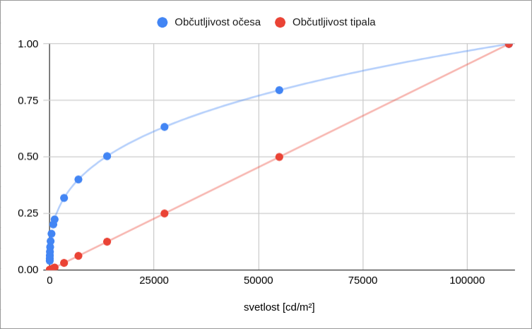
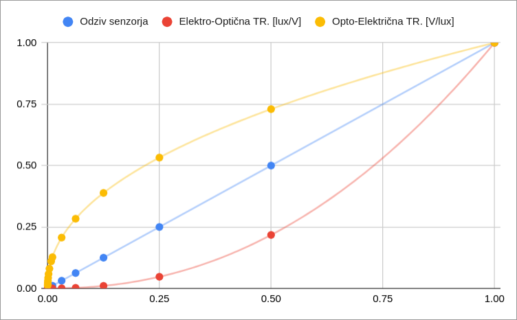
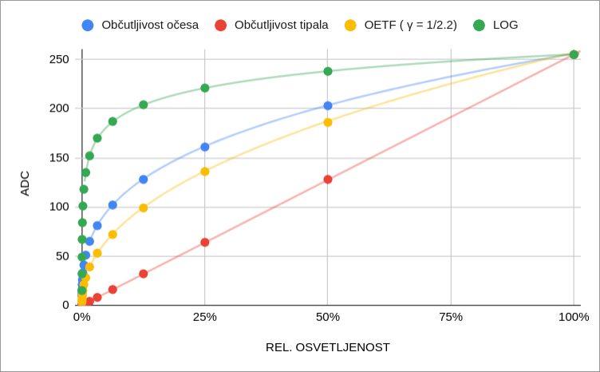
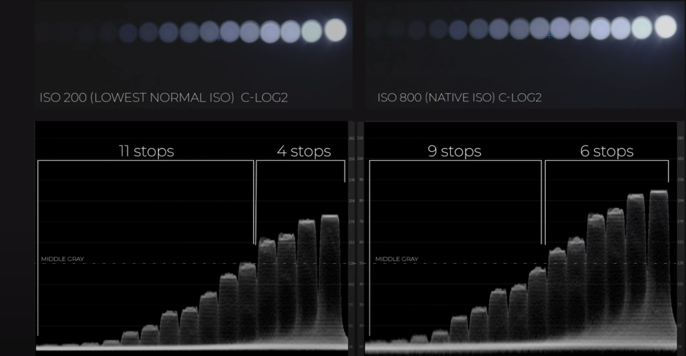

# DINAMIČNI RAZPON

- ... je razmerje med:
    - največjo vrednostjo, ki jo lahko merimo in
    - najmanjšo vrednostjo, ki jo lahko merimo (šum)
- naprimer METERSKA PALICA
    - max = 1000mm
    - min = 1mm
    - dinamični razpon = 1000:1

- prizorišče ima veliko različnih svetlosti (količina odbite svetlobe)
    - različne vrednosti L [cd/m²]
    - svetlo/temno

## DR našega očesa

- oko je logaritemsko občutljivo na količino svetlobe (na svetlost)

{#fig:eyeDR}

- Občutljivost očesa = $K  ln(I)$ (logaritem od svetilnosti I[cd])

{#fig:eye_sensor_sensitivity}

- svetlost LED-ic se nam zdi bolj LINEARNA
- film je imel podobno občutljivost (če foton zadane že razvito zrno se to ne pozna)
- !fotografska tipala imajo linearno občutljivost

## GAMA FAKTOR

- izhaja iz reprodukcije slike (prikaz slike na TV)
- svetilnost sorazmerna s $V_S^{\gamma}$
    - $I \propto V_s^\gamma$
    - za monitor $\gamma = 2.2$

{#fig:OETF_curne}

## GAMA in DINAMIČNI RAZPON

- kolikšen dinamični razpon pripada posamičnemu F/STOP območju

{#fig:signal_respond}

- količina svetlobe se podvoji med vsako vrstico v tabeli
- z LOG transformacijo lahko dosežemo enakomerne din. razpone (+17 ADC v tabeli)

| F/STOP | Rel. Osv. | Obč. očesa | Obč. tipala | OETF ( $\gamma=1/2.2$) | LOG tr. |
|:------:|:---------:|:----------:|:-----------:|:-----------------:|:-------:|
|    0   |    100%   |     255    |     255     |        255        |   255   |
|    1   |    50%    |     203    |     128     |        186        |   238   |
|    2   |    25%    |     161    |      64     |        136        |   221   |
|    3   |   12.5%   |     128    |      32     |         99        |   204   |
|    4   |   6.25%   |     102    |      16     |         72        |   187   |
|    5   |   3.125%  |     81     |      8      |         53        |   170   |
|    6   |   1.563%  |     65     |      4      |         39        |   152   |
|    7   |   0.781%  |     51     |      2      |         28        |   135   |
|    8   |   0.391%  |     41     |      1      |         21        |   118   |
|    9   |   0.195%  |     33     |      0      |         15        |   101   |
|   10   |   0.098%  |     26     |      0      |         11        |    84   |
|   11   |   0.049%  |     21     |      0      |         8         |    67   |
|   12   |   0.024%  |     16     |      0      |         6         |    49   |
|   13   |   0.012%  |     13     |      0      |         4         |    32   |
|   14   |   0.006%  |     10     |      0      |         3         |    15   |
Table: Preračun osvetljenosti v 8-bitno vrednost. {#tbl:data_val}

- RAW so zaradi LOG transformacije nekoliko sivo zelenkasti

## ISO in DINAMIČNI RAZPON

- ISO vrednost = Ojačanje el. signala, ki ga dobimo iz tipala
- ker s tem ojačamo tudi el. šum ... ravnamo smiselno

{#fig:ISOvsDinamicRange}

- Pomembno vprašanje je:
    - V katerem področju želimo imeti večji dinamični razpon?
    - Kadar želimo ohraniti detajle v temnih delih:
        - ISO majhen in manjši EV (daljši čas in širša zaslonka)
    - Kadar želimo ohraniti detajae v svetlih delih:
        - ISO večji in večji EV (krajši čas in ožja zaslonka)

<!--
https://www.youtube.com/watch?v=2sshGdMgJxQ

-->
