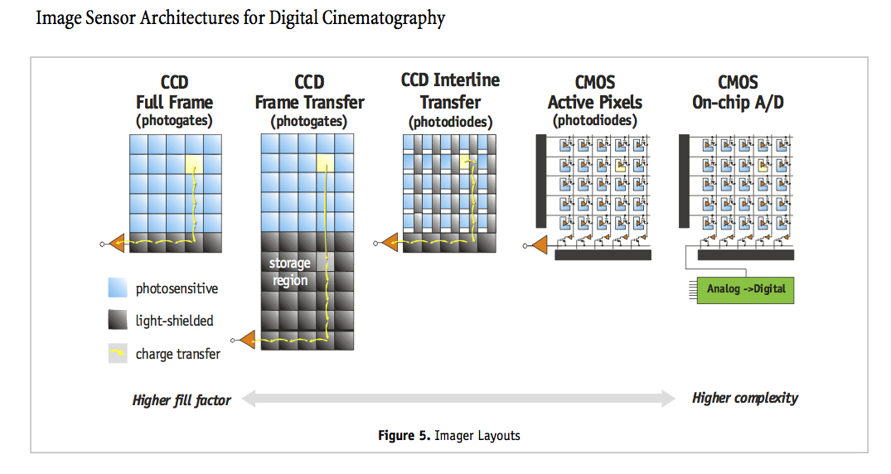
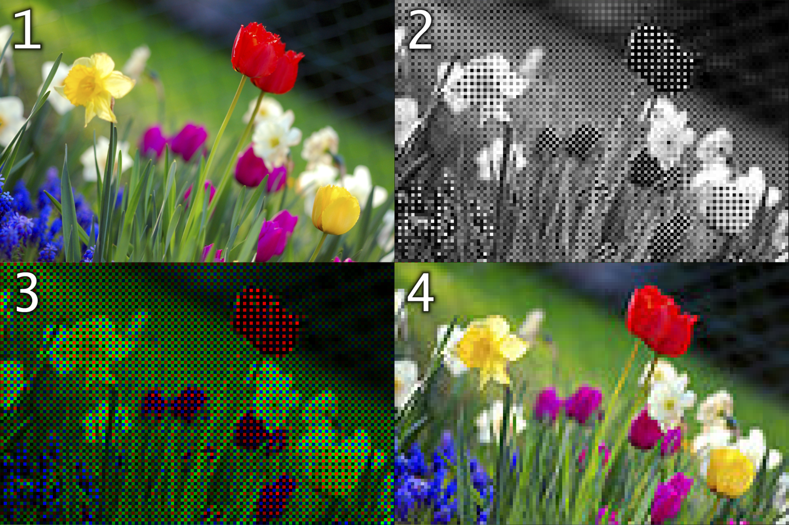

# TIPALA V FOTOGRAFIJI

Standardni film je imel širino 35 mm. Posamezna sličica pa je zavzela velikost 36 x 24 mm, kot je prikazano na [@fig:film135].

{#fig:film135}

- https://en.wikipedia.org/wiki/135_film
- standard za "full-frame"

Dimenzij senzorjev pa je precej več različnih dimenzij in jih zato velikokrat primerjamo s t.i. "full-frame" formatom.

Sama tehnologija svetlobnega tipala je relativno enostavna in podobna svetlobnim senzorjem, ki smo jih sestavljali pri elektroniki. Vrhunski tehnološki napredek je v:

- majhnosti teh senzorjev
    - pri Nikon D90 je dim. sl. točke 5.5 x 5.5 um
- gostota le - teh
    - pri Nikon-u D90 je tipalo dimenzije 23.6 x 15.8 mm na katerem je
    - 13 milijonov slikovnih točk v
    - resoluciji 4288 x 2848

Več podatkov o svetlobnih tipalih, ki so vgrajeni v različne naprave je zbranih na spletni strani [Digital Camera Database](https://www.digicamdb.com/).

## TEHNOLOGIJA SVETLOBNEGA TIPALA

V splošnem imamo dve različni tehnologiji tipal:

- CCD (angl.: Charge-coupled device) in
- CMOS (angl: Complementary Metal Oxide Semiconductor)

{#fig:CCDvsCMOS}

### CCD TIPALA

Ta tip tipala je dominiral v 80' in 90'. Samo tipalo je bilo zelo domiselno
načrtovano v **AT&T Bell laboratorijih**. W. Boyle in G. E. Smith sta si zamislila
tipalo, katerega sprejemna površina fotonov:

- sploh ni bila razdeljena v posamezne slikovne točke in
- ni vsebovala posameznih žic (za odčitavanje napetosti)
    - elektrone so vodili z električnim poljem po sami površini tipala.

Imel je kar nekaj prednosti, zaradi katerih se je na tržišču obdržal do leta 2010.

- [princip delovanja CCD tipala.](https://youtu.be/MytCfECfqWc?t=415)

Prednosti:

+ DOBRA SVETLOBNA OBČUTLJIVOST (relativno na velikost tipala)
+ velika površina na katero vpada svetloba
+ zanemarljiv električni šum

Slabosti:

- izguba elektronov pri prenosu od registra do registra
- počasno branje vrednosti senzorja (zaradi premikanja elektronov iz reg. v reg.)
- nujno mora vsebovati zaklop (senzor ne sme biti osvetljen mer premikanjem elektronov)
- premikanje elektronov zahteva nekaj več električne energije (potratno za baterijo fotoaparata)
- ob močni osvetlitvi so elektroni prešli tudi v kanal sosednjih celic!
- "blooming effect" - če je na enem mestu tipalo preveč osvetljeno se elektroni razporedijo tudi v sosednje celice

### CMOS TIPALA

- [princip delovanja CMOS tipala](https://youtu.be/MytCfECfqWc?t=580)

Prednosti:

- transformacija in ojačanje je narejena na vsaki sl. točki
    - manjša poraba el. energije
- sočasno procesiranje = hitrejši (zaporedni) zajem fotografije
- ni potrebno več imeti zaklopa (manjši fotoaparati)

Slabosti:

- ne-enakost posameznih ojačevalnikov = VEČJI EL. ŠUM
- ne-sočasnost odčitavanja vseh sl. točk = "rolling shutter effect"
    - [rolling shutter effect](https://youtu.be/MytCfECfqWc?t=650)
    - [RSE (vir: SmarterEveryDay)](https://youtu.be/dNVtMmLlnoE?t=121)

## RAZPOREDITEV BARVNEGA FILTRA NA TIPALU

Še danes je najbolj pogosta razporeditev barvnega filtra na tipalu t.i. "Bayer-jeva razporeditev".
Domislil se jo je Bryce Edward Bayer leta 1974, ko je delal za podjetje Kodak.
Barvna matrika je zasnovana tako kot prikazuje [@fig:bayer_filter].

{#fig:bayer_filter}

- vsaka slikovna točka sicer vzorči le eno barvo
- a z interpolacijo podatkov sosednjih točk izračunamo še ostali dve barvi

- več točk je zelene barve, ker so naše oči najbolj občutljive na zeleno barvo, kot je razvidno iz [@fig:eye_sens].

{#fig:eye_sens}

Na naslednji [@fig:bayer_filter] imamo 4 sličice. Primer prikazuje:

- če fotografiramo objekte na sličici 1,
- bo senzor zabeležil naslednje vrednosti, ki so z intenziteto bele prikazani na sličici 2,
- sličica 3 prikazuje njihovo vrednost v barvni matriki filtra.
- Popolne podatke za vsako slikovno točko dobimo z interpolacijo podatkov sosednjih točk.

{#fig:bayer_data}

## INTERPOLACIJA SLIKOVNIH TOČK

... out of scope ...

- ne gledamo le povprečja sosednjih točk
- več različnih algoritmov... kompleksnejši:
    - preverijo če obstaja hor. ali navp. rob,
    - glede na ta podatek se izračuna zelena barva za vsako sl. točko,
    - preveriomo najmanjšo varianco v hor., navpični ali diagonalni smeri
    - povprečje izračunamo glede na smer katero varianca je najmanjša
    - (če je varianca po diagonali najmanjša = povprečje sosednjih vrednosti)

-  več o [interpolaciji barvnih vrednosti](https://www.youtube.com/watch?v=dS5vKUAC3Sc)

- digitalna tipala CCD in CMOS \[[spletni
vir](http://www.youtube.com/watch?v=oMulF2pIyao):  A. Berger, CCD vs
CMOS - Part 2\] \[[spletni
vir](http://en.wikipedia.org/wiki/Charge-coupled_device):
Wikipedia, Charge-coupled device\], \[[spletni
vir](http://www.dvxuser.com/jason/CMOS-CCD/): B. Green, Sensor Artifact
and CMOS rolling shutter\] \[[spletni
vir](http://www.youtube.com/watch?v=ZsWcXQneZ1E&feature=related):
 VideoApexBlog, CMOS/CCD - rolling shutter\] \[[spletni
vir](http://www.youtube.com/watch?v=dvVerMvUOkc&NR=1): CCD vs.
CMOS-Chips: Smearing-Effekte\] \[[spletni
vir](http://www.youtube.com/watch?v=mDQmwCHAI4Q&NR=1): CCD vs.
CMOS-Chips: Blooming-Effekte\]
\[[e-skripta](https://sites.google.com/site/tp4fotografija/e-skripta/slikovni-senzor):
Slikovni senzor\]

- mikroleče \[[spletni vir](http://www.digitaltechnologyart.com/microlens.html): Microlens\]

- točka, resolucija in ločljivost \[[spletni vir](http://www.youtube.com/watch?v=x2-6ae_TAsc&feature=player_detailpage#t=14s): A. Berger, What is a pixle? - Part 2\]

- od točkje do barve \[[spletni vir](http://www.youtube.com/watch?v=2-stCNB8jT8&feature=related): Michael, How a Pixel Gets its Color \| Bayer Sensor \| Digital Image,
- [spletni vir](https://www.youtube.com/watch?v=dS5vKUAC3Sc)\]
