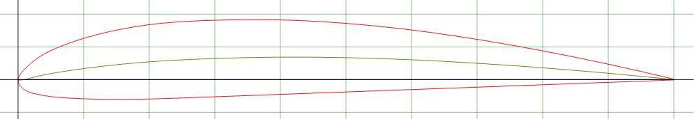
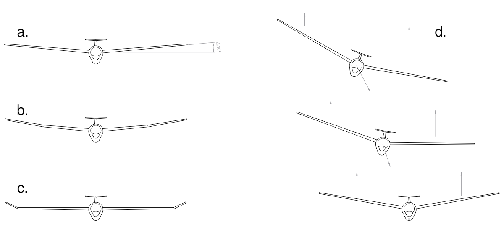

# FORCES ON AIRPLANE

In general the phisics of aerodinamics in flighing is quite complicated. But basicaly we can come down to 4 main forces that are present in the airplane flight.

![Forces on an Airplane[@Nasa-forces]](https://www.grc.nasa.gov/WWW/k-12/airplane/Images/forces.jpg){#fig:airplane-forces}

As we know, if an airplane stays in motion during the flight the 1st Newton's law applies. So the weight, lift, drag and thrust must cancel each other out since the net force must be 0.

$$ \Sigma \vec{F} = \vec{F_W} + \vec{F_L} +\vec{F_D} + \vec{F_T} = 0 $${#eq:newton-first}

As Newton described:

> Every object persists in its state of rest or uniform motion -­ in a straight line unless it is compelled to change that state by forces impressed on it.

## Weight
Weight is a force that is always directed toward the center of the earth. The magnitude of the weight depends on the mass of all the airplane parts, plus the amount of fuel, plus any payload on board (people, baggage, freight, etc.). The weight is distributed throughout the airplane. But we can often think of it as collected and acting through a single point called the center of gravity. In flight, the airplane rotates about the center of gravity[@Nasa-forces].

Flying encompasses two major problems; overcoming the weight of an object by some opposing force, and controlling the object in flight. Both of these problems are related to the object's weight and the location of the center of gravity. During a flight, an airplane's weight constantly changes as the aircraft consumes fuel. The distribution of the weight and the center of gravity also changes. So the pilot must constantly adjust the controls to keep the airplane balanced, or trimmed.

## Lift
To overcome the weight force, airplanes generate an opposing force called lift. Lift is generated by the motion of the airplane through the air and is an aerodynamic force. "Aero" stands for the air, and "dynamic" denotes motion. Lift is directed perpendicular to the flight direction. The magnitude of the lift depends on several factors including the shape, size, and velocity of the aircraft. As with weight, each part of the aircraft contributes to the aircraft lift force. Most of the lift is generated by the wings. Aircraft lift acts through a single point called the center of pressure. The center of pressure is defined just like the center of gravity, but using the pressure distribution around the body instead of the weight distribution.

The distribution of lift around the aircraft is important for solving the control problem. Aerodynamic surfaces are used to control the aircraft in roll, pitch, and yaw[@Nasa-forces].

## Drag
As the airplane moves through the air, there is another aerodynamic force present. The air resists the motion of the aircraft and the resistance force is called drag. Drag is directed along and opposed to the flight direction. Like lift, there are many factors that affect the magnitude of the drag force including the shape of the aircraft, the "stickiness" of the air, and the velocity of the aircraft. Like lift, we collect all of the individual components' drags and combine them into a single aircraft drag magnitude. And like lift, drag acts through the aircraft center of pressure[@Nasa-forces].

## Thrust
To overcome drag, airplanes use a propulsion system to generate a force called thrust. The direction of the thrust force depends on how the engines are attached to the aircraft. In the figure shown above, two turbine engines are located under the wings, parallel to the body, with thrust acting along the body centerline. On some aircraft, such as the Harrier, the thrust direction can be varied to help the airplane take off in a very short distance. The magnitude of the thrust depends on many factors associated with the propulsion system including the type of engine, the number of engines, and the throttle setting[@Nasa-forces].

## Short Video Tutorial...

- [How Do Airplanes Fly](https://www.youtube.com/watch?v=Gg0TXNXgz-w)

{#fig:How_Do_Airplanes_Fly}

<!-- QR generator https://www.the-qrcode-generator.com/ -->

# HOW WINGS CREATE LIFT

Lift opposes the downward force of weight and is produced by the dynamic effects of the surrounding airstream acting on the wing. Lift acts perpendicular to the flightpath through the wing’s center of lift (COL). There is a mathematical relationship between lift, angle of attack (AOA), airspeed, altitude, and the size of the wing. In the lift equation, these factors correspond to the coefficient of lift ($C_L$), velocity ($v$), air density ($\rho$), and wing surface area ($A_W$). These relationships are expressed in [@eq:force-lift].

$$ F_L = \frac{1}{2} C_L \rho A_W v^2  $${#eq:force-lift}

## Airfoil

"Lift is FORCE generated by TURNING a moving fluid" [@Nasa-lift]. Meaning that the relative direction of moving air in front of the wing is different from the moving air after the wing. The deflection of the airstream is mainly caouseb by angle of attack (AOA) of the wing and the airfoil shape itself.

![Deflection of air mass movement caused by wing [@wiki-lift].](https://upload.wikimedia.org/wikipedia/commons/thumb/d/d5/AirfoilDeflectionLift_W3C.svg/1920px-AirfoilDeflectionLift_W3C.svg.png){#fig:airflow}

In other words wing producing the force on air mass and causing the air to change the direction of relative movement. From 3rd Newton's law... :

> When one body exerts a force on a second body, the second body simultaneously exerts a force equal in magnitude and opposite in direction on the first body.

... we know that the same force is applied in opposite direction.

Applying the 2nd Newtons law:

> In an inertial frame of reference, the vector sum of the forces F on an object is equal to the mass m of that object multiplied by the acceleration a of the object:

$$ F = m a $${#eq:newton-second}

Since the acceleration $a$ is the change of velocity in time (regardless if the change is in scale or direction):

$$a = \frac{\vec{v}}{t} $${#eq:acceleration}

... we get the lift force mainly by the changing the airflow direction.

How much air mass ($m$) will be deflected in certain time by the wing is depended on several factors: air density ($\rho$), wing airfoil shape (included in $C_L$), wing area ($A$), wing angle (included in $C_L$) and wing speed ($v$). Thus we end up with presented equation [@eq:force-lift]:

More about the lift you can learn here:

- [Hoe a wing produce lift](https://www.youtube.com/watch?v=YDeQXPNpLeY&t=115s)

{#fig:How-Wing-Create-Lift.png}

## Angle Of Attack
- Angle of attack also gain to direction change of moving air mass
- Increasing an ANGLE of ATTACK...
  - air flow cannot follow the top wing surface
  - airflow will separate of the wing -> stalling

## Bernoulli principal

In a lot of resources you will find that the lift is generated by the Bernoulli effect. It is true that the change the velocity of fluid will cause the difference in pressure:

$$ \Delta P=\frac{1}{2}\rho \Delta v^2 $${#eq:bernulli}

It is a fact that the air flow under the wing is slowed down and airflow over the wing is speeded up. Thus we can find high pressure under the wing and low pressure on the upper surface of the wing. BUT THE LIFT FROM THAT PHENOMENON IS MINIMAL.

However this phenomena can not be overlooked. Since we have two different air masses with different pressures meeting at the end of the wing the vortex of air mass is produced which causing the **induced drag** (presented in [@fig:Induced-drag.png]) which is our next issue to discuss.

# DRAG

The force that resists the movement of the glider through the air is called drag. Two different types of drag combine to form total drag: parasite and induced. However, force of total drag can be calculated according to [@eq:force-drag].

$$ F_D = \frac{1}{2} C_D \rho A_W v^2  $${#eq:force-drag}

## Parasite drag

Drag caused by any aircraft surface that deflects or interferes with the smooth airflow around the airplane. In that respect we must mention two different types:

- Form drag and
- Skin friction drag.

### Form drag

Form drag results from the turbulent wake caused by the separation of airflow from the surface of a structure. Any object moving through the air in front of it out of the way. This causes a buildup of pressure in front of the object. Similarly, the object leaves a low-pressure void in its wake. This difference in pressure between the front and back surfaces of the object results in the force called form drag.

> Form drag can be reduced by reducing the object’s cross-sectional area or by streamlining it [@u2013glider].

**CLARK Y AIRFOIL**

One of the very popular airfoil is so called CLARK Y. This shape (see [@fig:Clark-Y-airfoil.png]) has flat bottom surface and thus easy to build. Some data about this airfoil shape was token from internet airfoil database [@airfoil-tools].

{#fig:Clark-Y-airfoil.png}

The maximum thickness of the airfoil is $d_AF = 11.7%$ at 28% of chord length. Some more data on coefficient of lift (CL) and coefficient of drag (CD) of the CLARK Y airfoil shape are presented in [@fig:Clark-Y-airfoil-data-graphs.png] [@airfoil-tools].

![Lift and drag coefficient depended on AOA [@airfoil-tools].](./slike/Clark-Y-airfoil-data-graphs.png){#fig:Clark-Y-airfoil-data-graphs.png}

### Skin Friction Drag

Skin friction drag is caused by the roughness of the glider’s surfaces. Even though the surfaces may appear smooth, they may be quite rough when viewed under a microscope. This roughness allows a thin layer of air to cling to the surface and create small eddies or areas of lower pressure that contribute to drag.

- If the changes in pressure are small and continues the laminar air flow is present where each layer of air passing smoothly in the same direction as it's neighbours.
- If changes in pressure are to big and sudden the turbulent air flow is induced, meaning that air molecule changing direction and colliding with each other an also with airplane skin. Thus, 

> turbulent layers generate 5 to 10 times more skin than laminar airflow** [@u2013glider].

## Induced drag

Drag that is the consequence of developing lift with a finite-span wing. It can be represented by a vector that results from the difference between total and vertical lift.
Induced drag is generated as the wing is driven through the air to develop the difference in air pressures that we call lift. As the higher pressure air on the lower surface of the airfoil curves around the end of the wing and fills in the lower pressure area on the upper surface, the lift is lost, yet the energy to produce the different pressures is still expended.

![Induced drag caused by air pressure difference [@u2013glider].](./slike/Induced-drag.png){#fig:Induced-drag.png}

> The difference in pressure at the wing edge can be reduced by the smaller chord length of the airfoil. That is why gliders often has wings with aspect ratio of 10 - 40. The difference in air pressure at the wing tips can be reduced by designing a wing with wiglets that reduces high pressure slowly.

# STABILITY

## Longitudinal stability

Gliders are designed to be slightly nose heavy in order to improve their longitudinal stability (shown in [@fig:Longitudinal-stability.png]). This causes the glider to tend to nose down during normal flight [@u2013glider]. In other words the center of gravity (CG) must be in front of center of lift (CL).

![Increasing longitudinal stability by placing CG infront of CL and negative AOA of horizontal stabilizer.[@u2013glider]](./slike/Longitudinal-stability.png){#fig:Longitudinal-stability.png}

The horizontal stabilizer on the tail is mounted at a slightly negative AOA to offset this tendency. When a dynamically stable glider oscillates, the amplitude of the oscillations should reduce through each cycle and eventually settle down to a speed at which the downward force on the tail exactly offsets the tendency to dive.  

## Lateral stability

Another type of stability that describes the glider’s tendency to return to wings-level flight following a displacement is lateral stability. This stability is relatively easy to achieve one option is to use dihedral wing planes.

Dihedral is the upward angle of the wings from a horizontal (front/rear view) axis of the plane. In the [@fig:Dihedral-wing.png] case "a" is shoving that setup. However lateral stability can be improved by polyhedral wing setup which is shorn in [@fig:Dihedral-wing.png] case "b". Further more we must mentioned that also the winglets (shown in [@fig:Dihedral-wing.png] - case "c") has similar effect although they are used primarily for reducing the induced drag.

{#fig:Dihedral-wing.png}

The [@fig:Dihedral-wing.png] - case "d" represent the situation when a glider is rolled in side direction. Glider starts sliding in the direction of the roll and losing altitude. During that action side way upstream airflow is induced which produce greater lift on the wing towards movement [@cajhen-letala].

# BUILDING CHALLENGE

**Build a glider model!**  
In the process of designing a glider we must to consider a lot of factors. Choose one of the issues listed and put it to the test.  

- Wing Area
- Thickness of profile
- Aspect Ratio
- Angle of attack

- Length of fuselage
- Taped fuselage
- Taped wing area
- Wingtips wing design
- Dihedral wing design

- Area of horizontal stabilizer
- Angle of attack of hor. stab.
- ...

Build a glider and change only one variable. Try out the glider and take the notes whether and what glider's performance improved. Your findings enter in the table to get nicer overall insight.

## Materials and technical assets

**Materials**

- Depron sheet (3 mm × 80cm × 120 cm)
- Depron sheet (5 mm × 80cm × 120 cm)
- One-sided tape (5 cm of width)
- Double-sided tape (1 cm of width)
- Silicon hot glue inserts
- Sanding paper

**Technical assets**

- Utility knife
- Metal rule (cca. 50 cm long, with handles)
- Pencil
- Silicon glue gun
- Gloves
- Protecting goggles

## Safety instructions

**Using an Utility knife**

- Wear safety glasses to protect your eyes in case a blade breaks.
- Always use a sharp blade. They are safer than a dull blade.
- Wear cut resistant gloves and sleeves (at least Level 3) to protect your hands and arms.
- Hand a utility knife to a co-worker with the handle first.
- Use one of the newer model self-retracting blade knives. The technology has increased the safety of this tool tremendously over the past several years.
- Ensure the blades are properly positioned in the handle before use.
- Keep extremities out of the cutting path.
- Don’t apply too much pressure on the blade.
- Follow manufacturer’s instructions when changing blades.
- Don’t use utility knives to pry loose objects.
- Dispose of dull or broken blades in a puncture-resistant container.

**Using hot glue gun**

- Choose a flat surface to work on. Make sure the surface is large enough to hold the entire project.
- Wear protecting gloves and if possible, wear long sleeves so if the glue drips it will be caught on the fabric and not your skin.
- Have all of your craft or project items ready to use before you plug in the gun and turn it on.
- If you have to step away from your project, turn the gun off.

## Methodology

Shortly describe the plan of your work...
```
Identify your problem?


```

```
Which basic physical principals apply to your problem?


```

```
Which factors will you change?


```

```
Which factors will you try to maintain fixed?


```

## Results

Enter the findings in the table below. Mark with `0` points if glider's performance does not change, with `[-3 .. -1]` if the performance decreased and with `[+1 .. +3]` if performance improved.

|      Performance | $A_W$ | $d_{af}$ | $ratio_W$ | $AOA_W$ | $l_F$ | $F_D(F)$ | $F_D(W)$ | W.t. | Dih. | $A_{HS}$ | $AOA_{HS}$ |
|-----------------:|-------|----------|-----------|---------|-------|----------|----------|------|------|----------|------------|
|             Lift |       |          |           |         |       |          |          |      |      |          |            |
|             Drag |       |          |           |         |       |          |          |      |      |          |            |
|            Speed |       |          |           |         |       |          |          |      |      |          |            |
|           Weight |       |          |           |         |       |          |          |      |      |          |            |
|      Trav. ratio |       |          |           |         |       |          |          |      |      |          |            |
| Stability (Lon.) |       |          |           |         |       |          |          |      |      |          |            |
| Stability (Lat.) |       |          |           |         |       |          |          |      |      |          |            |

```
What have you learned (sketches prefferd)?


```

# APPENDIX

## Building Main Wing

A quick tutorial can be found at that  
    [video]( https://www.youtube.com/watch?v=h_RzXO5u3M0 ) (https://www.youtube.com/watch?v=h_RzXO5u3M0).

### Area of the wing

- Calculate area of the wing according to [@eq:force-lift].
- Assuming that your glider will travel at speed $v = 4..8 m/s$ and 
- it will have a mass of cca. $m_{glider} = 200..500 grams$.

### Aspect ratio of wing area

The aspect ratio of the wing area for the glider models (homemade) are far from the values of the real gliders. Thus mainly for the practical reasons we choose the aspect around 6.

$$ Aspect Ratio = \frac{Wing Spam}{Chord Length} \approx 6-10 $${#eq:aspect-ratio}

### Airfoil shape

**Symetrical profile:**

- Center of Lift is at 25% the cord length of the wing 
- not changing if AOA change

**Profile (CLARK Y):**

- see [@fig:Clark-Y-airfoil.png]
- Center of Lift is changing from 20% (AOA=+10°) to 40% (AOA= -10°).
- Center of GRAVITY should be at $\frac{1}{3}$ of chord length.

- thickness of the airfoil shape should be cca.  12% of the chord length and is located at 31% of the cord length.

### More instructions on wing build
- Cut the material from depron sheet  
- Nice taping technique is described in this  
    [video]( https://youtu.be/PbyVGfB1oCg?t=639 ) (https://youtu.be/PbyVGfB1oCg?t=639)  
- Join two half's of the wing (if needed)  
    [Video]( https://youtu.be/40lgBxxLxyk?t=88 )( https://youtu.be/40lgBxxLxyk?t=88 )
- Fold the sheets to get airfoil shape  
    [Video]( https://youtu.be/40lgBxxLxyk?t=192 )( https://youtu.be/40lgBxxLxyk?t=192 )
- Glue the spacers to get right thickness of the wing  
    [Video]( https://youtu.be/40lgBxxLxyk?t=224 )( https://youtu.be/40lgBxxLxyk?t=224 )
- Glue the end wing panel upwards - to increase stability  
    [Video]( https://youtu.be/40lgBxxLxyk?t=537 )( https://youtu.be/40lgBxxLxyk?t=537 )
- Reinforce back edge of the wing  
    [Video]( https://youtu.be/40lgBxxLxyk?t=634 )( https://youtu.be/40lgBxxLxyk?t=634 )

## Fuselage

Basically you will do square tube from a depron sheet. Much like this guy in the  
    [video]( https://www.youtube.com/watch?v=z3Afs3VlaZc )(https://www.youtube.com/watch?v=z3Afs3VlaZc).

The 1°..2° degrees of negative angle on horizontal stabilizer are desired, which can be achieved by several options:  

- the angle of back of the fuselage or
- gluing it  with some support...

Area of horizontal stabilizer (slo.: višinski stabilizator) should be cca. 10% - 20% of the main wing area.

Area of the vertical stabilizer (slo.: smerni stabilizator) should be cca. 30% - 40% of horizontal stabilizer.

# REFERENCES

